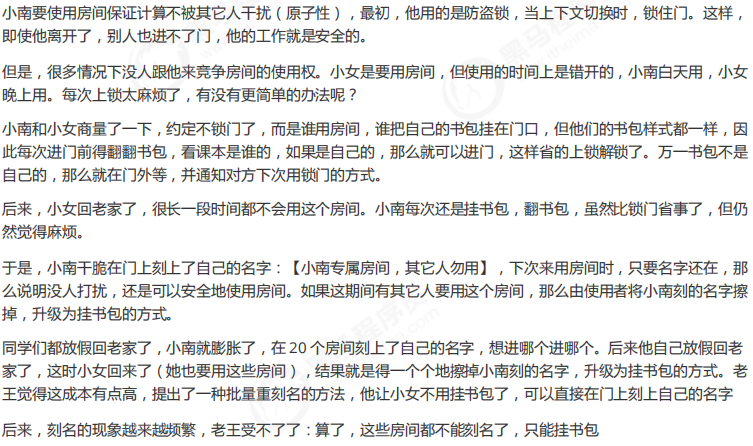
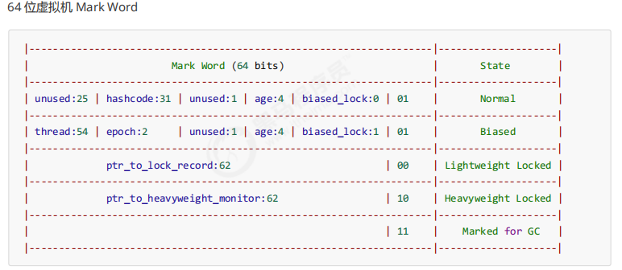
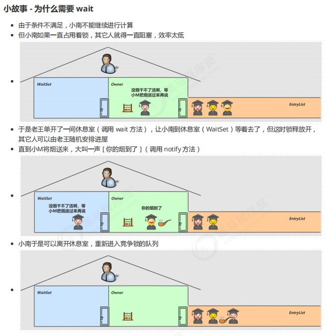
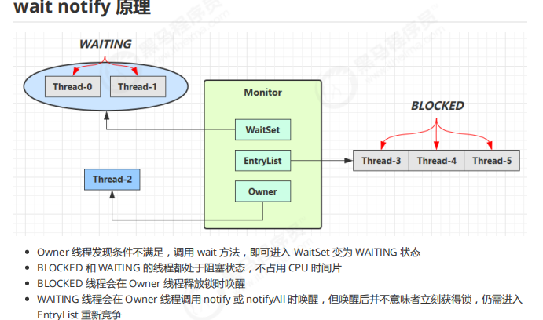
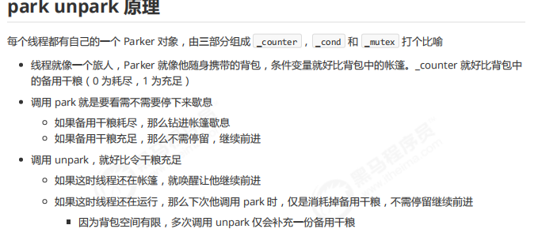
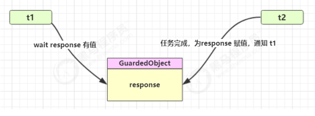
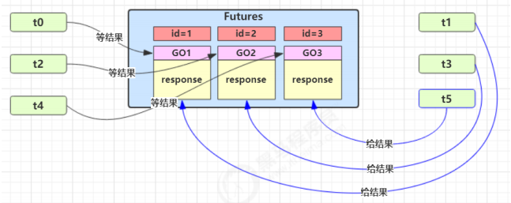
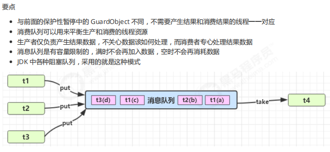

# JUC

### synchronized 

老王 - JVM

小南 - 线程

小女 - 线程

房间 - 对象

房间门上 - 防盗锁 - Monitor

房间门上 - 小南书包 - 轻量级锁

房间门上 - 刻上小南大名 - 偏向锁

批量重刻名 - 一个类的偏向锁撤销到达 20 阈值

不能刻名字 - 批量撤销该类对象的偏向锁，设置该类不可偏向





#### 偏向锁

理解为线程专用，record lock记录线程ID；默认是偏向锁，竞争锁不激烈的场景。

##### 偏向锁撤销：

- 当对象调用hashcode方法时，markword 没有更多的字节记录；轻量锁有hashcode记录，重量锁有monitor记录；
- 当有其他线程使用对象时，不是专用了就不可偏向；
- wait/notify，只有重量锁有，只能升级

##### 批量撤销

- 如果某场景撤销次数达到阈值 20次则jvm认为竞争激烈不可偏向，会将对象变为不可偏向；
- 如果撤销偏向锁阈值超过40次，jvm认为确实偏向错了，将整个类的所有对象变为不可偏向。

### wait notify

设置等待区域防止一致占着锁浪费资源。






##### API

它们都是线程之间进行协作的手段，都属于 Object 对象的方法。**必须获得此对象的锁**，才能调用这几个方法（即在synchronized(obj)中用）

- `obj.wait()` 让进入 object 监视器的线程到 waitSet 等待;
  - `wait(long n)` 有时限的等待, 到 n 毫秒后结束等待，或是被 notify;

- `obj.notify()` 在 object 上正在 waitSet 等待的线程中挑一个唤醒;

- `obj.notifyAll()` 让 object 上正在 waitSet 等待的线程全部唤醒;

##### **sleep(long n)** **和** **wait(long n)** **的区别**

1) sleep 是 Thread 方法，而 wait 是 Object 的方法
2)  sleep 不需要强制和 synchronized 配合使用，但 wait 需要和 synchronized 一起用 

3. sleep 在睡眠的同时，不会释放对象锁的，但 wait 在等待的时候会释放对象锁
4.  它们状态 TIMED_WAITING


#### join

```java
synchronized (t1) {
 // 调用者线程进入 t1 的 waitSet 等待, 直到 t1 运行结束
 while (t1.isAlive()) {
 t1.wait(0);
 }
}
```

底层实际是wait(delay) 实现的。是保护性暂停模式的体现之一。join是用于实现同步的，需要统筹多个线程的任务完成。

#### Park & Unpark



#####  Park & Unpark与 Object 的 wait & notify 相比

- wait，notify 和 notifyAll 必须配合 Object Monitor 一起使用，而 park，unpark 不必
- park & unpark 是以线程为单位来【阻塞】和【唤醒】线程，而 notify 只能随机唤醒一个等待线程，notifyAll 是唤醒所有等待线程，就不那么【精确】
- park & unpark 可以先 unpark，而 wait & notify 不能先 notify

### Volatile

- 为什么需要volatile？

和CPU的运行有关，CPU在一个时钟周期内运行相关指令，为了提高并行度优化内存访问，提高流水线利用率，会进行指令重排，即不影响运行结果的前提下更高效地执行。但会造成内存屏障问题，即多线程时，不同线程对某变量的读写在内存中可能没有及时同步造成脏读。

volatile

- 写屏障（sfence）保证在该屏障之前的，对共享变量的改动，都同步到主存当中
  - 写屏障会确保指令重排序时，不会将写屏障之前的代码排在写屏障之后
- 读屏障（lfence）保证在该屏障之后，对共享变量的读取，加载的是主存中最新数据
  - 读屏障会确保指令重排序时，不会将读屏障之后的代码排在读屏障之前

以此保证有序性


## 模式

### 同步模式-保护性暂停

 Guarded Suspension，用在一个线程等待另一个线程的执行结果；

- 有一个结果需要从一个线程传递到另一个线程，让他们关联同一个 GuardedObject

- 如果有结果不断从一个线程到另一个线程那么可以使用消息队列（见生产者/消费者）

- JDK 中，join 的实现、Future 的实现，采用的就是此模式

- 因为要等待另一方的结果，因此归类到同步模式



#### 多任务版的GuardedObject



多个类之间使用GO对象传参不方便，设计Futures；新增id标识GO

### 异步模式之生产者/消费者




