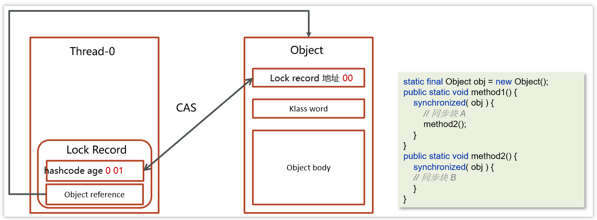
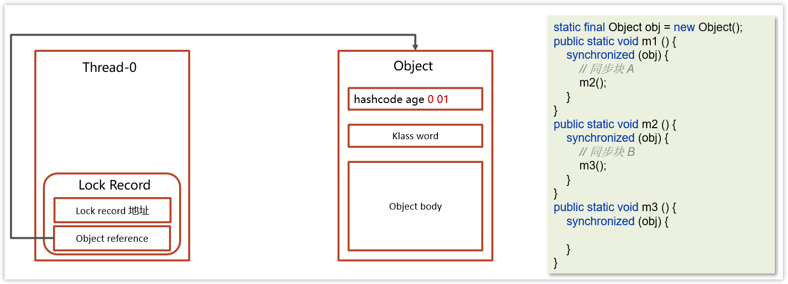
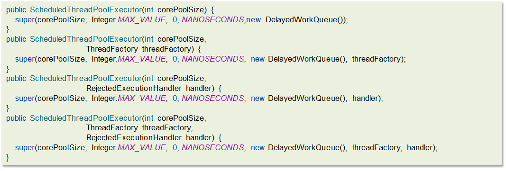

# 线程基础

### 线程和进程区别？

- 程序运行开启一个进程，进程是正在运行程序的实例，包含多个线程；
- 不同进程使用不同的内存空间，当前进程下的线程可以共享进程的堆和方法区(1.8之后是元空间)，线程有自己的PC计数器、本地方法栈(native)和虚拟栈；
- 线程更轻量，线程上下文切换成本比进程上下文低（上下文切换指从一个线程切换到另一个线程）

#### 为什么程序计数器是线程私有的？

CPU会分配时间片，线程时间片用完下次获取时需要知道之前运行的位置，PC记录了下一条指令的位置；

### 并发和并行

并发是多个线程轮流使用CPU，单核下微观串行，宏观并行；**多个作业同一时间段执行**

并行是多核同一时间做多件事，4核CPU同时执行4个线程；**多个作业同一时刻执行**

### 同步和异步？

- 同步： 发出调用后需要等待结果，否则不能返回；
- 异步：调用发出后不用等待结果，继续往下执行；

### 如何理解线程安全和不安全？

多线程场景下对同一份数据操作前后能保持数据的一致性和正确性；

### 创建线程的四种方式

继承Thread类，实现runnable接口，实现Callable接口，线程池创建线程

但都是`new Thread().start()`的方式创建

① **继承Thread类**

```java
public class MyThread extends Thread {

    @Override
    public void run() {
        System.out.println("MyThread...run...");
    }

    
    public static void main(String[] args) {

        // 创建MyThread对象
        MyThread t1 = new MyThread() ;
        MyThread t2 = new MyThread() ;

        // 调用start方法启动线程
        t1.start();
        t2.start();

    }
    
}
```

② **实现runnable接口**

```java
public class MyRunnable implements Runnable{

    @Override
    public void run() {
        System.out.println("MyRunnable...run...");
    }

    public static void main(String[] args) {

        // 创建MyRunnable对象
        MyRunnable mr = new MyRunnable() {
            @Override
             public void run() {
             log.debug("hello");
             }
        };
	    Runnable task2 = () -> log.debug("hello");
        // 创建Thread对象
        Thread t1 = new Thread(mr) ;
        Thread t2 = new Thread(task2,"t2") ;

        // 调用start方法启动线程
        t1.start();
        t2.start();

    }

}
```

③ **实现Callable接口**

```java
public class MyCallable implements Callable<String> {

    @Override
    public String call() throws Exception {
        System.out.println("MyCallable...call...");
        return "OK";
    }

    public static void main(String[] args) throws ExecutionException, InterruptedException {

        // 创建MyCallable对象
        MyCallable mc = new MyCallable() ;

        // 创建F
        FutureTask<String> ft = new FutureTask<String>(mc) ;

        // 创建Thread对象
        Thread t1 = new Thread(ft) ;
        Thread t2 = new Thread(ft) ;

        // 调用start方法启动线程
        t1.start();

        // 调用ft的get方法获取执行结果
        String result = ft.get();

        // 输出
        System.out.println(result);

    }

}
```

④ **线程池创建线程**

```java
public class MyExecutors implements Runnable{

    @Override
    public void run() {
        System.out.println("MyRunnable...run...");
    }

    public static void main(String[] args) {

        // 创建线程池对象
        ExecutorService threadPool = Executors.newFixedThreadPool(3);
        threadPool.submit(new MyExecutors()) ;

        // 关闭线程池
        threadPool.shutdown();

    }

}
```

**线程是执行线程体的容器，线程体是一个可运行的任务**。线程是可被操作系统调度的独立执行单元，线程体是需要线程作为载体的任务，线程体可以基于Runnable、Callable去实现，提供给线程执行的任务，并不属于java线程，最终还是需要依赖于new Thread（）

### runnable 和 callable 有什么区别

Callable是对runnable的封装，带返回值

1. **Runnable 接口run方法没有返回值；Callable接口call方法有返回值，是个泛型**，和Future、FutureTask配合可以用来获取异步执行的结果
2. **Callable接口的call()方法允许抛出异常；**而Runnable接口的run()方法的异常只能在内部消化，不能继续上抛
3. 在实际开发中，如果需要拿到执行的结果，需要使用Callalbe接口创建线程，调用FutureTask.get()得到可以得到返回值，此方法会阻塞主进程的继续往下执行，如果不调用不会阻塞。

### 线程的 run()和 start()有什么区别？

start(): 用来启动线程，通过该线程调用run方法执行run方法中所定义的逻辑代码。

start方法只能被调用一次。run封装了要执行的代码，可以调用多次。

### 可以直接调用Thread的run（）吗？

直接调用只是在当前线程（如main）下当成一个普通方法执行，而不是在某个线程中执行；

new 一个线程后进入NEW状态，start() 后进入可运行状态，拿到时间片后会自动执行run（），结束后进入终止状态；

### 线程包括哪些状态，状态之间是如何变化的

> 在JDK中的Thread类中的枚举State里面定义了6中线程的状态分别是：新建、可运行、终结、阻塞、等待和有时限等待六种。
>
> 关于线程的状态切换情况比较多。我分别介绍一下
>
> 当一个线程对象被创建，但还未调用 start 方法时处于**新建**状态，调用了 start 方法，就会由**新建**进入**可运行**状态。如果线程内代码已经执行完毕，由**可运行**进入**终结**状态。当然这些是一个线程正常执行情况。
>
> 如果线程获取锁失败后，由**可运行**进入 Monitor 的阻塞队列**阻塞**，只有当持锁线程释放锁时，会按照一定规则唤醒阻塞队列中的**阻塞**线程，唤醒后的线程进入**可运行**状态
>
> 如果线程获取锁成功后，但由于条件不满足，调用了 wait() 方法，此时从**可运行**状态释放锁**等待**状态，当其它持锁线程调用 notify() 或 notifyAll() 方法，会恢复为**可运行**状态
>
> 还有一种情况是调用 sleep(long) 方法也会从**可运行**状态进入**有时限等待**状态，不需要主动唤醒，超时时间到自然恢复为**可运行**状态


State是枚举类

- new 新建：线程对象被创建但没调用start()时
- RUNNABLE 可运行：调用了start()，等待系统资源如CPU时间片准备执行；
- TERMINATED 终结：执行完run() 后，线程内代码执行完毕
- BLOCKED 阻塞：线程进入synchronized代码块或者wait()被唤醒后重新进入同步代码块/方法，获取锁失败,它将被阻塞，直到获取到锁。
  - 获取锁失败后，由可运行进入Monitor 的阻塞队列**阻塞**，此时不占用 cpu 时间
  - 当持锁线程释放锁时，会按照一定规则唤醒阻塞队列中的**阻塞**线程，唤醒后的线程进入**可运行**状态

- WAITING 等待：如Thread.join(),Object.wait()正等待指定线程终止
  - 线程进入 **WAITING（等待）** 状态。进入等待状态的线程需要依靠其他线程的通知才能够返回到运行状态。
  - wait()是对象的本地方法，是让获得对象锁的线程实现等待
    - 当获取锁成功后，但由于条件不满足，调用了 wait() 方法，此时从**可运行**状态释放锁进入 Monitor 的waiting_set等待集合**等待**，同样不占用 cpu 时间
    - 当其它持锁线程调用 notify() 或 notifyAll() 方法，会按照一定规则唤醒等待集合中的**等待**线程，恢复为**可运行**状态
  
- TIMED_WAITING 有限时等待：Thread.join(long),Object.wait(long),Thread.sleep(long)
  - 有锁情况	
    - 获取锁成功后，但由于条件不满足，调用了 **wait(long)** 方法，此时从**可运行**状态释放锁进入 Monitor 等待集合进行**有时限等待**
    - 如果等待超时，也会从**有时限等待**状态恢复为**可运行**状态，并重新去竞争锁

  - sleep(long) 方法会从可运行状态进入有限时等待，到时间自动恢复可运行状态，不需要主动唤醒


- **阻塞队列**: 线程因无法获取锁而被阻塞，保持对锁的请求，等待锁的释放。
- **等待队列**: 线程释放锁后进入等待状态，直到接收到通知。

因此，线程并不会在这两者之间转换，通常是：

- **阻塞队列**：在等待获取锁的情况下。
- **等待队列**：在调用了特定的方法后，主动释放锁并等待其他线程的通知。

### 关于线程状态变化的一些理解

一个线程拿到锁进入同步代码块（synchronized）中调用了wait方法，当前线程释放了锁，此时进入monitor的waiting_set，当被唤醒后该线程变为runnabe状态尝试去获取锁，此时不会立即获取锁，而是和entrylist的线程一起竞争。

### 什么是线程上下文切换？

线程从占用CPU状态退出；通过PC执行对应的指令

wait(),sleep()主动让出CPU；时间片耗尽；被终止或结束运行；线程阻塞；

### 新建 T1、T2、T3 三个线程，如何保证它们按顺序执行？

可以执行join()方法，在T2中调用T1，在T3中调用T2来保证T3最后执行；

### notify()和 notifyAll()有什么区别？

notifyAll：唤醒所有wait的线程

notify：只随机唤醒一个 wait 线程


### 在 java 中 wait 和 sleep 方法的不同？

wait() ，wait(long) 和 sleep(long) 的效果都是让当前线程暂时放弃 CPU 的使用权，进入阻塞状态

不同点：

- 方法归属不同：sleep(long) 是Thread的静态方法；wait() 是Object的成员方法，每个对象都有

- 醒来时机不同：

  - sleep属于TIMED_WAITING，wait属于Object类的方法 

  - sleep(long) 和 wait(long) 的线程都会在等待相应毫秒后醒来
  - wait(long) 和 wait() 还可以被 notify 唤醒，wait() 如果不唤醒就一直等下去

- 锁特性不同
  - wait 方法的调用必须先获取使用 wait的对象的锁，**配合synchronized使用wait**，而 sleep 则无此限制
  - **wait 方法执行后会释放对象锁**，进入wating set中允许其它线程获得该对象锁（我放弃 cpu，但你们还可以用）
  - 而 **sleep 如果在 synchronized 代码块中执行，并不会释放对象锁**（我放弃 cpu，你们也用不了）
  - sleep是让当前线程暂停，不涉及对象类，也不需要获取对象锁

锁举例：

```java
private static void waiting() throws InterruptedException {
        Thread t1 = new Thread(() -> {
            synchronized (LOCK) {
                try {
                    get("t").debug("waiting...");
                    LOCK.wait(5000L);	//wait需要在synchronized代码块中执行，执行后会释放LOCK对象锁
                } catch (InterruptedException e) {
                    get("t").debug("interrupted...");
                    e.printStackTrace();
                }
            }
        }, "t1");
        t1.start();

        Thread.sleep(100);
        synchronized (LOCK) {	//wait执行后就可以拿到锁饼运行代码块
            main.debug("other...");
        }

    }

    private static void sleeping() throws InterruptedException {
        Thread t1 = new Thread(() -> {
            synchronized (LOCK) {
                try {
                    get("t").debug("sleeping...");
                    Thread.sleep(5000L);
                } catch (InterruptedException e) {
                    get("t").debug("interrupted...");
                    e.printStackTrace();
                }
            }
        }, "t1");
        t1.start();

        Thread.sleep(100);
        synchronized (LOCK) {	//不能立即拿到锁因为还没被释放，必须等t1里的sleep自动唤醒后释放才能拿到锁
            main.debug("other...");
        }
    }
```

### 如何停止一个正在运行的线程？

- 使用共享变量退出标志，使线程正常退出，也就是当run方法完成后线程终止
- 使用stop方法强行终止（不推荐，方法已作废）
- 使用thread.interrupt方法中断线程

```java
public class MyInterrupt3 {

    public static void main(String[] args) throws InterruptedException {

        //1.打断阻塞的线程
        /*Thread t1 = new Thread(()->{
            System.out.println("t1 正在运行...");
            try {
                Thread.sleep(5000);
            } catch (InterruptedException e) {
                e.printStackTrace();
            }
        }, "t1");
        t1.start();
        Thread.sleep(500);
        t1.interrupt();
        System.out.println(t1.isInterrupted());*/


        //2.打断正常的线程
        Thread t2 = new Thread(()->{
            while(true) {
                Thread current = Thread.currentThread();
                boolean interrupted = current.isInterrupted();
                if(interrupted) {
                    System.out.println("打断状态："+interrupted);
                    break;
                }
            }
        }, "t2");
        t2.start();
        Thread.sleep(500);
//        t2.interrupt();

    }
}
```

> 有三种方式可以停止线程
>
> 第一：可以使用退出标志，使线程正常退出，也就是当run方法完成后线程终止，一般我们加一个标记flag，flag为true则退出
>
> 第二：可以使用线程的stop方法强行终止，不过一般不推荐，这个方法已作废
>
> 第三：可以使用线程的interrupt方法中断线程，内部其实也是使用中断标志来中断线程
>
> 我们项目中使用的话，建议使用第一种或第三种方式中断线程

### 什么是线程死锁？如何避免死锁？

多个线程同时被阻塞，其中一个或多个线程等待某个资源被释放，无法正常终止；

产生死锁的条件：一个线程需要获取多个锁；t1线程持有A锁等待获取B锁，t2线程获取B锁等待A锁；

- 互斥：该资源任意时刻只能由一个线程持有
- 请求和保持条件：一个线程请求资源的同时没有释放自己的资源
- 不剥夺条件：线程手上的资源只能自己释放
- 循环等待条件：若干线程形成头尾相接等待资源的关系

**预防死锁**

- 破坏请求和保持条件：一次性申请所有资源
- 破坏不剥夺条件：申请不到资源主动放弃手上的资源
- 破坏循环等待条件：按顺序申请资源

**避免死锁**

使用银行家算法等算法控制资源分配；

银行家算法：通过先 **试探** 分配给该进程资源，然后通过安全性算法判断分配后的系统是否处于安全状态，若不安全则试探分配作废，让该进程继续等待。

- 安全性算法：进程执行前申明需要用的最大资源数、已分配资源和所需资源数；**系统检查每个进程所需资源是否小于当前系统可用资源**，保证系统处于安全状态，是则分配，不是则等待；


# 线程中的并发锁

### 锁的分类

#### 可重入锁和不可重入锁

Java中提供的synchronized、ReentrantLock、ReentrantReadWriteLock都是可重入锁。ThreadPoolExcutor中的Woker的实现是不可重入锁，继承自AQS实现的。

**允许同一个线程多次获取同一把锁而不会导致死锁**

- 重入:当前线程获取到A锁，在获取之后尝试再次获取A锁是可以直接拿到的。
- 不可重入:当前线程获取到A锁，在获取之后尝试再次获取A锁，无法获取到的，因为A锁被当前线程占用着，需要等待自己释放锁再获取锁。

#### 悲观锁和乐观锁

Synchronized、ReentrantLock都是悲观锁。

**悲观锁**: 

获取不到锁资源时，会将当前线程挂起(进入BLOCKED、WAITING)，线程挂起会涉及到用户态和内核的太的切换，而这种切换是比较消耗资源的。

总是假设最坏的情况，共享资源每次被访问的时候会被其他线程修改；所以共享资源每次只给一个线程上锁使用，其他线程阻塞等待；如 Synchronized、ReentrantLock；适合写多场景，开销固定

- 用户态:JVM可以自行执行的指令，不需要借助操作系统执行。
- 内核态:JVM不可以自行执行，需要操作系统才可以执行。

**乐观锁**:

获取不到锁资源，可以再次让CPU调度，重新尝试获取锁资源。

总是假设最好的情况，共享资源每次被访问不会出现问题；无需加锁，只在提交修改时去验证资源是否被其他资源修改；版本号法或CAS；适合读多场景

#### 公平锁和非公平锁

Java中提供的synchronized只能是非公平锁。
Java中提供的ReentrantLock，ReentrantReadWriteLock可以实现公平锁和非公平锁

`公平锁就是先来先得，新来的线程排队；非公平锁是新来的线程先和队列头节点竞争，失败继续排队`

**公平锁**: 线程A获取到了锁资源，线程B没有拿到，线程B去排队，线程C来了，锁被A持有，同时线程B在排队。
直接排到B的后面，等待B拿到锁资源或者是B取消后，才可以尝试去竞争锁资源。
**非公平锁**: 线程A获取到了锁资源，线程B没有拿到，线程B去排队，线程C来了，先尝试竞争一波

- 拿到锁资源:开心，插队成功。
- 没有拿到锁资源:依然要排到B的后面，等待B拿到锁资源或者是B取消后，才可以尝试去竞争锁资源。

#### 互斥锁和独占锁

Java中提供的synchronized、ReentrantLock是互斥锁,Java中提供的ReentrantReadWriteLock，有互斥锁也有共享锁；共享锁有信号量计数器。

互斥锁:同一时间点，只会有一个线程持有者当前互斥锁。
共享锁:同一时间点，当前共享锁可以被多个线程同时持有。


### 版本号法怎么实现？

对数据额外加一个版本字段，用于记录被修改次数，数据被修改，version + 1；当修改操作提交时会比较version 版本是否等于自己读操作时的version版本，不一致则重试；

### CAS 怎么实现？

Compare And Swap(比较再交换)，它体现的一种**乐观锁**的思想，在无锁情况下保证线程操作共享数据的**原子性**。**读取目标变量的地址V的值和将要更新的变量值A(旧值)比较，两值相等才会更新新值B**；i = 1(V = 1, A = 1, B=6) V == A ? i=6:重新获取A；

CAS是原子操作，底层依赖CPU的原子指令；

Atomic 原子性类就是基于CAS乐观锁实现的

### 乐观锁有什么问题？CAS有什么问题？

ABA问题；因为CAS是先比较预期值和变量值，相等则交换，但是如果变量值被别人修改了但值没变，CAS以为没被修改仍会成功；**加版本号或加时间戳**；

- 循环重试CPU开销大，因为CAS经常自旋；-》延迟自旋时间（一直循环尝试cas替换值，没有成功一直等待并尝试）
- 只能保证一个共享变量的原子操作；-》使用AtomicRefrence保证引用对象的原子性，把多个变量放在一个对象里进行操作；


**总结：**CAS的优点是乐观锁减少用户态到内核态的消耗，缺点是cpu占用可能高且有ABA问题

### synchronized关键字的底层原理？

Synchronized【对象锁】采用互斥的方式让同一时刻至多只有一个线程能持有【对象锁】，其它线程再想获取这个【对象锁】时就会阻塞住，是悲观锁；**是重量锁；**

**底层是JVM中的monitor实现的，同步代码块在字节码中会对代码块用monitorenter指令上锁，monitorexit解锁**，解两次是防止代码抛异常不能及时释放锁；**同步方法用ACC_SYNCHRONIZED标识该方法，实例方法获得实例对象的锁，静态方法获得class的锁**

> **具体说下monitor**
>
> monitor对象存在于每个Java对象的对象头中，synchronized 锁便是通过这种方式获取锁的，也是为什么Java中任意对象可以作为锁的原因
>
> monitor内部维护了三个变量
>
> - WaitSet：保存处于Waiting状态的线程
>
> - EntryList：保存处于Blocked状态的线程
>
> - Owner：持有锁的线程
>
> 只有一个线程获取到的标志就是在monitor中设置成功了Owner，一个monitor中只能有一个Owner
>
> 在上锁的过程中，如果有其他线程也来抢锁，则进入EntryList 进行阻塞，当获得锁的线程执行完了，释放了锁，就会唤醒EntryList 中等待的线程竞争锁，竞争的时候是非公平的。
>
> 上锁后所计数器+1，可重入；计数器0表示可获得锁；释放锁 -1

monitor结构是：


- Owner：存储当前获取锁的线程的，只能有一个线程可以获取

- EntryList：关联没有抢到锁的线程，处于Blocked状态的线程

- WaitSet：关联调用了wait方法的线程，处于Waiting状态的线程

流程：

- 代码进入synchorized代码块，先让对象锁关联monitor，判断monitor中的owner是否由线程持有
- 没有则让当前线程持有
- 有则进入entryList阻塞等待，当owner释放锁再让entryList中的线程去竞争owner的持有权
- 如果调用了wait()，会去waiSet中等待

参考回答：

- Synchronized【对象锁】采用互斥的方式让同一时刻至多只有一个线程能持有【对象锁】

- 它的底层由monitor实现的，monitor是jvm级别的对象（ C++实现），线程获得锁需要使用对象（锁）关联monitor

- 在monitor内部有三个属性，分别是owner、entrylist、waitset

- 其中owner是关联的获得锁的线程，并且只能关联一个线程；entrylist关联的是处于阻塞状态的线程；waitset关联的是处于Waiting状态的线程

### synchronized 的使用？

- 修饰实例方法-锁对象实例 （对象锁）
- 修饰静态方法- 锁当前类 （类锁）
- 修饰代码块- 锁指定对象：`synchronized(object)`；锁当前类 `synchronized(类.class)`

不能修饰构造方法，本身就是线程安全的；

### synchronized 和 volatile的区别？

- volatile 只能修饰变量，syn修饰方法和代码块
- vol保证数据可见性，不能保证数据原子性；syn都能保证；

### synchronized关键字的底层原理-进阶：Monitor实现的锁属于重量级锁，你了解过锁升级吗？

> **有锁竞争情况下会发生锁升级**
>
> 对象在内存中主要存对象头、实例数据；对象头里有32位的markword存有对象的信息，其中最后3位标识锁的状态：001无锁，101表示偏向锁，后两位00轻量锁，10重量锁; 
>
> 轻量锁就是用CAS替代重量锁，Markword的前30位锁记录的地址和实例对象(hashcode)的地址交换，比较对象markword后三位是不是001表示无锁，则CAS成功，00表示有锁，是自己的地址则锁重入，不是则失败升级重量锁；偏向锁，轻量锁重入也要CAS，偏向锁将线程id存入对象头101，是自己线程不用CAS直接锁重入，不是自己的锁则锁升级，锁升级次数达到阈值不用偏向锁；

Java中的synchronized有偏向锁、轻量级锁、重量级锁三种形式，分别对应了锁只被一个线程持有、不同线程交替持有锁、多线程竞争锁三种情况。

|          | **描述**                                                     |
| -------- | ------------------------------------------------------------ |
| 重量级锁 | 底层使用的Monitor实现，里面涉及到了**用户态和内核态**的切换、进程的上下文切换，成本较高，性能比较低。 |
| 轻量级锁 | 线程加锁的时间是错开的（也就是没有竞争），可以使用轻量级锁来优化。轻量级修改了对象头的锁标志，相对重量级锁性能提升很多。每次修改都是CAS操作，保证原子性 |
| 偏向锁   | 一段很长的时间内都只被一个线程使用锁，可以使用了偏向锁，在第一次获得锁时，会有一个CAS操作，之后该线程再获取锁，只需要判断mark  word中是否是自己的线程id即可，而不是开销相对较大的CAS命令 |

**一旦锁发生了竞争，都会升级为重量级锁**

还有偏向锁和轻量级锁，它们的引入是为了解决在**没有多线程竞争或基本没有竞争的场景下**因使用传统锁机制带来的性能开销问题。

#### 对象的内存结构


对象在内存中主要存对象头、实例数据（成员变量）和对齐填充（补齐前两个实现8的整数倍）

其中对象头有MarkWord和KlassWord（描述对象实例的具体类型）描述再不同锁状态下的markword的信息


- **biased_lock**：偏向锁标识，占1位 ，0表示没有开始偏向锁，1表示开启了偏向锁
- **ptr_to_lock_record**：轻量级锁状态下，指向栈中锁记录的指针，占30位
- **ptr_to_heavyweight_monitor**：重量级锁状态下，指向对象监视器Monitor的指针，占30位

可以通过后三位判断锁的等级：

- 后三位是001表示无锁
- 后三位是101表示偏向锁
- 后两位是00 表示轻量级锁
- 后两位是10表示重量级锁

#### Monitor重量级锁

使用 synchronized 给对象上锁（重量级）之后，**该对象头的Mark Word 中就被设置指向 Monitor 对象的指针**

#### 轻量级锁

在同步块中的代码是不存在竞争的，就没必要使用重量级锁过大的开销。轻量级锁对使用者是透明的，即语法仍然是synchronized。

加锁时会在栈帧中创建LockRecord，将其中的obj字段指向锁对象，通过CAS指令将Lockrecord地址存在对象头中，第一部分存markword的值；

- CAS数据交换成功加锁成功，说明是无锁状态；
- CAS数据交换失败：说明有锁，是其他线程的锁则升级为重量锁；如果是当前线程持有的锁表示锁重入，则创建的LockRecord第一部分为null，重入计数+1，当释放锁后，如果有null值的锁记录则重置所忌入

**加锁的流程**

1.在线程栈中创建一个Lock Record，将其obj字段指向锁对象。


2.通过CAS指令将Lock Record的地址存储在对象头的mark word中（数据进行交换），如果对象处于无锁状态则修改成功，代表该线程获得了轻量级锁。




3.如果是当前线程已经持有该锁了，代表这是一次锁重入。设置Lock Record第一部分为null，起到了一个重入计数器的作用。


4.如果CAS修改失败，说明发生了竞争，需要膨胀为重量级锁。

**解锁过程**

1.遍历线程栈,找到所有obj字段等于当前锁对象的Lock Record。

2.如果Lock Record的Mark Word为null，代表这是一次重入，将obj设置为null后continue。


3.如果Lock Record的 Mark Word不为null，则利用CAS指令将对象头的mark word恢复成为无锁状态。如果失败则膨胀为重量级锁。


#### 


#### 偏向锁

轻量级锁在没有竞争时（就自己这个线程），每次重入仍然需要执行 CAS 操作。可以将线程ID设置到markWord头中，如果线程id是自己表示不用CAS

**加锁的流程**

1.在线程栈中创建一个Lock Record，将其obj字段指向锁对象。



2.通过CAS指令将Lock Record的**线程id**存储在对象头的mark word中，同时也设置偏向锁的标识为101，如果对象处于无锁状态则修改成功，代表该线程获得了偏向锁。


3.如果是当前线程已经持有该锁了，代表这是一次锁重入。设置Lock Record第一部分为null，起到了一个重入计数器的作用。与轻量级锁不同的时，这里不会再次进行cas操作，只是判断对象头中的线程id是否是自己，因为缺少了cas操作，性能相对轻量级锁更好一些


解锁流程参考轻量级锁

### 谈谈 JMM（Java 内存模型） 

线程不能直接读写主内存中的变量，在自己的工作内存中保留共享变量副本进行读写操作，线程间的变量传递需要通过主内存完成，以此来保证多线程之间对同一个主内存空间的数据一致性。volatile修饰的变量会放进主内存中；

#### 并发编程的三大特性

- 原子性：一次或多次操作，所有操作或行为要么一次全部执行要么全部不执行
- 可见性：一个线程对`共享变量` 进行修改，其他线程可以立即看到变化结果；变量声明为volatile
- 有序性：指令重排序问题，代码执行顺序不一定是编写代码的顺序，需要使用volatile优化


- 保证原子性：


涉及到用户态和内核态的切换


CAS乐观锁实现


底层使用lock和unlock实现

- 可见性理解


> 如果属性被volatile修饰，相当于会告诉CPU，对当前属性的操作，不允许使用CPU的缓存，必须去和主内存操作。
>
> **volatile**的内存语义:
> ·volatile属性被写:当写一个volatile变量，JMM会将当前线程对应的CPU缓存及时的刷新到主内存中
> ·volatile属性被读:当读一个volatile变量，JMM会将对应的CPU缓存中的内存设置为无效，**必须**去主内存中重新读取共享变量
>
> 其实加了volatile就是告知CPU，对当前属性的读写操作，`不允许使用CPU缓存`

> **synchronized**也是可以解决可见性问题的，synchronized的内存语义。
> 如果涉及到了synchronized的同步代码块或者是同步方法，获取锁资源之后，将内部涉及到的变量从CPU缓存中移除，必须去主内存中重新拿数据，而且在释放锁之后，会立即将CPU缓存中的数据同步到主内存。`只会在加锁这一时刻同步数据。` 内部操作是不能保证可见性的，只能说一定程度上可以，彻底点的的还是volatile

> **final**修饰的属性，在运行期间是不允许修改的，这样一来，就间接的保证了可见性，所有多线程读取final属性，值肯定是一样。
> final并不是说每次取数据从主内存读取，他没有这个必要，而且final和volatile是不允许同时修饰一个属性的
> final修饰的内容已经不允许再次被写了，而volatile是保证每次读写数据去主内存读取，并且volatile会影响一定的性能，就不需要同时修饰。

- 有序性保证

> 如果需要让程序对某一个属性的操作不出现指令重排，除了满足happens-before原则之外，还可以基于volatile修饰属性，从而对这个属性的操作，就不会出现指令重排的问题了。
> volatile如何实现的禁止指令重排?
> 内存屏障概念。将内存屏障看成一条指令
> 会在两个操作之间，添加上一道指令，这个指令就可以避免上下执行的其他指令进行重排序

volatile不能保证原子性


### 对 volatile 的理解

> volatile 是一个关键字，可以修饰类的成员变量、类的静态成员变量，主要有两个功能
>
> 第一：保证了不同线程对这个变量进行操作时的**可见性**，即一个线程修改了某个变量的值，这新值对其他线程来说是立即可见的,volatile关键字会强制将修改的值立即写入主存。
>
> 第二： 禁止进行指令重排序，可以保证代码执行**有序性**。底层实现原理是，添加了一个**内存屏障**，通过插入内存屏障禁止在内存屏障**前后**的指令执行重排序优化

#### 保证线程间的可见性

保证了不同线程对这个变量进行操作时的可见性，volatile关键字会强制将修改的值立即写入主存。

#### 禁止进行指令重排序

用 volatile 修饰共享变量会在读、写共享变量时加入不同的屏障，阻止其他读写操作越过屏障，从而达到阻止重排序的效果。

- 写操作加的屏障是阻止上方其它写操作越过屏障排到volatile变量写的下方，一般修饰的变量放在最下方防止其他写操作越位
- 读操作加的屏障是阻止下方其它读操作越过屏障排到volatile变量读的上方，一般修饰的变量放在最上方防止其他读操作越位

### 单例模式了解吗？双重检验锁了解吗？

单例模式就是确保一个类只能创建一个实例，创建实例前判断是否以及存在该类的实例；如何确保？使用双重检验锁创建：先if(obj == null)，加锁确保只有一个线程创建实例，synchronized(MyTest.class){if(obj == null)}；加锁后再判断一次是否创建，防止第一次判空成功拿锁前被其他线程执行。

### volatile 可以保证原子性么？

不能；比如 i++ 不是原子操作是复合操作，先读i值，i 加 1，i写回内存；即使i对多线程可见但是线程不安全，在写操作之前多个线程进行i ++操作后，当前线程再写回 i 会覆盖其他线程修改的i，导致其它线程的i++失效；

需要用synchronized、Lock或原子数据类型；

### 什么是AQS？

> AQS（AbstractQueuedSynchronizer）是JDK提供的JUC（java.util.concurrent.locks）下的一个抽象类；有一个int volatile state成员变量表示资源的状态，1表示有锁，0表示无锁，用CAS的方法修改状态；有一个先进先出的双向等待队列，用于线程排队等待资源，头尾指针指向队列的第一个元素和最后一个元素。
>
> 有线程调用lock()方法，state为0则+1，线程获得锁，重入则state+1；state不为0则失败进入Node等待队列阻塞；公平锁则当线程释放锁后只允许队列的头线程获取锁，新来的线程排队；非公平锁随机或按优先级获取锁；
>
> 根据资源共享方式分为独占和共享锁：独占如ReentrantLock，只有一个线程能访问资源；共享表示多个线程同时访问资源执行，如semaphore和CountDownLatch；

阻塞式锁和相关的同步器工具的框架，常见的实现类有reentrantLock可重入锁；悲观锁，手动开启释放。

- 在AQS中维护了一个使用了volatile修饰的state属性来表示资源的状态，0表示无锁，1表示有锁
- 提供了基于 FIFO 的等待队列，类似于 Monitor 的 EntryList
- 条件变量来实现等待、唤醒机制，支持多个条件变量，类似于 Monitor 的 WaitSet


> - 线程0来了以后，去尝试修改state属性，如果发现state属性是0，就修改state状态为1，表示线程0抢锁成功
> - 线程1和线程2也会先尝试修改state属性，发现state的值已经是1了，有其他线程持有锁，它们都会到FIFO队列中进行等待

#### 多个线程共同去抢这个state资源是如何保证原子性的呢？

用CAS自旋锁保证原子性，失败线程的去等待队列

### AQS是公平锁吗，还是非公平锁？

- 队列中的线程共同来抢资源(随机或优先级)，是非公平锁

- 新的线程到队列中等待，只让队列中的head线程获取锁，是公平锁

#### AQS唤醒节点为什么是从尾节点向头节点方向找？


和插入节点的方法有关，新线程会加入链表末尾，尾节点指向A，A指向B，但是B可能还没有指向A还是null，这一系列不是原子操作，会有cpu调度问题刚好执行到中间；

此外如果某个节点取消了，也是先修改指向上一个节点prev的指针，next指针是后修改的，同样会有调度问题

### ReentrantLock的实现原理

> ReentrantLock是一个可重入锁:Lock接口的实现类，和syn类似但功能个更多；调用 lock 方 法获取了锁之后，再次调用 lock不阻塞，增加锁重入次数；
>
> ReentrantLock通过lock()用来获取锁，unlock()释放锁。
>
> 它的底层实现原理主要利用**CAS+AQS队列**来实现。因为里面有一个内部类Sync，Sync继承自AQS，有公平锁和非公平锁两个子类，ReentrantLock的加锁解锁大多在Sync实现；
>
> 构造方法接受一个可选的公平参数（**默认非公平锁**）；


主要利用CAS+AQS双向链表来实现。它支持公平锁和非公平锁，带参数公平锁，不带参数非公平锁


- 线程来抢锁后使用cas的方式修改state状态，修改状态成功为1，则让exclusiveOwnerThread属性指向当前线程，获取锁成功

- 假如修改状态失败，则会进入双向队列中等待，head指向双向队列头部，tail指向双向队列尾部

- 当exclusiveOwnerThread为null的时候，则会唤醒在双向队列中等待的线程

- 公平锁则体现在按照先后顺序获取锁，非公平体现在不在排队的线程也可以抢锁

### 什么是Semphore？

信号量，允许多个线程同时访问某个资源；Sync和ReentrantLock只能允许一个线程访问一个资源；通常用于资源有明确访问数量限制的场景比如限流：只使用单机模式，实际场景Redis + Lua做限流；

原理：AQS中的state 设为访问上限，**每次state-1**；state > 0 允许，state <= 0则不允许访问；state = 1退化成排他锁；CAS修改state状态；获取失败的线程进入等待队列，自旋访问state；

用semaphore.aquire() 阻塞，直到有线程拿到许可令牌；semaphore.release() 释放资源。

### 什么是CountDownLatch？

AQS共享锁的实现；允许count个线程阻塞在一个地方，直到所有count线程任务完成；执行countDown() 用CAS 进行state -1，执行await() 阻塞，**完成的线程进入等待队列**，当state == 0 表示所有线程都执行完毕，会释放所有等待队列中的线程，执行await() 之后的代码；

**应用场景**

- 某个线程运行前需要等待n个线程执行完毕；启动一个服务前需要等待多个组件加载完毕才能继续；
- 线程并行。如有n个任务或请求需要处理，最后进行统计；不同业务数据的统计


### synchronized和Lock有什么区别 ? 

- 语法层面
  - synchronized 是关键字，源码在jvm中，C++实现；Lock由java.util.concurrent.lock 实现
  - synchronized自动释放锁，Lock需要手动unLock
- syn 是非公平锁，Lock提供更多方法，可实现公平锁；
- syn不可中断，reentrantLock可中断，没获取到锁可以放弃获取不阻塞；

### synchronized和reentrantLock有什么区别？

- ReentrantLock是个类，synchronized是关键字，当然都是在JVm层面实现互斥锁的方式
- 效率区别:
  - 如果竞争比较激烈，推荐ReentrantLock去实现，不存在锁升级概念。而synchronized是存在锁升级概念的，如果升级到重量级锁，是不存在锁降级的，会被挂起。
- 底层实现区别:
  实现原理是不一样，ReentrantLock基于AQS实现的，synchronized是基于ObjectMonitor.
- 功能向的区别:
  ReentrantLock的功能比synchronized更全面：
  - ReentrantLock支持公平锁和非公平锁
  - ReentrantLock可以指定等待锁资源的时间。

### 死锁产生的条件是什么？

一个线程需要同时获取多把锁，这时就容易发生死锁，但是t1线程持有A锁等待获取B锁，t2线程获取B锁等待A锁；

### 如何进行死锁诊断？

jdk自带的工具：jps和 jstack或者一些可视化工具监控线程

> 我们可以先通过jps来查看当前java程序运行的进程id
>
> 然后通过jstack来查看这个进程id，就能展示出来死锁的问题，并且，可以定位代码的具体行号范围，我们再去找到对应的代码进行排查就行了。  

### ConcurrentHashMap 

HashMap1.8的结构一样，数组+链表/红黑二叉树。在计算完key的hash值确认存储的下标后，会先判断当前对应下标位置是否有线程进行操作，为了线程安全使用的是ReentrantLock进行加锁，如果获取锁失败会使用cas自旋锁进行尝试

> ConcurrentHashMap 是一种线程安全的高效Map集合，jdk1.7和1.8也做了很多调整。
>
> - JDK1.7的底层采用是**分段的数组**+**链表** 实现
> - JDK1.8 采用的数据结构跟HashMap1.8的结构一样，数组+链表/红黑二叉树。
>
> 在jdk1.7中 ConcurrentHashMap 里包含一个 Segment 数组。Segment 的结构和HashMap类似，是一 种数组和链表结构，一个 Segment 包含一个 HashEntry 数组，每个 HashEntry 是一个链表结构 的元素，每个 Segment 守护着一个HashEntry数组里的元素，当对 HashEntry 数组的数据进行修 改时，必须首先获得对应的 Segment的锁。
>
> Segment 是一种可重入的锁 ReentrantLock，每个 Segment 守护一个HashEntry 数组里得元 素，当对 HashEntry 数组的数据进行修改时，必须首先获得对应的 Segment 锁
>
> 在jdk1.8中的ConcurrentHashMap 做了较大的优化，性能提升了不少。首先是它的数据结构与jdk1.8的hashMap数据结构完全一致。其次是放弃了Segment臃肿的设计，取而代之的是采用Node + CAS/Synchronized来保 证并发安全进行实现，synchronized只锁定当前链表或红黑二叉树的首节点，这样只要hash不冲 突，就不会产生并发 , 效率得到提升

### *导致并发程序出现问题的根本原因是什么

**Java并发编程三大特性**：

- 原子性：一个线程在CPU中的操作要么都执行完成，要么不执行：synchronized：同步加锁/lock：加锁

- 可见性：让一个线程对共享变量的修改对另一个线程可见：volatile（推荐）

- 有序性: 指令重排，处理器为了提高程序运行效率，不保证程序中的语句执行顺序一致，但是保证程序运行结果一致。

### java.util.concurrent包下有哪些类和接口？

- Executor 接口：有ThreadPoolExecutor 子类
- Semaphore类：信号量，基于AQS实现的共享锁，设定令牌数，拿到令牌的可用访问资源，其余链表排队；
- CountDownLaunch类：计数器，设置state，一个线程执行完后countDown() state -1，await()等待state == 0 同步完成
- ConcurrentHashMap类：线程安全的哈希表；1.7之后是node数组+链表/红黑树 ；synchronized锁node，CAS写数据。
- AtomicInteger等原子类；
- ReentrantLock：CAS + AQS


# 线程池

### 什么是线程池？

管理一定数量线程的资源池，有任务处理时从线程池取线程，任务完成线程不销毁而是等待下一个任务。

### 线程池状态


stop会判断有终止入口的线程进行中断，没有可能中断不了，阻塞队列中的任务会作为shutdownNow的返回值返回，可以执行其他处理逻辑

### 说一下线程池的核心参数（线程池的执行原理知道嘛）

> 首先判断线程池里的核心线程是否都在执行任务，如果不是则创建一个新的工作线程来执行任务。如果核心线程都在执行任务，则线程池判断工作队列是否已满，如果工作队列没有满，则将新提交的任务存储在这个工作队 列里。如果工作队列满了，则判断线程池里的线程是否都处于工作状态，如果没有，则创建一个新的工作线程来执行任 务。如果已经满了，则交给拒绝策略来处理这个任务。

线程池核心参数主要参考ThreadPoolExecutor这个类的7个参数的构造函数


- corePoolSize 核心线程数目

- maximumPoolSize 最大线程数目 = (核心线程+救急线程/非核心线程的最大数目)

- keepAliveTime 生存时间 - 当线程数大于核心线程数时，多余的空闲线程存活的最长时间；非核心线程的生存时间，结束任务后不会立即销毁而是等待生存时间内有没有新任务，过期此线程资源会释放

- unit 时间单位 - 非核心线程的生存时间单位，如`秒、毫秒`等

- workQueue - 阻塞等待队列；当没有空闲核心线程时，新来任务会加入到此队列排队，队列满会创建救急线程执行任务

- threadFactory 线程工厂 - 创建线程，例如设置线程名字、是否是守护线程等

- handler 拒绝策略 - 当所有线程都在繁忙，workQueue 也放满时，会触发拒绝策略

### **线程池工作流程**


> 1，任务在提交的时候，首先判断核心线程数是否已满，如果没有满则直接添加到工作线程执行
>
> 2，如果核心线程数满了，则判断阻塞队列是否已满，如果没有满，当前任务存入阻塞队列
>
> 3，如果阻塞队列也满了，则判断线程数是否小于最大线程数，如果满足条件，则使用临时线程执行任务
>
> 如果核心或临时线程执行完成任务后会检查阻塞队列中是否有需要执行的线程，如果有，则使用非核心线程执行任务
>
> 4，如果所有线程都在忙着（核心线程+临时线程），则走拒绝策略

主要使用**execute**方法

```java
   // 存放线程池的运行状态 (runState) 和线程池内有效线程的数量 (workerCount)
   private final AtomicInteger ctl = new AtomicInteger(ctlOf(RUNNING, 0));

    private static int workerCountOf(int c) {
        return c & CAPACITY;
    }
    //任务队列
    private final BlockingQueue<Runnable> workQueue;

    public void execute(Runnable command) {
        // 如果任务为null，则抛出异常。
        if (command == null)
            throw new NullPointerException();
        // ctl 中保存的线程池当前的一些状态信息
        int c = ctl.get();

        //  下面会涉及到 3 步 操作
        // 1.首先判断当前线程池中执行的任务数量是否小于 corePoolSize
        // 如果小于的话，通过addWorker(command, true)新建一个线程，并将任务(command)添加到该线程中；然后，启动该线程从而执行任务。
        if (workerCountOf(c) < corePoolSize) {
            if (addWorker(command, true))
                return;
            c = ctl.get();
        }
        // 2.如果当前执行的任务数量大于等于 corePoolSize 的时候就会走到这里，表明创建新的线程失败。
        // 通过 isRunning 方法判断线程池状态，线程池处于 RUNNING 状态并且队列可以加入任务，该任务才会被加入进去
        if (isRunning(c) && workQueue.offer(command)) {
            int recheck = ctl.get();
            // 再次获取线程池状态，如果线程池状态不是 RUNNING 状态就需要从任务队列中移除任务，并尝试判断线程是否全部执行完毕。同时执行拒绝策略。
            if (!isRunning(recheck) && remove(command))
                reject(command);
                // 如果当前工作线程数量为0，新创建一个线程并执行。
            else if (workerCountOf(recheck) == 0)
                addWorker(null, false);
        }
        //3. 通过addWorker(command, false)新建一个线程，并将任务(command)添加到该线程中；然后，启动该线程从而执行任务。
        // 传入 false 代表增加线程时判断当前线程数是否少于 maxPoolSize
        //如果addWorker(command, false)执行失败，则通过reject()执行相应的拒绝策略的内容。
        else if (!addWorker(command, false))
            reject(command);
    }
```


如果核心线程满了，会判断任务能否添加到阻塞队列，如果能添加则还会做一个额外的判断，判断工作线程是否为0个，比如newCachedThreadPoll核心线程数是0，是则直接添加非核心线程进行处理

### 拒绝策略：

1.AbortPolicy：直接抛出异常，默认策略；

2.CallerRunsPolicy：用调用者所在的线程来执行任务，即在调用execute方法的线程运行(t.run())被拒绝的任务；

3.DiscardOldestPolicy：丢弃阻塞队列中靠最前的即最早未处理的任务，放进当前任务，并再次尝试交给线程池处理；

4.DiscardPolicy：直接丢弃任务；

### 线程池中有哪些常见的阻塞队列

workQueue - 当没有空闲核心线程时，新来任务会加入到此队列排队，队列满会创建救急线程执行任务

用的最多是ArrayBlockingQueue和LinkedBlockingQueue

**ArrayBlockingQueue的LinkedBlockingQueue区别**

| **LinkedBlockingQueue**          | **ArrayBlockingQueue** |
| -------------------------------- | ---------------------- |
| 默认无界，支持有界               | 强制有界               |
| 底层是链表                       | 底层是数组             |
| 是懒惰的，创建节点的时候添加数据 | 提前初始化 Node  数组  |
| 入队会生成新 Node                | Node需要是提前创建好的 |
| 两把锁（头尾）                   | 一把锁                 |

左边是LinkedBlockingQueue加锁的方式，右边是ArrayBlockingQueue加锁的方式

- LinkedBlockingQueue读和写各有一把锁，性能相对较好
- ArrayBlockingQueue只有一把锁，读和写公用，性能相对于LinkedBlockingQueue差一些


### 如何确定核心线程数? 如何设定线程池的大小？

经验上如下，最终需要放到测试环境或沙箱环境测试，根据压测得到相对符合的参数，可以去监控和动态修改核心线程数和拒绝策略，看cpu利用效率

> 为了减少线程上下文的切换，根据CPU核数决定：

高并发、任务执行时间短 -->（ CPU核数+1 ），减少线程上下文的切换

并发不高、任务执行时间长：

- IO密集型的任务 --> (CPU核数 * 2 + 1)，IO时间段不占用CPU
- 计算密集型任务 --> （ CPU核数+1 ）消耗CPU

### 线程池的种类有哪些？为什么不推荐使用Executor方式创建？

> 在jdk中默认提供了4中方式创建线程池
>
> 第一个是：newCachedThreadPool创建一个可缓存线程池，如果线程池长度超过处理需要，可灵活回 收空闲线程，若无可回收，则新建线程。 
>
> 第二个是：newFixedThreadPool 创建一个定长线程池，可控制线程最大并发数，超出的线程会在队列 中等待。 
>
> 第三个是：newScheduledThreadPool 创建一个定长线程池，支持定时及周期性任务执行。 
>
> 第四个是：newSingleThreadExecutor 创建一个单线程化的线程池，它只会用唯一的工作线程来执行任 务，保证所有任务按照指定顺序(FIFO, LIFO, 优先级)执行。

> 不建议用Executor：
>
> - 固定和先进先出单线程的阻塞等待队列最大长度是Integer.MAX_VALUE，堆积大量请求；
> - 缓存线程池使用同步等待队列，允许创建的线程数Integer.MAX_VALUE
> - 延迟线程池使用Integer.MAX_VALUE的阻塞等待队列

#### 1. 创建使用固定线程数的线程池


- 核心线程数与最大线程数一样，没有救急线程

- 阻塞队列是LinkedBlockingQueue，最大容量为Integer.MAX_VALUE

- 适用场景：适用于任务量已知，相对耗时的任务

#### 2. 单线程化的线程池，它只会用唯一的工作线程来执行任务，保证所有任务按照指定顺序(FIFO)执行


- 核心线程数和最大线程数都是1

- 阻塞队列是LinkedBlockingQueue，最大容量为Integer.MAX_VALUE

- 适用场景：适用于按照顺序执行的任务

#### 3. 可缓存线程池


- 核心线程数为0

- 最大线程数是Integer.MAX_VALUE

- 阻塞队列为SynchronousQueue:不存储元素的阻塞队列，每个插入操作都必须等待一个移出操作。

- 适用场景：适合任务数比较密集，但每个任务执行时间较短的情况

#### 4. 提供了“延迟”和“周期执行”功能的ThreadPoolExecutor。



- 适用场景：有定时和延迟执行的任务

### 为什么线程池要构建空任务的非核心工作线程？

excute中会执行addworker()方法创建线程并设置状态，为了防止工作线程为0而阻塞队列有任务的情况，会造成阻塞队列中的任务没有线程去执行，要等一个新任务添加进来创建线程才能解决，效率太低。

可能发生的情况有：

- 核心线程数为0，下面执行addworker判断时会跳过；
- 正常情况下核心线程是不会被销毁，除非设置了核心线程超时，导致没有工作线程。因此会添加空任务的非核心工作线程

### 线程池使用完为何必须shutdown（）？

可能造成线程池中的对象都没法被回收，占用堆内存导致内存溢出。执行该方法会改变线程池状态为shutdown，底层源码执行很多操作如工作队列等待任务之类之前都会进行状态判断，就会直接结束执行逻辑；还会中断一些工作的线程；结束线程池的生命周期


# 线程使用场景问题

### 线程池使用场景CountDownLatch、Future（你们项目哪里用到了多线程）

#### CountDownLatch


用于进行线程同步协作的，等待所有线程完成倒计时；

```java
CountDownLatch latch = new CountDownLatch(3); //表示有3个任务线程
for(int i=0; i<3;i++){
    new Thread(()->{
        //代码
        latch.countDown();
    }).start();
}
//等待其他线程完成
latch.await();
```

- 用countDownLatch.await() 等待计数归零表示其余线程都执行完了；
- countDown() 用来让计数减一

#### 案例一（es数据批量导入）

在我们项目上线之前，我们需要把数据库中的数据一次性的同步到es索引库中，但是当时的数据好像是1000万左右，一次性读取数据肯定不行（oom异常），当时我就想到可以使用线程池的方式导入，利用CountDownLatch来控制，就能避免一次性加载过多，防止内存溢出

整体流程就是通过CountDownLatch+线程池配合去执行


详细实现流程：


这个例子就是为了保证在项目启动前es能完成导入，防止搜索服务启动后es还没完成索引导入造成用户体验差；

计算总页数后可以开多个线程批量导入每页的数据。每个线程里将每页的文章数据放入es的bulkRequest中上传，提交到线程池中执行，线程完成用countDown(); 等全部数据页导入索引成功会await()才会放行；

### 如何控制某个方法允许并发访问线程的数量？

Semaphore [ˈsɛməˌfɔr] 信号量，是JUC包下的一个工具类，我们可以通过其限制执行的线程数量，达到限流的效果

> 在jdk中提供了一个Semaphore[seməfɔːr]类（信号量）
>
> 它提供了两个方法，semaphore.acquire() 请求信号量，可以限制线程的个数，是一个正数，如果信号量是-1,就代表已经用完了信号量，其他线程需要阻塞了
>
> 第二个方法是semaphore.release()，代表是释放一个信号量，此时信号量的个数+1

## 谈谈你对ThreadLocal的理解

ThreadLocal 主要是让每个线程绑定自己的私有变量。线程内资源共享(可见性)，线程间数据隔离（不会影响别的线程）。对ThreadLocal变量的修改是同一个线程内可见，其他线程不可见。

ThreadLocal是多线程中对于解决线程安全的一个操作类，它会为每个线程都分配一个独立的线程副本从而解决了变量并发访问冲突的问题。ThreadLocal 同时实现了线程内的资源共享

比如用户登入后，会将用户信息保存到各自的ThreadLocal中，保证每个线程都在各自的用户上进行操作，保存对应用户的行为信息。不同用户之间独立。

#### ThreadLocal基本使用

三个主要方法：

- set(value) 设置值

- get() 获取值

- remove() 清除值

```java
static ThreadLocal<String> threadLocal = new ThreadLocal<>();
public static void main(String[] args) {
        new Thread(() -> {
            String name = Thread.currentThread().getName();
            threadLocal.set("itcast");
            print(name);
            System.out.println(name + "-after remove : " + threadLocal.get());
        }, "t1").start();
        new Thread(() -> {
            String name = Thread.currentThread().getName();
            threadLocal.set("itheima");
            print(name);
            System.out.println(name + "-after remove : " + threadLocal.get());
        }, "t2").start();
    }

    static void print(String str) {
        //打印当前线程中本地内存中本地变量的值
        System.out.println(str + " :" + threadLocal.get());
        //清除本地内存中的本地变量
        threadLocal.remove();
    }

```

ThreadLocal实际上是ThreadLocalMap的封装，每个线程Thread只有一个ThreadLocalMap，map里存key为ThreadLocal,value为对象的键值对；比如用户对象和商品对象分别存在一个threadLocal对象中；

- 创建：ThreadMapLocal只会在第一次get或set时，调用Thread内置的创建ThreadLocalMap；
- 销毁：ThreadMapLocal随线程结束而销毁，当Thread成为垃圾回收的候选对象时，ThreadLocalMap和其中所有的ThreadLocal都会变成不可达对象而被垃圾回收；**因为key是弱引用**，当没有对象引用时就会自动被回收；（软引用是内存不足时才会回收，内存充足一定不会被回收）

###### ThreadLocal实现原理:
- 每个Thread中都存储着一个成员变量，ThreadLocalMap，是Thread 的静态内部类
- ThreadLocal本身不存储数据，像是一个工具类，基于ThreadLocal去操作ThreadLocalMap
- ThreadLocalMap本身就是基于Entry实现的，因为一个线程可以绑定多个ThreadLocal，这样一来，可能需要存储多个数据，所以采用Entry[]的形式实现。
- 每一个线程都自己独立的ThreadLocalMap，再基于ThreadLocal对象本身作为key，对value进行存取
- ThreadLocalMap的key是一个弱引用，弱引用的特点是，即便有弱引用，在GC时，也必须被回收。这里是为了在ThreadLocal对象失去引用后，如果key的引用是强引用，会导致ThreadLocal对象无法被回收


####  ThreadLocal-内存泄露问题


- **key的内存泄露**：如果key不设置为**弱引用**，则tl1引用指向堆内存中的TL对象，如果这个引用丢失了，但是TLMap中的key还是强引用则GC不会回收，导致内存溢出；
- value的内存泄露：因为key已经被GC回收了，但value是强引用会继续留着，因此使用完TL后**手动remove**移除对应的entry

> 是因为ThreadLocalMap 中的 key 被设计为弱引用，它是被动的被GC调用释放key，不过关键的是只有key可以得到内存释放，而value不会，因为value是一个强引用。
>
> 在使用ThreadLocal 时都把它作为静态变量（即强引用），因此无法被动依靠 GC 回收，建议主动的remove 释放 key，这样就能避免内存溢出。

- 强引用：最为普通的引用方式，表示一个对象处于有用且必须的状态，如果一个对象具有强引用，则GC并不会回收它。即便堆中内存不足了，宁可出现OOM，也不会对其进行回收


- 弱引用：表示一个对象处于可能有用且非必须的状态。在GC线程扫描内存区域时，一旦发现弱引用，就会回收到弱引用相关联的对象。对于弱引用的回收，无关内存区域是否足够，一旦发现则会被回收


每一个Thread维护一个ThreadLocalMap，**在ThreadLocalMap中的Entry对象继承了WeakReference**。其中key为使用弱引用的ThreadLocal实例，value为线程变量的副本


在使用ThreadLocal的时候，强烈建议：**务必手动remove**

## 什么是Future？

异步思想，避免程序原地等待任务执行完；交给Future等待执行，主程序执行其他任务，一段时间后去Future取结果；

Future 类是一个泛型接口：`public interface Future<V>`；包含取消任务、判断任务是否取消、判断任务是否完成和获取任务结果的方法；

### Callable 和 Future什么关系？

Callable封装了Future；


# 其他

## CopyOnWriteArrayList

线程安全的List，写写阻塞互斥，读写不阻塞

## ArrayBlockingQueue阻塞队列

put() 生产入队，take() 消费出队；

### 阻塞式获取元素

队列为空，会阻塞等待非空或线程中断；队列满了会阻塞直到有空间可用

### 非阻塞式获取元素

offer 插入队尾，poll 队首出队，如果队列满了直接返回false；add插入队尾，满了抛出异常

## DelayQueue 延迟队列

无界队列，需要实现Delayed接口，重写getDelay(TimeUnit unit)方法用于计算是否到期。

需要用到可重入锁ReentrantLock作为成员变量保证线程安全，优先队列作为队列使用；

### 简述延迟队列底层实现？

优先队列存储元素，采用二叉最小堆；使用ReentrantLock保证线程安全，同一时间只有一个线程操作队列。使用Condition的await()和signal() 完成多线程的阻塞和唤醒


