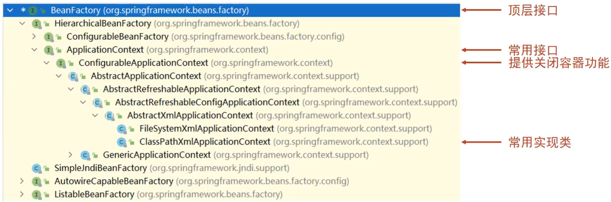
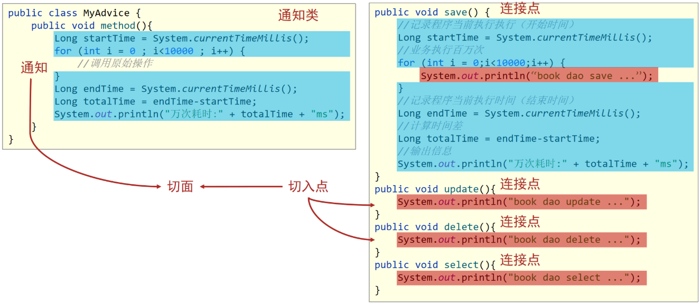
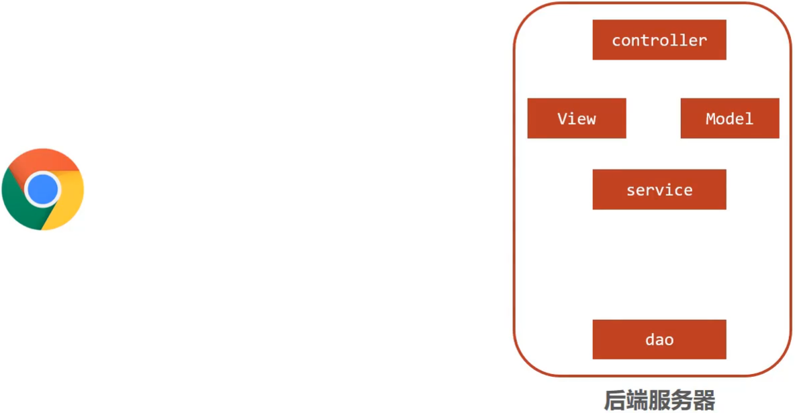
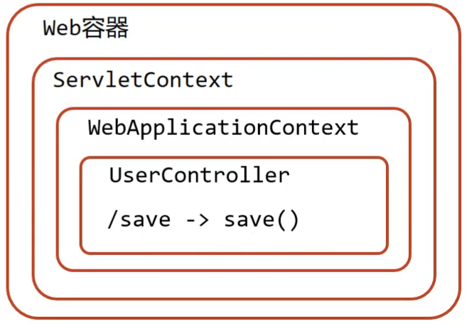
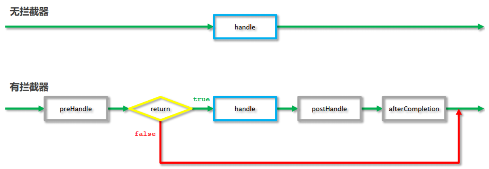
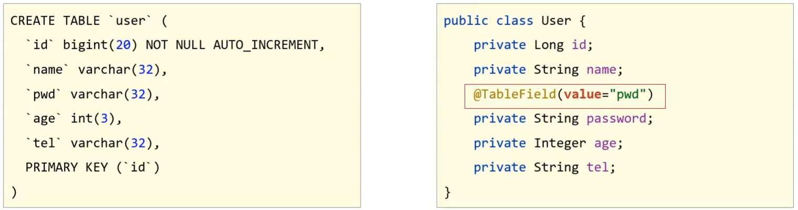
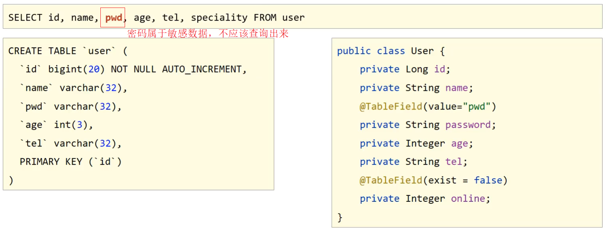
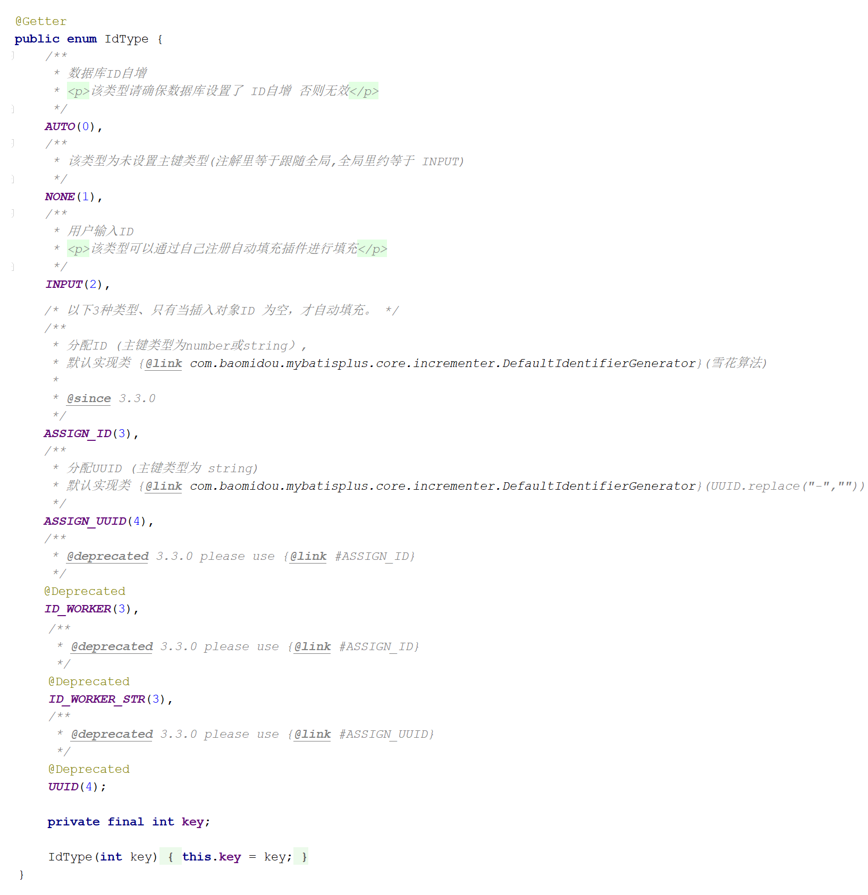

# Spring

## 1.Spring

### 1.1 IOC、IOC容器、Bean、DI

#### 什么是控制反转（IOC）

由主动new产生对象转换为由==外部==提供对象，此过程中对象创建控制权由程序转移到外部，此思想称为控制反转。

#### Spring和IOC之间的关系

* Spring技术是IOC思想的实现
* Spring提供了一个容器，称为==IOC容器==

#### IOC容器的作用以及内部存放的是什么?

* IOC容器负责对象的创建、初始化等一系列工作，其中包含了数据层和业务层的类对象
* 被创建或被管理的对象在IOC容器中统称为==Bean==
* IOC容器中放的就是一个个的Bean对象

#### 什么是依赖注入呢?

在容器中建立bean与bean之间的依赖关系的整个过程，称为依赖注入。如业务层需要依赖数据层，service就要和dao建立依赖关系。new对象的过程交给IOC容器注入进来（反射机制获得目标的class和方法，用invoke进行注入）

#### 总结

* 使用IOC容器管理bean（IOC)
* 在IOC容器内将有依赖关系的bean进行关系绑定（DI）
* 最终结果为:使用对象时不仅可以直接从IOC容器中获取，并且获取到的bean已经绑定了所有的依赖关系.

#### `什么是IOC/DI思想`、`什么是IOC容器`和`什么是Bean`

(1)什么IOC/DI思想?

* IOC:控制反转，控制反转的是对象的创建权
* DI:依赖注入，绑定对象与对象之间的依赖关系

(2)什么是IOC容器?

​	Spring创建了一个容器用来存放所创建的对象，这个容器就叫IOC容器

(3)什么是Bean?

​	容器中所存放的一个个对象就叫Bean或Bean对象

### 1.2 IOC

#### IOC实现的过程

Spring 是使用容器来管理bean对象的，管理(Service和Dao)等使用到的类对象；使用配置文件将bean对象告知IOC容器；使用Spring框架提供相应的接口来**获取IOC容器**，再通过提供接口的方法来获得IOC容器中的bean。

```java
//xml获取IOC容器
ApplicationContext ctx = new ClassPathXmlApplicationContext("applicationContext.xml"); 
//获取IOC容器中的bean
BookService bookService = (BookService) ctx.getBean("bookService");
```

#### IOC容器中对象是否为单例

默认情况下，Spring创建的bean对象都是单例的，即通过IOC容器getBean(xx)得到的对象的地址是一样的。

scope设置为`singleton`为单例；scope设置为`prototype`为非单例。

#### 为什么bean默认为单例?

* bean对象在IOC容器中只有一个就避免了对象的频繁创建与销毁，达到了bean对象的复用，性能高

#### bean在容器中是单例的，会不会产生线程安全问题?

要看是否为有状态对象。有状态对象存储的数据可能会被多个线程同时访问修改有线程安全。如果对象是无状态对象，即该对象没有成员变量没有进行数据存储的，因方法中的局部变量在方法调用完成后会被销毁，所以不会存在线程安全问题。

1. 有状态对象：指的是对象中含有可变状态（成员变量）并且能够存储数据的对象。**由于对象的状态可能会被多个线程同时修改**，因此在多线程环境下会存在线程安全问题。例如，在Spring中，单例Bean（默认情况下Bean是单例的）通常是有状态对象，因为它存储了对象的状态，可能被多个线程同时修改访问。
2. 无状态对象：指的是对象中没有可变状态或者不对外部共享其状态的对象。在这种情况下，对象的方法不会改变对象的状态，或者**只在方法的局部变量中存储数据，方法执行结束后局部变量会被销毁**，因此不会存在线程安全问题。在Spring中，原型（prototype）作用域的Bean通常可以看作是无状态对象，因为每次请求都会创建新的实例。

```java
public class MyService {
    private int count; //有线程安全

    public void increment() {
        count++;
    }
    public int add(int a, int b) {
        int result = a + b;// 无线程安全
       return result;
```

#### XML相关（了解）

##### XML配置Bean及Bean标签（了解）

```java
<!--bean标签标示配置bean
    id属性标示给bean起名字
    class属性表示给bean定义类型
	-->
    <bean id="bookDao" class="com.itheima.dao.impl.BookDaoImpl"/>
    <bean id="bookService" class="com.itheima.service.impl.BookServiceImpl">
<!--配置server与dao的关系-->
<!--property标签表示配置当前bean的属性
    name属性表示配置哪一个具体的属性
    ref属性表示参照哪一个bean
-->
    <property name="bookDao" ref="bookDao"/>
	</bean>
```

##### Bean的获取方式

```java
//方式一，就是目前案例中获取的方式:
BookDao bookDao = (BookDao) ctx.getBean("bookDao");
//方式二：解决强转类型
BookDao bookDao = ctx.getBean("bookDao"，BookDao.class);
```

方式三:

```
BookDao bookDao = ctx.getBean(BookDao.class);
```

必须要确保IOC容器中该类型对应的bean对象只能有一个。

##### BeanFactory 层次关系

只需要知晓容器的最上级的父接口为 BeanFactory即可



* 使用BeanFactory创建的容器加载bean是延迟加载（懒加载）;
* 使用ApplicationContext创建的容器加载bean是立即加载；`ClassPathXmlApplicationContext()`

xml配置参数(了解)


### 1.3 DI

#### Spring的注入方式（了解，原始麻烦）

* setter注入
  * 简单类型（基本数据类型与String）：对要注入的bean直接value属性赋值。
  * ==引用类型==：在xml中创建用到的bean，在property中指定将要注入的bean绑定，即ref属性指定要绑定的bean id，name属性指定被注入对象名（类名首字母小写）。


* 构造器注入
  * 简单类型
  * 引用类型
  * 使用标签<constructor-arg>，接构造参数，引用ref，简单value


- 自动注入，开启autowird
  * 需要注入属性的类中对应属性的setter方法不能省略
  * 被注入的对象必须要被Spring的IOC容器管理
  * 自动装配方式
    * ==按类型（常用）== `autowire="byType"`，bean唯一；
    * ==按名称== `autowire="byName"`  因变量名与配置耦合，不推荐使用
      * 对外部类来说，setBookDao方法名，去掉set后首字母小写是其属性名
        * 为什么是去掉set首字母小写?
        * 这个规则是set方法生成的默认规则，set方法的生成是把属性名首字母大写前面加set形成的方法名；所以按照名称注入，其实是和对应的set方法有关。
    * 按构造方法
    * 不启用自动装配

#### 反射机制流程

在Spring框架中，依赖注入的过程涉及到反射机制。当使用注解或XML配置进行依赖注入时，Spring会通过反射机制来调用对应类的setter方法，从而将特定的Bean对象注入到对应的属性中。

下面是一个详细的描述反射机制调用setter方法实现依赖注入的过程：

1. 在Spring配置文件中，通过`<bean>`标签或者注解对需要进行依赖注入的类进行标识。
2. 当Spring容器初始化时，它会解析配置文件或扫描注解，并根据配置文件中的信息创建对应的Bean对象。
3. 当容器创建某个Bean对象时，它会检查这个Bean是否有对应的setter方法，用来接收其他Bean的引用。
4. 如果发现了某个属性对应的setter方法，Spring会使用反射机制来调用这个setter方法。
5. Spring会在容器中查找符合该属性类型的Bean对象，然后将找到的Bean对象作为参数传递给setter方法。
6. 调用了setter方法后，被注入的Bean对象就会被赋值给属性，实现了依赖注入的过程。

```java
setUserServiceMethod.invoke(someService（被注入对象所在类的对象）, userService(被注入的对象));
```


### 1.4 Bean

#### 1.4.1 bean的实例化-spring如何创建bean

- 实例化bean的三种方式，`构造方法`,`静态工厂`和`实例工厂`
- bean本质上就是对象，对象在new的时候会使用构造方法完成，那创建bean也是使用构造方法完成的。

#### 1.4.2 构造方法实例化

Spring底层使用的是类的无参构造方法；

内部走的依然是构造函数,能访问到类中的私有构造方法,Spring底层用的是反射。

因为每一个类默认都会提供一个无参构造函数，常用，但是如果重写了构造方法，默认的就会消失。

#### 1.4.3 静态工厂实例化

创建一个静态方法返回实现类对象，这样可以直接通过类名调用方法。但需要交给springIOC，需要告诉IOC工厂类和静态方法才能被管理。不咋用。


#### 1.4.4 实例工厂

通过FactoryBean接口简化开发，利用接口中的getObje() 返回对象和getObjectTyp()指定要创建对象的类型。

#### 1.4.5 生命周期

##### bean生命周期是什么?

* bean对象从创建到销毁的整体过程。

##### bean生命周期控制是什么?

* 在bean创建后到销毁前做一些事情。


### 1.5 Spring注解开发

##### **记图


##### @Component注解

**开启注解包扫描**（后面用@ComponentScan替换）

```xml
<context:component-scan base-package="com.itheima"/>
```

base-package指定Spring框架扫描的包路径，它会扫描指定包及其子包中的**所有类上的注解**。

- **@Component**注解不可以添加在接口上，因为接口是无法创建对象的。Spring将管理的bean视作自己的一个组件.
- 


* 使用`@Component`注解标记的类会被Spring容器扫描并注册为Bean。当类上没有指定名称时，在使用`@Autowired`或者其他依赖注入的方式时，Spring会**根据类型**来获取对应的Bean对象。

  * 可以通过value属性来指定名称，`value=`可以省略；

    * ```java
      @Component("userService")
      public class UserService {
          // ...
      }
      ```

    - 为了在其他类中使用这个Bean，可以通过`@Autowired`注解结合`@Qualifier`注解来指定使用的Bean名称：

      ```java
      @Component
      public class App {
          @Autowired
          @Qualifier("userService")
          private UserService userService;
      
          // ...
      }
      ```

* @Component注解如果不起名称，会有一个默认值就是`当前类名首字母小写`，所以也可以按照名称获取，如

```java
BookService bookService = (BookService)ctx.getBean("bookServiceImpl");
```

- @Component注解，还衍生出了其他三个注解`@Controller`、`@Service`、`@Repository`, 方便我们后期在编写类的时候能很好的区分出这个类是属于`表现层`、`业务层`还是`数据层`的类。

##### @Configuration注解 + @ComponentScan

@Configuration标识该类为配置类,替换`applicationContext.xml`。在配置类上添加包扫描注解`@ComponentScan`替换`<context:component-scan base-package=""/>`

* @Configuration注解用于设定当前类为配置类

* @ComponentScan注解用于设定扫描路径，此注解只能添加一次，多个数据请用数组格式，用于加载使用注解格式定义的bean
  * excludeFilters:排除扫描路径中加载的bean,需要指定类别(type)和具体项(classes)

  * includeFilters:加载指定的bean，需要指定类别(type)和具体项(classes)

* @PropertySource注解加载properties配置文件

```java
@Configuration
@ComponentScan("com.itheima")
@PropertySource("jdbc.properties")
public class SpringConfig {
}
```

```java
AnnotationConfigApplicationContext ctx = new AnnotationConfigApplicationContext(SpringConfig.class);
```


##### **速记

* 记住@Component、@Controller、@Service、@Repository这四个注解
* applicationContext.xml中`<context:component-scan/>`的作用是指定扫描包路径，注解为@ComponentScan
* @Configuration标识该类为配置类，使用类替换applicationContext.xml文件
* ClassPathXmlApplicationContext是加载XML配置文件
* AnnotationConfigApplicationContext是加载配置类


### 1.6 注解开发bean与生命周期管理

##### @Scope bean作用范围-单例非单例

@Scope("prototype")；作用类上。

##### 生命周期

哪个是初始化方法，哪个是销毁方法?

只需要在对应的方法上添加`@PostConstruct`（init()上）和`@PreDestroy`（destroy()上）注解即可。


### 1.7 注解开发依赖注入

#### @Autowird注解

| 名称 | @Autowired                                                   |
| ---- | ------------------------------------------------------------ |
| 类型 | 属性注解  或  方法注解（了解）  或  方法形参注解（了解）     |
| 位置 | 属性定义上方  或  标准set方法上方  或  类set方法上方  或  方法形参前面 |
| 作用 | 为引用类型属性设置值                                         |
| 属性 | required：true/false，定义该属性是否允许为null               |

##### 为什么setter方法可以删除呢?

* 自动装配基于反射设计创建对象并通过暴力反射为私有属性进行设值
* 普通反射只能获取public修饰的内容
* 暴力反射除了获取public修饰的内容还可以获取private修改的内容

##### 按类型注入

```java
@Service
public class BookServiceImpl implements BookService {
    @Autowired
    private BookDao bookDao;
    
//	  public void setBookDao(BookDao bookDao) {
//        this.bookDao = bookDao;
//    }
    public void save() {
        System.out.println("book service save ...");
        bookDao.save();
    }
}
```

@Autowired是按照类型注入，那么对应BookDao接口如果有多个实现类（多个实现类的bean），按照类型注入就无法区分到底注入哪个bean对象，**解决方案**:`按照名称注入`，指定试下类bean的名称：

```java
@Repository("bookDao")
public class BookDaoImpl implements BookDao {
    public void save() {
        System.out.println("book dao save ..." );
    }
}
@Repository("bookDao2")
public class BookDaoImpl2 implements BookDao {
    public void save() {
        System.out.println("book dao save ...2" );
    }
}
```

**Note**: @Autowired默认按照类型自动装配，如果IOC容器中同类的Bean找到多个，就按照变量名和Bean的名称匹配。如果实现类只有一个，因为变量名叫`bookDao`而容器中也有一个`bookDao`，所以可以成功注入。

##### 按名称注入

解决IOC容器中找到多个bean但注入参数的属性名和容器中bean名不一致的情况，用`@Qualifier`来指定注入哪个名称的bean对象。

```java
@Autowired
@Qualifier("bookDao1")
private BookDao bookDao;
```

注意:@Qualifier不能独立使用，必须和@Autowired一起使用。

##### 按简单类型注入

```java
 @Value("itheima")
 private String name;
```

#### @Bean注解

第三方类在jar中，没法在该类上加注解，@Bean注解的作用是**将方法的返回值制作为Spring管理的一个bean对象**。

```java
@Configuration
public class SpringConfig {
	@Bean
    public DataSource dataSource(){
        DruidDataSource ds = new DruidDataSource();
        ds.setDriverClassName("com.mysql.jdbc.Driver");
        ds.setUrl("jdbc:mysql://localhost:3306/spring_db");
        ds.setUsername("root");
        ds.setPassword("root");
        return ds;
    }
}
```

#### @Import注解

- 作用导入**配置类**

* 扫描注解@ComponentScan可以移除

* @Import参数需要的是一个数组，可以引入多个配置类。

```java
@Configuration
//@ComponentScan("com.itheima.config")
@Import({JdbcConfig.class})
public class SpringConfig {	
}
```

## 2.Spring AOP

### 2.1 AOP简介

#### 什么是AOP?

- AOP(Aspect Oriented Programming)面向切面编程，一种编程思想。核心思想是在不改原有代码的前提下对其进行增强。

* OOP(Object Oriented Programming)面向对象编程




### 2.2 概念

* **连接点(JoinPoint)**：层于层之间调用的过程中，目标层中可供调用的方法，就称之为连接点。
* **切入点(Pointcut)**:匹配连接点的式子，被筛选后的方法，需要增强的方法。**连接点+切入规则。**
  * 在连接点的基础上 增加上切入规则 选择出需要进行增强的切入点 这些基于切入规则选出来的连接点 就称之为切入点。
  * 在SpringAOP中，一个切入点可以描述一个具体方法，也可也匹配多个方法
    * 一个具体的方法:如com.itheima.dao包下的BookDao接口中的无形参无返回值的save方法
    * 匹配多个方法:所有的save方法，所有的get开头的方法，所有以Dao结尾的接口中的任意方法，所有带有一个参数的方法
  * 连接点范围要比切入点范围大，是**切入点的方法也一定是连接点**，但是是连接点的方法就不一定要被增强，所以可能不是切入点。
* **通知(Advice)**:在切入点处执行的操作，增强的具体方法。
  * 在spring底层的代理拦截下切入点后，将切入点交给切面类，切面类中就要有处理这些切入点的方法，这些方法就称之为通知（也叫增强 增强方法）。
  * “around”、“before”和“after”等不同类型的通知
* **切面(Aspect)**:描述通知与切入点的对应关系。那哪个切入点需要添加哪个通知。

### 2.3 AOP实现步骤

- 1. 定义接口与实现类
- 2. 定义通知类和通知（增强的方法）
- 3. 定义切入点
- 4. 制作切面
- 5. 将通知类配给容器并标识其为切面类

```java
@Component	
@Aspect 	//切面类
public class MyAdvice {//2.通知类
    @Pointcut("execution(void com.itheima.dao.BookDao.update())")//3.切入点
    private void pt(){}//4.切面
    
    @Before("pt()") //4.切面
    public void method(){//2.通知
        System.out.println(System.currentTimeMillis());
    }
}
```

### 2.4 代理对象

* 如果目标对象中的方法会被增强，那么容器中将存入的是目标对象的代理对象
* 如果目标对象中的方法不被增强，那么容器中将存入的是目标对象本身。

* 目标对象(Target)：原始功能去掉共性功能对应的类产生的对象，这种对象是无法直接完成最终工作的
* 代理(Proxy)：目标对象无法直接完成工作，需要对其进行功能回填，通过原始对象的代理对象实现

### 2.5 通知类型


- 前置通知 待增强方法前执行

- 后置通知 不管有没有抛异常最后都会通知执行

- 返回后通知 待增强方法运行后执行

- 异常后通知 当方法有异常时执行

- 环绕通知 方法执行前后，必须依赖形参ProceedingJoinPoint才能实现对原始方法的调用，进而实现原始方法调用前后同时添加通知;环绕通知返回值设置为Object类型

  ```java
   @Around("pt2()")
      public Object aroundSelect(ProceedingJoinPoint pjp) throws Throwable {
          System.out.println("around before advice ...");
          //表示对原始操作的调用
          Object ret = pjp.proceed();
          System.out.println("around after advice ...");
          return ret;
      }
  ```

### 2.6 通知中获取参数

- 获取切入点方法的参数，所有的通知类型都可以获取参数
  - JoinPoint：适用于前置、后置、返回后、抛出异常后通知
  - ProceedingJoinPoint：适用于环绕通知
- 获取切入点方法返回值，前置和抛出异常后通知是没有返回值，后置通知可有可无，所以不做研究
  - 返回后通知
  - 环绕通知
- 获取切入点方法运行异常信息，前置和返回后通知是不会有，后置通知可有可无，所以不做研究
  - 抛出异常后通知
  - 环绕通知

### 2.7 AOP事务管理

Spring为了管理事务，提供了一个平台事务管理器`PlatformTransactionManager`


commit是用来提交事务，rollback是用来回滚事务。

#### @Transactional注解

==建议写在实现类或实现类的方法上==

##### 知识点1：@EnableTransactionManagement

| 名称 | @EnableTransactionManagement           |
| ---- | -------------------------------------- |
| 类型 | 配置类注解                             |
| 位置 | 配置类定义上方                         |
| 作用 | 设置当前Spring环境中开启注解式事务支持 |

##### 知识点2：@Transactional   

| 名称 | @Transactional                                               |
| ---- | ------------------------------------------------------------ |
| 类型 | 接口注解  类注解  方法注解                                   |
| 位置 | 业务层接口上方  业务层实现类上方  业务方法上方               |
| 作用 | 为当前业务层方法添加事务（如果设置在类或接口上方则类或接口中所有方法均添加事务） |


* transfer上添加了@Transactional注解，在该方法上就会有一个事务T

* AccountDao的outMoney方法的事务T1加入到transfer的事务T中

* AccountDao的inMoney方法的事务T2加入到transfer的事务T中

* 这样就保证他们在同一个事务中，当业务层中出现异常，整个事务就会回滚，保证数据的准确性。

  * 事务管理员：发起事务方，在Spring中通常指代业务层开启事务的方法

  - 事务协调员：加入事务方，在Spring中通常指代数据层方法，也可以是业务层方法

## 3.SpringMVC

### 3.1 MVC相关概念




后端服务器分为`web`、`service`和`dao`， 再细分web的功能，设计为`controller`、`view`和`Model`：

* controller负责请求和数据的接收，接收后将其转发给service进行业务处理

* service根据需要会调用dao对数据进行增删改查

* dao把数据处理完后将结果交给service,service再交给controller

* controller根据需求组装成Model和View,Model和View组合起来生成页面转发给前端浏览器

* Model 举例：

  * ```java
    public class User {
        private String name;
        private int age;
        //setter...getter...略
    }
    ```

- Controller举例：

  - ```java
    @Controller
    public class UserController {
        @RequestMapping("/commonParam")
        @ResponseBody
        public String commonParam(){
            return "{'module':'commonParam'}";
        }
    }
    ```

- View 现在是前后端分离，将Model和必要的参数以json等形式向前端传递

SpringMVC==主要==负责的就是

* controller如何接收请求和数据
* 如何将请求和数据转发给业务层
* 如何将响应数据转换成json发回到前端

#### SpringMVC执行流程


```text
01、用户发送出请求被前端控制器DispatcherServlet拦截进行处理。
02、DispatcherServlet收到请求调用HandlerMapping（处理器映射器）。
03、HandlerMapping找到具体的处理器(查找xml配置或注解配置)，生成处理器对象及处理器拦截器(如果有)，再一起返回给DispatcherServlet。
04、DispatcherServlet调用HandlerAdapter（处理器适配器）。
05、HandlerAdapter经过适配调用具体的处理器（Handler/Controller）。
06、Controller执行完成返回ModelAndView对象。
07、HandlerAdapter将Controller执行结果ModelAndView返回给DispatcherServlet。
08、DispatcherServlet将ModelAndView传给ViewReslover（视图解析器）。
09、ViewReslover解析ModelAndView后返回具体View（视图）给DispatcherServlet。
10、DispatcherServlet根据View进行渲染视图（即将模型数据填充至视图中）。
11、DispatcherServlet响应View给用户。
```

#### SpringMVC组件

- 1、**前端控制器DispatcherServlet**（不需要程序员开发）由框架提供，在web.xml中配置。
  作用：接收请求，响应结果，相当于转发器，中央处理器。本质上是一个Servlet，相当于一个中转站，所有的访问都会走到这个Servlet中，再根据配置进行中转到相应的Handler(Controller)中进行处理,获取到数据和视图后，在使用相应视图做出响应。
- 2、**处理器映射器HandlerMapping**（不需要程序员开发）由框架提供。
  作用：存储了URL和对应servlet(Controller)的映射关系；根据请求的url查找Handler（处理器/Controller），可以通过XML和注解方式来映射。
- 3、**处理器适配器HandlerAdapter**（不需要程序员开发）由框架提供。
  作用：按照特定规则（HandlerAdapter要求的规则）去执行Handler中的方法。将请求响应和对应的Handler信息交由处理器适配器处理，处理器适配器找到真正handler执行。
- 4、**处理器Handler**（也称之为Controller，==需要程序员开发==）
  注意：编写Handler时按照HandlerAdapter的要求去做，这样适配器才可以去正确执行Handler。
  作用：接受用户请求信息，调用业务方法处理请求，也称之为后端控制器。
- 5、**视图解析器ViewResolver**（不需要程序员开发）由框架提供。
  作用：进行视图解析，把逻辑视图解析成真正的物理视图。 
- 6、**视图View**（需要工程师开发）
  作用：把数据展现给用户的页面
  View是一个接口，实现类支持不同的View技术（jsp、freemarker、pdf等）


### 3.2 相关注解

多次工作

- 定义处理请求的控制器类 @Controller
- 定义处理请求的控制器方法，并配置映射路径（@RequestMapping）与返回json数据（@ResponseBody）

```java
@Controller //
@RequestMapping("/user")
public class UserController {
    @RequestMapping("/save")
    @ResponseBody
    public String save(){
        System.out.println("user save ...");
        return "{'info':'springmvc'}"; 
        //return "index.jsp"; //如果有@ResponseBody，则将"index.jsp"当成字符串返回给前端；如果没有该注解，则将"index.jsp"当成页面名去找这个文件，如果没找到返回404.
    }
}
```


#### @Controller

| 名称 | @Controller                       |
| ---- | --------------------------------- |
| 类型 | 类注解                            |
| 位置 | SpringMVC控制器类定义上方         |
| 作用 | **设定SpringMVC的核心控制器bean** |

####   @RequestMapping

| 名称     | @RequestMapping                                              |
| -------- | ------------------------------------------------------------ |
| 类型     | 类注解或方法注解                                             |
| 位置     | SpringMVC控制器类或方法定义上方                              |
| 作用     | 设置当前控制器方法请求访问路径;当类上和方法上都添加了`@RequestMapping`注解，前端发送请求的时候，要和两个注解的value值相加匹配才能访问到。 |
| 相关属性 | value(默认)，请求访问路径                                    |

#### @ResponseBody

| 名称 | @ResponseBody                                                |
| ---- | ------------------------------------------------------------ |
| 类型 | 类注解或方法注解                                             |
| 位置 | SpringMVC控制器类或方法定义上方                              |
| 作用 | 设置当前控制器方法响应内容为当前返回值，无需解析；写在类上，该类的所有方法都有该注解功能 |

当方法上有@ReponseBody注解后

* 方法的返回值为字符串，会将其作为文本内容直接响应给前端
* 方法的返回值为对象，会将对象转换成JSON响应给前端

此处又使用到了类型转换，内部还是通过Converter接口的实现类完成的，所以Converter除了前面所说的功能外，它还可以实现:

* 对象转Json数据(POJO -> json)
* 集合转Json数据(Collection -> json)

##### Converter接口

```java
/**
*	S: the source type
*	T: the target type
*/
public interface Converter<S, T> {
    @Nullable
    //该方法就是将从页面上接收的数据(S)转换成我们想要的数据类型(T)返回
    T convert(S source);
}
```

**注意:Converter所属的包为`org.springframework.core.convert.converter`**

#### @RequestParam

| 名称     | @RequestParam                                          |
| -------- | ------------------------------------------------------ |
| 类型     | 形参注解                                               |
| 位置     | SpringMVC控制器方法形参定义前面                        |
| 作用     | 绑定请求参数与处理器方法形参间的关系                   |
| 相关参数 | required：是否为必传参数 <br/>defaultValue：参数默认值 |

#### @EnableWebMvc

| 名称 | @EnableWebMvc                                          |
| ---- | ------------------------------------------------------ |
| 类型 | ==配置类注解==                                         |
| 位置 | SpringMVC配置类定义上方                                |
| 作用 | 开启SpringMVC多项辅助功能;比如开启json数据类型自动转换 |

#### @RequestBody

| 名称 | @RequestBody                                                 |
| ---- | ------------------------------------------------------------ |
| 类型 | ==形参注解==                                                 |
| 位置 | SpringMVC控制器方法形参定义前面                              |
| 作用 | 将请求中请求体所包含的数据传递给请求参数，此注解一个处理器方法只能使用一次 |

#### @RequestBody与@RequestParam区别

* 区别
  * @RequestParam用于接收url地址传参，表单传参【application/x-www-form-urlencoded】
  * @RequestBody用于接收json数据【application/json】

* 应用
  * 后期开发中，发送json格式数据为主，@RequestBody应用较广
  * 如果发送非json格式数据，选用@RequestParam接收请求参数

#### @DateTimeFormat

| 名称     | @DateTimeFormat                 |
| -------- | ------------------------------- |
| 类型     | ==形参注解==                    |
| 位置     | SpringMVC控制器方法形参前面     |
| 作用     | 设定日期时间型数据格式          |
| 相关属性 | pattern：指定日期时间格式字符串 |

#### @PathVariable

| 名称 | @PathVariable                                                |
| ---- | ------------------------------------------------------------ |
| 类型 | ==形参注解==                                                 |
| 位置 | SpringMVC控制器方法形参定义前面                              |
| 作用 | 绑定路径参数与处理器方法形参间的关系，要求路径参数名与形参名一一对应 |

#### `@RequestBody`、`@RequestParam`、`@PathVariable`,这三个注解之间的区别和应用分别是什么?

* 区别
  * @RequestParam用于接收url地址传参或表单传参
  * @RequestBody用于接收json数据
  * @PathVariable用于接收路径参数，使用{参数名称}描述路径参数
* 应用
  * 后期开发中，发送请求参数超过1个时，以json格式为主，@RequestBody应用较广
  * 如果发送非json格式数据，选用@RequestParam接收请求参数
  * 采用RESTful进行开发，当参数数量较少时，例如1个，可以采用@PathVariable接收请求路径变量，通常用于传递id值

#### @RestController

| 名称 | @RestController                                              |
| ---- | ------------------------------------------------------------ |
| 类型 | ==类注解==                                                   |
| 位置 | 基于SpringMVC的RESTful开发控制器类定义上方                   |
| 作用 | 设置当前控制器类为RESTful风格，<br/>等同于@Controller与@ResponseBody两个注解组合功能 |

#### @GetMapping @PostMapping @PutMapping @DeleteMapping

| 名称     | @GetMapping @PostMapping @PutMapping @DeleteMapping          |
| -------- | ------------------------------------------------------------ |
| 类型     | ==方法注解==                                                 |
| 位置     | 基于SpringMVC的RESTful开发控制器方法定义上方                 |
| 作用     | 设置当前控制器方法请求访问路径与请求动作，每种对应一个请求动作，<br/>例如@GetMapping对应GET请求 |
| 相关属性 | value（默认）：请求访问路径                                  |

#### @RestControllerAdvice

| 名称 | @RestControllerAdvice              |
| ---- | ---------------------------------- |
| 类型 | ==类注解==                         |
| 位置 | Rest风格开发的控制器增强类定义上方 |
| 作用 | 为Rest风格开发的控制器类做增强     |

**说明:**此注解自带@ResponseBody注解与@Component注解，具备对应的功能


#### @ExceptionHandler

| 名称 | @ExceptionHandler                                            |
| ---- | ------------------------------------------------------------ |
| 类型 | ==方法注解==                                                 |
| 位置 | 专用于异常处理的控制器方法上方                               |
| 作用 | 设置指定异常的处理方案，功能等同于控制器方法，<br/>出现异常后终止原始控制器执行,并转入当前方法执行 |

**说明：**此类方法可以根据处理的异常不同，制作多个方法分别处理对应的异常


### 3.3 工作流程解析

#### 启动服务器初始化（略）




#### 单次请求过程

1. 发送请求`http://localhost/save`
2. web容器发现该请求满足SpringMVC拦截规则，将请求交给SpringMVC处理
3. 解析请求路径/save
4. 由/save匹配执行对应的方法save(）
   * 上面的第五步已经将请求路径和方法建立了对应关系，通过/save就能找到对应的save方法
5. 执行save()
6. 检测到有@ResponseBody直接将save()方法的返回值作为响应体返回给请求方

### 3.4 bean加载控制

#### controller、service和dao这些类都需要被容器管理成bean对象，那么到底是该让SpringMVC加载还是让Spring加载呢?

* SpringMVC加载其相关bean(表现层bean),也就是controller包下的类
* Spring控制的bean
  * 业务bean(Service)
  * 功能bean(DataSource,SqlSessionFactoryBean,MapperScannerConfigurer等)

#### 因为功能不同，如何避免Spring错误加载到SpringMVC的bean?

解决方案也比较简单，就是:

* 加载Spring控制的bean的时候排除掉SpringMVC控制的bean

具体该如何排除：

* 方式一:Spring加载的bean设定扫描范围为精准范围，例如service包、dao包等

  * ```java
    @Configuration
    @ComponentScan({"com.itheima.service","comitheima.dao"})
    public class SpringConfig {
    }
    ```

  * ```java
    @Configuration
    @ComponentScan("com.itheima.controller")
    public class SpringMvcConfig {
    }
    ```

* 方式二:Spring加载的bean设定扫描范围为com.itheima,排除掉controller包中的bean

  ```java
  @Configuration
  @ComponentScan(value="com.itheima",
      excludeFilters=@ComponentScan.Filter(
      	type = FilterType.ANNOTATION,
          classes = Controller.class
      )
  )
  public class SpringConfig {
  }
  ```

* 方式三:不区分Spring与SpringMVC的环境，加载到同一个环境中[了解即可]


### 3.5 参数传递

#### 3.5.1 普通参数

普通参数:url地址传参，地址参数名与形参变量名相同，定义形参即可接收参数。

若url地址和方法形参对不上，则用@RequestParam注解。

> url http://localhost/commonParamDifferentName?name=张三&age=18

```java
@RequestMapping("/commonParamDifferentName")
@ResponseBody
public String commonParamDifferentName(@RequestPaam("name") String userName , int age){
    System.out.println("普通参数传递 userName ==> "+userName);
    System.out.println("普通参数传递 age ==> "+age);
    return "{'module':'common param different name'}";
}
```

#### 3.5.2 POJO参数

POJO参数：请求参数名与形参对象属性名相同，定义POJO类型形参即可接收参数

==请求参数key的名称要和POJO中属性的名称一致，否则无法封装。==

```java
public class User {
    private String name;
    private int age;
    //setter...getter...略
}
```

```java
//url http://localhost/pojoParam?name=张三&age=18
//POJO参数：请求参数与形参对象中的属性对应即可完成参数传递
@RequestMapping("/pojoParam")
@ResponseBody
public String pojoParam(User user){
    System.out.println("pojo参数传递 user ==> "+user);
    return "{'module':'pojo param'}";
}
```

#### 3.5.3 嵌套POJO参数

嵌套POJO参数：请求参数名与形参对象属性名相同，按照对象层次结构关系即可接收嵌套POJO属性参数


#### 3.5.4 数组类型参数

数组参数：请求参数名与形参对象属性名相同且请求参数为多个，定义数组类型即可接收参数。

```java
//数组参数：同名请求参数可以直接映射到对应名称的形参数组对象中
@RequestMapping("/arrayParam")
@ResponseBody
public String arrayParam(String[] likes){
    System.out.println("数组参数传递 likes ==> "+ Arrays.toString(likes));
    return "{'module':'array param'}";
}
```

#### 3.5.5 集合类型参数

SpringMVC将List看做是一个POJO对象来处理，将其创建一个对象并准备把前端的数据封装到对象中，但是List是一个接口无法创建对象，所以报错。

集合保存普通参数：请求参数名与形参集合对象名相同且请求参数为多个，@RequestParam绑定参数关系

```java
//集合参数：同名请求参数可以使用@RequestParam注解映射到对应名称的集合对象中作为数据
@RequestMapping("/listParam")
@ResponseBody
public String listParam(@RequestParam List<String> likes){
    System.out.println("集合参数传递 likes ==> "+ likes);
    return "{'module':'list param'}";
}
```

### 3.6 JSON数据传输

SpringMVC接收JSON数据的实现步骤为:

(1)导入jackson包

(2)使用PostMan发送JSON数据

(3)开启SpringMVC注解驱动，在配置类上添加@EnableWebMvc注解

(4)Controller方法的参数前添加@RequestBody注解

在SpringMVC的配置类中开启SpringMVC的注解支持，这里面就包含了将JSON转换成对象的功能。

```java
@Configuration
@ComponentScan("com.itheima.controller")
//开启json数据类型自动转换
@EnableWebMvc
public class SpringMvcConfig {
}
```

##### 参数前添加@RequestBody 

```java
//使用@RequestBody注解将外部传递的json数组数据映射到形参的集合对象中作为数据
@RequestMapping("/listParamForJson")
@ResponseBody
public String listParamForJson(@RequestBody List<String> likes){
    System.out.println("list common(json)参数传递 list ==> "+likes);
    return "{'module':'list common for json param'}";
}
```

### 3.7 REST风格

#### 小结

(1)设定Http请求动作(动词)

@RequestMapping(value="",==method== = RequestMethod.==POST|GET|PUT|DELETE==)

(2)设定请求参数(路径变量)

@RequestMapping(value="/users/=={id}==",method = RequestMethod.DELETE)

@ReponseBody

public String delete(==@PathVariable== Integer ==id==){

}

#### 内容

* 发送GET请求是用来做查询
* 发送POST请求是用来做新增
* 发送PUT请求是用来做修改
* 发送DELETE请求是用来做删除

对应不同的@RequestMapping

> 如果发送的不是DELETE请求，比如发送GET请求，则会报错

```java
@Controller
public class UserController {
    //设置当前请求方法为DELETE，表示REST风格中的删除操作
	@RequestMapping(value = "/users/{id}",method = RequestMethod.DELETE)
    @ResponseBody
    public String delete(@PathVariable Integer id) {
        System.out.println("user delete..." + id);
        return "{'module':'user delete'}";
    }
}
```

#### 如果方法形参的名称和路径`{}`中的值不一致，该怎么办?


#### RESTful快速开发

问题1：每个方法的@RequestMapping注解中都定义了访问路径/books，重复性太高。

```
将@RequestMapping提到类上面，用来定义所有方法共同的访问路径。
```

问题2：每个方法的@RequestMapping注解中都要使用method属性定义请求方式，重复性太高。

```
使用@GetMapping  @PostMapping  @PutMapping  @DeleteMapping代替
```

问题3：每个方法响应json都需要加上@ResponseBody注解，重复性太高。

```
1.将ResponseBody提到类上面，让所有的方法都有@ResponseBody的功能
2.使用@RestController注解替换@Controller与@ResponseBody注解，简化书写
```

```java
@RestController //@Controller + ReponseBody
@RequestMapping("/books")
public class BookController {
	//@RequestMapping(method = RequestMethod.POST)
    @PostMapping
    public String save(@RequestBody Book book){
        System.out.println("book save..." + book);
        return "{'module':'book save'}";
    }
}   
```


## 4. SSM

### 4.1 流程

```java
public class ServletConfig extends AbstractAnnotationConfigDispatcherServletInitializer {
    //加载Spring配置类
    protected Class<?>[] getRootConfigClasses() {
        return new Class[]{SpringConfig.class};
    }
    //加载SpringMVC配置类
    protected Class<?>[] getServletConfigClasses() {
        return new Class[]{SpringMvcConfig.class};
    }
    //设置SpringMVC请求地址拦截规则
    protected String[] getServletMappings() {
        return new String[]{"/"};
    }
    //设置post请求中文乱码过滤器
    @Override
    protected Filter[] getServletFilters() {
        CharacterEncodingFilter filter = new CharacterEncodingFilter();
        filter.setEncoding("utf-8");
        return new Filter[]{filter};
    }
}
```


#### (1) 创建工程

* 创建一个Maven的web工程
* pom.xml添加SSM需要的依赖jar包
* 编写Web项目的入口配置类，实现`AbstractAnnotationConfigDispatcherServletInitializer`重写以下方法
  * getRootConfigClasses()	：返回Spring的配置类->需要==SpringConfig==配置类
  * getServletConfigClasses() ：返回SpringMVC的配置类->需要==SpringMvcConfig==配置类
  * getServletMappings()      : 设置SpringMVC请求拦截路径规则
  * getServletFilters()       ：设置过滤器，解决POST请求中文乱码问题

#### (2)SSM整合[==重点是各个配置的编写==]

* SpringConfig
  * 标识该类为配置类 @Configuration
  * 扫描Service所在的包 @ComponentScan
  * 在Service层要管理事务 @EnableTransactionManagement
  * 读取外部的properties配置文件 @PropertySource
  * 整合Mybatis需要引入Mybatis相关配置类 @Import
    * 第三方数据源配置类 JdbcConfig
      * 构建DataSource数据源，DruidDataSouroce,需要注入数据库连接四要素， @Bean @Value
      * 构建平台事务管理器，DataSourceTransactionManager,@Bean
    * Mybatis配置类 MybatisConfig
      * 构建SqlSessionFactoryBean并设置别名扫描与数据源，@Bean
      * 构建MapperScannerConfigurer并设置DAO层的包扫描
* SpringMvcConfig
  * 标识该类为配置类 @Configuration
  * 扫描Controller所在的包 @ComponentScan
  * 开启SpringMVC注解支持 @EnableWebMvc

#### (3)功能模块[与具体的业务模块有关]

* 创建数据库表
* 根据数据库表创建对应的模型类
* 通过Dao层完成数据库表的增删改查(接口+自动代理)
* 编写Service层[Service接口+实现类]
  * @Service
  * @Transactional
  * 整合Junit对业务层进行单元测试
    * @RunWith
    * @ContextConfiguration
    * @Test
* 编写Controller层
  * 接收请求 @RequestMapping @GetMapping @PostMapping @PutMapping @DeleteMapping
  * 接收数据 简单、POJO、嵌套POJO、集合、数组、JSON数据类型
    * @RequestParam
    * @PathVariable
    * @RequestBody
  * 转发业务层 
    * @Autowired
  * 响应结果
    * @ResponseBody


### 4.2 同一结果封装

将返回结果的数据进行统一，大体的思路为:

* 为了封装返回的结果数据:==创建结果模型类，封装数据到data属性中==
* 为了封装返回的数据是何种操作及是否操作成功:==封装操作结果到code属性中==
* 操作失败后为了封装返回的错误信息:==封装特殊消息到message(msg)属性中==


根据分析，我们可以设置统一数据返回结果类

```java
public class Result{
	private Object data;
	private Integer code;
	private String msg;
}
```

### 4.3 统一异常处理


#### 异常处理器的使用

1. 各个层级均出现异常，异常处理代码书写在哪一层?

   ==所有的异常均抛出到表现层进行处理==

2. 异常的种类很多，表现层如何将所有的异常都处理到呢?

   ==异常分类==

3. 表现层处理异常，每个方法中单独书写，代码书写量巨大且意义不强，如何解决?

   ==AOP==

**异常处理器类返回结果给前端**

@RestControllerAdvice为Rest风格开发的控制器类做增强

@ExceptionHandler设置指定异常的处理方案，功能等同于控制器方法, 出现异常后终止原始控制器执行,并转入当前方法执行

```java
//@RestControllerAdvice用于标识当前类为REST风格对应的异常处理器
@RestControllerAdvice
public class ProjectExceptionAdvice {
    //除了自定义的异常处理器，保留对Exception类型的异常处理，用于处理非预期的异常
    @ExceptionHandler(Exception.class)
    public Result doException(Exception ex){
      	System.out.println("嘿嘿,异常你哪里跑！")
        return new Result(666,null,"嘿嘿,异常你哪里跑！");
    }
}
```


#### 异常分类和异常解决方案（详细见原文档）

##### 异常分类

- 业务异常（BusinessException）
  - 发送对应消息传递给用户，提醒规范操作
    - 大家常见的就是提示用户名已存在或密码格式不正确等
- 系统异常（SystemException）
  - 发送固定消息传递给用户，安抚用户
    - 系统繁忙，请稍后再试
    - 系统正在维护升级，请稍后再试
    - 系统出问题，请联系系统管理员等
  - 发送特定消息给运维人员，提醒维护
    - 可以发送短信、邮箱或者是公司内部通信软件
  - 记录日志
    - 发消息和记录日志对用户来说是不可见的，属于后台程序
- 其他异常（Exception）
  - 发送固定消息传递给用户，安抚用户
  - 发送特定消息给编程人员，提醒维护（纳入预期范围内）
    - 一般是程序没有考虑全，比如未做非空校验等
  - 记录日志

##### 解决方案

- 步骤1:自定义异常类

  - 让自定义异常类继承`RuntimeException`的好处是，后期在抛出这两个异常的时候，就不用在try...catch...或throws了

  - ```java
    //自定义异常处理器，用于封装异常信息，对异常进行分类
    public class SystemException extends RuntimeException{
        private Integer code;
        ...
    }
    ```

    

- 步骤2:将其他异常包成自定义异常

  - 方式一:`try{}catch(){}`在catch中重新throw我们自定义异常即可。

  - 方式二:直接throw自定义异常即可

  - ```java
    //模拟系统异常，将可能出现的异常进行包装，转换成自定义异常
    try{
        int i = 1/0;
    }catch (Exception e){
        throw new SystemException(Code.SYSTEM_TIMEOUT_ERR,"服务器访问超时，请重试!",e);
    }
    ```

  - ```java
    //状态码
    public class Code {
        public static final Integer SAVE_OK = 20011;
        public static final Integer GET_OK = 20041;
        public static final Integer SYSTEM_TIMEOUT_ERR = 50002;
    }
    ```

- 步骤3:处理器类中处理自定义异常

  - ```java
    //@RestControllerAdvice用于标识当前类为REST风格对应的异常处理器
    @RestControllerAdvice
    public class ProjectExceptionAdvice {
        //@ExceptionHandler用于设置当前处理器类对应的异常类型
        @ExceptionHandler(SystemException.class)
        public Result doSystemException(SystemException ex){
            //记录日志
            //发送消息给运维
            //发送邮件给开发人员,ex对象发送给开发人员
            return new Result(ex.getCode(),null,ex.getMessage());
        }
        ...
    }
    ```

    

### 4.4 拦截器

#### 4.4.1 拦截器概念


* 拦截器（Interceptor）是一种动态拦截方法调用的机制，在SpringMVC中动态拦截控制器方法的执行
* 作用:
  * 在指定的方法调用前后执行预先设定的代码
  * 阻止原始方法的执行
  * 总结：拦截器就是用来做增强

##### 拦截器和过滤器之间的区别是什么?

- 归属不同：Filter属于Servlet技术，Interceptor属于SpringMVC技术
- 拦截内容不同：Filter对所有访问进行增强，Interceptor仅针对SpringMVC的访问进行增强


#### 4.4.2 拦截器开发



- 当有拦截器后，请求会先进入preHandle方法，如果方法返回true，则放行继续执行后面的handle[controller的方法]和后面的方法如果返回false，则直接跳过后面方法的执行。


##### 步骤1:创建拦截器类

让类实现HandlerInterceptor接口，重写接口中的三个方法。

```java
@Component
//定义拦截器类，实现HandlerInterceptor接口
//注意当前类必须受Spring容器控制
public class ProjectInterceptor implements HandlerInterceptor {
    @Override
    //原始方法调用前执行的内容
    public boolean preHandle(HttpServletRequest request, HttpServletResponse response, Object handler) throws Exception {
        System.out.println("preHandle...");
        return true;
    }

    @Override
    //原始方法调用后执行的内容
    public void postHandle(HttpServletRequest request, HttpServletResponse response, Object handler, ModelAndView modelAndView) throws Exception {
        System.out.println("postHandle...");
    }

    @Override
    //原始方法调用完成后执行的内容
    public void afterCompletion(HttpServletRequest request, HttpServletResponse response, Object handler, Exception ex) throws Exception {
        System.out.println("afterCompletion...");
    }
}
```

**注意:**拦截器类要被SpringMVC容器扫描到。

##### 步骤2:配置拦截器类

```java
@Configuration
public class SpringMvcSupport extends WebMvcConfigurationSupport {
    @Autowired
    private ProjectInterceptor projectInterceptor;

    @Override
    protected void addResourceHandlers(ResourceHandlerRegistry registry) {
        registry.addResourceHandler("/pages/**").addResourceLocations("/pages/");
    }

    @Override
    protected void addInterceptors(InterceptorRegistry registry) {
        //配置拦截器
        registry.addInterceptor(projectInterceptor).addPathPatterns("/books" );
    }
}
```

拦截器中的`preHandler`方法，如果返回true,则代表放行，会执行原始Controller类中要请求的方法，如果返回false，则代表拦截，后面的就不会再执行了。

##### 步骤3:SpringMVC添加SpringMvcSupport包扫描

```java
@Configuration
@ComponentScan({"com.itheima.controller","com.itheima.config"})
@EnableWebMvc
public class SpringMvcConfig{
   
}
```

##### 简化SpringMvcSupport的编写

```java
@Configuration
@ComponentScan({"com.itheima.controller"})
@EnableWebMvc
//实现WebMvcConfigurer接口可以简化开发，但具有一定的侵入性
public class SpringMvcConfig implements WebMvcConfigurer {
    @Autowired
    private ProjectInterceptor projectInterceptor;

    @Override
    public void addInterceptors(InterceptorRegistry registry) {
        //配置多拦截器
        registry.addInterceptor(projectInterceptor).addPathPatterns("/books","/books/*");
    }
}
```


#### 4.4.3 拦截器参数

##### 前置处理方法 preHandle（==常用==）

原始方法之前运行preHandle；最常用在这个方法中可以通过返回值来决定是否要进行放行，我们可以把业务逻辑放在该方法中，如果满足业务则返回true放行，不满足则返回false拦截。

* request:请求对象

  * 可以获取请求数据中的内容，如获取请求头的`Content-Type`

  * ```java
    String contentType = request.getHeader("Content-Type");
    ```

* response:响应对象

* handler:被调用的处理器对象，本质上是一个方法对象，对反射中的Method对象进行了再包装；因此可以利用反射获取方法的相关信息；

  * ```java
    HandlerMethod hm = (HandlerMethod)handler;
    String methodName = hm.getMethod().getName();//可以获取方法的名称
    ```


##### 后置处理方法 postHandle（不常用）

原始方法运行后运行，如果原始方法被拦截，则不执行 ；modelAndView参数:如果处理器执行完成具有返回结果，可以读取到对应数据与页面信息，并进行调整

因为咱们现在都是返回json数据，所以该参数的使用率不高。

##### 完成处理方法 afterCompletion（不常用）

ex:如果处理器执行过程中出现异常对象，可以针对异常情况进行单独处理 ；因为我们现在已经有全局异常处理器类，所以该参数的使用率也不高。

#### 4.4.4 拦截器链

```java
@Configuration
@ComponentScan({"com.itheima.controller"})
@EnableWebMvc
//实现WebMvcConfigurer接口可以简化开发，但具有一定的侵入性
public class SpringMvcConfig implements WebMvcConfigurer {
    @Autowired
    private ProjectInterceptor projectInterceptor;
    @Autowired
    private ProjectInterceptor2 projectInterceptor2;

    @Override
    public void addInterceptors(InterceptorRegistry registry) {
        //配置多拦截器
        registry.addInterceptor(projectInterceptor).addPathPatterns("/books","/books/*");
        registry.addInterceptor(projectInterceptor2).addPathPatterns("/books","/books/*");
    }
}
```


* 当配置多个拦截器时，形成拦截器链
* 拦截器链的运行顺序参照拦截器添加顺序为准
* 当拦截器中出现对原始处理器的拦截，后面的拦截器均终止运行
* 当拦截器运行中断，仅运行配置在前面的拦截器的afterCompletion操作


preHandle：与配置顺序相同，必定运行

postHandle:与配置顺序相反，可能不运行

afterCompletion:与配置顺序相反，可能不运行。

这个顺序不太好记，最终只需要把握住一个原则即可:==以最终的运行结果为准==


# Maven

## 1.分模块开发

项目中的每一层都可以单独维护，也可以很方便的被别人使用。


## 2.依赖管理

依赖指当前项目运行所需的jar，一个项目可以设置多个依赖。

格式为:

```xml
<!--设置当前项目所依赖的所有jar-->
<dependencies>
    <!--设置具体的依赖-->
    <dependency>
        <!--依赖所属群组id-->
        <groupId>org.springframework</groupId>
        <!--依赖所属项目id-->
        <artifactId>spring-webmvc</artifactId>
        <!--依赖版本号-->
        <version>5.2.10.RELEASE</version>
    </dependency>
</dependencies>
```

### 依赖传递


**说明:**A代表自己的项目；B,C,D,E,F,G代表的是项目所依赖的jar包；D1和D2 E1和E2代表是相同jar包的不同版本

(1) A依赖了B和C,B和C有分别依赖了其他jar包，所以在A项目中就可以使用上面所有jar包，这就是所说的依赖传递

(2) 依赖传递有直接依赖和间接依赖

* 相对于A来说，A直接依赖B和C,间接依赖了D1,E1,G，F,D2和E2
* 相对于B来说，B直接依赖了D1和E1,间接依赖了G
* 直接依赖和间接依赖是一个相对的概念

(3)因为有依赖传递的存在，就会导致jar包在依赖的过程中出现冲突问题，具体什么是冲突?Maven是如何解决冲突的?

- 这里所说的==依赖冲突==是指项目依赖的某一个jar包，有多个不同的版本，因而造成类包版本冲突。

  - 情况一: 特殊优先：当同级配置了相同资源的不同版本，后配置的覆盖先配置的。

  - 情况二: 路径优先：当依赖中出现相同的资源时，层级越深，优先级越低，层级越浅，优先级越高
    - E1是2度，E2是3度，所以A最终会选择E1
  - 情况三: 声明优先：当资源在相同层级被依赖时，配置顺序靠前的覆盖配置顺序靠后的
    - D1和D2都是两度，谁先声明用谁，也就是说B在C之前声明，这个时候使用的是D1

### 可选依赖和排除依赖

* `A依赖B,B依赖C`,`C`通过依赖传递会被`A`使用到，现在要想办法让`A`不去依赖`C`
* 可选依赖是在B上设置`<optional>`,`A`不知道有`C`的存在，
* 排除依赖是在A上设置`<exclusions>`,`A`知道有`C`的存在，主动将其排除掉。

## 3.聚合和继承

### 项目的打包方式

项目的打包方式，我们接触到的有三种，分别是

* jar:默认情况，说明该项目为java项目
* war:说明该项目为web项目
* pom:说明该项目为聚合或继承(后面会讲)项目

### 聚合

**聚合工程主要是用来管理项目**。

```xml
<!--设置管理的模块名称-->
    <modules>
        <module>../maven_02_ssm</module>
        <module>../maven_03_pojo</module>
        <module>../maven_04_dao</module>
    </modules>
```

### 继承

* 述的是两个工程间的关系，与java中的继承相似，子工程可以继承父工程中的配置信息，常见于依赖关系的继承。**减少重复内容。**
* 作用：
  - 简化配置
  - 减少版本冲突

* 将所有项目的jar包配置到父工程的dependencyManagement标签下，实现版本管理，方便维护
  * ==dependencyManagement标签不真正引入jar包，只是管理jar包的版本==
  * 子项目在引入的时候，只需要指定groupId和artifactId，不需要加version
  * 当dependencyManagement标签中jar包版本发生变化，所有子项目中有用到该jar包的地方对应的版本会自动随之更新

最后总结一句话就是，**父工程主要是用来快速配置依赖jar包和管理项目中所使用的资源**。

- 在**父工程**的pom文件中配置依赖关系(子工程将沿用父工程中的依赖关系),一般只抽取子项目中公有的jar包；`<dependencies>`
- 在**父工程**中配置子工程中可选的依赖关系; `<dependencyManagement>`
- 在**子工程**中配置当前工程所继承的父工程; `<parent>`
- 在**子工程**中配置使用父工程中可选依赖的坐标;无需加version

### 聚合和继承的区别

作用

* 聚合用于快速构建项目，对项目进行管理
* 继承用于快速配置和管理子项目中所使用jar包的版本

区别

* 聚合是在当前模块中配置关系，聚合可以感知到参与聚合的模块有哪些
* 继承是在子模块中配置关系，父模块无法感知哪些子模块继承了自己


# MyBatisPlus

## 1.入门

### 相关代码

#### 根据数据库表创建实体类

```java
public class User {   
    private Long id;
    private String name;
    private String password;
    private Integer age;
    private String tel;
    //setter...getter...toString方法略
}
```

#### Dao类

```java
@Mapper
public interface UserDao extends BaseMapper<User>{
}
```

#### 编写引导类

```java
@SpringBootApplication
//@MapperScan("com.itheima.dao")
public class Mybatisplus01QuickstartApplication {
    public static void main(String[] args) {
        SpringApplication.run(Mybatisplus01QuickstartApplication.class, args);
    }
}
```

**说明:**Dao接口要想被容器扫描到，有两种解决方案:

* 方案一:在Dao接口上添加`@Mapper`注解，并且确保Dao处在引导类所在包或其子包中
  * 该方案的缺点是需要在每一Dao接口中添加注解
* 方案二:在引导类上添加`@MapperScan`注解，其属性为所要扫描的Dao所在包
  * 该方案的好处是只需要写一次，则指定包下的所有Dao接口都能被扫描到，`@Mapper`就可以不写。

#### 编写测试类

```java
@SpringBootTest
class MpDemoApplicationTests {

	@Autowired
	private UserDao userDao;
	@Test
	public void testGetAll() {
		List<User> userList = userDao.selectList(null);
		System.out.println(userList);
	}
}
```

跟之前整合MyBatis相比，你会发现我们不需要在DAO接口中编写方法和SQL语句了，只需要继承`BaseMapper`接口即可。

## 2.标准数据层开发

### 2.1 CRUD

以下方法都继承自BaseMapper类


### 2.2 insert

在进行新增之前，我们可以分析下新增的方法:

```java
int insert (T t)
-> userDao.insert(user);
```

* T:泛型，新增用来保存新增数据

* int:返回值，新增成功后返回1，没有新增成功返回的是0

### 2.3 deleteById

在进行删除之前，我们可以分析下删除的方法:

```java
int deleteById (Serializable id)
-> userDao.deleteById(1401856123725713409L);
```

* Serializable：参数类型， 是一个序列化类
  * 
    * Serializable是String和Number的父类，
    * Number又是Float,Double,Integer等类的父类，
    * 能作为主键的数据类型都已经是Serializable的子类，
    * MP使用Serializable作为参数类型，就好比我们可以用Object接收任何数据类型一样。
* int:返回值类型，数据删除成功返回1，未删除数据返回0。

### 2.4 updateById

在进行修改之前，我们可以分析下修改的方法:

```java
int updateById(T t);
-> userDao.updateById(user);
```

- T:泛型，需要修改的数据内容，注意因为是根据ID进行修改，所以传入的对象中需要有ID属性值

- int:返回值，修改成功后返回1，未修改数据返回0

### 2.5 selectById 根据id查询

在进行根据ID查询之前，我们可以分析下根据ID查询的方法:

```java
T selectById (Serializable id)
-> User user = userDao.selectById(2L);
```

- Serializable：参数类型,主键ID的值
- T:根据ID查询只会返回一条数据

### 2.6 selectList 查询所有

在进行查询所有之前，我们可以分析下查询所有的方法:

```java
List<T> selectList(Wrapper<T> queryWrapper)
-> List<User> userList = userDao.selectList(null);
```

- Wrapper：用来构建条件查询的条件，目前我们没有可直接传为Null
- List<T>:因为查询的是所有，所以返回的数据是一个集合

### 2.7 Lombok

一个Java类库，提供了一组注解，简化POJO实体类开发。

#### 添加lombok依赖

```xml
<dependency>
    <groupId>org.projectlombok</groupId>
    <artifactId>lombok</artifactId>
    <!--<version>1.18.12</version>-->
</dependency>
```

#### Lombok常见的注解:

* @Setter:为模型类的属性提供setter方法
* @Getter:为模型类的属性提供getter方法
* @ToString:为模型类的属性提供toString方法
* @EqualsAndHashCode:为模型类的属性提供equals和hashcode方法
* ==@Data:是个组合注解，包含上面的注解的功能==
* ==@NoArgsConstructor:提供一个无参构造函数==
* ==@AllArgsConstructor:提供一个包含所有参数的构造函数==

```java
@Data
@AllArgsConstructor
@NoArgsConstructor
public class User {
    private Long id;
    private String name;
    private String password;
    private Integer age;
    private String tel;

    public User(String name, String password) {
        this.name = name;
        this.password = password;
    }
}
```

### 2.8 分页功能

分页查询使用的方法是:

```java
IPage<T> selectPage(IPage<T> page, Wrapper<T> queryWrapper)
```

- IPage:用来构建分页查询条件
- Wrapper：用来构建条件查询的条件，目前我们没有可直接传为Null
- IPage:返回值，你会发现构建分页条件和方法的返回值都是IPage

IPage是接口，ctrl+h,会找到其有一个实现类为`Page`

#### 步骤1:调用方法传入参数获取返回值

```java
@SpringBootTest
class Mybatisplus01QuickstartApplicationTests {

    @Autowired
    private UserDao userDao;
    
    //分页查询
    @Test
    void testSelectPage(){
        //1 创建IPage分页对象,设置分页参数,1为当前页码，3为每页显示的记录数
        IPage<User> page=new Page<>(1,3);
        //2 执行分页查询
        userDao.selectPage(page,null);
        //3 获取分页结果
        System.out.println("当前页码值："+page.getCurrent());
        System.out.println("每页显示数："+page.getSize());
        System.out.println("一共多少页："+page.getPages());
        System.out.println("一共多少条数据："+page.getTotal());
        System.out.println("数据："+page.getRecords());
    }
}
```

#### 步骤2:设置分页拦截器

这个拦截器MP已经为我们提供好了，我们只需要将其配置成Spring管理的bean对象即可。

```java
@Configuration
public class MybatisPlusConfig {
    
    @Bean
    public MybatisPlusInterceptor mybatisPlusInterceptor(){
        //1 创建MybatisPlusInterceptor拦截器对象
        MybatisPlusInterceptor mpInterceptor=new MybatisPlusInterceptor();
        //2 添加分页拦截器
        mpInterceptor.addInnerInterceptor(new PaginationInnerInterceptor());
        return mpInterceptor;
    }
}
```

#### 查看MP执行的SQL语句

修改application.yml配置文件，

```yml
mybatis-plus:
  configuration:
    log-impl: org.apache.ibatis.logging.stdout.StdOutImpl #打印SQL日志到控制台
```

## 3.DQL编程控制

### 3.1 条件查询

#### 3.1.1 条件查询的类Wrapper

MyBatisPlus将书写复杂的SQL查询条件进行了封装，使用编程的形式完成查询条件的组合。

用`Wrapper`类用来构建查询条件的，如下图所示:


#### 3.1.2 构建条件查询

Wrapper类是接口，构建查询找其实现类：


##### ==LambdaQueryWrapper==（记这个）

```java
@SpringBootTest
class Mybatisplus02DqlApplicationTests {

    @Autowired
    private UserDao userDao;
    
    @Test
    void testGetAll(){
        LambdaQueryWrapper<User> lqw = new LambdaQueryWrapper<User>();
        lqw.lt(User::getAge, 10);
        List<User> userList = userDao.selectList(lqw);
        System.out.println(userList);
    }
}
```

```sql
SELECT id,name,password,age,tel FROM user WHERE (age < ?)
```

###### QueryWrapper （略）

缺点：查询的列名（age）需要自己手打可能打错

```java
QueryWrapper qw = new QueryWrapper();
qw.lt("age",18);
```

###### QueryWrapper的基础上使用lambda-类名::方法名 （略）

缺点：不存在名称写错情况但qw多了lambda()调用

```java
QueryWrapper<User> qw = new QueryWrapper<User>();
qw.lambda().lt(User::getAge, 10);//添加条件
```

* User::getAget,为lambda表达式中的，类名::方法名，最终的sql语句为:

**注意:**构建LambdaQueryWrapper的时候泛型不能省。

#### 3.1.3 多条件构建

```java
@Test
void testGetAll(){
    LambdaQueryWrapper<User> lqw = new LambdaQueryWrapper<User>();
    lqw.lt(User::getAge, 30);
    lqw.gt(User::getAge, 10);
    //lqw.lt(User::getAge, 30).gt(User::getAge, 10); //链式编程
    List<User> userList = userDao.selectList(lqw);
    System.out.println(userList);
}
```

```sql
SELECT id,name,password,age,tel FROM user WHERE (age < ? AND age > ?)
```

- or() sql 中的or关键字， 不加默认and

  - ```java
    lqw.lt(User::getAge, 10).or().gt(User::getAge, 30);
    ```

  - ```sql
    SELECT id,name,password,age,tel FROM user WHERE (age < ? OR age > ?)
    ```

#### 3.1.4 null判定 接收多个属性-继承

使用一个age属性，如何去接收页面上的两个age值呢?

- ~~方案一~~:添加属性age2,这种做法可以但是会影响到原模型类的属性内容

- 方案二：新建一个模型类,让其继承User类，并在其中添加age2属性，UserQuery在拥有User属性后同时添加了age2属性。

  - ```java
    @Data
    public class User {
        private Long id;
        private String name;
        private String password;
        private Integer age;
        private String tel;
    }
    
    @Data
    public class UserQuery extends User {
        private Integer age2;
    }
    ```

- ```java
  @Test
  void testGetAll(){
      //模拟页面传递过来的查询数据
      UserQuery uq = new UserQuery();
      uq.setAge(10);
      uq.setAge2(30);
      LambdaQueryWrapper<User> lqw = new LambdaQueryWrapper<User>();
      lqw.lt(null!=uq.getAge2(),User::getAge, uq.getAge2()); 
      lqw.gt(null!=uq.getAge(),User::getAge, uq.getAge());
      List<User> userList = userDao.selectList(lqw);
      System.out.println(userList);
  }
  ```

  - 

  - condition为boolean类型，返回true，则添加条件，返回false则不添加条件; 等价于 

    ```java
    if(null != uq.getAge2()){
        lqw.lt(User::getAge, uq.getAge2());
    }
    ```

### 3.2 查询投影

#### 3.2.1 查询指定字段-select(...)

```sql
lqw.select(User::getId,User::getName,User::getAge);
-> SELECT id,name,age FROM user
```

#### 3.2.2 聚合查询

```java
QueryWrapper<User> lqw = new QueryWrapper<User>();
lqw.select("count(*) as count");
//SELECT count(*) as count FROM user
lqw.select("max(age) as maxAge");
//SELECT max(age) as maxAge FROM user
lqw.select("min(age) as minAge");
//SELECT min(age) as minAge FROM user
lqw.select("sum(age) as sumAge");
//SELECT sum(age) as sumAge FROM user
lqw.select("avg(age) as avgAge");
//SELECT avg(age) as avgAge FROM user
List<Map<String, Object>> userList = userDao.selectMaps(lqw);
```

#### 3.2.3 分组查询 - groupBy

完成 group by的查询使用

```java
QueryWrapper<User> lqw = new QueryWrapper<User>();
lqw.select("count(*) as count,tel");
lqw.groupBy("tel");
//-> SELECT count(*) as count,tel FROM user GROUP BY tel
List<Map<String, Object>> list = userDao.selectMaps(lqw);
```

### 3.3 查询条件

#### 3.3.1 等值查询

```java
lqw.eq(User::getName, "Jerry").eq(User::getPassword, "jerry");
User loginUser = userDao.selectOne(lqw);
//-> SELECT id,name,password,age,tel FROM user WHERE (name = ? AND password = ?)
```

- eq()： 相当于 `= `
- selectList：查询结果为多个或者单个
- selectOne: 查询结果为单个

#### 3.3.2 范围查询

使用lt()、le()、gt()、ge()、between()进行范围查询

```java
lqw.between(User::getAge, 10, 30);
//SELECT id,name,password,age,tel FROM user WHERE (age BETWEEN ? AND ?)
List<User> userList = userDao.selectList(lqw);
```

* gt():大于(>)
* ge():大于等于(>=)
* lt():小于(<)
* lte():小于等于(<=)
* between():between ? and ?

#### 3.3.3 模糊查询

使用like进行模糊查询

```java
lqw.likeLeft(User::getName, "J");
//SELECT id,name,password,age,tel FROM user WHERE (name LIKE ?)
```

* like():前后加百分号,如 %J%
* likeLeft():前面加百分号,如 %J
* likeRight():后面加百分号,如 J%

#### 3.3.4 排序查询

```java
 /**
 * condition ：条件，返回boolean，
        当condition为true，进行排序，如果为false，则不排序
 * isAsc:是否为升序，true为升序，false为降序
 * columns：需要操作的列
 */
lqw.orderBy(true,false, User::getId);
```

其他方法


### 3.4 映射匹配兼容性

MP默认情况下会使用模型类的类名首字母小写当表名使用。User -> user

#### @TableField

| 名称     | @TableField                                                  |
| -------- | ------------------------------------------------------------ |
| 类型     | ==属性注解==                                                 |
| 位置     | 模型类属性定义上方                                           |
| 作用     | 设置当前属性对应的数据库表中的字段关系                       |
| 相关属性 | value(默认)：设置数据库表字段名称<br/>exist:设置属性在数据库表字段中是否存在，默认为true，此属性不能与value合并使用<br/>select:设置属性是否参与查询，此属性与select()映射配置不冲突 |

#### 问题1:表字段与编码属性设计不同步

当表的列名和模型类的属性名发生不一致，就会导致数据封装不到模型对象，这个时候就需要其中一方做出修改，那如果前提是两边都不能改又该如何解决?

注解`@TableField`,使用该注解可以实现模型类属性名和表的列名之间的映射关系



#### 问题2:编码中添加了数据库中未定义的属性

当模型类中多了一个数据库表不存在的字段，就会导致生成的sql语句中在select的时候查询了数据库不存在的字段，程序运行就会报错。

`@TableField`注解，它有一个属性叫==`exist`==，设置该字段是否在数据库表中存在，如果设置为false则不存在，生成sql语句查询的时候，就不会再查询该字段了。


#### 问题3：限制哪些字段默认不要进行查询

采用默认查询开放了更多的字段查看权限，限制哪些字段默认不要进行查询。解决方案是`@TableField`注解的一个属性叫==`select`==，该属性设置默认是否需要查询该字段的值，true(默认值)表示默认查询该字段，**false表示默认不查询该字段**。



#### 问题4:表名与编码开发设计不同步

#### @TableName

| 名称     | @TableName                    |
| -------- | ----------------------------- |
| 类型     | ==类注解==                    |
| 位置     | 模型类定义上方                |
| 作用     | 设置当前类对应于数据库表关系  |
| 相关属性 | value(默认)：设置数据库表名称 |

该问题主要是表的名称和模型类的名称不一致，导致查询失败，这个时候通常会报如下错误信息:

==Table 'databaseName.tableNaem' doesn't exist==,翻译过来就是数据库中的表不存在。

指定`@TableName`来设置表与模型类之间的对应关系


## 4.DML编程控制

### 4.1 id生成策略控制-自增

- 不同的表、不同业务应用不同的id生成策略

#### @TableId

| 名称     | @TableId                                                     |
| -------- | ------------------------------------------------------------ |
| 类型     | ==属性注解==                                                 |
| 位置     | 模型类中用于表示主键的属性定义上方                           |
| 作用     | 设置当前类中主键属性的生成策略                               |
| 相关属性 | value(默认)：设置数据库表主键名称<br/>type:设置主键属性的生成策略，值查照IdType的枚举值 |



* NONE: 不设置id生成策略
* AUTO：数据库id自增
* INPUT:用户手工输入id
* ASSIGN_ID:雪花算法生成id(可兼容数值型与字符串型)
* ASSIGN_UUID:以UUID生成算法作为id生成策略
* 其他的几个策略均已过时，都将被ASSIGN_ID和ASSIGN_UUID代替掉。

**拓展:** 分布式ID，需要生成全局ID，-> redis

#### AUTO策略-数据库ID自增

==使用数据库ID自增==，在使用该策略的时候一定要确保对应的数据库表设置了ID主键自增，否则无效。

```java
@Data
@TableName("tbl_user")
public class User {
    @TableId(type = IdType.AUTO)
    private Long id;
    ...
}
```

#### **雪花算法

雪花算法(SnowFlake),是Twitter官方给出的算法实现 是用Scala写的。其生成的结果是一个64bit大小整数，它的结构如下图:


1. 1bit,不用,因为二进制中最高位是符号位，1表示负数，0表示正数。生成的id一般都是用整数，所以最高位固定为0。
2. 41bit-时间戳，用来记录时间戳，毫秒级
3. 10bit-工作机器id，用来记录工作机器id,其中高位5bit是数据中心ID其取值范围0-31，低位5bit是工作节点ID其取值范围0-31，两个组合起来最多可以容纳1024个节点
4. 序列号占用12bit，每个节点每毫秒0开始不断累加，最多可以累加到4095，一共可以产生4096个ID

#### ID生成策略对比

介绍了这些主键ID的生成策略，我们以后该用哪个呢?

* NONE: 不设置id生成策略，MP不自动生成，约等于INPUT,所以这两种方式都需要用户手动设置，但是手动设置第一个问题是容易出现相同的ID造成主键冲突，为了保证主键不冲突就需要做很多判定，实现起来比较复杂
* AUTO:数据库ID自增,这种策略适合在数据库服务器只有1台的情况下使用,不可作为分布式ID使用
* ASSIGN_UUID:可以在分布式的情况下使用，而且能够保证唯一，但是生成的主键是32位的字符串，长度过长占用空间而且还不能排序，查询性能也慢
* ASSIGN_ID:可以在分布式的情况下使用，生成的是Long类型的数字，可以排序性能也高，但是生成的策略和服务器时间有关，如果修改了系统时间就有可能导致出现重复主键
* 综上所述，每一种主键策略都有自己的优缺点，根据自己项目业务的实际情况来选择使用才是最明智的选择。

#### 一键配置id策略


```yml
mybatis-plus:
  global-config:
    db-config:
    	id-type: assign_id
```

配置完成后，每个模型类的主键ID策略都将成为assign_id.

### 4.2 多记录操作 

```java
int deleteBatchIds(@Param(Constants.COLLECTION) Collection<? extends Serializable> idList);
->  userDao.deleteBatchIds(list);
```

```java
List<T> selectBatchIds(@Param(Constants.COLLECTION) Collection<? extends Serializable> idList);
```

### 4.3 逻辑删除

#### @TableLogic

| 名称     | @TableLogic                               |
| -------- | ----------------------------------------- |
| 类型     | ==属性注解==                              |
| 位置     | 模型类中用于表示删除字段的属性定义上方    |
| 作用     | 标识该字段为进行逻辑删除的字段            |
| 相关属性 | value：逻辑未删除值<br/>delval:逻辑删除值 |

1号离职，但有主外键在合计业绩时导致外表查无此人，我们不应该将表中的数据删除掉，而是需要进行保留，但是又得把离职的人和在职的人进行区分，这样就解决了上述问题，如:


区分的方式，就是在员工表中添加一列数据`deleted`，如果为0说明在职员工，如果离职则将其改完1，（0和1所代表的含义是可以自定义的）

* 物理删除:业务数据从数据库中丢弃，执行的是delete操作

* 逻辑删除:为数据设置是否可用状态字段，删除时设置状态字段为不可用状态，数据保留在数据库中，执行的是update操作

  * 修改数据库表添加`deleted`列

  * 实体类添加属性 delete，标识新增的字段为逻辑删除字段，使用`@TableLogic`

    * ```java
      @TableLogic(value="0",delval="1")
      //value为正常数据的值，delval为删除数据的值
      private Integer deleted;
      ```

    * 逻辑删除deleteById() 最后走的是update操作，会将指定的字段修改成删除状态对应的值。

    - 在配置文件中添加全局配置，如下:

      ```yml
      mybatis-plus:
        global-config:
          db-config:
            # 逻辑删除字段名
            logic-delete-field: deleted
            # 逻辑删除字面值：未删除为0
            logic-not-delete-value: 0
            # 逻辑删除字面值：删除为1
            logic-delete-value: 1
      ```

介绍完逻辑删除，逻辑删除的本质为:

**逻辑删除的本质其实是修改操作。如果加了逻辑删除字段，查询数据时也会自动带上逻辑删除字段。**


### 4.4 乐观锁

乐观锁的实现方式（版本号法）:

> * 数据库表中添加version列，比如默认值给1
> * 第一个线程要修改数据之前，取出记录时，获取当前数据库中的version=1
> * 第二个线程要修改数据之前，取出记录时，获取当前数据库中的version=1
> * 第一个线程执行更新时，set version = newVersion where version = oldVersion
>   * newVersion = version+1  [2]
>   * oldVersion = version  [1]
> * 第二个线程执行更新时，set version = newVersion where version = oldVersion
>   * newVersion = version+1  [2]
>   * oldVersion = version  [1]
> * 假如这两个线程都来更新数据，第一个和第二个线程都可能先执行
>   * 假如第一个线程先执行更新，会把version改为2，
>   * 第二个线程再更新的时候，set version = 2 where version = 1,此时数据库表的数据version已经为2，所以第二个线程会修改失败
>   * 假如第二个线程先执行更新，会把version改为2，
>   * 第一个线程再更新的时候，set version = 2 where version = 1,此时数据库表的数据version已经为2，所以第一个线程会修改失败
>   * 不管谁先执行都会确保只能有一个线程更新数据，这就是MP提供的乐观锁的实现原理分析。


**实现**

- 在模型类中添加对应属性

```java
@Version
private Integer version;
```

- 添加乐观锁的拦截器

```java
@Configuration
public class MpConfig {
    @Bean
    public MybatisPlusInterceptor mpInterceptor() {
        //1.定义Mp拦截器
        MybatisPlusInterceptor mpInterceptor = new MybatisPlusInterceptor();
        //2.添加乐观锁拦截器
        mpInterceptor.addInnerInterceptor(new OptimisticLockerInnerInterceptor());
        return mpInterceptor;
    }
}
```

## 5.SpringBoot

### 5.1 快速入门

#### 5.1.1 依赖

**starter**

* `SpringBoot` 中常见项目名称，定义了当前项目使用的所有项目坐标，以达到减少依赖配置的目的

**parent**

* 所有 `SpringBoot` 项目要继承的项目，定义了若干个坐标版本号（依赖管理，而非依赖），以达到减少依赖冲突的目的

#### 5.1.2 启动

创建的每一个 `SpringBoot` 程序时都包含一个类似于下面的类，我们将这个类称作引导类

```java
@SpringBootApplication
public class Springboot01QuickstartApplication {
    
    public static void main(String[] args) {
        SpringApplication.run(Springboot01QuickstartApplication.class, args);
    }
}
```

==注意：==

* `SpringBoot` 在创建项目时，采用jar的打包方式

* `SpringBoot` 的引导类是项目的入口，运行 `main` 方法就可以启动项目

  因为我们在 `pom.xml` 中配置了 `spring-boot-starter-web` 依赖，而该依赖通过前面的学习知道它依赖 `tomcat` ，所以运行 `main` 方法就可以使用 `tomcat` 启动咱们的工程。

### 5.2 配置文件

#### 5.2.1 配置文件优先级

==`application.properties`  >  `application.yml`   >  `application.yaml`==

`SpringBoot` 中4级配置文件放置位置：

* 1级：classpath：application.yml  
* 2级：classpath：config/application.yml
* 3级：file ：application.yml
* 4级：file ：config/application.yml 

> ==说明：==级别越高优先级越高

#### 5.2.2 读取配置文件

##### 使用 @Value注解

使用 `@Value("表达式")` 注解可以从配置文件中读取数据，注解中用于读取属性名引用方式是：`${一级属性名.二级属性名……}`

```java
@Value("${server.port}")
private Integer port;
@Value("${enterprise.subject[0]}")
private String subject_00;
```

##### Environment对象 （少用）

上面方式读取到的数据特别零散，`SpringBoot` 还可以使用 `@Autowired` 注解注入 `Environment` 对象的方式读取数据。这种方式 `SpringBoot` 会将配置文件中所有的数据封装到 `Environment` 对象中，如果需要使用哪个数据只需要通过调用 `Environment` 对象的 `getProperty(String name)` 方法获取。具体代码如下：

```java
@Autowired
private Environment env;

@GetMapping("/{id}")
public String getById(@PathVariable Integer id){
    System.out.println(env.getProperty("lesson"));
    System.out.println(env.getProperty("enterprise.name"));
    System.out.println(env.getProperty("enterprise.subject[0]"));
    return "hello , spring boot!";
}
```

##### 自定义对象

`SpringBoot` 还提供了将配置文件中的数据封装到我们自定义的实体类对象中的方式。具体操作如下：

* 将实体类 `bean` 的创建交给 `Spring` 管理。

  在类上添加 `@Component` 注解

* 使用 `@ConfigurationProperties` 注解表示加载配置文件

  在该注解中也可以使用 `prefix` 属性指定只加载指定前缀的数据

* 在 `Controller` 中进行注入