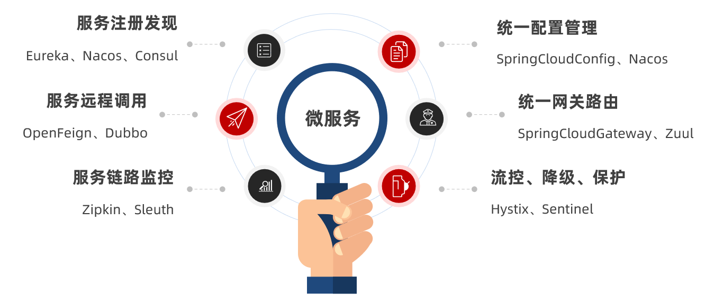
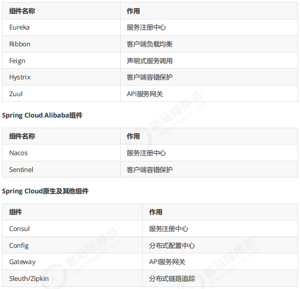

# Spring Cloud

## 基础知识

### 微服务架构的优缺点

- **优点**
  - 将业务拆分解耦，面向服务，服务间隔离，可以独立运行，分布式
- **缺点**
  - 不容易维护

### 微服务组件

- 服务注册发现：通过Eureka、nacos等实现服务的注册和发现
  - 服务注册：在注册中心注册服务，暴露自己的地址
  - 服务发现：去注册中心获取其中的服务实例请求对应的服务
- 负载均衡：将工作负载到多个服务器提高性能，Ngnix、Ribbon
- 熔断、降级：压力过大或响应异常时保护上游服务而切断下游服务的调用
- 网关路由：控制流量、路由请求、拦截
- 配置中心：对yaml等配置统一管理
- 远程调用：feign

## 服务注册

记录微服务中的服务信息；

常见注册中心：zookeeper、Eureka、nacos

### Eureka

- Eureka Server：注册中心，提供服务注册和发现
- Service Provider：服务提供者，将自身服务注册到Eureka，能被其他服务找到
- Service Consumer：服务消费者，去Eureka中心获取注册列表，进行对应服务的请求

心跳等待做健康检测

### Nacos

注册中心部分和Eureka差不多，提供服务注册和发现；

不同之处在于，nacos的服务实例分为临时实例和非临时实例，临时实例通过心跳检测不正常的被自动剔除，非临时实例主动检测；

提供统一配置管理和热更新（在dashboard修改不用重启服务）

## 服务调用

### Ribbon-负载均衡

通过RestTemplate实现服务的远程调用；

服务发起请求去注册中心拉取需要调用的**服务列表**，通过Ribbon采用负载均衡算法请求列表中的服务；一般默认是轮询方案，如请求的userService有8081 和 8082两个服务，轮流调用服务。

### Feign

更优雅的调用HTTP API；采用接口的方式，创建要调用服务的接口，在上面加注解；整合了Ribbon和注册中心；

- 通过 @FeignClient 声明一个调用远程微服务接口
- 启动类上通过 @EnableFeignClients 激活Feign

## 服务熔断

### 服务容错

- **雪崩效应**：一个请求调用多个服务，其中某个服务阻塞，此时大量请求涌入，导致全部阻塞导致服务瘫痪，连锁至其他服务；因此需要做**熔断、隔离、限流**处理
- 服务隔离：减少服务间的依赖
- 熔断降级：上游服务调用下游服务，当下游服务阻塞，可以切断下游服务的调用保护整体。
- 服务限流：控制请求策略，如延迟、拒绝等

### Hystrix

- 回退机制：当请求失败、超时时，执行fallback，降级服务，如报错或执行其他方法
- 资源隔离：线程池（信号量）满了，后续请求不排队等待，直接拒绝
- 监控：提供运行的信息

### Feign实现熔断

**Feign内置了Hystrix，在FeignClient中设置fallback的降级方法**

### Sentinel

alibaba提供的熔断服务

## 服务网关

介于客户端和服务端的中间层：用于监控、身份认证、负载均衡、请求路由；客户端通过统一的网关接入微服务；

### Ngnix

- 正向代理：代理客户端发送请求，轮流解决不同用户请求
- 反向代理：代理服务端，代服务端接收请求，轮流向服务端发送请求

### Spring Cloud GateWay

- 路由：根据断言（规则）转发请求到某个微服务，如果路由的目标服务有多个，做负载均衡
  - 由路由id、URL、断言工厂、过滤器组成
- 权限控制（过滤器）：校验用户是否有请求资格，没有则进行拦截；如超级管理员和普通用户；app端和后端
- 断言：判断路由的规则；常用的有设置请求类型POST、GET；url path是否匹配（权限认证）

- 限流

#### 限流模式

- 计数器：计数达到多少阈值就拒绝请求
- 漏桶算法：桶的另一端控制请求输出速率
- 令牌桶算法：设置令牌数量，一个请求消费一个令牌，请求结束还回令牌

**redis + lua结合令牌桶**

基于ip地址、基于用户id的请求限流，在redis中key存ip/id，value存剩余令牌数

### Ngnix 结合 GateWay

设置多个Gateway网关服务，用ngnix对网关服务负载均衡

### 

