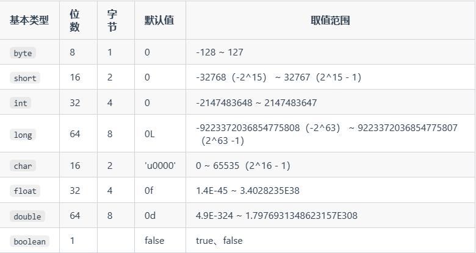
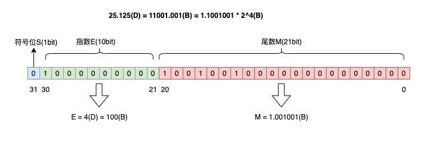
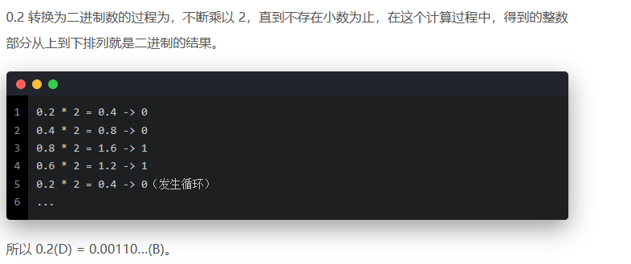

# 基础概念

## 常识

### JVM、JDK、JRE

jvm 是是运行java字节码的虚拟机；JDK是 java开发组件，包含JRE和编译器、Javadoc等工具；JRE是java运行时环境，包含必要的类库。

### 什么是字节码？

JVM可以理解的代码，.class的文件，可以在任何系统下运行；需要经过.class -> 机器码的转义；

### Java和C++的区别？

都是面向对象编程，支持封装多态继承；

- java不能提供指针直接访问内存，内存更安全
- java的类是单继承的，但接口可以多继承
- java有垃圾回收机制GC，c++需要自己管理

### 移位运算符？

- 左移 <<： 高位丢弃，低位补零。x << 1 相当于 x * 2;
- 带符号右移 >>：x >> 1相当于 x / 2;
- 无符号右移 >>> : 空位0补齐

double、float 二进制表示特殊不能移位；只支持 int 和long，short、byte、char移位先转int；

**移位数超过数值占有位数**

会取余用余数在移位，如int 32 位， x << 42 -> x << 10;

## 基本数据类型

### 基本数据类型有哪些？



正数最高位表示符号位，0正1负；

### 基本类型和包装类型的区别

```java
`Byte`、`Short`、`Integer`、`Long`、`Float`、`Double`、`Character`、`Boolean
```

- 包装类可用于泛型
- 基本类型的 **局部变量**存在JVM 栈空间的局部变量表中，**成员变量(没有static修饰)** 存在堆中；包装类型
- 包装类型不赋值是null，基本类型有默认值不为null；
- 比较方式不同，基本类型==比较值，包装类型比较的是内存地址，比较值用equals()；

> **基本数据类型**的存储位置取决于它们的作用域和声明方式。如果它们是局部变量，那么它们会存放在栈中；如果它们是成员变量，那么它们会存放在堆中。因为局部变量生命周期短，方法调用结束就会出栈，成员变量是对象的一部分，对象销毁前都存在，因此在堆中。

### 包装类型的缓存机制是什么？

`Byte`,`Short`,`Integer`,`Long` 这 4 种包装类默认创建了数值 **[-128，127]** 的相应类型的缓存数据，`Character` 创建了数值在 **[0,127]** 范围的缓存数据，`Boolean` 直接返回 `True` or `False`。

在JVM中对应的只有一个实例，在缓存内的不会创建对象；超出缓存范围的会新创建对象；因此缓存范围内的hashcode是一样的。

缓存池是堆中的final 数组，只适用于自动装箱；

### 自动装箱和自动拆箱是什么？

- **装箱**：将基本类型用它们对应的引用类型包装起来； `Integer i = 10;  //装箱`
- **拆箱**：将包装类型转换为基本数据类型；`int n = i;   //拆箱`

- `Integer i = 10` 等价于 `Integer i = Integer.valueOf(10)` ，范围内缓存机制，Integer 的引用对象内存地址相等
- `int n = i` 等价于 `int n = i.intValue()`;

### 浮点数运算为什么有精度丢失风险？

```java
float a = 2.0f - 1.9f;
float b = 1.8f - 1.7f;
System.out.println(a);// 0.100000024
System.out.println(b);// 0.099999905
```

因为无限循环小数无法被存储在计算机中，只能被截断；在计算机中的表示是 有效数字 + 指数形式





**使用BigDecimal 避免精度丢失**

- 创建：不能使用new BigDecimal(0.1 F), 因为float不精确；应该使用 BigDecimal(String val) 构造方法或者 BigDecimal.valueOf(double val);

- 加减乘除：a.add(b);a.substract(b);a.multiply(b);a.divide(b，RoundingMode);除法时选择保留几位小数防止除不尽；
- 比较：a.compareTo(b)

### 超过long整形范围的数据如何表示？

long范围是64位，Long.MAX_VALUE + 1 会改变符号位0 -> 1 ，值变成了Long.MIN_VALUE

超过了可以使用BigInteger，内部是int[] 数组来存储任意大小的整形数据；

## 变量

### 成员变量和局部变量的区别？

- 语法上：成员变量是属于类的，局部变量是代码块或方法中定义的；局部变量不能使用static；
- 存储位置：局部变量在栈内存，没有 `static修饰`的成员变量在堆内存；如果成员变量用 **static** 修饰则属于类存在JVM方法区，随类加载加载，类卸载而卸载；
- 生命周期不一样：局部变量随方法调用结束，出栈后销毁；成员变量存在堆中随对象销毁而结束；
- 默认值不同：成员变量会自动被赋值(final 修饰的需显示赋值)，局部变量不会(因此需要显式赋值否则报错)；静态成员变量会在类初始化阶段赋值，普通成员变量属于实例变量，在实例化对象阶段被赋值基本数据类型和引用类型null。

### 成员变量的默认值设置？

手动和自动，在运行时可以通过反射方法手动赋值，局部变量不行。

### 静态变量有什么用？

静态变量被static修饰，在类加载阶段保存信息到方法区中，在**类连接阶段**赋初值，类初始化阶段赋值；是线程**共享**的，所有对象共享静态变量，可以**节省内存**空间；

### 字符型常量和字符串常量的区别？

字符常量相当于**整形值**(ASCII值)，可以参加表达式运算；JDK8字符串常量是在字符串常量池中(堆的元数据区)的**地址值** （其实就是**引用**）；

内存大小不同：char 占2字节，String 若干

## 方法

### 静态方法为什么不能调用非静态成员变量？

静态方法属于类，在类加载时被分配内存，可以通过类名直接访问；而非静态成员是属于实例对象的，需要对象实例化后才存在，需要通过类的实例对象访问；

静态方法想调用非静态成员变量时，内存中还没有呢。

### 静态方法和实例方法的区别？

- 通过 `类名.方法` 调用静态方法，通过 `对象.方法` 调用实例方法；**调用静态方法无需创建对象**

- 静态方法不能访问非静态成员；

### 重载和重写的区别？

- 重载就是同样的一个方法能够根据输入数据的不同，做出不同的处理
  - 发生在**同一个类**中（或者父类和子类之间），方法名必须相同，参数类型、顺序、个数、返回值类型不同；
- 重写就是当**子类继承自父类**的相同方法，输入数据一样，但要做出有别于父类的响应时，你就要覆盖父类方法
  - 重写发生在运行期，是子类对父类的允许访问的方法的实现过程进行重新编写。（父类方法private、final、static 子类不能重写）
  - 构造方法不能重写

- 重载是静态多态，发生在**编译时**，根据传递的参数确定要调用的方法版本；
- 重写是动态多态，发生在**运行时**，通过父类的引用访问这个方法时，根据对象类型动态地确定要调用的方法版本；如猫和狗继承自动物，根据对象是猫还是狗的类型确定叫方法的具体实现。

> **方法重写原则**：**两同两小一大**；方法名和形参名相同；子类返回值类型或抛出异常更小或相等；子类的访问权限比父类更大或相等；

# 面向对象基础

## 面向对象基础

### 面向对象和面向过程的区别？

面向过程是将问题拆成一个个方法执行解决；面向对象是先抽象出对象，用对象的方法解决；

### 创建对象用什么运算符？对象实体和对象引用有何不同？

new运算符创建对象实例，对象实例保存在堆内存中，对象引用指向对象实例，对象引用保存在栈内存中保存对象实例的内存地址；

### 对象的相等和引用相等的区别？

对象的相等一般比较内存中存放的值是否相等；

引用的相等一般比较指向的内存地址是否相等；

### 构造方法有哪些特点？是否可以被重写？

- 名字和类名相同
- 无返回值，不能用void 声明构造函数；
- 生成类的对象时自动执行，无需调用；new后带()就是默认无参构造方法；
- 构造方法不能被继承和重写

### 面向对象三大特征？

- 封装：把对象的**属性**隐藏在对象内部，不允许外部对象直接访问对象内部的信息；可以提供允许被外界访问的方法操作属性。**增强了安全性**。
- 继承：一个对象可以继承另一个对象的属性和方法，子类可以拥有父类的属性和方法，促进代码的重用和扩展；
- 多态：一个对象具有多种状态，表现为父类的引用指向子类实例；方法的重载和重写；

### 接口和抽象类的共同点和区别？

**共同点**

不能被实例化；不提供具体的实现细节，要通过子类来实现；

**区别**

- 抽象类用abstract修饰，接口用interface修饰
- 一个类只能继承一个抽象类，但能实现多个接口，即类可以继承多个接口；
- 抽象类可以有构造函数，接口没有；
- 抽象类强调公共的基类（通用的属性和行为，如Animal抽象类）；接口强调可多重继承的行为；
- 接口不能有成员变量，允许常量；抽象类允许成员变量和实例对象；

### 深拷贝和浅拷贝以及引用拷贝是什么？

区别是复制对象时是否复制对象所有属性以及属性所引用的对象。

- **深拷贝**：完全复制整个对象，包括这个对象的内部对象，递归的复制内部对象引用的对象；
  - `Person person3 = new Person(person1.name, new Address(person1.address.city));`
- **浅拷贝**：只复制对象本身以及对象中的基本数据类型的属性。如果对象中有引用类型的属性，拷贝对象直接复制内部对象的引用，即拷贝对象和原对象公用一个内部对象
  - `Person person2 = new Person(person1.name, person1.address);`

> JVM角度看，浅拷贝时，新对象和原始对象的内部引用对象指向同一块内存区域；深拷贝时，除了复制属性外，对引用对象的复制是创建一个新对象再复制，新对象和原对象内部引用对象指向的内存不一样；

- **引用拷贝**：相当于没有new 一个对象，只是单纯的引用地址的赋值
  - `Object obj = new Object(); Object a = obj;`

### Object 的常见方法有哪些？

```java
public final native Class<?> getClass() // 获取运行时对象的Class对象，可以获得类的信息如类加载器、类的接口、类名、实例化对象等
public boolean equals(Object obj) //比较两个对象内存地址是否相等
public final native void notify() //多线程的一些方法，唤醒monitor中等待的线程
public final native void wait(long timeout) throws InterruptedException  // 暂停线程
```

### hashCode()有什么用？

获取对象再哈希表中的索引位置；可以更快的找到有没有相等的对象，hashcode不相等对象一定不相等，hashcode 相等时equal是也相等对象才相等(hash冲突)；

### 为什么重写equals() 时必须重写hashCode()?

- 默认实现是使用"=="运算符比较两个对象的引用是否相等，但是它可以被子类重写来提供对象内容的比较。

**equals保证逻辑值是相等的，hashcode保证对象是相等的。**

因为两个相等的对象的 `hashCode` 值必须是相等。也就是说如果 `equals` 方法判断两个对象是相等的，那这两个对象的 `hashCode` 值也要相等。

如果重写 `equals()` 时没有重写 `hashCode()` 方法的话就可能会导致 `equals` 方法判断是相等的两个对象，`hashCode` 值却不相等。

## String

### String、StringBuffer和StringBuilder的区别？

- 可变性：

  String不可变；StringBuilder和StringBuffer都继承自AbstractStringBuilder类，使用字符数组保存字符串，提供append等方法修改字符数组；

- 线程安全

  String 对象不可变，线程安全；StringBuffer 对方法加了同步锁，线程安全；StringBuilder没加同步锁线程不安全；一般来说，多线程使用Buffer，单线程使用Builder；

### 为什么String不可变？

String 类中使用 `final ` 修饰字符数组 来保存字符串，因此不能被继承；同时String类也没有提供修改字符数组的方法；

### 字符串拼接用 + 还是StringBuilder ？

> 字符串对象使用 + 拼接实际上是通过StringBuilder 调用 append 方法实现的，拼接完成后调用 toString得到String 对象；

但是 String 对象使用 + 这种方式每加一次都会创建一个StringBuilder，而直接使用Stringbuilder 的append拼接就只创建一个；（JDK9之后没事）

- ’+‘号拼接 字符串，常量池中有的直接拼接，因为在编译时就确定了值；如果是字符串对象相加，会在堆上创建返回，因此 == 地址和前者不对，要用equals

### 字符串常量池的作用了解吗？

目的是减少重复创建相同字符串值的对象，节约内存；

### String.intern() 有什么用？

将指定的字符串对象的引用保存在字符串常量池中；常量池中有对应字符串对象的引用，直接返回该引用，如果没则先在常量池中保存后返回；

# java高阶

## 异常

### Exception 和Error 有什么区别？

其父类都是Throwable；**Exception** 是程序本身可以处理的异常，可以用catch 捕获；**Error** 是程序无法处理的错误，如JVM运行错误，内存溢出等，一般会终止线程；

### Checked Exception 和 Unchecked Exception 有什么区别？

Checked Exception 是受检查异常，必须通过catch或throws 处理，否则编译不通过；如找不到类Unchecked Exception 是不受检查异常，不处理异常编译也能过，如RuntimeException及其子类；比如空指针异常；

### Throwable 类常用方法？

- `String getMessage()`: 返回异常发生时的简要描述
- `void printStackTrace()`: 在控制台上打印 `Throwable` 对象封装的异常信息

### try-catch-finally 如何使用？

try 捕获异常，catch处理异常，finally无论是否捕获或处理异常都执行的语句；

如果当前线程死亡，不一定执行finally

## 泛型

### 什么是泛型？有什么用？

可以通过泛型参数指定要传入的对象类型；

### 泛型使用方式？

- **泛型类**，在实例化泛型类时，必须指定T的具体类型；List<Integer> = new LinkedList<>(); 使用了List<T>;
- **泛型接口**：public interface Generator<T> 
- **泛型方法**： public static < E > void printArray( E[] inputArray )

## 反射

### 什么是反射？

在运行时能分析类以及执行类中的方法；并对类执行特定的操作；比如获得类名，获得类的信息，获得类加载器信息，创建该类的新实例；

### 反射的优缺点？

代码更灵活，更容易扩展；缺点是性能有开销，以及安全问题；

### 反射应用场景？

注解用到了反射；各种框架，比如Spring中用到了很多反射机制，使用动态代理；

## 注解

### 什么是注解

继承了Annotation的特殊接口；@Target 用于指定注解应用的地方，如类上还是方法上；@Retention 指定注解保留策略，运行时保留还是编译时保留

### 注解解析方法有哪几种？

编译期直接扫描并处理，如@Override；运行时反射处理，如Spring中的 @Value @Component 依赖注入；

## 序列化

### 什么是序列化和反序列化？

- **序列化**：将数据结构或对象转换成二进制字节流的过程
- **反序列化**：将在序列化过程中所生成的二进制字节流转换成数据结构或者对象的过程

如网络传输前需要先序列化，接收到序列化的对象后再反序列化；将对象存到redis前需要序列化，取数据出来需要反序列化

序列化对应TCP/IP4层模型哪一层？应用层；OSI七层模型的应用层、表示层和会话层都是TCP/IP的应用层


