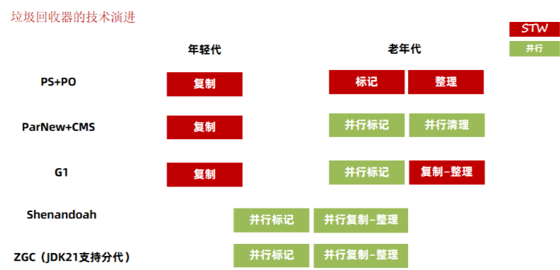
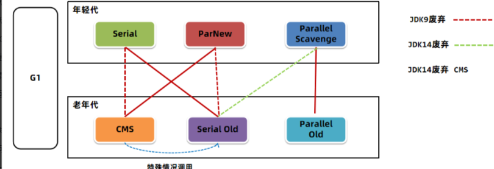

# JVM

## 什么是JVM？

java虚拟机，用于在任何操作系统上能运行class文件的程序；

主要功能：解析执行字节码文件；对象创建回收的内存管理；优化热点代码；

主要结构：类加载器、运行时数据区、执行引擎（JIT、GC）、本地接口（C++）；

## 类文件结构

### 字节码的组成？

基本信息(魔数、版本号等)、常量池、字段、方法、属性

## 运行时数据区

**JDK 1.7**：

Java 运行时数据区域（JDK1.7)

**JDK 1.8**：

Java 运行时数据区域（JDK1.8 )

**线程私有**

程序计数器、虚拟机栈、本地方法栈

**线程共享**

直接内存(`非运行时部分`)、堆、方法区（1.7）/ 元空间（1.8）

### 程序计数器

记录当前线程执行字节码指令的位置；线程CPU时间片耗尽重新获得后，根据程序计数器的指令地址继续执行；不会内存溢出，生命周期是线程；

### JVM虚拟机栈

每次调用方法，会用栈帧保存信息，每个栈帧保存：

- 局部变量表：可以存堆中实例的地址
- 操作数栈：存放中间计算结果
- 帧数据：返回值，动态链接

**栈出现的错误**

- 栈溢出：压入的栈帧过多
- 内存溢出：无法申请足够内存

### 本地方法栈

主要为native方法服务

### 堆

存放对象实例；根据垃圾回收算法分为：

- 1.7：新生代、老年代、永久代(有内存上限)；继续划分还有伊甸园和幸存区；对象首先在Eden区分配，第一次新生代GC后，存活的对象移到S0或S1，年龄+1；年龄超过15移到老年代；
- 1.8： 永久代换成元空间，并移到本地内存(适合扩容)

**堆的问题**

- 内存溢出：一是堆空间不足，二是GC花太多时间但没回收多少空间

### 方法区

在**类加载阶段**将 类信息、字段、方法、常量、静态变量、JIT的代码存到方法区的一块内存区域；

永久代和元空间类似对方法区(接口)的具体实现(实现类)；1.7之前永久代，1.8之后元空间；

1.7之后静态变量脱离永久代存在堆中的Class对象中

#### 运行时常量池

方法区/元空间的一部分，主要存放类信息、字段、方法、接口等信息，以及字面量(int之类)和符号引用(解析阶段换成直接引用(换成内存地址))；

#### 字符串常量池

存String类的区域；保存字符串(key，字面量) 和 字符串对象的引用（value）；

1.6之前在方法区；1.7移到堆；1.8之后保留在堆，其他信息移到元空间本地内存；

为什么移到堆，因为在堆中适合GC；

String s = "abc"; 是保存**字符串常量**，会在字符串常量池中查找有无"abc"，有则返回引用地址，无则存入"abc" 地址并返回；

String s1 = new String("abcd"); 本质是StringBuilder().append("abcd")在堆上创建对象，此时常量池没有abcd，虚拟机栈的s1 保存 堆中地址的引用；除非手动s1.intern() 会将s1 的引用保存在常量池中，此时常量池中的"abcd" 指向 堆中地址；

### 直接内存

不是运行时的内存区域；特殊的内存区域；减少堆的赋值开销；

## 对象的创建

- 类加载检查：遇到new指令，检查该类是否被加载、连接、初始化过，没则类加载；
- 分配内存：内存分配并发问题，自旋CAS 保证操作原子性，在Eden预分配内存
- 初始化零值；
- 设置对象头；
- 执行init方法生成对象；

## 类的加载过程

### 类的生命周期

- 类加载：通过类加载器根据类的全限定名，以二进制流的方式获取字节码信息，保存到内存的方法区；
- 类连接：
  - 验证：代码是否符合规范
  - 准备：静态变量分配内存赋初值
  - 解析：常量池的符号引用换成直接引用
- 类初始化：<clinit> 方法执行，执行静态代码块和静态变量的赋值

- 类使用
- 类卸载：被GC：可达性分析

### 什么时候类被卸载？

- 该类的所有实例被回收，堆中没有该类的实例对象以及子类对象
- 该类的类加载器被回收，loader = null；
- 该类的java.lang.Class 对象没有被引用：Class<?> claszz = loader.loadClass(..); loader = null;

### 类加载器

根据类的全限定名，以二进制流加载字节码文件到内存方法区/元空间；

#### 类加载器种类

- BootstrapClassLoader（启动类加载器）：C++实现，最顶层加载类；加载核心类库，如lang、io、util；
- ExtensionClassLoader（扩展类加载器）：主要加载 lib/ext下的jar包
- ApplicationClassloader（应用类加载器）：加载当前应用classpath下的jar和类
- 自定义类加载器

ClassLoader 返回null表示启动类加载器加载的类，因为是C++加载的，没有父类；其他加载器都继承自抽象父类接口ClassLoader；

## 双亲委派机制

ClassLoader 有loadClass（）和findClass（）方法；当加载一个类时，会自底向上查找该类是否被父类加载器加载，然后自顶向下从启动类加载器尝试加载类；

**作用**：一是保证类的安全性和完整性避免核心类库代码被替换，二是避免一个类被重复加载

### 如何打破双亲委派机制？为什么要打破？

比如Tomcat可以运行多个Web应用，导致出现相同的类限定名（两个MyServlet类），传统双亲委派只会加载一个Myservlet类，导致另一个类无法被加载；需要自定义类加载器打破双亲委派实现应用之间类的隔离，每个应用有独立的类加载器加载对应的类；（**JVM中相同类加载器+相同类限定名才会被认为是同一个类，所以需要各自的自定义类加载器**）

举例：tomcat不同应用；JDBC加载不同的数据库；

#### 如何打破？

继承ClassLoader，重写loadClass（）方法，尝试在委托父类的loadClass之前自己尝试加载类；（因为传统的不会自己加载这个类二是委托父类加载）

## 垃圾回收机制

主要是对堆内存的回收；堆分为新生代、老年代和永久代；新生代又分Eden和幸存者区S0和S1；对象在Eden分配内存创建，新生代GC扫描一次年龄+1；幸存者年龄超过15移至老年代；1.8之后老年代被元空间取代；

- 大对象（大量连续内存的对象）直接进入老年代，减少GC的频率和成本（因为新生代内存不够就会触发GC）
- 长期存活移至老年代

### 什么时候触发GC？

部分收集 (Partial GC)：

- 新生代收集（Minor GC / Young GC）：只对新生代进行垃圾收集；
- 老年代收集（Major GC / Old GC）：只对老年代进行垃圾收集。需要注意的是 Major GC 在有的语境中也用于指代整堆收集；
- 混合收集（Mixed GC）：对整个新生代和部分老年代进行垃圾收集。

整堆收集 (Full GC)：收集整个 Java 堆和方法区。

### 对象死亡判断方法？什么时候可以回收对象？

- 引用计数法，有对象引用，计数器+1；容易嵌套死循环
- 可达性分析：从GC roots为起点，向下搜索形成引用链，没有引用链的对象需要被回收
- GC roots
  - 引用线程栈帧的对象（虚拟机栈和本地方法栈的局部变量）
  - 静态变量；
  - 持有同步锁的对象
  - 本地方法调用的全局对象

一般来说对象会经过两次可达性分析，第一次筛选宣告死亡，第二次标记死亡

### 引用类型

- 强引用：内存足不足都不会被GC回收 `User user = new User()`
- 软引用：内存不足时被回收；常用于缓存或内存敏感的程序  `SoftReference`
- 弱引用：不管内存足不足，被GC扫描到就被回收；ThreadLocalMap key
- 虚引用：随时被回收，不能决定对象生命周期，用来跟踪对象被回收的活动

### 垃圾回收算法

- 标记-清除算法（Mark Sweep GC）：可达性分析，标记引用链存活对象，清除其他对象；
  - 引用链链表，碎片化内存；但不用移动性能好
- 复制算法：将内存分为From 和 To空间，GC时将From的存活对象移到To，结束调换名字；
  - 内存使用效率底；但无内存碎片
- 标记整理算法：GC Roots标记存活对象，将存活对象全移到内存一侧，清楚剩余空间；
  - 性能差；无内存碎片，内存空间利用高
- 分代回收算法：创建的对象在Eden，Edan满了GC扫描移至幸存者S0和S1，是复制算法；超过年龄的移至老年代，老年代空间不足会先Minor GC，还不行Full GC，否则内存溢出

### 垃圾回收器

- JDK9之后默认G1回收期
- JDK 8

**年轻代都用复制算法**

- Serial + SerialOld： 新生代、老年代都单线程串行回收；老年代标记整理算法
- Parallel Scavenge + ParallelOld：新老多线程并行回收；老年代并行标记整理；吞吐量高；
- ParNew + CMS：新用多线程并行回收，多次标记；老年代并行标记+并行清除；相比PS 多次标记停顿时间短（因为用户线程和垃圾回收线程是并行执行减少用户等待时间）；

- G1：将内存分为多个大小相等的区域，区域可以不连续，新建对象在Eden，新生代空间不足则YoungGC，将Eden和S中存活对象复制到新的幸存区，age +1；当某个对象age大于15则放入old；
  - 年前代是复制算法；老年代是并行标记+复制整理算法；

## 参数总结

指定堆内存：Xms 分配最小堆内存 Xmx 分配最大堆内存

