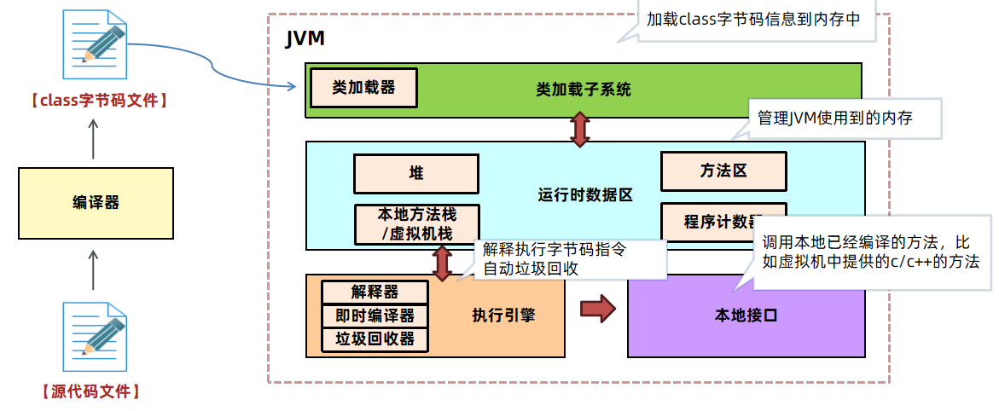
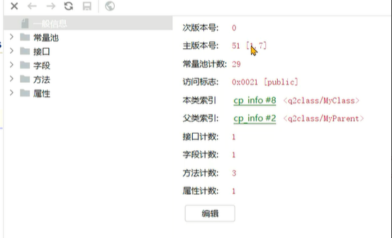
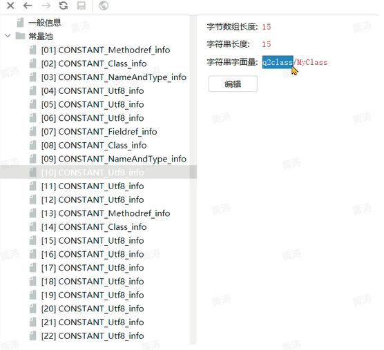
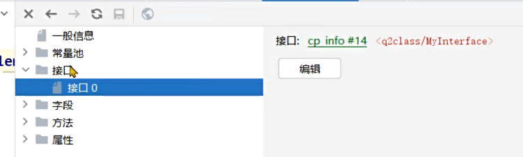
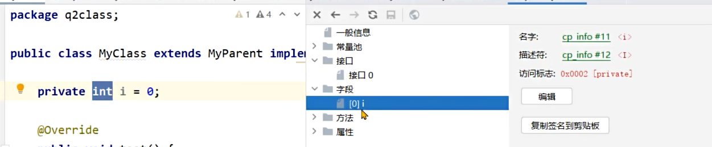
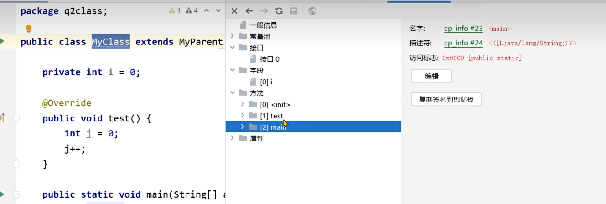
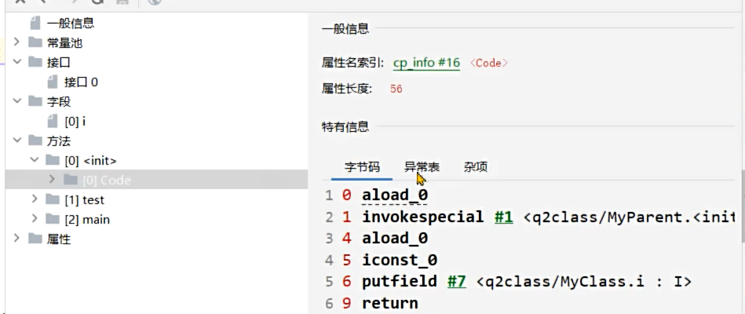
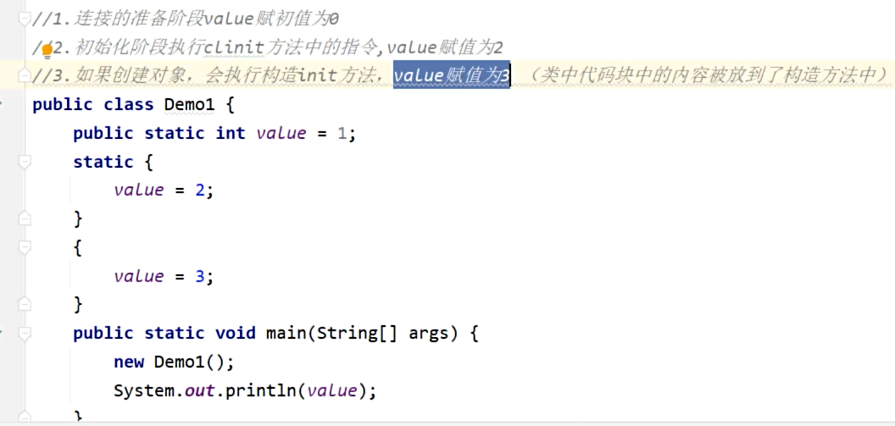
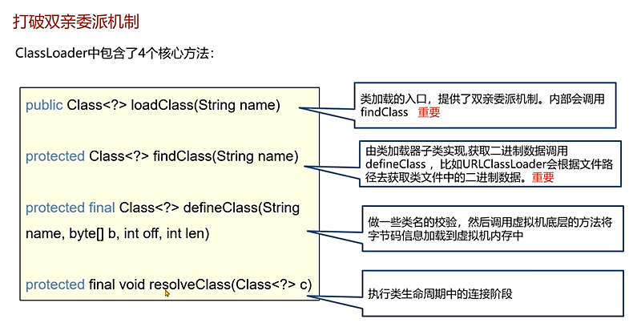
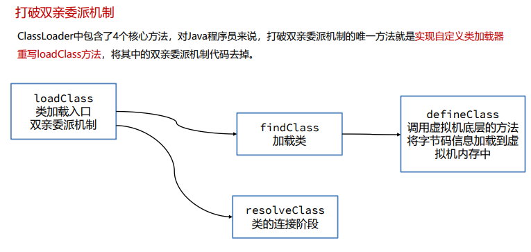

# JVM

## 什么是JVM

1、JVM 指的是Java虚拟机，本质上是一个运行在计算机上的程序，他的职责是运行Java字节码文件，作用是为了支持跨平台特性。

2、JVM的功能有三项：第一是解释执行字节码指令；第二是管理内存中对象的分配，完成自动的垃圾回收（内存回收）；第三是优化热点代码提升执行效率（即时编译JIT）。

3、JVM组成分为类加载子系统、运行时数据区、执行引擎、本地接口这四部分。

4、常用的JVM是Oracle提供的Hotspot虚拟机，也可以选择GraalVM、龙井、OpenJ9等虚拟机。

## 了解字节码文件的组成吗？

字节码文件本质上是一个二进制的文件，无法直接用记事本等工具打开阅读其内容。需要通过专业的工具打开。

- 开发环境使用jclasslib插件
- 服务器环境使用javap –v命令

**基本信息**： 魔数、字节码文件对应的Java版本号、访问标识(public final等等)、父类和接口。

**常量池**：保存了字符串常量、类或接口名、字段名，可以通过编号链接到对应的类名等信息，主要在字节码指令中使用。

**字段**：当前类或接口声明的字段信息

每个方法都会被解释成字节码指令交给虚拟机去运行

**方法**：当前类或接口声明的方法信息、字节码指令。

属性：类的属性，比如源码的文件名、内部类的列表等。

## 说一下运行时数据区

 运行时数据区指的是JVM所管理的内存区域，其中分成两大类：

- 线程共享 – 方法区、堆     
- 线程不共享 – 本地方法栈、虚拟机栈、程序计数器

其中

**堆**：用于存储对象实例，是**可动态分配的内存区域**，支持垃圾回收。

**方法区**：用于存储类的元数据等信息，相对来说是一个较为**静态的区域**，垃圾回收主要用于清理不再使用的类信息。1.7之前在永久代，1.8之后在元空间

**永久代**的内存空间相对固定，不会随着对象的创建和销毁而频繁变化。物理上可以看成是和堆相互独立的区域，逻辑上是在堆中，但是偏静态

### JVM在jdk6-8之间在内存区域上有什么不同？

方法区独立到元空间（直接内存）；字符串常量池（1.6之前在运行时常量池中的方法区，在永久代；1.7从方法区独立出来拿到堆，运行时常量池其他方法属性等还在永久代；1.8永久代移到元空间包括方法区，但字符串常量池还在堆）

（即字符串常量池1.7之前在方法区，1.8之后在堆；运行时常量池一直在方法区中，方法区1.7之前在永久代，1.8之后在元空间）

- JDK7及之前将方法区存放在**永久代空间**，堆的大小由虚拟机参数来控制，有上限。 

- JDK8及之后的版本将方法区存放在**元空间**中，元空间位于操作系统维护的**直接内存**中，默认情况下只要不 超过操作系统承受的上限，可以一直分配。也可以手动设置最大大小。

**原因**

- 提高内存上限
- 优化垃圾回收的策略：
  - 永久代在堆上，垃圾回收机制一般使用老年代的垃圾回收方式，不够灵活。
  - 元空间 有对应的适合方法区的垃圾回收机制

## 类的生命周期

- 类加载
  - 类加载器根据类的全限定名通过二进制流的方式获取字节码信息。
  - 将字节码中的类信息保存在方法区，并复制一份到堆中（java.lang.Class）
- 连接
  - 验证：看字节码是否符合规范，如文件格式，是否访问了private信息等
  - 准备：为静态变量（static）分配内存并设置初值，如果是final修饰直接赋值
  - 解析：将常量池中的符号引用替换为直接引用
- 初始化
  - 会执行静态代码块，并为静态变量赋值。
- 使用
- 卸载
  - 1、此类所有实例对象都已经被回收，在堆中不存在任何该类的实例对象以及子类对象。 
  - 2、加载该类的类加载器已经被回收。
  - 3、该类对应的 java.lang.Class 对象没有在任何地方被引用。

### 类加载器

#### 什么是类加载器

负责在类加载阶段将字节码以流的方式获取并加载到内存中

分类：

- 启动类加载器-Bootstrap：底层c++实现，最核心类；9之后是java自己实现
- 扩展类加载器-Extension：加载java中比较通用的类；9之后改为Platform平台类加载器
- 应用类加载器-Application：加载应用使用的类；加载classpath/路径下的类
- 自定义类加载器：允许用户自行实现类加载的逻辑，需要继承自ClassLoader抽象类重写findClass方法，调用父类方法defineClass（className，bytes，0，size）会在方法区创建一个instanceKlass对象，然后在堆区再创建一个class对象，完成类加载的过程
  - 当调用自定义类加载器的loadClass方法后，就能获得对应类信息进行创建实例等操作，同时能够打破双亲委派机制

#### 双亲委派机制

- 类加载器会有对应的父类加载器，启动类没有会返回null，即类加载器有一个层级结构；
- 什么是双亲委派机制：当一个类加载器接收到加载类的任务时，会向上查找是否加载过，再由顶向下进行加载；
  - 如果当前类加载器没加载过该类会向上询问，如果启动类加载器没加载则向下尝试加载看在不在对应classpath路径中，如果加载过就直接返回
- 有什么作用？
  - 保证类加载的安全性，确保核心类库的完整（防止核心类被重新编写）
  - 避免同一个类被重复加载

- 如何打破双亲委派机制？

  即自定义类加载器不经过向上查找向下加载的过程，直接用当前的类加载器加载，能加载就加载，加载不了就抛异常

  - 重写自定义类加载器中的loadClass方法，自己获取类信息，并调用defineClass去加载类，执行resolveClass完成类连接的操作；
  - 但实际工作中使用自定义类加载器通常会重写findClass方法，因为双亲委派机制还是有很多好处的
  - 不执行原来loadClass的双亲委派机制的方法，原来的loadclass方法中会去判断自己有没有加载，没有就用parent.loadClass（）方法执行父类的加载器

  

  

  ## 垃圾回收机制

  可达性分析将对象分为两类：垃圾回收的根对象（GC  Root）和普通对象，对象与对象之间存在引用关系，如果从某个对象到GC Root对象是可达的，对象就不可被回收。

  GC Root对象：

  -  线程Thread对象，因为会引用线程栈帧中的方法参数、局部变量等。 
  -  系统类加载器加载的java.lang.Class对象，因为会引用类中的静态变量。 
  -  monitor监视器对象，用来保存同步锁synchronized关键字持有的对象。（锁持有对象） 
  -  本地方法调用时使用的全局对象

  

  

  

  

  

