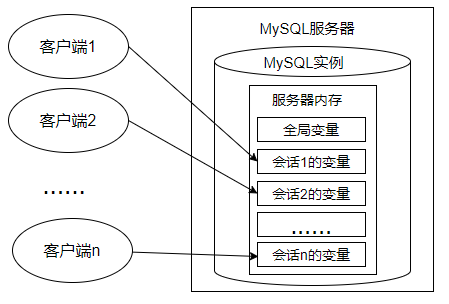
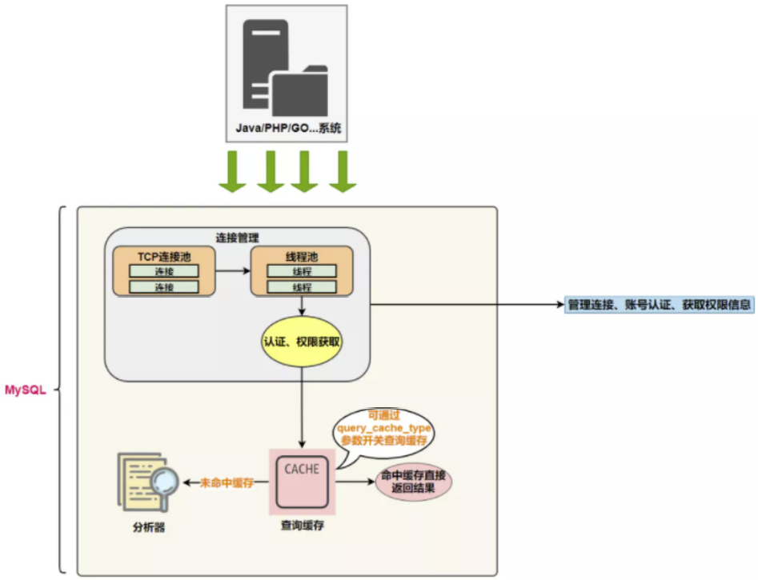
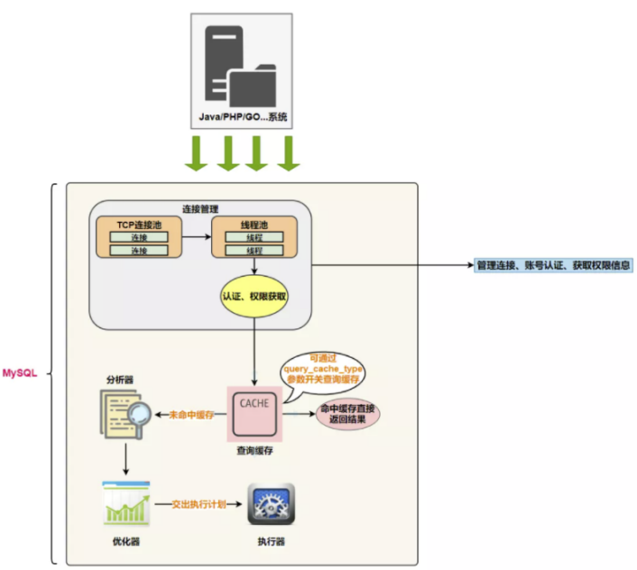
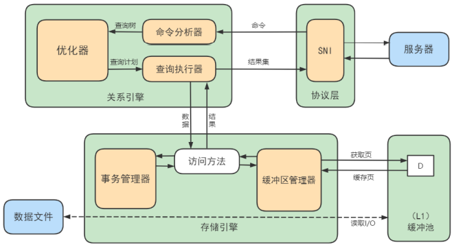

## 1.SQL基础

### 1.1 SQL 分类


#### 1.1.1 DDL

##### 数据库操作

```sql
-- 查询所有数据库
show databases;
-- 查询当前数据库
select database();
-- 创建数据库
create database [ if not exists ] 数据库名 [ default charset 字符集 ] [ collate 排序规则 ] ;
-- 删除数据库
drop database [ if exists ] 数据库名 ; 
-- 切换数据库
use 数据库名 ;
```

##### 表操作

```sql
-- 查询当前数据库所有表
show tables;
-- 查看指定表结构
desc 表名 ;
-- 查询指定表的建表语句
show create table 表名 ;
-- 创建表结构
CREATE TABLE 表名(
    字段1 字段1类型 [ COMMENT 字段1注释 ],
    字段2 字段2类型 [COMMENT 字段2注释 ],
    字段3 字段3类型 [COMMENT 字段3注释 ],
    ......
    字段n 字段n类型 [COMMENT 字段n注释 ]
) [ COMMENT 表注释 ] ;

-- 添加字段
ALTER TABLE 表名 ADD 字段名 类型 (长度) [ COMMENT 注释 ] [ 约束 ];
-- 修改字段
ALTER TABLE 表名 MODIFY 字段名 新数据类型 (长度);
-- 修改字段名和字段类型
ALTER TABLE 表名 CHANGE 旧字段名 新字段名 类型 (长度) [ COMMENT 注释 ] [ 约束 ];
-- 删除字段
ALTER TABLE 表名 DROP 字段名; 
-- 修改表名
ALTER TABLE 表名 RENAME TO 新表名;
-- 删除表
DROP TABLE [ IF EXISTS ] 表名; 
-- 删除指定表, 并重新创建表
TRUNCATE TABLE 表名;
```


###### 数据类型

MySQL中的数据类型有很多，主要分为三类：数值类型、字符串类型、日期时间类型。

- 数值类型


- 字符串类型


char 与 varchar 都可以描述字符串，char是定长字符串，指定长度多长，就占用多少个字符，和字段值的长度无关 。而varchar是变长字符串，指定的长度为最大占用长度 。相对来说，char的性能会更高些。

在MySQL中+只表示数值相加。如果遇到非数值类型，先尝试转成数值，如果转失败，就按0计算。MySQL中字符串拼接要使用字符串函数CONCAT()实现

在定义数据类型时，如果确定是`整数`，就用` INT`； 如果是`小数`，一定用定点数类型 `DECIMAL(M,D)`； 如果是日期与时间，就用 `DATETIME`。 

这样做的好处是，首先确保你的系统不会因为数据类型定义出错。不过，凡事都是有两面的，可靠性好，并不意味着高效。比如，TEXT 虽然使用方便，但是效率不如 CHAR(M) 和 VARCHAR(M)。

- 日期类型


#### 1.1.2 DML

##### 添加数据（INSERT）

```sql
-- 给指定字段添加数据
INSERT INTO 表名 (字段名1, 字段名2, ...) VALUES (值1, 值2, ...);
-- 给全部字段添加数据
INSERT INTO 表名 VALUES (值1, 值2, ...);
-- 批量添加
INSERT INTO 表名 (字段名1, 字段名2, ...) VALUES (值1, 值2, ...), (值1, 值2, ...), (值1, 值2, ...) ;

INSERT INTO 表名 VALUES (值1, 值2, ...), (值1, 值2, ...), (值1, 值2, ...) ;

```

- 字符串和日期型数据应该包含在引号中。
- 插入的数据大小，应该在字段的规定范围内。

##### 修改数据（UPDATE）

```sql
UPDATE 表名 SET 字段名1 = 值1 , 字段名2 = 值2 , .... [ WHERE 条件 ] ; 1
```

##### 删除数据（DELETE）

```sql
DELETE FROM 表名 [ WHERE 条件 ] ;
```

DELETE 语句不能删除某一个字段的值(可以使用UPDATE，将该字段值置为NULL即可)

#### 1.1.3 DQL - SELECT

```sql
SELECT
	字段列表
FROM
	表名列表
WHERE
	条件列表 
GROUP BY
	分组字段列表
HAVING
	分组后条件列表
ORDER BY
	排序字段列表
LIMIT
	分页参数
```

##### 基础查询

```sql
-- 去除重复记录
SELECT DISTINCT 字段列表 FROM 表名; 
```

1. DISTINCT 需要放到所有列名的前面，如果写成`SELECT salary, DISTINCT department_id FROM employees`会报错。
2. DISTINCT 其实是对后面所有**列名的组合**进行去重，你能看到最后的结果是 74 条，因为这 74 个部门id不同，都有 salary 这个属性值。如果你想要看都有哪些不同的部门（department_id），只需要写`DISTINCT department_id`即可，后面不需要再加其他的列名了。

##### 条件查询


**安全等于运算符**
安全等于运算符（<=>）与等于运算符（=）的作用是相似的，`唯一的区别`是‘<=>’可以用来对NULL进行判断。在两个操作数均为NULL时，其返回值为1，而不为NULL；当一个操作数为NULL时，其返回值为0，而不为NULL。

**空运算符**
空运算符（IS NULL或者ISNULL）判断一个值是否为NULL，如果为NULL则返回1，否则返回0。

- 位运算符


- 优先级


##### 聚合函数


```sql
SELECT 聚合函数(字段列表) FROM 表名 ;
```

> NULL值是不参与所有聚合函数运算的。

###### **问题：用count(*)，count(1)，count(列名)谁好呢?**

> 其实，对于MyISAM引擎的表是没有区别的。这种引擎内部有一计数器在维护着行数。
>
> Innodb引擎的表用count(*),count(1)直接读行数，复杂度是O(n)，因为innodb真的要去数一遍。但好于具体的count(列名)。

###### **问题：能不能使用count(列名)替换count(*)?**

> 不要使用 count(列名)来替代 `count(*)`，`count(*)`是 SQL92 定义的标准统计行数的语法，跟数据库无关，跟 NULL 和非 NULL 无关。 
>
> 说明：count(*)会统计值为 NULL 的行，而 count(列名)不会统计此列为 NULL 值的行。

##### 分组查询

```sql
SELECT 字段列表 FROM 表名 [ WHERE 条件 ] GROUP BY 分组字段名 [ HAVING 分组后过滤条件 ];
```

###### where与having区别

- 执行时机不同：where是分组之前进行过滤，不满足where条件，不参与分组；而having是分组之后对结果进行过滤。

- 判断条件不同：where不能对聚合函数进行判断，而having可以。

> - 分组之后，查询的字段一般为聚合函数和分组字段，查询其他字段无任何意义。
> - 执行顺序: where > 聚合函数 > having 。

##### 排序查询

```sql
SELECT 字段列表 FROM 表名 ORDER BY 字段1 排序方式1 , 字段2 排序方式2 ;
```

**ASC** : 升序(默认值) **DESC**: 降序

> 如果是多字段排序，当第一个字段值相同时，才会根据第二个字段进行排序 ;

##### 分页查询

```sql
SELECT 字段列表 FROM 表名 LIMIT 起始索引, 查询记录数 ;
```

> 起始索引从0开始，起始索引 = （查询页码 - 1）* 每页显示记录数。

##### * 执行顺序


#### 1.1.4 DCL （略）

```sql
-- 查询数据库用户
select * from mysql.user;
-- 创建用户
CREATE USER '用户名'@'主机名' IDENTIFIED BY '密码';
-- 修改用户
ALTER USER '用户名'@'主机名' IDENTIFIED WITH mysql_native_password BY '新密码' ;
-- 删除用户
DROP USER '用户名'@'主机名' ;
```

### 1.2 函数

字符串函数、数值函数、日期函数、流程函数。

#### 字符串函数


#### 数值函数


#### 日期函数


#### 流程函数


```sql
select if(false, 'Ok', 'Error');
select ifnull(null,'Default');
select
	name,
	( case workaddress when '北京' then '一线城市' when '上海' then '一线城市' else '二线城市' end ) as '工作地址'
from emp;
```

### 1.3 约束

概念：约束是作用于表中字段上的规则，用于限制存储在表中的数据。

目的：保证数据库中数据的正确、有效性和完整性


> 约束是作用于表中字段上的，可以在创建表/修改表的时候添加约束。

```sql
CREATE TABLE tb_user(
    id int AUTO_INCREMENT PRIMARY KEY COMMENT 'ID唯一标识',
    name varchar(10) NOT NULL UNIQUE COMMENT '姓名' ,
    age int check (age > 0 && age <= 120) COMMENT '年龄' ,
    status char(1) default '1' COMMENT '状态',
    gender char(1) COMMENT '性别'
);
```

#### 外键约束

- 添加外键

```sql
CREATE TABLE 表名(
    字段名 数据类型,
    ...
    [CONSTRAINT] [外键名称] FOREIGN KEY (外键字段名) REFERENCES 主表 (主表列名)
);
```

```sql
ALTER TABLE 表名 ADD CONSTRAINT 外键名称 FOREIGN KEY (外键字段名) REFERENCES 主表 (主表列名) ;
```

##### **删除**/更新行为


### 1.4 **多表查询**

- 一对多(多对一)

- 多对多

- 一对一

##### 笛卡尔积

- **笛卡尔积的错误会在下面条件下产生**：

  - 省略多个表的连接条件（或关联条件）
  - 连接条件（或关联条件）无效
  - 所有表中的所有行互相连接

- 为了避免笛卡尔积， 可以**在 WHERE 加入有效的连接条件。**

- 加入连接条件后，查询语法：

  ```mysql
  SELECT	table1.column, table2.column
  FROM	table1, table2
  WHERE	table1.column1 = table2.column2;  #连接条件
  ```

  - **在 WHERE子句中写入连接条件。**

##### 内连接 vs 外连接

- 内连接: 合并具有同一列的两个以上的表的行, **结果集中不包含一个表与另一个表不匹配的行**

- 外连接: 两个表在连接过程中除了返回满足连接条件的行以外**还返回左（或右）表中不满足条件的行** **，这种连接称为左（或右） 外连接**。没有匹配的行时, 结果表中相应的列为空(NULL)。

- 如果是左外连接，则连接条件中左边的表也称为`主表`，右边的表称为`从表`。

  如果是右外连接，则连接条件中右边的表也称为`主表`，左边的表称为`从表`。

- 满外连接的结果 = 左右表匹配的数据 + 左表没有匹配到的数据 + 右表没有匹配到的数据。

##### 7种SQL JOINs的实现


- 左中图

```mysql
#实现A -  A∩B
select 字段列表
from A表 left join B表
on 关联条件
where 从表关联字段 is null and 等其他子句;
```

- 右中图

```mysql
#实现B -  A∩B
select 字段列表
from A表 right join B表
on 关联条件
where 从表关联字段 is null and 等其他子句;
```

- 左下图

```mysql
#实现查询结果是A∪B
#用左外的A，union 右外的B
select 字段列表
from A表 left join B表
on 关联条件
where 等其他子句

union 

select 字段列表
from A表 right join B表
on 关联条件
where 等其他子句;
```

- 右下图

```mysql
#实现A∪B -  A∩B  或   (A -  A∩B) ∪ （B - A∩B）
#使用左外的 (A -  A∩B)  union 右外的（B - A∩B）
select 字段列表
from A表 left join B表
on 关联条件
where 从表关联字段 is null and 等其他子句

union

select 字段列表
from A表 right join B表
on 关联条件
where 从表关联字段 is null and 等其他子句
```

##### 小结

- WHERE：适用于所有关联查询

- `ON`：只能和JOIN一起使用，只能写关联条件。虽然关联条件可以并到WHERE中和其他条件一起写，但分开写可读性更好。

- USING：只能和JOIN一起使用，而且要求**两个**关联字段在关联表中名称一致，而且只能表示关联字段值相等

### 1.5 视图

- 视图是一种`虚拟表`，本身是`不具有数据`的，占用很少的内存空间，它是 SQL 中的一个重要概念。

- **视图建立在已有表的基础上**, 视图赖以建立的这些表称为**基表**。

  

- 向视图提供数据内容的语句为 SELECT 语句, 可以将视图理解为**存储起来的** **SELECT** **语句** 
  - 在数据库中，视图不会保存数据，数据真正保存在数据表中。当对视图中的数据进行增加、删除和修改操作时，数据表中的数据会相应地发生变化；反之亦然。

#### 创建视图

- **在** **CREATE VIEW** **语句中嵌入子查询**

```mysql
CREATE [OR REPLACE] 
[ALGORITHM = {UNDEFINED | MERGE | TEMPTABLE}] 
VIEW 视图名称 [(字段列表)]
AS 查询语句
[WITH [CASCADED|LOCAL] CHECK OPTION]
```

- 精简版

```mysql
CREATE VIEW 视图名称 
AS 查询语句
```

在创建视图时，没有在视图名后面指定字段列表，则视图中字段列表默认和SELECT语句中的字段列表一致。如果SELECT语句中给字段取了别名，那么视图中的字段名和别名相同。

#### 视图的优缺点

- 优点

  - 操作简单

  - 减少数据冗余
  - 数据安全
  - 适应灵活多变的需求
  - 能够分解复杂的查询逻辑

- 缺点

  - 如果实际数据表的结构变更了，我们就需要及时对相关的视图进行相应的维护

### 1.6 存储过程与函数

**含义**：存储过程的英文是 `Stored Procedure`。它的思想很简单，就是一组经过`预先编译`的 SQL 语句的封装。

执行过程：存储过程预先存储在 MySQL 服务器上，需要执行的时候，客户端只需要向服务器端发出调用存储过程的命令，服务器端就可以把预先存储好的这一系列 SQL 语句全部执行。

**好处**：

1、简化操作，提高了sql语句的重用性，减少了开发程序员的压力
2、减少操作过程中的失误，提高效率
3、减少网络传输量（客户端不需要把所有的 SQL 语句通过网络发给服务器）
4、减少了 SQL 语句暴露在网上的风险，也提高了数据查询的安全性

**和视图、函数的对比**：

它和视图有着同样的优点，清晰、安全，还可以减少网络传输量。不过它和视图不同，视图是`虚拟表`，通常不对底层数据表直接操作，而存储过程是程序化的 SQL，可以`直接操作底层数据表`，相比于面向集合的操作方式，能够实现一些更复杂的数据处理。

一旦存储过程被创建出来，使用它就像使用函数一样简单，我们直接通过调用存储过程名即可。相较于函数，存储过程是`没有返回值`的。 

#### 创建存储过程

语法：

```mysql
CREATE PROCEDURE 存储过程名(IN|OUT|INOUT 参数名 参数类型,...)
[characteristics ...]
BEGIN
	存储过程体

END
```

类似于Java中的方法：

```mysql
修饰符 返回类型 方法名(参数类型 参数名,...){

	方法体;
}
```

说明：

1、参数前面的符号的意思

- `IN`：当前参数为输入参数，也就是表示入参；

  存储过程只是读取这个参数的值。如果没有定义参数种类，`默认就是 IN`，表示输入参数。

- `OUT`：当前参数为输出参数，也就是表示出参；

  执行完成之后，调用这个存储过程的客户端或者应用程序就可以读取这个参数返回的值了。

- `INOUT`：当前参数既可以为输入参数，也可以为输出参数。

- `characteristics` 表示创建存储过程时指定的对存储过程的约束条件

举例：创建存储过程show_someone_salary2()，查看“emps”表的某个员工的薪资，并用IN参数empname输入员工姓名，用OUT参数empsalary输出员工薪资。

```mysql
DELIMITER //

CREATE PROCEDURE show_someone_salary2(IN empname VARCHAR(20),OUT empsalary DOUBLE)
	BEGIN
		SELECT salary INTO empsalary FROM emps WHERE ename = empname;
	END //

DELIMITER ;
```

**举例2：**

```mysql
DELIMITER //

CREATE PROCEDURE CountProc(IN sid INT,OUT num INT)
BEGIN
	SELECT COUNT(*) INTO num FROM fruits 
	WHERE s_id = sid;
END //

DELIMITER ;
```

调用存储过程：

```mysql
mysql> CALL CountProc (101, @num);
Query OK, 1 row affected (0.00 sec)
```

查看返回结果：

```mysql
mysql> SELECT @num;
```

该存储过程返回了指定 s_id=101 的水果商提供的水果种类，返回值存储在num变量中，使用SELECT查看，返回结果为3。

#### 创建存储函数

语法格式：

```mysql
CREATE FUNCTION 函数名(参数名 参数类型,...) 
RETURNS 返回值类型
[characteristics ...]
BEGIN
	函数体   #函数体中肯定有 RETURN 语句

END
```

说明：

1、参数列表：指定参数为IN、OUT或INOUT只对PROCEDURE是合法的，FUNCTION中总是默认为IN参数。

2、RETURNS type 语句表示函数返回数据的类型；

RETURNS子句只能对FUNCTION做指定，对函数而言这是`强制`的。它用来指定函数的返回类型，而且函数体必须包含一个`RETURN value`语句。

3、characteristic 创建函数时指定的对函数的约束。取值与创建存储过程时相同，这里不再赘述。

4、函数体也可以用BEGIN…END来表示SQL代码的开始和结束。如果函数体只有一条语句，也可以省略BEGIN…END。

举例

创建存储函数，名称为email_by_id()，参数传入emp_id，该函数查询emp_id的email，并返回，数据类型为字符串型。

```mysql
DELIMITER //

CREATE FUNCTION email_by_id(emp_id INT)
RETURNS VARCHAR(25)
DETERMINISTIC
CONTAINS SQL
BEGIN
	RETURN (SELECT email FROM employees WHERE employee_id = emp_id);
END //

DELIMITER ;
```

调用：

```mysql
SET @emp_id = 102;
SELECT email_by_id(102);
```

#### 对比存储函数和存储过程

|          | 关键字    | 调用语法        | 返回值            | 应用场景                         |
| -------- | --------- | --------------- | ----------------- | -------------------------------- |
| 存储过程 | PROCEDURE | CALL 存储过程() | 理解为有0个或多个 | 一般用于更新                     |
| 存储函数 | FUNCTION  | SELECT 函数()   | 只能是一个        | 一般用于查询结果为一个值并返回时 |

此外，**存储函数可以放在查询语句中使用，存储过程不行**。反之，存储过程的功能更加强大，包括能够执行对表的操作（比如创建表，删除表等）和事务操作，这些功能是存储函数不具备的。

### 1.7 变量、流程控制与游标



#### 系统变量

```mysql
#查看指定的系统变量的值
SELECT @@global.变量名;

#查看指定的会话变量的值
SELECT @@session.变量名;
#或者
SELECT @@变量名;
```

#### 用户变量

##### 1 用户变量分类

用户变量是用户自己定义的，作为 MySQL 编码规范，MySQL 中的用户变量以`一个“@”`开头。根据作用范围不同，又分为`会话用户变量`和`局部变量`。

- 会话用户变量：作用域和会话变量一样，只对`当前连接`会话有效。

- 局部变量：只在 BEGIN 和 END 语句块中有效。局部变量只能在`存储过程和函数`中使用。

##### 2 会话用户变量

- 变量的定义

```mysql
#方式1：“=”或“:=”
SET @用户变量 = 值;
SET @用户变量 := 值;

#方式2：“:=” 或 INTO关键字
SELECT @用户变量 := 表达式 [FROM 等子句];
SELECT 表达式 INTO @用户变量  [FROM 等子句];

```

```mysql
SELECT @num := COUNT(*) FROM employees;

SELECT @num;
```

##### 3 局部变量

定义：可以使用`DECLARE`语句定义一个局部变量

作用域：仅仅在定义它的 BEGIN ... END 中有效

位置：只能放在 BEGIN ... END 中，而且只能放在第一句

```mysql
BEGIN
	#声明局部变量
	DECLARE 变量名1 变量数据类型 [DEFAULT 变量默认值];
	DECLARE 变量名2,变量名3,... 变量数据类型 [DEFAULT 变量默认值];

	#为局部变量赋值
	SET 变量名1 = 值;
	SELECT 值 INTO 变量名2 [FROM 子句];

	#查看局部变量的值
	SELECT 变量1,变量2,变量3;
END
```

#### 对比会话用户变量与局部变量

```
			  作用域					定义位置				  语法
会话用户变量	  当前会话				   会话的任何地方				加@符号，不用指定类型
局部变量	   定义它的BEGIN END中 		BEGIN END的第一句话		  一般不用加@,需要指定类型
```

## 

#### 定义处理程序

可以为SQL执行过程中发生的某种类型的错误定义特殊的处理程序。

```mysql
DECLARE 处理方式 HANDLER FOR 错误类型 处理语句
```

#### 流程控制

##### 分支结构之 IF

- IF 语句的语法结构是：


```mysql
IF 表达式1 THEN 操作1
[ELSEIF 表达式2 THEN 操作2]……
[ELSE 操作N]
END IF
```

```mysql
IF val IS NULL 
	THEN SELECT 'val is null';
ELSE SELECT 'val is not null';

END IF;
```

##### 分支结构之 CASE

CASE 语句的语法结构1：

```mysql
#情况一：类似于switch
CASE 表达式
WHEN 值1 THEN 结果1或语句1(如果是语句，需要加分号) 
WHEN 值2 THEN 结果2或语句2(如果是语句，需要加分号)
...
ELSE 结果n或语句n(如果是语句，需要加分号)
END [case]（如果是放在begin end中需要加上case，如果放在select后面不需要）
```

```mysql
CASE val
　　　WHEN 1 THEN SELECT 'val is 1';
　　　WHEN 2 THEN SELECT 'val is 2';
　　　ELSE SELECT 'val is not 1 or 2';
END CASE;
```

##### 循环结构之LOOP

LOOP循环语句用来重复执行某些语句。LOOP内的语句一直重复执行直到循环被退出（使用**LEAVE**子句），跳出循环过程。

LOOP语句的基本格式如下：

```mysql
[loop_label:] LOOP
	循环执行的语句
END LOOP [loop_label]
```

其中，loop_label表示LOOP语句的标注名称，该参数可以省略。

举例：使用LOOP语句进行循环操作，id值小于10时将重复执行循环过程。

```mysql
DECLARE id INT DEFAULT 0;
add_loop:LOOP
	SET id = id +1;
	IF id >= 10 THEN LEAVE add_loop;
	END IF;

END LOOP add_loop;
```

##### 循环结构之WHILE

WHILE语句创建一个带条件判断的循环过程。

```mysql
[while_label:] WHILE 循环条件  DO
	循环体
END WHILE [while_label];
```

while_label为WHILE语句的标注名称；如果循环条件结果为真，WHILE语句内的语句或语句群被执行，直至循环条件为假，退出循环。

举例

WHILE语句示例，i值小于10时，将重复执行循环过程，代码如下：

```mysql
DELIMITER //

CREATE PROCEDURE test_while()
BEGIN	
	DECLARE i INT DEFAULT 0;
	
	WHILE i < 10 DO
		SET i = i + 1;
	END WHILE;
	
	SELECT i;
END //

DELIMITER ;
#调用
CALL test_while();
```

##### 循环结构之REPEAT

REPEAT语句创建一个带条件判断的循环过程。与WHILE循环不同的是，REPEAT 循环首先会执行一次循环，然后在 UNTIL 中进行表达式的判断，如果满足条件就退出，即 END REPEAT；如果条件不满足，则会就继续执行循环，直到满足退出条件为止。

REPEAT语句的基本格式如下：

```mysql
[repeat_label:] REPEAT
　　　　循环体的语句
UNTIL 结束循环的条件表达式
END REPEAT [repeat_label]
```

其实就是dowhile

##### 跳转语句之LEAVE语句

LEAVE语句：可以用在循环语句内，或者以 BEGIN 和 END 包裹起来的程序体内，表示跳出循环或者跳出程序体的操作。如果你有面向过程的编程语言的使用经验，你可以把 LEAVE 理解为 break。

##### 跳转语句之ITERATE语句

ITERATE语句：只能用在循环语句（LOOP、REPEAT和WHILE语句）内，表示重新开始循环，将执行顺序转到语句段开头处。如果你有面向过程的编程语言的使用经验，你可以把 ITERATE 理解为 continue，意思为“再次循环”。

##### 游标

在 SQL 中，游标是一种临时的数据库对象，可以指向存储在数据库表中的数据行指针。这里游标`充当了指针的作用`，我们可以通过操作游标来对数据行进行操作。让我们能够对结果集中的每一条记录进行定位，并对指向的记录中的数据进行操作的数据结构。

###### 使用游标

**第一步，声明游标**

在MySQL中，使用DECLARE关键字来声明游标，其语法的基本形式如下：

```mysql
DECLARE cursor_name CURSOR FOR select_statement; 
-> 
DECLARE cur_emp CURSOR FOR 
SELECT employee_id,salary FROM employees;
```

**第二步，打开游标**

打开游标的语法如下：

```mysql
OPEN cursor_name
```

当我们定义好游标之后，如果想要使用游标，必须先打开游标。打开游标的时候 SELECT 语句的查询结果集就会送到游标工作区，为后面游标的`逐条读取`结果集中的记录做准备。

**第三步，使用游标（从游标中取得数据）**

语法如下：

```mysql
FETCH cursor_name INTO var_name [, var_name] ...
```

这句的作用是使用 cursor_name 这个游标来读取当前行，并且将数据保存到 var_name 这个变量中，游标指针指到下一行。如果游标读取的数据行有多个列名，则在 INTO 关键字后面赋值给多个变量名即可。

**第四步，关闭游标**

```mysql
CLOSE cursor_name
```

### 1.8 触发器

触发器是由`事件来触发`某个操作，这些事件包括`INSERT`、`UPDATE`、`DELETE`事件。所谓事件就是指用户的动作或者触发某项行为。如果定义了触发程序，当数据库执行这些语句时候，就相当于事件发生了，就会`自动`激发触发器执行相应的操作。

#### 创建触发器语法

创建触发器的语法结构是：

```mysql
CREATE TRIGGER 触发器名称 
{BEFORE|AFTER} {INSERT|UPDATE|DELETE} ON 表名 
FOR EACH ROW 
触发器执行的语句块;
```

说明：

- `表名`：表示触发器监控的对象。
- `BEFORE|AFTER`：表示触发的时间。BEFORE 表示在事件之前触发；AFTER 表示在事件之后触发。
- `INSERT|UPDATE|DELETE`：表示触发的事件。
  - INSERT 表示插入记录时触发；
  - UPDATE 表示更新记录时触发；
  - DELETE 表示删除记录时触发。


- `触发器执行的语句块`：可以是单条SQL语句，也可以是由BEGIN…END结构组成的复合语句块。

举例：

创建名称为before_insert的触发器，向test_trigger数据表插入数据之前，向test_trigger_log数据表中插入before_insert的日志信息。

```mysql
DELIMITER //

CREATE TRIGGER before_insert
BEFORE INSERT ON test_trigger 
FOR EACH ROW
BEGIN
	INSERT INTO test_trigger_log (t_log)
	VALUES('before_insert');

END //

DELIMITER ;
```

```mysql
INSERT INTO test_trigger (t_note) VALUES ('测试 BEFORE INSERT 触发器');
```

test_trigger_log表中会有相应记录。

#### 优点

**1、触发器可以确保数据的完整性**。

**2、触发器可以帮助我们记录操作日志。**

**3、触发器还可以用在操作数据前，对数据进行合法性检查。**

#### 缺点

**1、触发器最大的一个问题就是可读性差。**

因为触发器存储在数据库中，并且由事件驱动，这就意味着触发器有可能`不受应用层的控制`。这对系统维护是非常有挑战的。

**2、相关数据的变更，可能会导致触发器出错。**

特别是数据表结构的变更，都可能会导致触发器出错，进而影响数据操作的正常运行。这些都会由于触发器本身的隐蔽性，影响到应用中错误原因排查的效率。

# 2 高级篇

## 2.1 架构篇

### 2.1.1 逻辑架构

那服务器进程对客户端进程发送的请求做了什么处理，才能产生最后的处理结果呢？这里以查询请求为例展示：

   


下面具体展开看一下：


#### Connectors

Connectors, 指的是不同语言中与SQL的交互。MySQL首先是一个网络程序，在TCP之上定义了自己的应用层协议。所以要使用MySQL，我们可以编写代码，跟MySQL Server `建立TCP连接`，之后按照其定义好的协议进行交互。

#### 2.1.1 连接层

系统（客户端）访问`MySQL`服务器前，做的第一件事就是建立`TCP`连接。

经过三次握手建立连接成功后，`MySQL`服务器对`TCP`传输过来的账号密码做身份认证、权限获取。

- **用户名或密码不对，会收到一个Access denied for user错误，客户端程序结束执行**
- **用户名密码认证通过，会从权限表查出账号拥有的权限与连接关联，之后的权限判断逻辑，都将依赖于此时读到的权限**

`TCP`连接收到请求后，必须要分配给一个线程专门与这个客户端的交互。所以还会有个线程池，去走后面的流程。每一个连接从线程池中获取线程，省去了创建和销毁线程的开销。

#### 2.1.2 服务层

- **SQL Interface: SQL接口**

  - 接收用户的SQL命令，并且返回用户需要查询的结果。比如SELECT ... FROM就是调用SQL Interface 

  - MySQL支持DML（数据操作语言）、DDL（数据定义语言）、存储过程、视图、触发器、自定义函数等多种SQL语言接口

- **Parser:** **解析器**
  - 在解析器中对 SQL 语句进行语法分析、语义分析。将SQL语句分解成数据结构，并将这个结构传递到后续步骤，以后SQL语句的传递和处理就是基于这个结构的。如果在分解构成中遇到错误，那么就说明这个SQL语句是不合理的。
  - 在SQL命令传递到解析器的时候会被解析器验证和解析，并为其创建`语法树`，并根据数据字典丰富查询语法树，会==`验证该客户端是否具有执行该查询的权限`==。创建好语法树后，MySQL还会对SQL查询进行语法上的优化，进行查询重写。

- **Optimizer:** **查询优化器**

  - SQL语句在语法解析之后、查询之前会使用查询优化器确定 SQL 语句的执行路径，生成一个`执行计划`。
  - 这个执行计划表明应该`使用哪些索引`进行查询（全表检索还是使用索引检索），表之间的连接顺序如何，最后会按照执行计划中的步骤调用存储引擎提供的方法来真正的执行查询，并将查询结果返回给用户。
  - 它使用“`选取-投影-连接`”策略进行查询。例如：

  ```mysql
  SELECT id,name FROM student WHERE gender = '女';
  ```

  这个SELECT查询先根据WHERE语句进行`选取`，而不是将表全部查询出来以后再进行gender过滤。 这个SELECT查询先根据id和name进行属性`投影`，而不是将属性全部取出以后再进行过滤，将这两个查询条件`连接`起来生成最终查询结果。

- **Caches & Buffers： 查询缓存组件**

#### 2.1.3 引擎层

插件式存储引擎层（ Storage Engines），**真正的负责了MySQL中数据的存储和提取，对物理服务器级别维护的底层数据执行操作**，服务层通过API与存储引擎进行通信。

#### 2.1.4 存储层

所有的数据，数据库、表的定义，表的每一行的内容，索引，都是存在文件系统 上，以`文件`的方式存在的，并完成与存储引擎的交互。

#### 2.1.5 小结（*直接看这个）

MySQL架构图本节开篇所示。下面为了熟悉SQL执行流程方便，我们可以简化如下：


简化为三层结构： 

1. 连接层：客户端和服务器端建立连接，客户端发送 SQL 至服务器端； 
2. SQL 层（服务层）：对 SQL 语句进行查询处理；与数据库文件的存储方式无关；
3. 存储引擎层：与数据库文件打交道，负责数据的存储和读取。

### 2.1.2 SQL 执行流程

#### mysql中的SQL执行流程

SQL 语句在 MySQL 中的流程是： `SQL语句`→`查询缓存`→`解析器`→`优化器`→`执行器` 。


MySQL的查询流程：

##### **1. 查询缓存**：

Server 如果在查询缓存中发现了这条 SQL 语句，就会直接将结果返回给客户端；如果没 有，就进入到解析器阶段。需要说明的是，因为查询缓存往往效率不高，所以在 MySQL8.0 之后就抛弃了这个功能。

> **总之，因为查询缓存往往弊大于利，查询缓存的失效非常频繁。**
>
> 一般建议大家在静态表里使用查询缓存，什么叫`静态表`呢？就是一般我们极少更新的表。比如，一个系统配置表、字典表，这张表上的查询才适合使用查询缓存。

##### 2. 解析器



如果没有命中查询缓存，就要开始真正执行语句了。首先，MySQL需要知道你要做什么，因此需要对SQL语句做解析。SQL语句的分析分为==词法分析==与==语法分析==。

分析器先做==“ `词法分析` ”==。你输入的是由多个字符串和空格组成的一条 SQL 语句，MySQL 需要识别出里面 的字符串分别是什么，代表什么。 

> MySQL 从你输入的"select"这个关键字识别出来，这是一个查询语 句。它也要把字符串“T”识别成“表名 T”，把字符串“ID”识别成“列 ID”。

接着，要做==“ `语法分析` ”==。根据词法分析的结果，语法分析器（比如：Bison）会根据语法规则，判断你输 入的这个 SQL 语句是否 `满足 MySQL 语法` 。

如果SQL语句正确，则会生成一个这样的语法树：


下图是SQL分词分析的过程步骤:


##### **3. 优化器**：

在优化器中会确定 SQL 语句的执行路径，比如是根据 `全表检索` ，还是根据 `索引检索` 等。 

**一条查询可以有很多种执行方式，最后都返回相同的结果。优化器的作用就是找到这其中最好的执行计划**。

在查询优化器中，可以分为 `逻辑查询` 优化阶段和 `物理查询` 优化阶段。

**逻辑查询优化**就是通过改变SQL语句的内容来使得SQL查询更高效，同时为物理查询优化提供更多的候选执行计划。通常采用的方式是对SQL语句进行`等价变换`，对查询进行`重写`，而查询重写的数学基础就是关系代数。对条件表达式进行等价谓词重写、条件简化，对视图进行重写，对子查询进行优化，对连接语义进行了外连接消除、嵌套连接消除等。

**物理查询优化**是基于关系代数进行的查询重写，而关系代数的每一步都对应着物理计算，这些物理计算往往存在多种算法，因此需要计算各种物理路径的代价，从中选择代价最小的作为执行计划。在这个阶段里，对于单表和多表连接的操作，需要高效地`使用索引`，提升查询效率。

##### **4. 执行器**：

截止到现在，还没有真正去读写真实的表，仅仅只是产出了一个执行计划。于是就进入了执行器阶段 。



在执行之前需要判断该用户是否 `具备权限` 。如果没有，就会返回权限错误。如果具备权限，就执行 SQL 查询并返回结果。


```mysql
select * from test where id=1;
```

比如：表 test 中，ID 字段没有索引，那么执行器的执行流程是这样的：

```mysql
调用 InnoDB 引擎接口取这个表的第一行，判断 ID 值是不是1，如果不是则跳过，如果是则将这行存在结果集中；
调用引擎接口取“下一行”，重复相同的判断逻辑，直到取到这个表的最后一行。
执行器将上述遍历过程中所有满足条件的行组成的记录集作为结果集返回给客户端。
```

至此，这个语句就执行完成了。对于有索引的表，执行的逻辑也差不多。

#### mysql8中的sql执行原理

```mysql
mysql> show profile;
```


### 2.1.3 数据库缓冲池（buffer pool）

`InnoDB` 存储引擎是以页为单位来管理存储空间的，我们进行的增删改查操作其实本质上都是在访问页面（包括读页面、写页面、创建新页面等操作）。而磁盘 I/O 需要消耗的时间很多，而在内存中进行操作，效率则会高很多，为了能让数据表或者索引中的数据随时被我们所用，DBMS 会申请`占用内存来作为数据缓冲池` ，在真正访问页面之前，需要把在磁盘上的页缓存到内存中的 Buffer Pool 之后才可以访问。

这样做的好处是可以让磁盘活动最小化，从而 `减少与磁盘直接进行 I/O 的时间 `。要知道，这种策略对提升 SQL 语句的查询性能来说至关重要。如果索引的数据在缓冲池里，那么访问的成本就会降低很多。

#### 缓冲池 vs 查询缓存

##### 缓冲池

在 InnoDB 存储引擎中有一部分数据会放到内存中，缓冲池则占了这部分内存的大部分，它用来存储各种数据的缓存，如下图所示：


从图中，你能看到 InnoDB 缓冲池包括了数据页、索引页、插入缓冲、锁信息、自适应 Hash 和数据字典信息等。

**缓存原则：**

“ `位置 * 频次` ”这个原则，可以帮我们对 I/O 访问效率进行优化。如果无法将所有数据都加载到缓冲池里涉及优先级，则会`优先对使用频次高的热数据进行加载 `。

**缓冲池的预读特性:**

缓冲池的作用就是提升 I/O 效率，而我们进行读取数据的时候存在一个“局部性原理”，也就是说我们使用了一些数据，**大概率还会使用它周围的一些数据**，因此采用“预读”的机制提前加载，可以减少未来可能的磁盘 I/O 操作。

##### 查询缓存

查询缓存是提前把 查询结果缓存起来，这样下次不需要执行就可以直接拿到结果。需要说明的是，在 MySQL 中的查询缓存，不是缓存查询计划，而是查询对应的结果。因为命中条件苛刻，而且只要数据表 发生变化，查询缓存就会失效，因此命中率低。

#### 缓存池如何读取数据

缓冲池管理器会尽量将经常使用的数据保存起来，在数据库进行页面读操作的时候，首先会判断该页面 是否在缓冲池中，如果存在就直接读取，如果不存在，就会通过内存或磁盘将页面存放到缓冲池中再进行读取。

缓存在数据库中的结构和作用如下图所示：



黑盒下的更新数据流程

当我们查询数据的时候，会先去 Buffer Pool 中查询。如果 Buffer Pool 中不存在，存储引擎会先将数据从磁盘加载到 Buffer Pool 中，然后将数据返回给客户端；同理，当我们更新某个数据的时候，如果这个数据不存在于 Buffer Pool，同样会先数据加载进来，然后修改内存的数据。被修改的数据会在之后统一刷入磁盘。


我更新到一半突然发生错误了，想要回滚到更新之前的版本，该怎么办？连数据持久化的保证、事务回滚都做不到还谈什么崩溃恢复？

答案：**Redo Log** & **Undo Log**

### 2.1.4 存储引擎

#### 引擎介绍

##### InnoDB 引擎：具备外键支持功能的事务存储引擎

* MySQL从3.23.34a开始就包含InnoDB存储引擎。 `大于等于5.5之后，默认采用InnoDB引擎` 。
* InnoDB是MySQL的 默认事务型引擎 ，它被设计用来处理大量的短期(short-lived)事务。可以确保事务的完整提交(Commit)和回滚(Rollback)。 
* 除了增加和查询外，还需要更新、删除操作，那么，应优先选择InnoDB存储引擎。 除非有非常特别的原因需要使用其他的存储引擎，否则应该优先考虑InnoDB引擎。 

- InnoDB是 为处理巨大数据量的最大性能设计 。 
- 对比MyISAM的存储引擎， InnoDB写的处理效率差一些 ，并且会占用更多的磁盘空间以保存数据和索引。 
- MyISAM只缓存索引，不缓存真实数据；InnoDB不仅缓存索引还要缓存真实数据， 对内存要求较 高 ，而且内存大小对性能有决定性的影响。

#### 引擎对比

| 对比项         | **MyISAM**                                               | **InnoDB**                                                   |
| -------------- | -------------------------------------------------------- | ------------------------------------------------------------ |
| 外键           | 不支持                                                   | 支持                                                         |
| 事务           | 不支持                                                   | 支持                                                         |
| 行表锁         | 表锁，即使操作一条记录也会锁住整个表，不适合高并发的操作 | 行锁，操作时只锁某一行，不对其它行有影响，适合高并发的操作   |
| 缓存           | 只缓存索引，不缓存真实数据                               | 不仅缓存索引还要缓存真实数据，对内存要求较高，而且内存大小对性能有决定性的影响 |
| 自带系统表使用 | Y                                                        | N                                                            |
| 关注点         | 性能：节省资源、消耗少、简单业务                         | 事务：并发写、事务、更大资源                                 |
| 默认安装       | Y                                                        | Y                                                            |
| 默认使用       | N                                                        | Y                                                            |


# 面试

## 约束

### **面试1、为什么建表时，加 not null default '' 或 default 0**

答：不想让表中出现null值。

### **面试2、为什么不想要 null 的值**

答:（1）不好比较。null是一种特殊值，比较时只能用专门的is null 和 is not null来比较。碰到运算符，通常返回null。

​     （2）效率不高。影响提高索引效果。因此，我们往往在建表时 not null default '' 或 default 0

### **面试3、带AUTO_INCREMENT约束的字段值是从1开始的吗？**

在MySQL中，默认AUTO_INCREMENT的初始值是1，每新增一条记录，字段值自动加1。设置自增属性（AUTO_INCREMENT）的时候，还可以指定第一条插入记录的自增字段的值，这样新插入的记录的自增字段值从初始值开始递增，如在表中插入第一条记录，同时指定id值为5，则以后插入的记录的id值就会从6开始往上增加。添加主键约束时，往往需要设置字段自动增加属性。

### **面试4、并不是每个表都可以任意选择存储引擎？**

外键约束（FOREIGN KEY）不能跨引擎使用。

MySQL支持多种存储引擎，每一个表都可以指定一个不同的存储引擎，需要注意的是：外键约束是用来保证数据的参照完整性的，如果表之间需要关联外键，却指定了不同的存储引擎，那么这些表之间是不能创建外键约束的。所以说，存储引擎的选择也不完全是随意的。

### **问题1：如果两个表之间有关系（一对一、一对多），比如：员工表和部门表（一对多），它们之间是否一定要建外键约束？**

答：不是的

### **问题2：建和不建外键约束有什么区别？**

答：建外键约束，你的操作（创建表、删除表、添加、修改、删除）会受到限制，从语法层面受到限制。例如：在员工表中不可能添加一个员工信息，它的部门的值在部门表中找不到。

不建外键约束，你的操作（创建表、删除表、添加、修改、删除）不受限制，要保证数据的`引用完整性`，只能依`靠程序员的自觉`，或者是`在Java程序中进行限定`。例如：在员工表中，可以添加一个员工的信息，它的部门指定为一个完全不存在的部门。

### **问题3：那么建和不建外键约束和查询有没有关系？**

答：没有

> 在 MySQL 里，外键约束是有成本的，需要消耗系统资源。对于大并发的 SQL 操作，有可能会不适合。比如大型网站的中央数据库，可能会`因为外键约束的系统开销而变得非常慢`。所以， MySQL 允许你不使用系统自带的外键约束，在`应用层面`完成检查数据一致性的逻辑。也就是说，即使你不用外键约束，也要想办法通过应用层面的附加逻辑，来实现外键约束的功能，确保数据的一致性。


## mysql8特性及架构

### 为什么8之后不支持缓存的查询？

`在 8.0 版本之后，MySQL 不再支持缓存的查询`。一旦数据表有更新，缓存都将清空，因此只有数据表是静态的时候，或者数据表很少发生变化时，使用缓存查询才有价值，否则如果数据表经常更新，反而增加了 SQL 的查询时间。


### **如果我们执行 SQL 语句的时候更新了缓存池中的数据，那么这些数据会马上同步到磁盘上吗？**

实际上，当我们对数据库中的记录进行修改的时候，首先会修改缓冲池中页里面的记录信息，然后数据库会`以一定的频率刷新`到磁盘中。注意并不是每次发生更新操作，都会立即进行磁盘回写。缓冲池会采用一种叫做 `checkpoint 的机制` 将数据回写到磁盘上，这样做的好处就是提升了数据库的整体性能。

比如，当`缓冲池不够用`时，需要释放掉一些不常用的页，此时就可以强行采用checkpoint的方式，将不常用的脏页回写到磁盘上，然后再从缓存池中将这些页释放掉。这里的脏页 (dirty page) 指的是缓冲池中被修改过的页，与磁盘上的数据页不一致。
