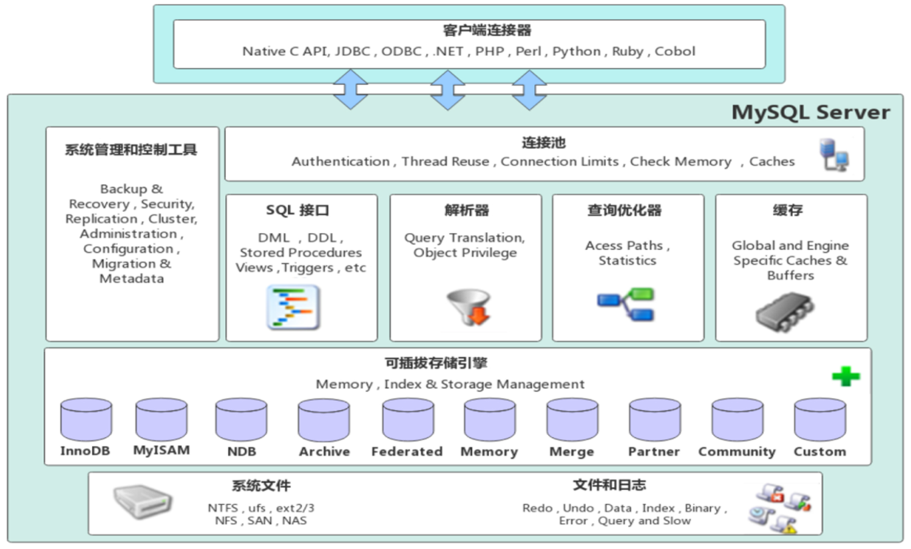
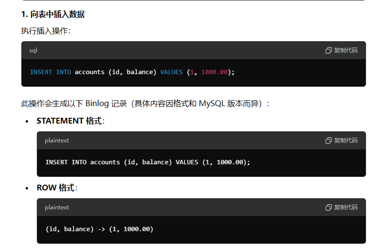
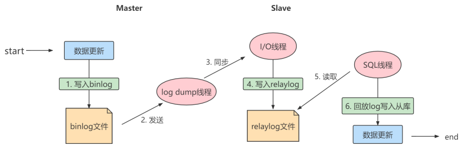

# 常见面试题

## 字段类型

### 1. 整数类型的unsigned 属性有什么用？

表示不允许用负号的无符号整型，第一位符号位，tinyint 两字节 从-128 - 127 变为 0 - 255；适合从0递增的ID列。

### 2. CHAR 和 VARCHAR的区别？

char是定长字符串，varchar是变长字符串；

char 会用空格补足右边字符串，检索时去掉；varchar需要用1或2字节记录字符串长度；

char适合存储手机号身份证等定长字符串；varchar适合文章标题等变长字符串

### 3. DECIMAL 和 FLOAT/DOUBLE 区别？

decimal是定点数，可以存储精确的小数值；存储货币等

float是浮点数，存储近似小数值

### 4. 为啥不推荐使用TEXT和BLOB？

检索效率低，不能直接创建索引，消耗大量网络和I/O带宽

### 5. DATETIME 和 TIMESTAMP 的区别？

timestamp有时区，4~7字节，所以时间范围比datetime小，5~8字节；

性能上timestamp要转换时区效率低一点；

也可以使用int来存日期，算1970到现在的毫秒值；4字节

### 6. NULL 和‘’的区别？

- NULL是不确定的值，select中 NULL=NULL 为false，group by order by 中 NULL是相等的；
- ‘’ 长度是0不占空间，NULL占空间
- NULL影响聚合结果，SUM，COUNT() 等会忽略NULL（COUNT（*） 会统计全部记录包括NULL）;
- 查询时必须用is null和is not null，不能使用比较运算符；

### 7. Boolean 类型如何表示？

TINYINT(1) 存储0、1

## 介绍下mysql的基础架构？

分为连接层、服务层、引擎层、存储层

- 连接器 ：身份权限认证
- 查询缓存
- 解析器：词法分析（关键字）、语法分析（语句是否符合规范）
- 查询优化器：按最优方案执行，如使用索引
- 执行器：返回结果
- 插件式存储引擎：数据读写，InnoDB，MyISAM等
- 文件系统

## 存储引擎

### mysql支持哪些存储引擎？

InnoDB（5.5.5之后默认）、MyISAM（5.5.5之前默认）、memory

### MyISAM 和 InnoDB 的区别？

MyISAM 不支持事务和行级锁，因此只能表级锁，不适合并发；不支持外键

InnoDB支持事务：提交和回滚；默认使用可重读隔离级别解决幻读问题(MVCC和next-key Lock)

## MySQL 索引

### 索引的优缺点？

优点：加快检索速度；唯一索引保证唯一性

缺点：耗费空间；增删改操作维护索引降低SQL执行效率

### 索引一定能提高查询效率吗？

数据量大的时候是的，数据量小提升不大

### 索引的数据结构

#### 红黑树

插入删除节点只需要O(1)次数的旋转和变色，不需要像二叉平衡树执行O(logn)次旋转；但查询可能不是最优，因为只实现了大致平衡，导致树高。

有以下特点：根节点是黑色，每个叶子节点是空黑节点，从根节点到叶子节点的每条路径，必须包含相同数目的黑色节点；

### B 树和B+ 树的异同？

- 查询效率不同：B树叶子节点和非叶子节点都存数据和索引，而B+树非叶子节点只存索引，一页内存的索引数量更多，因此B+树的树深更低，查询效率更高，I/O更少；
- 查询稳定不同：B 树查询到非叶子节点可能就返回数据，B+树稳定从根节点查到叶子节点
- 范围查询不同：B 树可能需要中序遍历，B +树对链表遍历

### 索引类型有哪些？

按存储方式划分：聚簇索引、二级索引

按应用维度划分：主键索引、唯一索引、普通索引、全文索引

### 聚簇索引是什么？

叶子节点存储数据和key，只能有一个聚簇索引，存在主键则主键索引是聚簇索引，不存在主键存在唯一索引使用第一个唯一索引做聚簇索引，都不存在系统隐式生成rowid做聚簇索引

优点：查询速度快；范围查找和排序查找快

缺点：维护成本高；依赖有序数据

### 二级索引是什么？

叶子节点存储的数据是主键，通过回表在聚簇索引中定位主键的位置；

优点：更新代价比聚簇索引小，因为叶子不存具体数据，存指向数据的指针

缺点：可能回表，多一次查询；依赖有序数据；

### 非聚簇索引一定回表吗？(覆盖索引是什么？)

不一定，如果叶子节点的索引就已经包含了返回的结果就不需要回表，即覆盖索引；

### 最左前缀原则是什么？

在使用联合索引时，会按照联合索引中字段的顺序从左至右依次匹配；遇到>,< 或跳索引字段会导致索引失效

### 索引下推是什么？

在引擎层做字段的条件判断过滤掉不符合的记录，在非聚簇索引遍历过程中，对索引中包含的字段先做判断，过滤掉不符合条件的记录，减少回表次数。

### 如何选择字段做索引？

- 数据量大且查询频繁的表
- 常用于where、order by、group by的字段建立索引
- 区分度高的建立索引
- 尽量使用联合索引可以覆盖索引避免回表
- 控制索引数量，占空间维护成本高

### 什么情况索引失效？

- 组合索引查询没按最左前缀原则
- 索引列使用了计算、函数、类型转换
- 使用的<,> 的范围查询
- %开头的模糊查询

- OR 的前后有一个列没有索引，涉及的索引都不会使用

### 如何分析语句是否走索引？

EXPLAIN 输出可能用到的索引列和索引的类型

## MySQL日志

### 常见日志有哪些？

- binary log 二进制日志：记录更改数据库的变化，用于数据库备份和恢复
- 慢查询日志：执行时间超过阈值秒的查询
- redo log 和 undo log 事务日志：重做日志和回滚日志
- relay log 中继日志：和binary 差不多，用于主从复制的从库

### binlog 主要记录什么？

主要记录数据库中数据的所有变化；记录了所有对数据库状态产生变化的操作，例如 INSERT、UPDATE 和 DELETE 等。

statement记录的内容是`SQL`语句原文，row记录了具体的数据

### binlog 和 redolog的区别？

binlog主要用于数据库还原和主从复制；redolog 主要是事务的持久性；

binlog 通过追加方式写入；redolog采用循环写方式，日志满了会从头覆盖记录；

redo log 它是物理日志，记录内容是“在某个数据页上做了什么修改”，属于 InnoDB 存储引擎。

而 binlog 是逻辑日志，记录内容是语句的原始逻辑，类似于“给 ID=2 这一行的 c 字段加 1”，属于`MySQL Server` 层。

### redo log如何保证事务的持久性？

增删改操作内存中的缓冲池的数据页，得到脏页，将数据页的变化记录在redo log buffer中，事务提交时，会将redo log buffer 的数据刷新到redo log 磁盘中；如果之后缓冲区的脏页通过后台线程刷新到磁盘，这个过程出错了还可以通过redo log数据恢复；如果每出错可以将redolog删了（因为事务已提交）。

## Mysql 事务

### 什么是事务？

逻辑上的一组操作，要么都执行，要么都不执行。

### 事务的特性有哪些？

ACID：

- 原子性：动作要么全部成功要么全部失败；
- 一致性：执行事务前后，数据保持一致；如转账业务中，转账人和收款人的总额是不变的；
- 隔离性：事务之间是独立的，不能被其他事务干扰；
- 持久性：事务被提交后，对数据的改变是永久的。

### 并发事务的问题？

- 脏读：另一个事务读到了还未提交的数据
- 不可重复读：对同一个查询语句执行前后的数据不一致；
- 幻读：查询前后多了本不存在的记录；

### 并发事务的控制方式？

锁和MVCC：

锁分为共享锁(S锁)读锁和排他锁(X锁) 写锁；又可分为表级锁和行级锁；

MVCC是多版本并发控制：对一份数据存储多个版本，控制不同事务对数据的可见性

### 有哪些事务隔离级别？

读未提交、读已提交、可重复读、串行化

## MySQL锁

### 表级锁和行级锁有什么区别？

行级锁是针对索引字段加锁，只针对行记录加锁；

#### 行锁类型:

- record lock 记录锁：单个行记录的锁
- Gap lock 间隙锁：锁定一个行范围，不包括记录本身
- next-key lock 临建锁：record lock + gap lock，锁定一个范围，解决幻读（避免插入新记录使用间隙锁）

InnoDB默认是临建锁，但是索引如果是主键或唯一索引，会降级为记录所只锁记录本身

### 共享锁和排他锁是什么?

表级锁和行级锁都有S锁和X锁；共享锁就是读操作允许多个事务获取锁，共享读；排他锁不允许多个事务同时获取；

select 添加共享锁：SELECT ... LOCK IN SHARE MODE;

select 添加排他锁：SELECT ... FOR UPDATE;

增删改自动加排他锁；

### 意向锁有什么作用？

数据库在加锁时可以更高效地判断当前事务的意图，从而避免不必要的锁等待。提高并发性，减少死锁

意向锁是表级锁；有IS锁和IX锁；一行行遍历记录是否加锁太慢，用意向锁表示是否能加表级锁：
**意向锁是由数据引擎自己维护的，用户无法手动操作意向锁，在为数据行加共享/排他锁之前，InooDB 会先获取该数据行所在在数据表的对应意向锁。**

### 当前读和快照读有什么区别？

**快照读**就是普通的select语句，如果记录在执行update/delete ，读操作不会等待排他锁，而是读当前可见的最新版本数据（快照）；

快照读的不同隔离级别：

- RC级别下：每次select 都会生成一个readview
- RR级别下：只有事务第一次select生成readview
- 在readview中判断，如果当前事务id在最大事务和最小事务id之间，如果当前事务读的时候，有其他事务在增改
  - 根据RC readview，该记录事务id不在活跃事务集合， 会读到最新的数据，可能存在不可重复读
  - 根据 RR 级别，读第一次的readview，该记录事务id在活跃事务集合，因此不能访问，回滚指针下一个版本数据。解决不可重复读。

**当前读**：给行记录加X锁或S锁；最新版本的数据；

## MVCC 的原理

MVCC由隐藏字段、undo log和readview实现

**隐藏字段**：

- DB_TRX_ID: 最后以此插入或更新的事务id
- DB_ROLL_PTR：回滚指针，指向该行的undo log；如果记录没更新，则为空；
- DB_ROW_ID：如果没有主键且没有唯一索引，添加自增id 生成聚簇索引

**readview**：

- `m_low_limit_id`：目前出现过的最大的事务 ID+1，即下一个将被分配的事务 ID。大于等于这个 ID 的数据版本均不可见

- `m_up_limit_id`：活跃事务列表 `m_ids` 中最小的事务 ID，如果 `m_ids` 为空，则 `m_up_limit_id` 为 `m_low_limit_id`。小于这个 ID 的数据版本均可见

- `m_ids`：`Read View` 创建时其他未提交的活跃事务 ID 列表。创建 `Read View`时，将当前未提交事务 ID 记录下来，后续即使它们修改了记录行的值，对于当前事务也是不可见的。`m_ids` 不包括当前事务自己和已提交的事务（正在内存中）

- `m_creator_trx_id`：创建该 `Read View` 的事务 ID

可见性判断

1. trx_id == creator_trx_id , 意味着当前事务在访问它自己修改过的记录，所以该版本可以被当前事务访问。

2. trx_id < min_trx_id，表明生成该版本的事务在当前事务生成ReadView前已经提交，所以该版本可以被当前事务访问。  

3. trx_id > max_trx_id，表明生成该版本的事务在当前事务生成ReadView后才开启，所以该版本不可以被当前事务访问。 不确定之前的事务是否提交。

4. 需要判断一下trx_id属性值是不是在 m_ids 列表中。

   * 如果在，说明创建ReadView时生成该版本的事务还是活跃的，该版本不可以被访问。 
   * 如果不在，说明创建ReadView时生成该版本的事务已经被提交，该版本可以被访问。

### MVCC + next-key Lock解决幻读

1. 执行select 后根据MVCC 快照读的方式实现了可重复读和快照读下的幻读
2. 使用 next-key Lock 来锁住间隙，防止其他事务在查询范围内插入；(使用 select for update/lock in share mode 增删改加锁)

## 读写分离和分库分表

### 主从复制原理？

主库将数据库中数据的变化写入到 binlog

从库连接主库

从库会创建一个 I/O 线程向主库请求更新的 binlog

主库会创建一个 binlog dump （导出）线程来发送 binlog ，从库中的 I/O 线程负责接收

从库的 I/O 线程将接收的 binlog 写入到 relay log 中。

从库的 SQL 线程读取 relay log 同步数据本地（也就是再执行一遍 SQL ）。

### 分库分表

- 垂直分库：将单一数据库按业务划分到不同的数据库，如用户数据库、商品数据库
- 水平分库：表数据量太大，将同一个表按一定规则拆分到不同数据库中；结构相同
- 垂直分表：将一张表的多个字段拆分成存在不同表中
- 水平分表：按一定规则将将一张表拆分成多张表

### 分库分表的问题

- join操作麻烦，需要手动封装去另一个库找数据
- 事务问题：需要引入分布式事务
- 分布式ID
- 跨库聚合查询

## 分布式事务

​	

