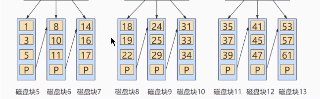
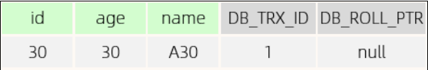
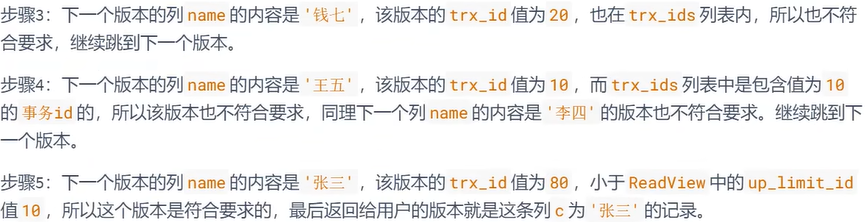

# 索引

## 索引结构

### BTree


非叶子节点既要存索引也要存数据，搜索过程中主要花费的时间是从磁盘中读数据的IO，比较在内存中可忽略。

### B+Tree




将数据都存在叶子节点，非叶子节点只存索引。

### 为什么用B+Tree？

> A. 相对于二叉树，层级更少，搜索效率高；
>
> B. 对于B-tree，无论是叶子节点还是非叶子节点，都会保存数据，这样导致一页中存储
>
> 的键值减少，指针跟着减少，要同样保存大量数据，只能增加树的高度，导致性能降低；
>
> C. 相对Hash索引，B+tree支持范围匹配及排序操作；

**和B树比**

- B+Tree查询效率更稳定；BTree非叶子节点还存有数据，查询时有时候在非叶子节点就返回结果，有时在叶子节点返回
- B+Tree查询效率更高；因为B+树非叶子节点不存数据只存索引，因此每页可存的索引更多， 比 B深度更低，查询IO的次数更少；
- 查询范围比B树效率高；因为B+树数据在叶子节点有序双向链表连接；而B树需要中序遍历才能完成范围查找；

**和hash树比**


-  Hash索引只能用于对等比较(=，in)，不支持范围查询（between，>，< ，...）

- 无法利用索引完成排序操作

- 查询效率高，通常(不存在hash冲突的情况)只需要一次检索就可以了，效率通常要高于B+tree索

引; redis使用

## 索引分类

### 分类

主键索引、唯一索引、常规索引、全文索引

主键索引自动创建，只能有一个

### 物理存储形式

**聚簇索引**

叶子节点存储数据，只能有一个，存在主键则主键索引是聚簇索引，不存在主键存在唯一索引使用第一个唯一索引做聚簇索引，都不存在系统隐式生成rowid做聚簇索引

**二级索引**

二级索引的叶子节点下挂的是该字段值对应的主键值，是关键字+主键，二级索引查询找到叶子节点的关键字后，根据叶子节点中的主键值回表到聚簇索引找主键获取该行具体数据

## 索引优化

### 索引失效

#### 最左前缀法则

查询从索引的最做列开始且不跳过索引中间的列。如果第一个索引存在可以使用，后面如果跳过则后续的索引查询失效

#### 范围查询

!= 、>、<，范围查询右侧的列索引失效，尽可能的使用类似于 >= 或 <= 这类的范围查询，而避免使用 > 或 <

#### 索引列计算、函数导致索引失效

#### 类型转换(自动或手动)——字符串不加引号

字符串不加引号可能会将数字转换成字符串再匹配

#### 模糊查询

尾部模糊匹配，索引不会失效。如果是头部模糊匹配，索引失效；`like '%ab'`

#### or连接条件

如果or前的条件中的列有索引，而后面的列中没有索引，那么涉及的索引都不会

被用到，**两边都有索引才会用到索引**

####  is null可以使用索引，is not null无法使用索引

not like也不行

### 覆盖索引

**一个索引包含了满足查询结果的数据就叫做覆盖索引**。比如有id_age索引，目标是查age，则不用进行回表，如果还需要其他的值比如name则需要回表再查聚簇索引返回结果。

因此减少使用select * ，可以构建联合索引使用覆盖索引。

### 前缀索引-字符串添加索引

由于字符串可能很长，保存索引会占很大空间，只取前缀可以节省空间


### 索引设计原则

- 数据量大且查询频繁的表
- 常用于where、order by、group by的字段建立索引
- 区分度高的建立索引
- 尽量使用联合索引可以覆盖索引避免回表
- 控制索引数量，占空间维护成本高

## SQL优化

### insert 批量插入

### 主键优化

数据是记录在页中的，页大小是固定16K，记录按主键排序，主键插入可能会导致**页分裂**：

- 如果插入磁盘的第一个页空间满了，会申请第二个页插入，用指针连接页；
- 如果第二个页也满了，会申请第三个页但不是直接插入，而是将第一个页的一半数据移到第三个页后再插入，然后重置三个页的指针，比较耗性能


**页合并**

- 当删除记录时，只是标记记录的空间可以被其他记录使用，没有物理删除
- 当一个页被标记的数量超过一半时会尝试去附近的页合并空间


**尽量使用自增主键**

顺序插入，避免过多的页分裂和页合并

### order by优化

MySQL的排序，有两种方式：

**Using filesort** : 通过表的索引或全表扫描，读取满足条件的数据行，然后在`排序缓冲区sort`

`buffer中`完成排序操作，所有不是通过索引直接返回排序结果的排序都叫 FileSort 排序。

**Using index** : 通过有序索引顺序扫描直接返回有序数据，这种情况即为 using index，`不需要`

`额外排序`，操作效率高。

- 建立合适索引，使用覆盖索引
- 减少使用order by，和业务沟通能不排序就不排序，或将排序放到程序端去做。Order by、group by、distinct这些语句较为耗费CPU，数据库的CPU资源是极其宝贵的。

### group by

- 创建索引，遵循最左原则

### limit分页优化

一般分页查询时，通过创建 覆盖索引 能够比较好地提高性能，可以通过覆盖索引加子查

询形式进行优化。

# 视图、存储过程、触发器

### 视图

视图只保存了查询的SQL逻辑，不保存查询结果。

### 存储过程

- 封装，复用 ——可以把某一业务SQL封装在存储过程中，需要用到的时候直接调用即可。

- 可接收参数，可返回结果

- 减少网络交互，效率提升 -------------> 如果涉及到多条SQL，每执行一次都是一次网络传

  输。 而如果封装在存储过程中，我们只需要网络交互一次可能就可以了。

```mysql
CREATE PROCEDURE 存储过程名称 ([ 参数列表 ])
BEGIN
-- SQL语句
END ;
```

调用

```sql
CALL 名称 ([ 参数 ]);
```

### 触发器

触发器是与表有关的数据库对象，指在insert/update/delete之前(BEFORE)或之后(AFTER)，触

发并执行触发器中定义的SQL语句集合。

# 锁

按照锁的粒度分，分为以下三类：

全局锁：锁定数据库中的所有表。

表级锁：每次操作锁住整张表。

行级锁：每次操作锁住对应的行数据。

### 表级锁

每次操作锁住整张表。锁定粒度大，发生锁冲突的概率最高，并发度最低。

#### 表锁

- 表共享读锁（read lock）

- 表独占写锁（write lock）

加锁：lock tables 表名... read/write。

释放锁：unlock tables / 客户端断开连接 

**读锁**：不影响其他线程读，阻塞其他线程写

**写锁**：阻塞其他线程读写


#### 元数据锁（meta data lock，MDL）


#### 意向锁

为了避免DML在执行时，加的行锁与表锁的冲突，在InnoDB中引入了意向锁，使得表锁不用检查每行

数据是否加锁，使用意向锁来减少表锁的检查。

无意向锁场景下加表锁，会逐行检查是否有加行锁；加意向锁后不用逐行检查，根据意向锁来判断是否可以加表锁：

- 意向共享锁(IS): 可读不可写
- 意向排他锁：不可读写

### 行级锁

> 行锁是通过对索引上的**索引项加锁**来实现的，而不是对记录加的锁。

#### 行锁

共享锁（S）：允许一个事务去读一行，阻止其他事务获得相同数据集的排它锁。

排他锁（X）：允许获取排他锁的事务更新数据，阻止其他事务获得相同数据集的共享锁和排他

锁。

- insert 、update、delete 都是自动加排他锁(涉及写操作)

- select 手动添加共享锁/排他锁：SELECT之后加LOCK IN SHARE MODE/ SELECT之后加FOR UPDATE

- > 无索引行锁升级为表锁，因为行锁是对索引项加锁

#### 间隙锁&临建锁

默认情况下，InnoDB在 REPEATABLE READ事务隔离级别运行，InnoDB使用 next-key 锁（临建锁）进行搜索和索引扫描，以**防止幻读**。锁住区间内的数据防止其他事务插入产生幻读。

> 间隙锁唯一目的是防止其他事务插入间隙。间隙锁可以共存，一个事务采用的间隙锁不会阻止另一个事务在同一间隙上采用间隙锁。

- 索引上的等值查询(唯一索引)，给不存在的记录加锁时, 优化为间隙锁 。

- 索引上的等值查询(非唯一普通索引)，向右遍历时最后一个值不满足查询需求时，next-key lock 退化为间隙锁。

- 索引上的范围查询(唯一索引)--会访问到不满足条件的第一个值为止。


# InnoDB引擎

## 逻辑存储结构


段分为数据段、索引段、回滚段，数据段是B+树叶子节点，索引段是非叶子节点；

每个区大小为1M，页大小16K，一个区有64个连续页；

页是InnoDB最小存储单元，存放行；

行中有两个默认字段：Trx_id事务id和Roll_pointer回滚指针；

## 事务

### 事务

是**一组操作的集合**，它是一个不可分割的工作单位，事务会把所有的操作作为一个整体一起向系

统**提交或撤销操作请求**，即这些**操作要么同时成功，要么同时失败。**

### ACID

• 原子性（Atomicity）：事务是不可分割的最小操作单元，要么全部成功，要么全部失败。

• 一致性（Consistency）：事务完成时，必须使所有的数据都保持一致状态。

• 隔离性（Isolation）：数据库系统提供的隔离机制，保证事务在不受外部并发操作影响的独立环

境下运行。

• 持久性（Durability）：事务一旦提交或回滚，它对数据库中的数据的改变就是永久的。


ACD靠redo log和undo log实现，隔离性靠锁和MVCC实现。

### 隔离级别

#### 并发事务问题

- 脏读：一个事务读到另一个事务还没提交的数据，读的数据可能会被修改/回滚。
- 不可重复读：一个事务先后读取同一条记录，两次读取的数据不同
- 幻读：一个事务按条件查询数据时，没查到对应记录，但插入数据时系统又表示已存在记录；

#### 事务隔离级别


### Redo log

重做日志，记录事务提交时数据页的物理修改，实现事务的持久性。

该日志文件由两部分组成：重做日志缓冲（redo log buffer）以及重做日志文件（redo log

file）,前者是在内存中，后者在磁盘中。当事务提交之后会把所有修改信息都存到该日志文件中, 用

于在刷新脏页到磁盘,发生错误时, 进行数据恢复使用。

#### 保证持久性

增删改操作内存中的缓冲池的数据页，得到脏页，将数据页的变化记录在redo log buffer中，事务提交时，会将redo log buffer 的数据刷新到redo log 磁盘中；如果之后缓冲区的脏页通过后台线程刷新到磁盘，这个过程出错了还可以通过redo log数据恢复；如果每出错可以将redolog删了。

##### 为什么不直接将buffer pool中的脏页刷新到磁盘？

redo log在往磁盘中写数据是顺序写的效率比随机写高，先写日志再同步数据；

### undo log

回滚日志，用于记录数据被修改之前的信息：提供回滚（保证原子性）和MVCC（多版本并发控制）。

在insert、delete、update时产生，update、delete产生的日志在事务提交后，可能要快照读不会被立即删除，insert事务提交后日志删除。

undo log是逻辑日志，记录的是操作命令相反的命令，delete 记录则日志中insert 记录，当执行rollback时可以从日志回滚。


### MVCC

- 当前读

读取的是记录的最新版本，读取时保证其他并发事务不能修改当前记录，会对记录加锁，共享锁或排他锁

- 快照读

不加锁的select 为快照读，读取的是记录数据的可见版本，可能是历史数据也可能是最新的，非阻塞读。

• Read Committed：每次select，都生成一个快照读。

• Repeatable Read：开启事务后第一个select语句才是快照读的地方。可能不是最新的数据，但保证了可重复读，前后数据一致；

• Serializable：快照读会退化为当前读

#### 多版本控制

维护一个数据多个版本使得读写操作没有冲突，且非阻塞读。

由隐藏字段、undolog和readview实现。

##### 隐藏字段

- DB_TRX_ID ：最近修改事务ID，记录插入这条记录或最后一次修改该记录的事务ID。

- DB_ROLL_PTR ：回滚指针，指向这条记录的上一个版本，用于配合undo log，指向上一个版

本。

- DB_ROW_ID ：隐藏主键，如果表结构**没有指定主键**，将会生成该隐藏字段。

##### undolog版本链

用于回滚以前版本的数据。

插入一条记录：



- DB_TRX_ID : 代表最近修改事务ID，记录插入这条记录或最后一次修改该记录的事务ID，是自增的。`因为是新插入的数据，因此事务id为1，后续事务id自增`

- DB_ROLL_PTR ： 由于这条数据是才插入的，`没有被更新过，所以该字段值为null`

此时有四个并发事务同时访问该表：

###### 第一步


当事务2执行update语句时，会在undo log日志中记录修改前的数据(左图)；更新记录后DB_TRX_ID自增为2，同时回滚指针DB_ROLL_PTR指定undo log中要回滚版本的记录。

###### 第二步


事务3执行update，undo log记录修改前的数据，并更新事务id和回滚指针

###### 第三步


> 不同事务或相同事务对同一条记录进行修改，会导致该记录的undo log生成一条
>
> 记录版本链表，链表的头部是最新的旧记录，链表尾部是最早的旧记录


##### readview

ReadView（读视图）是 `快照读SQL`执行时MVCC提取数据的依据，记录并维护系统当前活跃的事务（**未提交的**）id。目的是控制读哪个版本数据。

- m_ids  表示在生成ReadView时当前系统中活跃的读写事务的 `事务id列表` 。

- min_trx_id  活跃事务中最小的活跃事务ID

- max_trx_id  预分配id，表示生成ReadView时系统中应该分配给下一个事务的 id 值。max_trx_id 是系统最大的事务id值，这里要注意是系统中的事务id，需要区别于正在活跃的事务ID。活跃集合最大ID+1

- creator_trx_id  ReadView创建者的事务ID

> 比如，现在有id为1， 2，3这三个事务，之后id为3的事务提交了。那么一个新的读事务在生成ReadView时， trx_ids就包括1和2，min_trx_id的值就是1，max_trx_id的值就是4。

**访问undolog版本链规则：**

trx_id 代表当前尝试访问的事务id，要提取那个历史版本的数据就通过undo log的版本链获取trx_id来进行对比。select 生成readview后访问最新回滚指针指向的事务，获取事务id 20，判断是否符合可见规则，不符合则通过版本链跳到下一个事务获得id 10，不可见再跳id为8，符合则返回数据，如果返回到最后trx_id==creator_id,说明是自己事务修改的数据。


1. trx_id == creator_trx_id , 意味着当前事务在访问它自己修改过的记录，所以该版本可以被当前事务访问。

2. trx_id < min_trx_id，表明生成该版本的事务在当前事务生成ReadView前已经提交，所以该版本可以被当前事务访问。  

3. trx_id > max_trx_id，表明生成该版本的事务在当前事务生成ReadView后才开启，所以该版本不可以被当前事务访问。 不确定之前的事务是否提交。

4. 需要判断一下trx_id属性值是不是在 m_ids 列表中。

   * 如果在，说明创建ReadView时生成该版本的事务还是活跃的，该版本不可以被访问。 
   * 如果不在，说明创建ReadView时生成该版本的事务已经被提交，该版本可以被访问。

   ```mysql
   # Transaction 10
   BEGIN;
   UPDATE student SET name="李四" WHERE id=1;
   UPDATE student SET name="王五" WHERE id=1;
   # Transaction 20
   BEGIN;
   # 更新了一些别的表的记录
   ...
   ```

   

> 总结：就看当前事务id和当前活跃id集合的情况，比当前活跃id集合中小说明事务已经提交，数据不会变化，如果要访问的数据其事务id还在活跃，那访问可能会脏读所以不允许被访问；如果trx_id > max_id，如事务id 22 > 目前版本max_id 21，说明是在目前版本之后生成的readview，可能目前版本还没有提交事务，不能被访问。

##### READ COMMITTED隔离级别下

**READ COMMITTED ：每次读取数据前都生成一个ReadView。**

```mysql
# Transaction 10
BEGIN;
UPDATE student SET name="李四" WHERE id=1;
UPDATE student SET name="王五" WHERE id=1;
COMMIT;
# Transaction 20
BEGIN;
# 更新了一些别的表的记录
...
UPDATE student SET name="钱七" WHERE id=1;
UPDATE student SET name="宋八" WHERE id=1;
```

此时事务20还在活跃，查找这个 id 为 1 的记录


```mysql
# 使用READ COMMITTED隔离级别的事务
BEGIN;

# SELECT1：Transaction 10、20均未提交
SELECT * FROM student WHERE id = 1; # 得到的列name的值为'张三'

# SELECT2：Transaction 10提交，Transaction 20未提交
SELECT * FROM student WHERE id = 1; # 得到的列name的值为'王五'
```


只是解决了脏读，但不可重复读，因为前后读取不一致

##### REPEATABLE READ隔离级别下

只会在第一次执行查询语句时生成一个 `ReadView` ，之后的查询就不会重复生成了。

```mysql
# 使用REPEATABLE READ隔离级别的事务
BEGIN;
# SELECT1：Transaction 10、20均未提交
SELECT * FROM student WHERE id = 1; # 得到的列name的值为'张三'
# SELECT2：Transaction 10提交，Transaction 20未提交
SELECT * FROM student WHERE id = 1; # 得到的列name的值仍为'张三'
```




执行select 1后生成readview，后续不再生成新的readview，因此即使后续有事务提交，但是readview里的活跃id集合是不会被更新的，因此两次select 读的是一致的，实现了可重复读。

##### 通过readview和undo log解决幻读

幻读是指第一次查询没查到记录，尝试插入时发现记录已存在/或者事务内第二次查询出现了第一次查询不存在的记录，可能是并发导致。

解决幻读就是事务内的两次查询结果保持一致，也就是新增的数据对当前事务不可见。

第一次select产生readview：

`trx_ids= [20,30] ， min_limit_id=20 ， max_limit_id=31 ， creator_trx_id=20` 。


通过MVCC，RR隔离级别下，事务A在第一次select后产生了readview后不会再产生新的readview；根据readview规则，访问新增数据id2和id3的trx_id 为30，在活跃集合[20,30]中，因此不能被访问，需要符合规则4，trx_id 如果在min_id 和 max_id之间但事务id不在活跃集合中才行。

#### MVCC总结


