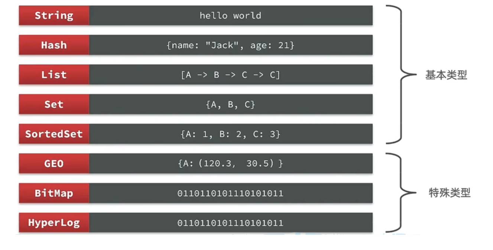
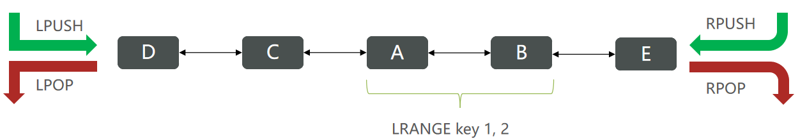
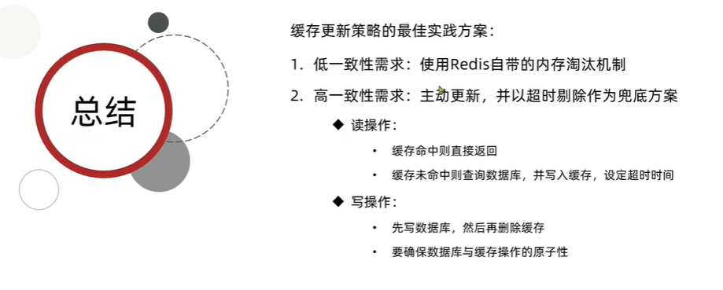
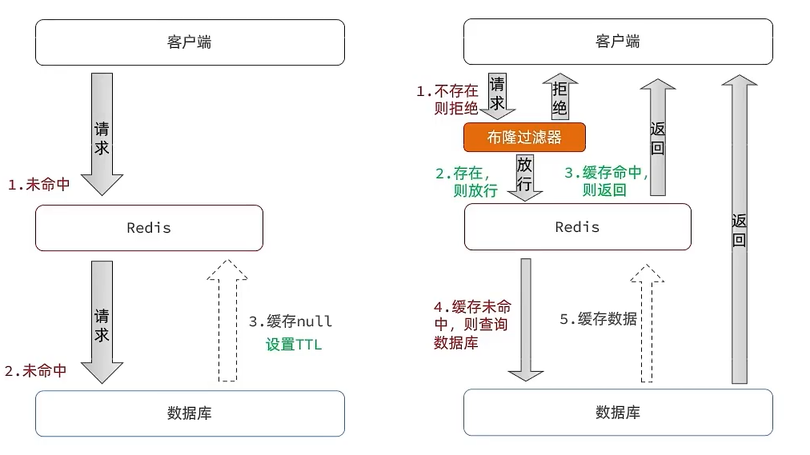
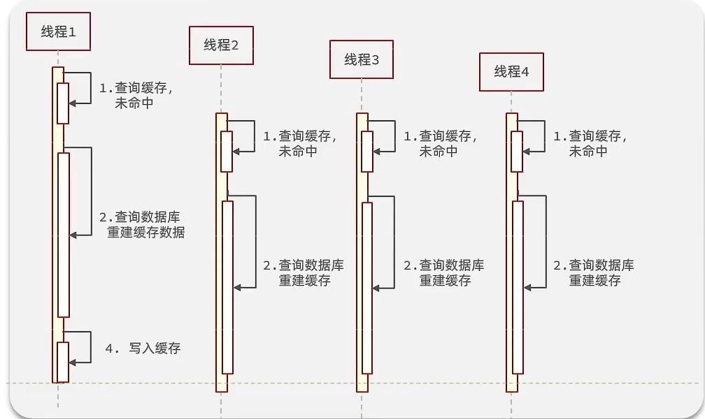
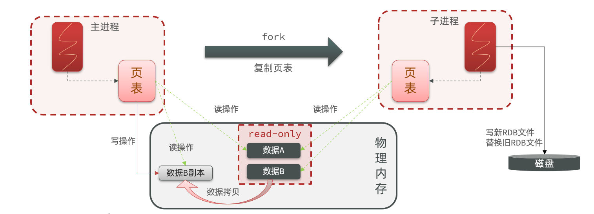

# Redis

## 基本概念

no sql 非关系型数据库，键值型数据库

## 常用命令



### 通用命令

- KEYS：查看符合模板的所有key ` keys *`
- DEL：删除一个指定的key
- EXISTS：判断key是否存在
- EXPIRE：给一个key设置有效期，有效期到期时该key会被自动删除；`expire age 10`
- TTL：查看一个KEY的剩余有效期；ttl 用于查看key剩余多少有效期，-1表示永久有效，-2表示过期

### String

**value类型**

* string：普通字符串
* int：整数类型，可以做自增.自减操作
* float：浮点类型，可以做自增.自减操作

**命令**

* SET：添加或者修改已经存在的一个String类型的键值对
* GET：根据key获取String类型的value
* MSET：批量添加多个String类型的键值对 
  * `MSET k1 v1 k2 v2 k3 v3`
* MGET：根据多个key获取多个String类型的value
* INCR：让一个整型的key自增1
  * `incr age //增加1`
* INCRBY:让一个整型的key自增并指定步长，例如：incrby num 2 让num值自增2
* INCRBYFLOAT：让一个浮点类型的数字自增并指定步长
* SETNX：添加一个String类型的键值对，前提是这个key不存在，否则不执行；设置成功返回OK
* SETEX：添加一个String类型的键值对，并且指定有效期 `setex name 10 jack`

### Key


### Hash

Hash类型，也叫散列，其value是一个无序字典，类似于Java中的HashMap结构。

**String结构**是将对象序列化为**JSON字符串**后存储，当需要修改对象某个字段时很不方便：


Hash结构可以将对象中的每个字段独立存储，可以针对单个字段做CRUD：


- HSET key field value：添加或者修改hash类型key的field的值

- HGET key field：获取一个hash类型key的field的值

- HINCRBY:让一个hash类型key的字段值自增并指定步长

- HSETNX：添加一个hash类型的key的field值，前提是这个field不存在，否则不执行

### List

Redis中的List类型与Java中的LinkedList类似，可以看做是一个双向链表结构。既可以支持正向检索和也可以支持反向检索。

**特点**

* 有序
* 元素可以重复
* 插入和删除快
* 查询速度一般

**命令**

- LPUSH key element ... ：向列表左侧插入一个或多个元素
- LPOP key：移除并返回列表左侧的第一个元素，没有则返回nil
- RPUSH key element ... ：向列表右侧插入一个或多个元素
- RPOP key：移除并返回列表右侧的第一个元素
- LRANGE key star end：返回一段角标范围内的所有元素
- BLPOP和BRPOP：与LPOP和RPOP类似，只不过在没有元素时等待指定时间，而不是直接返回nil



### Set-底层类似Hashset-数组+链表/红黑树

* 无序
* 元素不可重复
* 查找快
* 支持交集.并集.差集等功能

**命令**

* SADD key member ... ：向set中添加一个或多个元素 **增**
* SREM key member ... : 移除set中的指定元素 **删**
* SCARD key： 返回set中元素的个数 
* SISMEMBER key member：判断一个元素是否存在于set中
* SMEMBERS：获取set中的所有元素
* SINTER key1 key2 ... ：求key1与key2的交集
* SDIFF key1 key2 ... ：求key1与key2的差集
* SUNION key1 key2 ..：求key1和key2的并集

### SortedSet - 跳表实现（多级索引的链表）

- 可排序
- 元素不重复
- 查询速度快

**命令**

- ZADD key score member：添加一个或多个元素到sorted set ，如果已经存在则更新其score值
- ZREM key member：删除sorted set中的一个指定元素
- ZSCORE key member : 获取sorted set中的指定元素的score值
- ZRANK key member：获取sorted set 中的指定元素的排名

- **升序**获取sorted set 中的指定元素的排名：ZRANK key member
- **降序**获取sorted set 中的指定元素的排名：ZREVRANK key memeber

## java集成

SpringDataRedis - Jedis- **redisTemplate**


Springboot中集成CacheServer


## 业务应用

登录校验 JWT JSON Web Token**白话**：用户请求携带cookie用户JWT 的token信息，校验令牌，没有则通过拦截器拦截，有则将用户信息保存到ThreadLocal中，用hash格式保存userDTO数据并做转换


将用户的信息放到redis中，拦截器登录刷新更新token有效期

### 缓存

缓存目的：降低后端负载，提高读写效率，降低响应时间


#### 查询缓存

优先在redis中查询，没缓存则再回数据库查询，数据库查到后再更新redis；


##### 数据库缓存不一致方案

- 单体系统中将缓存和数据库操作放在同一个事务中

一般先操作数据库再删缓存，因为redis的读写速度快，发生多线程数据不一致



#### 缓存穿透

缓存穿透是指客户端请求的数据在缓存中和数据库中都不存在，这样缓存永远不会生效，这些请求都会打到数据库。

常见的解决方案有两种：



* 缓存空对象
  * 将空对象存入redis，若第一次查询不存在数据，则后来的请求都返回TTL空，防止频繁访问数据库
  * 优点：实现简单，维护方便
  * 缺点：
    * 额外的内存消耗
    * 可能造成短期的不一致
* 布隆过滤
  * 走哈希思想去判断当前这个要查询的这个数据是否存在，如果布隆过滤器判断存在，则放行，这个请求会去访问redis，哪怕此时redis中的数据过期了，但是数据库中一定存在这个数据
  * 优点：内存占用较少，没有多余key
  * 缺点：
    * 实现复杂
    * 存在误判可能

#### 缓存雪崩

缓存雪崩是指在同一时段大量的缓存key同时失效或者Redis服务宕机，导致大量请求到达数据库，带来巨大压力。

解决方案：给不同的key添加随机值TTL，添加多级缓存

* 给不同的Key的TTL添加随机值
* 利用Redis集群提高服务的可用性
* 给缓存业务添加降级限流策略
* 给业务添加多级缓存


#### 缓存击穿

缓存击穿问题也叫**热点Key问题**，就是一个被**高并发访问**并且缓存重建业务较复杂的key**突然失效**了，无数的请求访问会在瞬间给数据库带来巨大的冲击。

白话：高并发访问的热点key突然失效并且重建缓存复杂，导致大量请求瞬间到数据库查询并尝试重建缓存；



解决方案：

- 设置合理的TTL防止失效
- 缓存预热，对高并发的热点key提前加载进redis

常见的重建解决方案有两种：

* 互斥锁
* 逻辑过期
* 

**互斥锁**

重建缓存任务加锁，防止多个线程去执行查询数据库重建缓存，会阻塞死锁

**逻辑过期**

额外添加redis设置过期时间，即不是真正的ttL，需要自己实现定期扫描是否过期，如果过期则在开启独立线程后直接返回之前的数据，异步的更新缓存，单独开一个线程重置逻辑过期时间，缺点在于在构建完缓存之前，返回的都是脏数据


### 优惠券秒杀

#### 超买超卖

- **悲观锁**：串行化执行，比如syn
- **乐观锁**：版本号法：对数据对象的每次操作后会对比之前的版本，只大于1则成功

#### 分布式锁

在redis中设置多进程可见的互斥锁 setNX，存在key则赋值失败

#### 分布式锁误删


判断锁是否是自己的，在释放锁时先获取锁中的线程标示，判断是否与当前线程标示一致，即**将线程id作为value**

- 用lua脚本解决多条命令的原子性问题

#### Redission 分布式锁

Redisson是一个在Redis的基础上实现的Java驻内存数据网格（In-Memory Data Grid）。它不仅提供了一系列的分布式的Java常用对象，还提供了许多分布式服务，其中就包含了各种分布式锁的实现。

### Redis消息队列

- XADD: 发消息

- XREAD： 收消息


### 用户行为

#### 点赞

同一个用户只能点赞一次，再次点击则取消点赞，修改点赞功能，利用Redis的set集合判断是否点赞过，未点赞过则点赞数+1，已点赞过则点赞数-1

为什么采用set集合：

因为我们的数据是不能重复的，当用户操作过之后，无论他怎么操作

#### 共同关注

可以将两个用户id的关注列表分别放入一个set中返回交集数据。


## 分布式缓存

### Redis持久化

#### RDB持久化

RDB全称Redis Database Backup file（Redis数据备份文件），也被叫做Redis数据快照。将数据保存在磁盘中，有故障重启则从磁盘中读取RDB恢复。

由于RDB是定时执行保存的，存在时效性和数据丢失问题；通常用在数据备份数据迁移场景；

##### 执行时机

**RDB持久化在四种情况下会执行：**

- 执行save命令：其他命令会阻塞，只有数据迁移时会用

- 执行bgsave命令：异步保存，有独立进程保存

- Redis停机时：停机时

- 触发RDB条件时：指定时间内有key被修改了会自动保存

  - ```properties
    # 900秒内，如果至少有1个key被修改，则执行bgsave ， 如果是save "" 则表示禁用RDB
    save 900 1  
    save 300 10  
    save 60 10000 
    ```

##### 原理

当 RDB 被触发时，Redis 会fork（分叉）出一个子进程。这个子进程会负责将当前内存中的数据快照写入到磁盘，而主进程继续处理客户端请求。

子进程会将内存中的数据以二进制格式写入到一个 `.rdb` 文件中。数据写入完成后，子进程会通知主进程。

- fork主进程得到一个子进程复制页表，共享内存空间
- 子进程读取内存数据并写入新的RDB文件
- 用新RDB文件替换旧的RDB文件

fork采用的是copy-on-write技术：

- 当主进程执行读操作时，访问共享内存；
- 当主进程执行写操作时，则会拷贝一份数据，执行写操作。

cow 大意是数据库的更新操作不会立即执行，而是会将数据复制到一个缓冲区中延迟更新。



##### 缺点

- 数据丢失和时效性：RDB执行间隔时间长，两次RDB之间写入数据有丢失的风险（每隔60秒做一次持久化，在这之间出现异常则可能会丢失本来要save的数据）
- fork子进程、压缩、写出RDB文件都比较耗时

#### AOF持久化

AOF全称为Append Only File（追加文件）。Redis处理的每一个写命令都会记录在AOF文件，可以看做是**命令日志文件**。适合实时场景

AOF的命令记录的频率：**写命令执行完先放入AOF缓冲区，然后表示每隔1秒将缓冲区数据写到磁盘AOF文件**，是默认方案

```properties
# 表示每执行一次写命令，立即记录到AOF文件
appendfsync always 
# 写命令执行完先放入AOF缓冲区，然后表示每隔1秒将缓冲区数据写到AOF文件，是默认方案
appendfsync everysec 
# 写命令执行完先放入AOF缓冲区，由操作系统决定何时将缓冲区内容写回磁盘
appendfsync no
```

##### AOF文件重写

记录命令，所以AOF文件比RDB大很多

#### RDB和AOF对比


### 主从同步

#### 同步原理

##### 全量同步

主从第一次建立连接时，会执行**全量同步**，将master节点的所有数据都拷贝给slave节点


- **Replication Id**：简称replid，是数据集的标记，id一致则说明是同一数据集。每一个master都有唯一的replid，slave则会**继承**master节点的replid
- **offset**：偏移量，记录数据的位置；随着记录在repl_baklog中的数据增多而逐渐增大。slave完成同步时也会记录当前同步的offset。**如果slave的offset小于master的offset，说明slave数据落后于master，需要更新。**

判断是否第一次更新：id不一致，全量同步

##### 流程

- slave节点请求增量同步
- master节点判断replid，发现不一致，拒绝增量同步
- master将完整内存数据生成RDB，发送RDB到slave
- slave清空本地数据，加载master的RDB
- master将RDB期间的命令记录在repl_baklog，并持续将log中的命令发送给slave
- slave执行接收到的命令，保持与master之间的同步

#### 增量同步

只更新slave与master存在差异的部分数据。


通过repl_baklog，slave与master的offset之间的差异，就是salve需要增量拷贝的数据了。


如果阻塞导致master超过了slave的offset，则做全量同步

- 全量同步：master将完整内存数据生成RDB，发送RDB到slave。后续命令则记录在repl_baklog，逐个发送给slave。
- 增量同步：slave提交自己的offset到master，master获取repl_baklog中从offset之后的命令给slave

什么时候执行全量同步？

- slave节点第一次连接master节点时
- slave节点断开时间太久，repl_baklog中的offset已经被覆盖时

什么时候执行增量同步？

- slave节点断开又恢复，并且在repl_baklog中**能找到offset时**

### 哨兵


哨兵的作用如下：

- **监控**：Sentinel 会不断检查您的master和slave是否按预期工作
- **自动故障恢复**：如果master故障，Sentinel会将一个slave提升为master。当故障实例恢复后也以新的master为主
- **通知**：Sentinel充当Redis客户端的服务发现来源，当集群发生故障转移时，会将最新信息推送给Redis的客户端

#### 监控原理

Sentinel基于心跳机制监测服务状态，每隔1秒向集群的每个实例发送ping命令：

•主观下线：如果某sentinel节点发现某实例未在规定时间响应，则认为该实例**主观下线**。

•客观下线：若超过指定数量（quorum）的sentinel都认为该实例主观下线，则该实例**客观下线**。quorum值最好超过Sentinel实例数量的一半。

#### 集群故障恢复

master故障则需要从slave中选择一个作为新master：

- 与master断开时间长的不选(数据不一致/故障)
- slave优先级高的选
- **offset值越大越新**

选出后，哨兵**通知**该slave成为master，**广播**其他slave新的master并同步数据

### 分片集群

Redis如何判断某个key应该在哪个实例？

- 将16384个插槽分配到不同的实例
- 根据key的有效部分计算哈希值，对16384取余
- 余数作为插槽，寻找插槽所在实例即可

如何将同一类数据固定的保存在同一个Redis实例？

- 这一类数据使用相同的有效部分，例如key都以{typeId}为前缀


## 数据结构原理

### 动态字符串

简单动态字符串（Simple Dynamic String），简称**SDS**。C语言实现，支持动态扩容，对SDS追加字符串，会申请新内存空间

- 如果新字符串小于1M，则新空间为扩展后字符串长度的两倍+1；
- 如果新字符串大于1M，则新空间为扩展后字符串长度+1M+1。称为内存预分配。

### Dict

Dict由三部分组成，分别是：哈希表（DictHashTable）、哈希节点（DictEntry）、字典（Dict）

#### dictht——哈希表


当我们向Dict添加键值对时，Redis首先根据key计算出hash值（h），然后利用 h & sizemask来计算元素应该存储到数组中的哪个索引位置。我们存储k1=v1，假设k1的哈希值h =1，则1&3 =1，因此k1=v1要存储到数组角标1位置。

#### dict


**Dict的rehash**


**小总结：**

Dict的结构：

* 类似java的HashTable，底层是数组加链表来解决哈希冲突
* Dict包含两个哈希表，ht[0]平常用，ht[1]用来rehash

Dict的伸缩：

* 当LoadFactor大于5或者LoadFactor大于1并且没有子进程任务时，Dict扩容
* 当LoadFactor小于0.1时，Dict收缩
* 扩容大小为第一个大于等于used + 1的2^n
* 收缩大小为第一个大于等于used 的2^n
* Dict采用渐进式rehash，每次访问Dict时执行一次rehash
* rehash时ht[0]只减不增，新增操作只在ht[1]执行，查询修改删除在两个哈希表依次执行，这样可以确保ht[0]的数据只减不增，随着rehash最终为空

### List

**ZipList特点**


* 压缩列表的可以看做一种连续内存空间的"双向链表"
* **列表的节点之间不是通过指针连接，而是记录上一节点和本节点长度（偏移量）来寻址，内存占用较低**
* 如果列表数据过多，导致链表过长，可能影响查询性能
* 增或删较大数据时有可能发生连续更新问题

#### quickList-双端链表的ziplist实现

有quickList和SkipList、ZpList压缩列表的底层结构，3.2之后用QuickList实现List


特点：

* 是一个节点为ZipList的双端链表
* 节点采用ZipList，解决了传统链表的内存占用问题
* 控制了ZipList大小，解决连续内存空间申请效率问题
* 中间节点可以压缩，进一步节省了内存

## 内存管理

#### 过期Key内存回收

redis有最大内存存储限制。key过期即TTL到期时

##### 惰性删除

key过期不立即删除，等访问到该key时检查TTL，过期了再删除

##### 周期删除

周期性定时检查key是否过期

- LOW模式执行频率默认为10，每次不超过25ms
- FAST模式执行频率不固定，但两次间隔不低于2ms，每次耗时不超过1ms

#### 内存淘汰策略

**内存使用达到上限，主动挑选部分key删除。**

* noeviction： 不淘汰任何key，但是内存满时**不允许写入新数据**，**默认**就是这种策略。
* volatile-ttl： 对设置了TTL的key，比较key的剩余TTL值，**TTL越小越先被淘汰**
* allkeys-random：对全体key ，随机进行淘汰。也就是直接**从db->dict中随机挑选淘汰**
* volatile-random：对设置了TTL的key ，随机进行淘汰。也就是**从db->expires中随机挑选淘汰**。
* allkeys-lru： 对全体key，基于LRU算法进行淘汰
* volatile-lru： 对设置了TTL的key，基于LRU算法进行淘汰
* allkeys-lfu： 对全体key，基于LFU算法进行淘汰
* volatile-lfu： 对设置了TTL的key，基于LFI算法进行淘汰

> * **LRU（Least Recently Used），最少最近使用，淘汰距上次访问时间长的key。**用当前时间减去最后一次访问时间，这个值越大则淘汰优先级越高。以**秒**为单位记录最近一次访问时间，长度24bit。（秒为单位长时间不访问的key淘汰）
> * **LFU（Least Frequently Used），最少频率使用，统计单位时间内key的访问频率，逻辑频率低的淘汰。**会统计每个key的访问频率，值越小淘汰优先级越高。高16位以**分钟**为单位记录最近一次访问时间，低8为记录逻辑访问次数。（分为单位访问次数最少的淘汰）

LFU是逻辑访问次数，不是每次key被访问就+1：

- 1-0的随机数R

- 1/旧次数*访问因子，得P
- 如果R<P，则计数器+1，最大不超过255
- 访问次数会随时间衰减，剧上次访问时间间隔lfu_decay_time分钟，计数器-1

白话：有0-1的随机数R，有1除次数*常数因子的值P，如果R<P计数器才+1，访问次数多了逻辑频率越小；如果key在单位时间内很久没被访问，则计数器-1.


## JavaGuide

### Redis 为什么快？

- 基于内存的
- 单线程事件循环和多路复用
- 数据结构优化

### 为什么用Redis做缓存？

- 高性能，普通数据库在磁盘中查询较慢；如果是读多场景，用户下次查询可以缓存热点数据，直接操作内存；
- 高并发；

### 常见缓存读写策略？

#### 旁路缓存模式

适合读多场景；先更新DB数据，删除cache对应key；先读缓存，有返回无则DB查询返回并存到缓存；

**为什么先更新DB，再删缓存？**

首先，由于缓存内存操作快和DB查询慢的不一致，在高并发场景下更新DB可能会发生数据不一致性，先删缓存还是后删都有数据不一致的风险；**但先删缓存会导致请求去DB查询旧值数据并将旧值存入缓存，发生概率比后删缓存的大；**

可以通过对缓存和数据库的操作实现原子性来保证数据一致性：如将缓存与数据库操作放进一个事务，或者分布式的TCC事务；或者加锁；

- 缺点：频繁写操作导致缓存大量被删除
- 解决：通过加锁保证双写一致，确保线程安全；或者更新双写时，给缓存添加较短的过期时间；

#### 读写穿透

- 写：先查缓存是否存在数据，不存在则直接更新DB；存在则先更新缓存再更新DB
- 读：查缓存不存在，先DB查完存缓存后再响应

在旁路缓存的基础上，DB查出的数据不直接返回而由缓存响应；

#### 异步缓存写入

先更新缓存，异步更新DB；适合写多但数据一致性要求低的场景；

### redis应用场景

- 分布式锁：redission
- 消息队列：List当队列，Stream类型的数据结构，有主题和消费组概念，支持持久化和ACK机制
- 延迟队列
- 分布式session

### String 还是Hash存储对象数据更好？

String存储序列化后的对象数据，存整个对象；hash是对对象的每个字段单独存储；如果是经常更新某个属性，hash更好；

String 更省内存；大部分情况用String存对象

### String底层实现？

SDS（Simple Dynamic String，简单动态字符串）来实现；用len属性存使用字节数,即字符长度;

### redis 排行榜怎么实现？

Sorted set数据类型；ZRANGE从小到大排序、ZREVRANGE 从大到小；

### Redis 的有序集合底层怎么实现？

- 当有序集合对象保存的键值对数量小于128个、每个元素长度小于64字节时使用 **ziplist**
- 否则使用 **skiplist**；
- 底层用一个hash表维护 dict，用ziplist 或 skiplist维护有序

**在原始链表的基础上建立多级索引，增删改查的时间复杂度变为O(logn)**

### Set的应用场景

无序但唯一；网站数据统计、行为统计、并差集的场景，随机获取元素的场景

### Set实现抽奖系统怎么做？

使用Set；SADD key v1 v2 ... 添加奖项；SPOP key count 随机弹出几个元素；

## JavaGuide 持久化

### AOF重写?

当AOF文件太大，会自动重写一个新的AOF文件，体积更小；（因为会移除冗余命令，合并多个写命令）

### 什么时候选择AOF和RDB？

- RDB 是二进制数据，是某个时刻的数据快照，适合做数据备份；AOF记录命令日志，体积比RDB大很多，重写命令占内存；
- 数据安全角度：AOF更可靠，是秒级持久化，追加写的方式不会阻塞；
- 根据可靠性和场景需求，一般混合使用；

## Redis线程模型

基于Reactor模式开发的事件处理模型，文件事件处理器以单线程方式运行，通过IO多路复用监听多个socket；

### 单线程如何监听大量客户端连接？

使用IO多路复用监听多个socket，如监听读写事件；不需要额外创建多线程监听大量连接，减少资源消耗；

文件事件处理器：


### Redis6之前为什么不适用多线程？

redis4之后实际上增加了多线程的支持，针对大键值对的删除命令创建线程异步处理的命令；总的来说还是单线程处理；

- 单线程编程容易维护，redis性能瓶颈不在CPU，主要是内存和网络
- 多线程存在死锁、上下文切换等问题

### redis6之后为何引入多线程？

主要是提高**网络IO读写性能**，因为网络IO是瓶颈；多线程只在网络读写这些耗时间的操作上使用了多线程；执行命令还是单线程

## JavaGuide Redis 性能

### 事务

redis事务 命令的性能不高，持久化有缺陷；使用Redis + lua脚本实现原子性事务

### 大量key集中过期问题？

内存淘汰策略是定期删除+惰性删除策略；遇到大量key过期，会阻塞线程等待删除key；

- 设置随机ttl

### 什么是bigkey？

指String value过大或 复合类型的value包含元素过多；可能会**造成redis阻塞**：单线程处理，需要等待命令完成的时间变长；

- 分割bigkey为多个小key
- 采用合适的数据结构
- 延迟删除（异步线程）

### 什么是hotkey？

被访问频率高的key；每秒被访问2k次；可能会造成缓存击穿；

- 读写分离
- 将热点数据分散在多个redis集群节点上
- 二级缓存

## Redis生产问题

### 缓存穿透

大量请求的key不在缓存中，直接到数据库导致巨大压力；

- 缓存空数据
- 布隆过滤器：基于hash思想用二进制向量标识key是否存在，存在hash冲突而误报，但不存在的数据一定返回false；

### 缓存击穿

热点key 失效，重建缓存复杂，大量请求抵达数据库；秒杀

- 设置不过期或长时间ttl
- 请求重建缓存的写操作时，设置互斥锁；保证只有一个线程重建缓存
- 预热

### 缓存雪崩

大量key同时失效或redis宕机，导致大量请求抵达数据库；

服务不可用：

- redis集群，防止单机宕机
- 限流
- 多级缓存

大量key失效：

- 设置随机ttl
- 缓存预热：提前存热点key，设置永不过期

### 如何保证数据库和缓存的数据一致性？

- 读：设置ttl，惰性淘汰key，查询数据库重建缓存
- 写：先操作数据库，再删除缓存；Lua保证原子性

## Redis集群

### redis部署模式？

- 主从复制：读写分离
- 哨兵部署：使用哨兵心跳检测节点可用状态，通过AOF的offset选举新的master；
- 集群部署：将数据分片存储到多个节点上；将16384（2^14）个hash slot 分配到多个节点，计算key应该落在哪个slot；

### 集群部署

#### 为什么要集群部署？

缓存数据量太大；并发量太大；主从复制和哨兵模式都是复制master增加slave，都不支持横向扩展；

#### 切片集群模式

部署多台master节点，地位平等；通过数据分片进行数据存储；一个master至少需要一个slave（备份作用）；

采用 **hash slot**分区，每一个键值对属于一个hash slot；集群通常由16384个hash slot；需要计算key的校验码，将key分配到对应的hash slot的节点中；

- Node 1 ： 0 - 5500 的 hash slots

- Node 2 ： 5501 - 11000 的 hash slots

- Node 3 ： 11001 - 16383 的 hash slots


