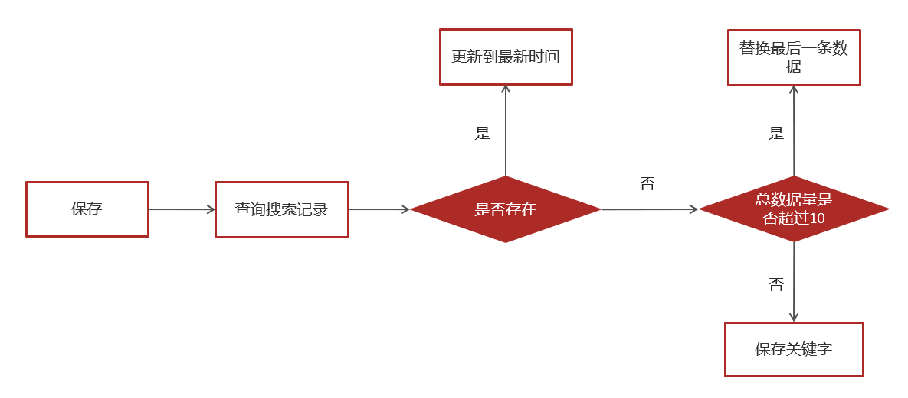

# 黑马头条

### docker

下载镜像：

```shell
docker pull zookeeper:3.4.14
docker run -d --restart=always --name zookeeper -p 2181:2181 zookeeper:3.4.14
docker pull wurstmeister/kafka:2.12-2.3.1
docker run -d --restart=always --name kafka \
--env KAFKA_ADVERTISED_HOST_NAME=39.101.77.189 \
--env KAFKA_ZOOKEEPER_CONNECT=39.101.77.189:2181 \
--env KAFKA_ADVERTISED_LISTENERS=PLAINTEXT://39.101.77.189:9092 \
--env KAFKA_LISTENERS=PLAINTEXT://0.0.0.0:9092 \
--env KAFKA_HEAP_OPTS="-Xmx256M -Xms256M" \
--net=host wurstmeister/kafka:2.12-2.3.1

docker pull elasticsearch:7.4.0
docker run -id --name elasticsearch -d --restart=always -p 9200:9200 -p 9300:9300 -v /usr/share/elasticsearch/plugins:/usr/share/elasticsearch/plugins -e "discovery.type=single-node" elasticsearch:7.4.0

docker pull mongo
docker run -di --restart=always --name mongo-service --restart=always -p 27017:27017 -v ~/data/mongodata:/data mongo
```

```shell

cd /usr/share/elasticsearch/plugins
mkdir analysis-ik
cd analysis-ik
#root根目录中拷贝文件
mv elasticsearch-analysis-ik-7.4.0.zip /usr/share/elasticsearch/plugins/analysis-ik
#解压文件
cd /usr/share/elasticsearch/plugins/analysis-ik
unzip elasticsearch-analysis-ik-7.4.0.zip
```


## 相关注解

### springboot启动

```java
@SpringBootApplication
@EnableDiscoveryClient
@MapperScan("com.heima.user.mapper")
public class UserApplication {

    public static void main(String[] args) {
        SpringApplication.run(UserApplication.class,args);
    }
}
```

- `@SpringBootApplication` 标记启动项
- `@EnableDiscoveryClient` ：应用程序将被注册为服务发现的客户端，可以与注册中心进行交互并使用服务注册表中的服务实例。（也可以使用nacos 或eureka 在yml中配置地址和属性）

- `@MapperScan`：告诉 MyBatis 框架扫描指定包下的接口，以便生成对应的实现类，实现与数据库的交互。

### controller 相关

```java
@RestController 
@RequestMapping("/api/v1/login") 
public class ApUserLoginController {

    @PostMapping("/login_auth")
    public ResponseResult login(@RequestBody LoginDto dto) {
        return null;
    }
}
```

- `@RestController` 等同于@Controller与@ResponseBody两个注解组合功能
  - `@ResponseBody`方法的返回值为对象，会将对象转换成JSON响应给前端
- `@RequestMapping` 前端发送的请求路径映射的控制器
-  `@PostMapping` 当前控制器方法请求访问路径与请求动作，每种对应一个请求动作 有post、get、delete、put对应的mapping；
  -  `@RequestBody` 接受请求体中的json数据；将请求中请求体所包含的数据传递给请求参数


## 其他

### MyBatis Plus 使用流程

1. **引入依赖：** 在 Maven 或 Gradle 中引入 MyBatis Plus 的依赖，例如：

```xml
<dependency>
    <groupId>com.baomidou</groupId>
    <artifactId>mybatis-plus-boot-starter</artifactId>
    <version>${mybatis-plus.version}</version>
</dependency>
```

1. **配置数据源和 MyBatis Plus：** 在配置文件中配置数据源和 MyBatis Plus 的相关信息，例如：

```properties
# 数据库配置
spring.datasource.url=jdbc:mysql://localhost:3306/mydb
spring.datasource.username=root
spring.datasource.password=password
spring.datasource.driver-class-name=com.mysql.cj.jdbc.Driver

# MyBatis Plus 配置
mybatis-plus.mapper-locations=classpath*:/mapper/*Mapper.xml
```

1. **定义实体类：** 创建一个实体类，用于表示数据库中的表结构。可以使用 MyBatis Plus 提供的注解简化配置，例如：

```java
import com.baomidou.mybatisplus.annotation.TableId;
import com.baomidou.mybatisplus.annotation.TableName;
import lombok.Data;

@Data
@TableName("user")
public class User {
    @TableId
    private Long id;
    private String username;
    private String email;
    // 其他属性...
    // 省略构造方法、Getter和Setter等...
}
```

1. **定义 Mapper 接口：** 创建一个接口继承 `BaseMapper`，并指定实体类的类型。可以直接使用 MyBatis Plus 提供的通用方法，也可以自定义 SQL 语句。

```java
import com.baomidou.mybatisplus.core.mapper.BaseMapper;

public interface UserMapper extends BaseMapper<User> {
    // 可以定义自定义的查询方法
    User getUserById(Long id);
    void insertUser(User user);
    void updateUser(User user);
    void deleteUser(Long id);
    // 其他操作...
}
```

1. **使用 Mapper 接口：** 在服务层或控制器中注入 Mapper 接口，调用其中定义的方法进行数据库操作，例如：

```java
@Service
public class UserService {
    @Autowired
    private UserMapper userMapper;
    
    public User getUserById(Long id) {
        return userMapper.selectById(id);
    }
    
    public int insertUser(User user) {
        return userMapper.insert(user);
    }
    
    // 其他操作...
}
```

### 工程结构


- controller 业务控制器，调用service中的方法 
  - 
- service 业务层，具体功能实现
- mapper 持久层mybatis开发

### ResponseResult的封装

定义了各种场景下的code 的枚举类；并封装了响应的方法；

```java
public class ResponseResult<T> implements Serializable {

    private String host;

    private Integer code;

    private String errorMessage;

    private T data;

    public ResponseResult() {
        this.code = 200;
    }
   ...
   }
```

### SWagger

用于生成接口文档，方便前后端对接

### feign 的使用

feign封装了网络通信的功能，可以对其他微服务或controller发送对应的请求，从而将不同数据库或不同对象的数据结合起来。

比如自媒体微服务对文章进行了增改，但是文章config相关的表在文章微服务中，可以在完成了文章内容审核后，通过feign远程调用文章微服务的保存方法：

```java
//文章微服务中feign的 ArticleClient
@RestController
public class ArticleClient implements IArticleClient {

    @Autowired
    private ApArticleService apArticleService;

    @Override
    @PostMapping("/api/v1/article/save")
    public ResponseResult saveArticle(@RequestBody ArticleDto dto) {

        return apArticleService.saveArticle(dto);
    }

}

// 和controller很像，但可以包装返回
```

在进行文章生成模板html上传minio后，再通过feign将生成的article_id返回回自媒体微服务中进行保存（因为自媒体微服务在没发表出去的文章是没有articleid的）。


## 业务结构

#### 

主要分为用户app端，自媒体端（发布文章），管理员端（审核等）

#### 用户app端

##### 


## 业务问题

### other


- 当后端响应给前端的数据中包含了id或者特殊标识（可自定义）的时候，把当前数据进行转换为String类型
- 当前端传递后后端的dto中有id或者特殊标识（可自定义）的时候，把当前数据转为Integer或Long类型。

在这过程中long类型会精度丢失，用jackson进行序列化和反序列化解决


## 业务流程

### redis 实现定时文章发布和分布式锁

- redis缓存短期内将要发布的文章
- 出于安全考虑，需要将定时任务存在持久化数据库中
- 将持久化的数据库数据同步到redis缓存中


- list存立即执行任务，zset存放未来5分钟内的任务，大于5分钟的任务存在数据库中定时刷新zset；

##### 为什么需要zset和list两种数据结构？

和效率有关，因为redis中的list执行LPUSH出消息队列的复杂度是O(1)，而zset执行zadd时间复杂度是O(M*(logn))，执行时间任务次数随数据规模变化；

因此可以按粗粒度的刷新用一次性刷新一分钟的任务到list队列，效率更高；list每秒刷新任务时间是否小于当前时间来发布文章。

而数据库中可以按5分钟一次的频率将持久化数据同步到zset中。

##### mysql 记录任务

记录缓存到redis的任务和任务日志

##### 添加任务

- 获取5分钟后的时间，如果任务执行时间（发布时间）小于当前时间，放入list；
- 如果大于当前时间小于5分钟，放入zset，zset每分钟刷新任务到list中

##### 取消任务

更新mysql 任务日志，删除redis的数据，将对应key 的TTL置0

##### 消费任务

list lRightPop出队列，更新数据库任务日志


##### 定时任务


将zset的数据按分值(执行时间的值倒排)查出，并将数据用scan管道存到list，减少连接的时间消耗。

##### 分布式锁


用setNX来保证两台定时刷新的微服务，设置key成功表示加锁成功


### ES 搜索

#### 新增文章自动审核构建索引


新增文章审核通过后用kafka发送消息，搜索微服务接收消息将文章相关的数据添加到索引库中。

- 文章微服务：已知文章id，根据id获取文章的数据，文章内容通过模板生成html，将html上传到minio中，并修改article表的static_url字段做映射，发送消息告诉搜索微服务用es创建索引，`kafkaTemplate.send(Kafka_topic，文章内容dto);`
- 搜索微服务：定义对文章微服务的kafka监听，接受kafka_topic消息，`@KafkaListener(topics = ArticleConstants.ARTICLE_ES_SYNC_TOPIC)`; es保存索引数据；

#### 搜索记录

用户的搜索记录，需要给每一个用户都保存一份，数据量较大，要求加载速度快，通常这样的数据存储到**mongodb**更合适，不建议直接存储到关系型数据库中

#### 实现思路

##### 异步保存搜索记录到mongodb

在搜索微服务中调用保存历史记录的方法，并且是异步调用保存关键字到mongodb。


用户输入关键字进行搜索的异步记录关键字



1.查询当前用户的搜索关键词，按时间倒序排

2.存在 更新创建时间

3.不存在，判断当前历史记录总数量是否超过10，超过10条替换时间最长的即最后一条数据

##### 用户加载历史记录

按时间倒排mongodb的所有关键字，显示当前用户的搜索记录

#### 关键字联想——模糊查询

根据用户输入的关键字展示联想词；从关键字相关的词库获取（第三方/自己维护）


### 定时热点计算


- 在文章微服务中查询前5天的文章数据列表
- 遍历文章，按权重计算文章分值，获得带有分值的文章列表
- 用feign获得自媒体微服务中的频道列表，对每隔频道按分值排序取前30的作为热点文章，存入redis
- redis 格式`key：频道id   value：30条分值较高的文章id`
- 对推荐页取全部频道的30篇存入redis，key为推荐页id

#### 定时分布式任务

集成xxl-job，路由策略为轮询路由，定时每日凌晨00：00；


### 实时计算热点

- 创建kstream对象，同时指定从哪个topic中接收消息，根据value进行聚合分组，返回处理后的结果


#### 更新用户行为和文章config

- 保存行为信息的对象mess，
- redis 中缓存有用户行为的键值对：key:  行为+文章id，feild： 用户id， value： 行为对象数据

```java
acheService.hPut(BehaviorConstants.LIKE_BEHAVIOR + dto.getArticleId().toString(), user.getId().toString(), JSON.toJSONString(dto));
```

- 将行为信息对象 放入kafka stream中做聚合处理

```java
//发送消息，数据聚合
kafkaTemplate.send(HotArticleConstants.HOT_ARTICLE_SCORE_TOPIC,JSON.toJSONString(mess));
```

#### 使用kafkaStream实时接收消息，聚合内容

实体类ArticleVisitStreamMess，用于聚合之后的分值封装

```java
@Data
public class ArticleVisitStreamMess {
    /**
     * 文章id
     */
    private Long articleId;
    /**
     * 阅读
     */
    private int view;
    /**
     * 收藏
     */
    private int collect;
    /**
     * 评论
     */
    private int comment;
    /**
     * 点赞
     */
    private int like;
}
```

- kafka监听接收消息并聚合处理，更新redis中的热点文章分值，并重新排序

  


