# 用户app端

## 登录

### 登录加盐加密

md5(paddword + salt)；随机生成字符串+密码 再经过md5加密；

- 登录校验成功返回**基于当前用户ID生成的JWT**
- 游客访问 返回0

```java
 //1.3 返回数据  jwt
Map<String, Object> map = new HashMap<>();
map.put("token", AppJwtUtil.getToken(apUser.getId().longValue())); //根据用户id生成token传回前端
map.put("user", apUser);
return ResponseResult.okResult(map);
```

JWT是用jsonWebToken的工具包根据用户id生成的

## 全局过滤器实现jwt校验

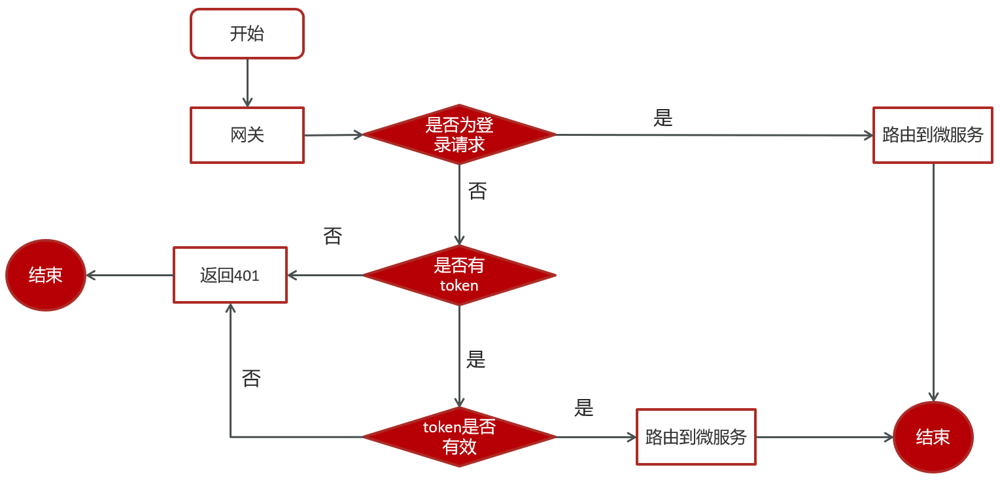

用户进入网关过滤器进行判断

- 如果是登录，则直接路由到微服务；

- 如果不是登入则**判断是否有jwt token并判断token 是否过期**；token有效路由到微服务；

## 加载文章 - 文章微服务

获取请求参数，下拉加载最新，上拉加载更多；sql条件查询根据最大时间和最小时间分别设置最新和更多。在mapper 中配置加载更多和加载最新的sql，加载更多就是改变查询size的大小，查询语句是limit size 条记录

## freemarker 实现静态文章页面的生成并传入minIO

### freemarker

模板文件中，用${} 获取json对象或逻辑运算；

在springboot中，创建freemarker模板对象获取模板(xxx.ftl)，将需要填充的文章内容等信息存入map对象中，传入freemarker.process()中进行渲染生成静态文件。

#### minIO

有bucket 文件系统目录、Object 文件

有封装好的上传图片文件方法、上传html文件方法(uploadHtmlFile)、删除下载文件方法

#### 文章预缓存

在文章微服务下，通过mybatis 查询文章id获得文章内容用freemarker生成静态html，将html上传到minIO中并保存文件在minIO的静态地址，更新表。


## 保存文章

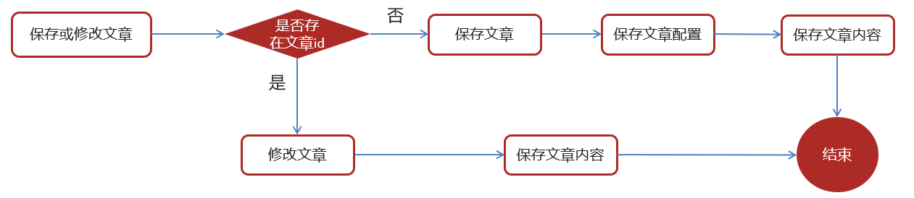

经过异步自动审核后从自媒体微服务传来的文章信息，判断是否存在文章id来判断修改还是新增。

获取文章Dto对象，如果id为null，则有新建文章对象自动生成的文章id；如果有id，则复制到文章对象。分别保存文章内容和文章信息(分表)。


# 自媒体端

## 素材管理

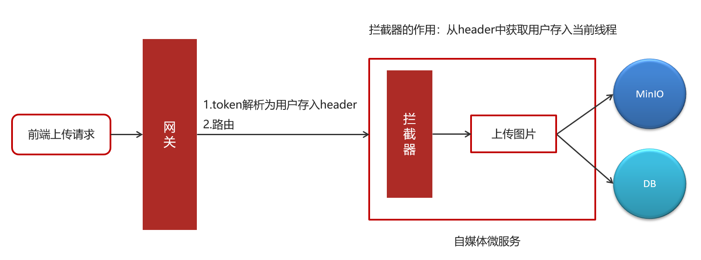

前端请求经过网关验证和路由，将请求中的token解析出userid，通过拦截器将用户信息存入threadLocal中方便读取。

定义了ThreadLocal<WmUser> 保存用户信息的线程，包含增删查用户的**静态方法**；在自媒体微服务中设置拦截器intercepter，根据用户id 获得用户对象，将用户对象保存在线程中，请求结束后销毁。

**为什么保存在线程中？** 保证不同用户之间相互独立；避免过多的参数传递；多线程下保证线程安全

#### 上传素材

将图片上传到minIO，为了防止文件名重名，UUID拼接；数据库实现增操作，保存素材信息

#### 查素材

按是否收藏和时间倒序条件查询用户的素材列表

## 文章管理

### 文章发布

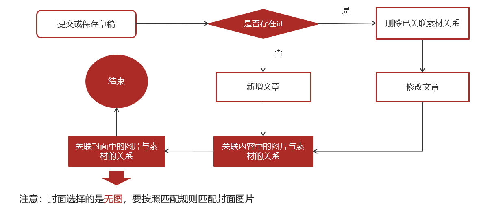

判断是新增文章还是修改文章，文章id是文章审核通过后发布到app端才生成的。

- 有文章id则为修改文章，重置文章与图片素材的映射关系
- 无文章id则为新增文章，关联文章与图片素材的映射关系


将发布文章的操作异步集成到延迟任务队列中，

- feign远程调用定时刷新微服务的添加任务方法，定时微服务会维护redis中的延迟任务
  - 数据库每5分钟同步任务到zset
  - zset每分钟同步任务到list
- 自媒体微服务每秒刷消费消费任务模块，远程调用定时微服务中的list队列的任务信息拿到文章信息，实现发布；
- 同步文章信息到es索引库

## 自动审核

通过feign 远程调用文章微服务保存文章，保存成功返回文章id，**开启异步审核**

通过第三方阿里云接口实现内容的审核。

- 先审核文章标题和内容
- 图片从minIO下载后审核
- 修改文章审核状态，审核失败或不确定转人工审核

#### 服务降级

如果feign远程调用失败，则服务降级指向失败消息业务方法

@FeignClient(value = "leadnews-article",fallback = IArticleClientFallback.class)

#### 异步审核

在要自动审核的方法上加上**@Async** 并在自媒体引导类中使用 `@EnableAsync`

```java
@Override
@Async  //标明当前方法是一个异步方法
public void autoScanWmNews(Integer id) {
	//代码略
}
```


#### 自管理敏感词

使用DFA 确定有穷自动机实现，思想其实和字典树有点像：

扫描词库里的字符，除了根节点不存字符，后面每个节点存一个字符，敏感词尾存一个状态，遍历的时候，潘顿一个词检测到终止状态值是否有输出；

存储：一次性的把所有的敏感词存储到了多个map中，就是下图表示这种结构

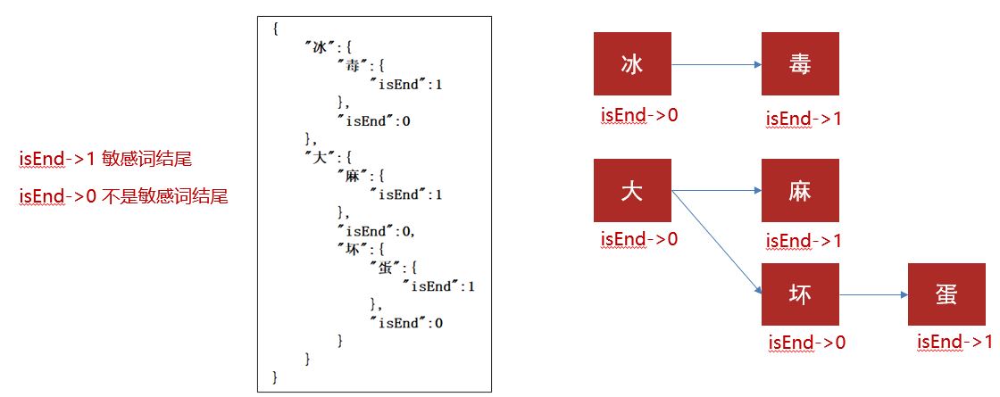

1、创建一个哈希表，作为该结构的空白根节点

2、遍历敏感词词库，得到一个敏感词字符串

3、遍历敏感词字符串，得到一个当前遍历字符

4、在树结构中查找是否已经包含了当前遍历字符，如果包含则直接走到树结构中已经存在的这个节点，然后继续向下遍历字符。

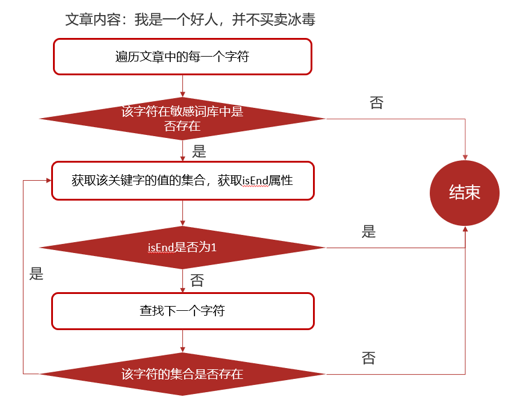

## 延迟任务精准发布文章

可以使用rabbitmq + ttl 死信交换机实现延迟消息，rabbitmq 对消息设置时间发送至ttl队列，过期消息会被发送至死信交换机，由交换机根据路由key转发到目标队列。

### redis实现延迟任务

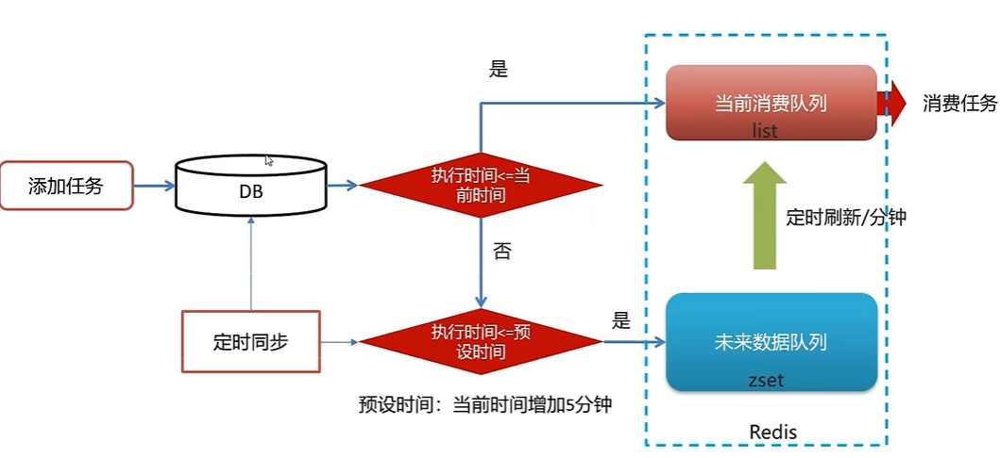

需要将定时任务持久化到数据库中，防止宕机等因素丢失内存中的任务数据；在redis中使用list和zset来实现延迟任务；

- list存立即执行任务，zset执行未来的任务
- 任务量过大，zset性能会下降
  - list插入数据是LPUSH, O(1)
  - zset 是zadd, 底层是hash表和跳表实现，hash表存key-value；跳表维护排序；O(M*log(n))，M是批量存的key，N是全部Key，根据score二分查找插入的位置
  - 跳表每个节点包含多个跨度的指针，可以通过高层指针跨越多个节点再用双向指针找目标节点

因此可以按粗粒度的刷新用一次性批量刷新一分钟的任务到list队列，效率更高；list实时刷新任务时间是否小于当前时间来发布文章。

而数据库中可以按5分钟一次的频率将持久化数据同步到zset中。从数据库中拿任务，悲观锁则取任务id作为锁key；乐观锁则用版本号法，通过比较取数据前后version的值；

#### 消费任务

从redis中的topic key的list中LPOP得到任务id，更新数据库任务日志，返回任务信息找到

### 未来数据定时刷新

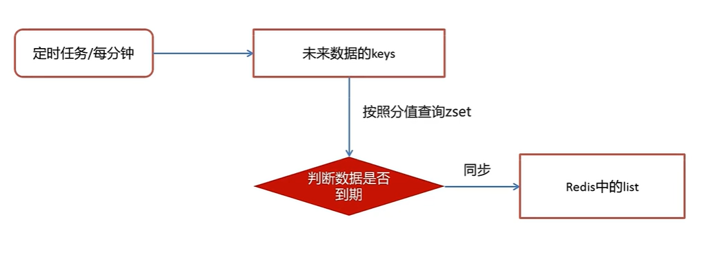

设置两个定时刷新任务

- 每分钟将zset的数据按分值(执行时间的值倒排)查出小于当前时间的任务，并将任务用scan管道同步到list，减少连接的时间消耗。删除zset，lpush list；

- 数据库每5分钟刷新一次将小于五分钟的任务同步到zset；zadd + 5min

##### redis setNX 实现分布式锁

分布式下有多个定时微服务，有多个zset同步list的定时刷新任务，保证数据redis中任务的数据一致性，对不同的刷新任务微服务加锁：

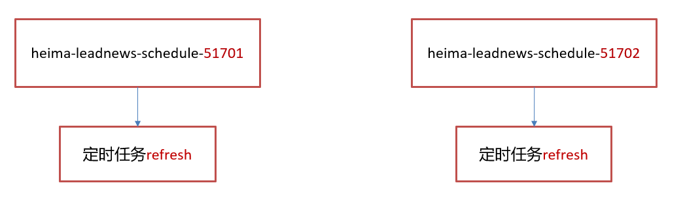

用setNX 设置zset同步list方法的分布式key；

## kafka 异步通知文章上下架

在自媒体微服务根据文章id获得文章信息，发布的文章才有上下架功能；发布文章审核通过后自动发消息给文章微服务修改文章配置 上架字段；手动下架发送通知修改两边表的信息。

文章微服务设置kafka监听，修改文章配置中的上下架字段。


# app端

## 文章es搜索

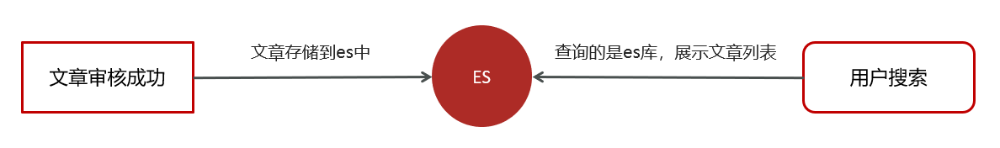

文章审核通过发布前，还需要将文章的信息存储到es索引库；

- 审核通过后上传html到minIO并将文章信息用kafka传到搜索微服务
- 搜索微服务用kafka监听到文章信息，并更新索引库

文章es搜索，设置es的搜索条件，对关键字分词后查询按照发布时间倒序分页显示，高亮关键字

## 搜索记录-关键字联想

mongoDB是文档型数据库，以二进制JSON存储数据；

输入搜索关键字，异步保存搜索记录和用户id到mongoDB；保存用户的十条搜索记录，如果超过十条则按时间排序更新时间最小的记录。

维护mongoDB的联想词表，进行模糊查询

## 定时计算文章热度

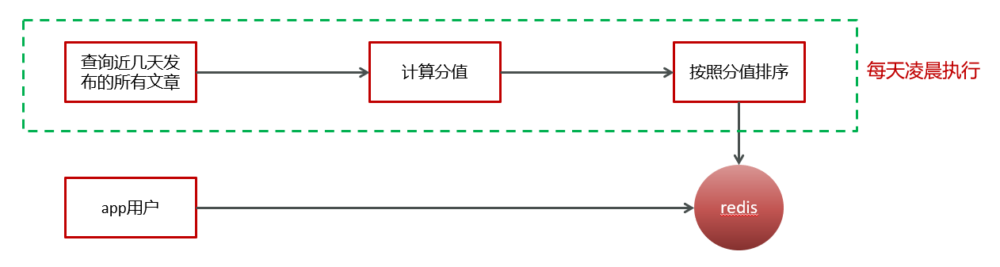

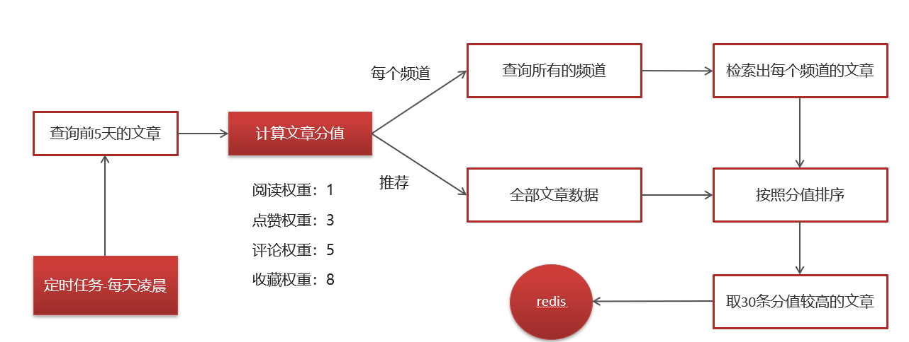

xxljob 定时框架替代@Schedule

#### 更新用户行为和文章config

- 保存行为信息的对象mess，
- redis 中缓存有用户行为的键值对：key:  行为+文章id，feild： 用户id， value： 行为对象数据

```java
acheService.hPut(BehaviorConstants.LIKE_BEHAVIOR + dto.getArticleId().toString(), user.getId().toString(), JSON.toJSONString(dto));
```

- 将行为信息对象 放入kafka stream中做聚合处理

```java
//发送消息，数据聚合
kafkaTemplate.send(HotArticleConstants.HOT_ARTICLE_SCORE_TOPIC,JSON.toJSONString(mess));
```

#### 使用kafkaStream实时接收消息，聚合内容

实体类ArticleVisitStreamMess，用于聚合之后的分值封装

```java
@Data
public class ArticleVisitStreamMess {
    /**
     * 文章id
     */
    private Long articleId;
    /**
     * 阅读
     */
    private int view;
    /**
     * 收藏
     */
    private int collect;
    /**
     * 评论
     */
    private int comment;
    /**
     * 点赞
     */
    private int like;
}
```

- kafka监听接收消息并聚合处理，更新redis中的热点文章分值，并重新排序

  


