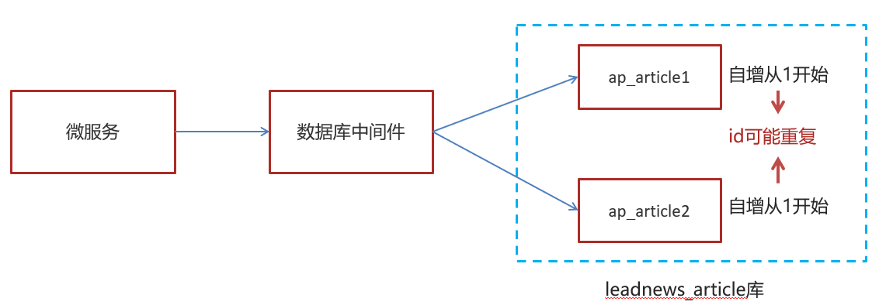

# 业务结构

## 系统  

主要分为用户app端，自媒体端（发布文章），管理员端（审核等）

### 网关

核心功能：

- **权限控制**：作为微服务的入口，校验用户是否有请求资格，没有则进行拦截
- **路由和负载均衡**：一切请求经过网关，不处理具体业务，而是根据规则把请求转发到某个微服务；
- **限流**：请求流量过高限流放行

项目中会对每个微服务设置网关：

用户端网关、自媒体网关、管理网关

#### 注册中心-nacos

在springcloud框架中，对应的微服务网关开启注册中心：启动类上加@EnableDiscoveryClient  

如在app端开启：yaml中设置application名：`name: leadnews-app-gateway`，在nacos中配置yaml，如请求类型，路由地址设为uri: lb://leadnews-user

在nacos设置数据库、mybatis(扫描mapper.xml 和pojo)、redis、kafka、es

### 分布式ID

因为对数据库进行了分库分表，不同微服务中的表主键自增，可能导致重复的id，因此需要使用分布式id，可以使用redis生成，本项目是用mybatis里的雪花算法自动生成；雪花算法就是64位中第一位0符号位，41毫秒时间戳，10位机器id，12位1毫秒内生成序列号；后12位1毫秒可生成4096个序列号

## 用户App

### 用户表结构

| **表名称**       | **说明**          |
| ---------------- | ----------------- |
| ap_user          | APP用户信息表     |
| ap_user_fan      | APP用户粉丝信息表 |
| ap_user_follow   | APP用户关注信息表 |
| ap_user_realname | APP实名认证信息表 |

#### ap_user

主要是记录用户信息，重要字段有 自增主键id、salt 密码加盐、用户名和密码、电话号等信息，用户实名认证；flag标记普通用户/大V；

#### Article

##### ap_article

记录文章列表页显示的基础信息：标题、作者、时间、频道、点赞、收藏等；

##### ap_article_content 

文章内容表: 主键、文章id、文章内容，对文章id创建了索引，文章id是bigint

##### ap_article_config  

文章配置表：文章id、是否发布、是否下架等，对文章id创建了索引

##### 表的拆分-垂直分表

将一个表的字段分散到多个表中，每个表存一部分字段

1. 把不常用的字段单独放在一张表;
2. 把text，blob等大字段拆分出来放在附表中;
3. 经常组合查询的列放在一张表中;

**水平分表**是在同一个数据库内，把同一个表的数据按一定规则拆到多个表中。

### 业务功能

- 登录：加盐校验返回jwt token

- 全局请求过滤实现jwt校验： 判断是否有jwt token并判断token 是否过期

- 加载文章，上拉加载更多文章(加载分页)，下拉加载最新文章(sql 加载发布时间最大的文章)；
  - 切换频道查看不同类目的文章(sql 条件查询)
- freemarker 实现静态文章页面的生成(文章内容大字段填充)，将html存入minI并保存静态地址
  - 异步上传，减少渲染和用户等待时间
- 保存文章，自媒体微服务传来文章信息，有无文章id判断修改还是新增，保存文章表信息，**异步**调用freemarker生成静态文件；

## 自媒体 Wemedia

包含自媒体微服务和自媒体网关微服务

### 表结构

| wm_material      | 素材表；用户id、图片地址、是否收藏             |
| ---------------- | ---------------------------------------------- |
| wm_channel       | 文章频道信息；频道描述                         |
| wm_news          | 新闻文章信息；标题，内容，图片，状态，定时发布 |
| wm_news_material | 文章素材关系表；文章id-素材id                  |

### 业务功能

- 设置拦截器，保存自媒体微服务的请求中的用户信息到ThreadLocal中，保证不同用户线程独立和用户信息参数传递；

- 素材管理 ，上传图片到minIO，数据库增操作；按用户是否收藏和时间倒序查素材列表
- 文章管理
  - 根据文章频道条件查询文章
  - 根据搜索词模糊查询文章
  - 发布文章，通过是否有文章id来判断是新增文章还是修改文章；异步发布，远程调用定时服务消费任务
- 异步文章审核
  - 通过feign 远程调用文章微服务的保存文章方法并返回文章id（如果新增）
    - 服务降级处理，如果远程调用不了文章微服务，feign 降级返回失败消息
  - **保存成功则开启异步审核**，调用阿里云接口审核图片和文本，修改审核状态；
  - 审核通过则通过kafka通知文章微服务可以发布文章(修改发布状态)

- 自管理敏感词 DFA/字典树
- 延迟任务精准发布文章，维护定时微服务，添加任务持久化到mysql，每5分钟同步到zset，每分钟同步到list；

- kafka 异步通知文章上下架，文章配置kafka监听

## APP

### 业务功能

- 文章es搜索
- 搜索记录-关键字联想；存在mongoDB中
- 排行榜，定时计算文章热度，推荐热点文章：用户行为封装到行为DTO中发送到kafka 的热度计算Topic中，监听消息后用kafka传送行为信息到文章微服务，根据文章的不同行为权重计算文章得分；重新查询热门文章并将得分30的文章列表缓存到redis中，如果存在该文章，则更新得分值；

## 平台管理端

- 频道管理
- 敏感词管理
- 文章审核

## 用户行为

用户行为包含关注、点赞、收藏、阅读、评论、不喜欢，都有对应的DTO，产生的行为会先保存在redis中，比如点赞信息，Operation 0表示取消点赞，1表示点赞，保存LIKE-BEHAVIOR+文章id.userID作为key，行为dto作为值；行为dto包含一篇文章以上行为的信息，最后会**发送行为dto到kafka的热点文章得分Topic队列中进行热度计算**。

