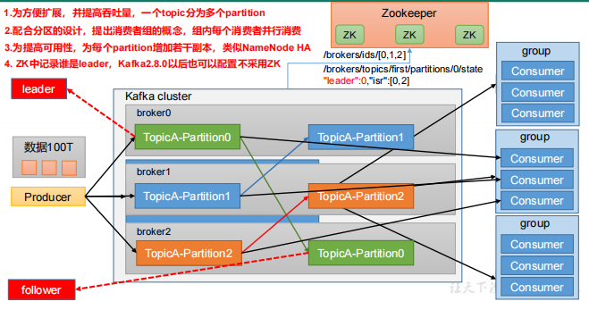

# kafka基础

## 基础架构

- producer：发布消息的对象称之为主题生产者（Kafka topic producer），向kafka broker 发消息
- topic：Kafka将消息分门别类，每一类的消息称之为一个主题（Topic），理解为一个队列
- consumer：订阅消息并处理发布的消息的对象称之为主题消费者（consumers），向kafka broker 获取消息
- broker：一台borker就是一台服务器。已发布的消息保存在一组服务器中，称之为Kafka集群。消费者可以订阅一个或多个主题（topic），并从Broker拉数据，从而消费这些已发布的消息。
- **Consumer Group（CG）**：消费者组，由多个 consumer 组成。**消费者组内每个消费者负责消费不同分区的数据，一个分区只能由一个组内消费者消费；消费者组之间互不影响。**所有的消费者都属于某个消费者组，即**消费者组是逻辑上的一个订阅者**。
- partitioin：为了实现扩展性，一个非常大的 topic 可以分布到多个 broker（即服务器）上，**一个** **topic** **可以分为多个** **partition**，每个 partition 是一个有序的队列。（100T数据在topicA中放不下，放在多个服务器上同一个主题的不同分区中）
- replica：副本。一个 topic 的每个分区都有若干个副本，一个 **Leader** 和若干个**Follower**。
- leader：每个分区多个副本的“主”，生产者发送数据的对象，以及消费者消费数据的对象都是 Leader。
- follower：每个分区多个副本中的“从”，实时从 Leader 中同步数据，保持和Leader 数据的同步。Leader 发生故障时，某个 Follower 会成为新的 Leader
- **zookeeper**：记录集群中哪些broker在服务，记录leader副本的信息

> kafka有生产者和消费者在两端，消息队列：broker-topic-partition，一个服务器broker可以存放多个topic，每个topic可以分区成多个partition；
>

## kafka有什么功能？

- 消息队列
- 持久化消息流
- 流式处理平台

### 应用场景

- 消息队列
- 异步通信
- 实时数据流处理

## kafka相比其他消息队列的优势？

- 吞吐量高
- 生态系统好
- 多分区（负载均衡）多副本（数据一致性）

## Kafka的队列模型是什么？

订阅发布模型，topic和partition实现队列的功能

## Kafka的多副本机制是什么？

就是备份机制；topic的多个分区可用分布在不同的broker中，每个分区有消息的备份为replica 副本，分为leader 副本和 follow 副本；消息会被发送到leader副本做交互，follow 副本做同步备份；有点主从复制的思想；follow副本分为ISR副本和普通副本，ISR是和leader做同步的，普通副本可能存在一定的延时；

当leader发生故障时，会从副本follow 中选出新leader，从ISR可用副本选一个当leader，ISR不行则普通副本选举。

副本都失效的情况下：

- 高一致性：只选ISR，副本都失效等待ISR复活；
- 高可用性：ISR和普通副本最先复活的当leader

### ACK机制

发送消息后什么时候写下一条消息，0 直接写；1 等leader写成功回传成功ack信息再写；all 等所有副本也写成功再写下一条

| **确认机制**     | **说明**                                                     |
| ---------------- | ------------------------------------------------------------ |
| acks=0           | 生产者在成功写入消息之前不会等待任何来自服务器的响应,消息有丢失的风险，但是速度最快 |
| acks=1（默认值） | 只有集群首领节点收到消息，生产者就会收到一个来自服务器的成功响应 |
| acks=all         | 只有当所有参与赋值的节点全部收到消息时，生产者才会收到一个来自服务器的成功响应 |

## Zookeeper的作用？

主要提供kafka的管理功能

- broker注册：有专门记录broker的表
- topic注册：记录一个topic多个分区分布在broker的信息
- 负载均衡：指定topic的不同partition

## kafka是怎么写入消息的？

1. 从zookeeper获取leader的位置（哪个broker哪个topic哪个partition）
2. 发送消息给leader，并写入本地log
3. follow 同步信息并写入本地log
4. leader接收到所有ISR的ACK后，向生产者返回ack

## kafka怎么消费消息的？

rabbitMQ采用推模式，将消息推给消费者，消息状态由消息队列记录；

kafka是拉模式，消息状态由消费者记录，消费者互相独立地拉取每个分区的消息；

kafka可以根据自己的offset决定消费顺序，如重置旧offset可以重新消费之前的消息，跳到最近的位置消费最新消息 ；

### 读取消息

根据offset找到存储数据的segmnet，根据segment的offset读取消息

### 消费流程

消费者加入消费者组，获取分配的分区对应的leader位置和offset，拉取数据，并提交offset

## kafka的数据存储形式-持久化

partition-segment-（index、log、timeindex）

1. 消息数据的持久化：将topic和partition写入磁盘的日志文件中，每个分区对应一个log，每条消息在日志中都有唯一offset；支持消息压缩和索引；
2. 消费者组的offset持久化：kafka的消息状态由消费者自己管理，因此由ZK或新版的comsumer_offsets主题来存储消费者组的offset。

### 日志压缩、删除

- 删除

定期自动删除日志；超过存储阈值删除；

- 日志压缩

  按照消息的key进行压缩整合，如果有相同key的不同value值，只保留最新版本

## Kafka消费顺序、消息丢失和重复消费怎么解决？

### 保证消费顺序

比如聊天业务场景，必须保证消息的顺序；

partition 是真正保存消息的地方，一个topic可以指定多个partition，因此为了**保证消息的顺序只需要将消息放在同一个分区就行**：

- 一个topic只有一个分区；
- 发送消息的时候指定 key/partition；（路由到相同key的分区）

> 消息在被追加到 Partition(分区)的时候都会分配一个特定的偏移量（offset）。偏移量（offset)表示 Consumer 当前消费到的 Partition(分区)的所在的位置。Kafka 通过偏移量（offset）可以保证消息在分区内的顺序性。

### 消息丢失怎么解决？

持久化机制、消息确认机制、偏移量追踪；分别在生产者部分、消费者部分、kafka中实现；

#### 生产者丢失消息

ACK确认机制：0是直接写消息，1是等leader写入成功回传ack，-1是等ISR都写入成功回传ack

生产者发送消息，为了判断消息是否成功发送到kafka，

- 异步：用回调函数接收异步发送是否成功的消息；发送失败则重发，重发有次数限制；
- 同步：发送消息后等待kafka返回结果

#### 消费者消息丢失

偏移量追踪：用ZK或新版consumer_offsets主题存储消费者组的偏移量信息

test_topic 有一个包含两个分区的消费者组 test_group，group包含A B两消费者；AB开始消费topic消息，会先从consumer_offsets 主题中获取偏移量，确定每个分区应该从那开始消费；

当A消费完一批消息，会手动提交已消费的offset到offsets主题更新。如果消费者故障重启，可以通过offsets主题获取偏移量信息知道哪些是已消费的消息，保证不会重复消费或丢失信息。

#### broker数据丢失

从follow选取ISR做新leader，持久化备份；

## kafka的幂等性

幂等性指重复同一个操作产生的影响是一样的；生产者生产消息如果多发了几次，可能导致消息重复，就不具备幂等性；

**如何保证？**

对每个生产者的消息使用PID（生产者id），并在partition中有递增的序列号记录；即每次发送消息会带有（pid，seq id），如果发生重发消息，找到pid对应发送的分区，如果消息seq id小于等于分区中的seqid则不保存

## kafka事务

生产者和消费者提交的offset操作是原子性的

