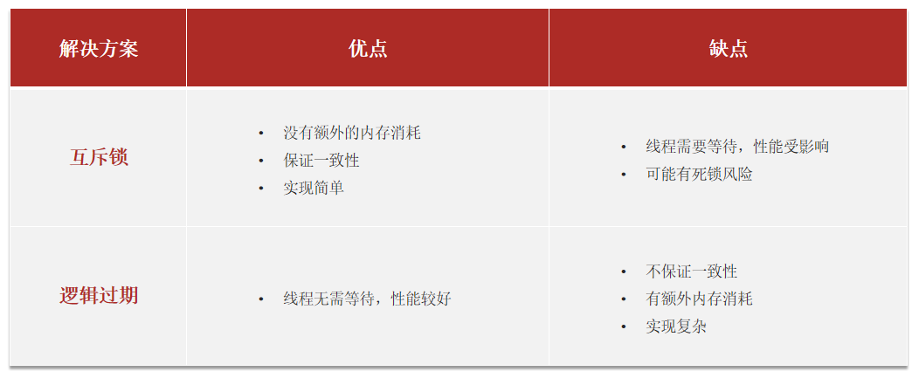

# 点评问题知识点

## 缓存更新策略


低一致性需求：使用内存淘汰机制，如店铺类型查询缓存

高一致性需求：主动更新，并以超时更新兜底；如商户详情查询的缓存；

## 数据库缓存不一致解决方案

在更新数据库的同时更新缓存；

- 删除缓存：更新数据库时让缓存失效，查询时再更新缓存 yes （直接更新无效写多）
- 先操作数据库再删缓存更好，因为缓存操作快可能数据库还没更新完，新来的查询命中缓存为空。

## 缓存穿透解决


缓存穿透 ：缓存穿透是指客户端请求的数据在缓存中和数据库中都不存在，这样缓存永远不会生效，这些请求都会打到数据库。

解决：对查询的key缓存空对象；布隆过滤，通过超大bit数组，基于hash思想判断key是否存在，由于hash冲突存在误判，但数据库中不存在的数据一定不存在，存在的hash冲突误判；

## 缓存雪崩问题


缓存雪崩是指在同一时段大量的**缓存key同时失效**或者**Redis服务宕机**，导致大量请求到达数据库，带来巨大压力。

解决方案：

* 给不同的Key的**TTL添加随机值**
* 利用Redis集群提高服务的可用性
* **给缓存业务添加降级限流策略**
* 给业务添加**多级缓存**

## 缓存击穿问题

缓存击穿问题也叫热点Key问题，就是一个被高并发访问并且缓存重建业务较复杂的key突然失效了，无数的请求访问会在瞬间给数据库带来巨大的冲击。

常见的解决方案有两种：

* 互斥锁
* 逻辑过期

* 

**互斥锁**

索引失效所以要重建索引，但对 `重建缓存任务` 加锁，防止多个线程去执行查询数据库重建缓存，会阻塞死锁

```java
String lockKey = "lock:shop:" + id;
 try {
            boolean isLock = tryLock(lockKey);
            // 4.2 判断否获取成功
            if(!isLock){
                //4.3 失败，则休眠重试
                Thread.sleep(50);
                return queryWithMutex(id);
            }
            //4.4 成功，根据id查询数据库
             shop = getById(id);
            // 5.不存在，返回错误
			 //6.写入redis        	stringRedisTemplate.opsForValue().set(key,JSONUtil.toJsonStr(shop),CACHE_NULL_TTL,TimeUnit.MINUTES);
 }...
finally {
            //7.释放互斥锁
            unlock(lockKey);
        }
```


**逻辑过期**

额外给添加redis的key设置过期时间(不用ttl)，如果过期则再开启独立线程后直接返回之前的数据，异步的更新缓存，单独开一个线程重置逻辑过期时间，缺点在于在构建完缓存之前，返回的都是脏数据


需要创建一个实体类放额外的逻辑时间

```java
@Data
public class RedisData {
    private LocalDateTime expireTime;
    private Object data;
}
```

将redis实体类 json存放再redis中

```java
 String key = CACHE_SHOP_KEY + id;
    // 1.从redis查询商铺缓存
    String shopjson = stringRedisTemplate.opsForValue().get(key);
    // 2.判断是否存在
		  // 3.存在，直接返回
	// 4.命中，需要先把json反序列化为对象
    RedisData redisData = JSONUtil.toBean(shopjson, RedisData.class);
	Shop shop = JSONUtil.toBean((JSONObject) redisData.getData(), Shop.class);
    LocalDateTime expireTime = redisData.getExpireTime();
 // 5.判断是否过期
    if(expireTime.isAfter(LocalDateTime.now())) {
        // 5.1.未过期，直接返回店铺信息
        return shop;
    }
    // 5.2.已过期，需要缓存重建
    // 6.缓存重建
// 6.1.获取互斥锁
    String lockKey = LOCK_SHOP_KEY + id;
    boolean isLock = tryLock(lockKey);
    // 6.2.判断是否获取锁成功
//6.3 异步创建线程重建缓存
if (isLock){
        CACHE_REBUILD_EXECUTOR.submit( ()->{

            try{
                //重建缓存
                this.saveShop2Redis(id,20L);
            }catch (Exception e){
                throw new RuntimeException(e);
            }finally {
                unlock(lockKey);
            }
        });
    }
    // 6.4.返回过期的商铺信息
```


