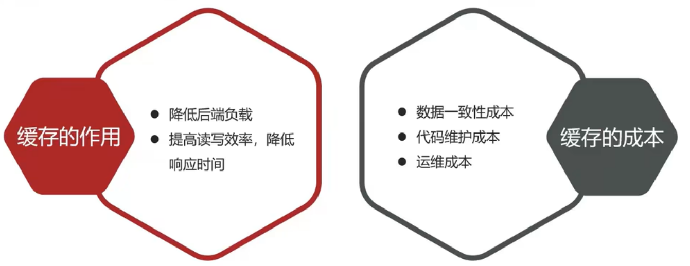
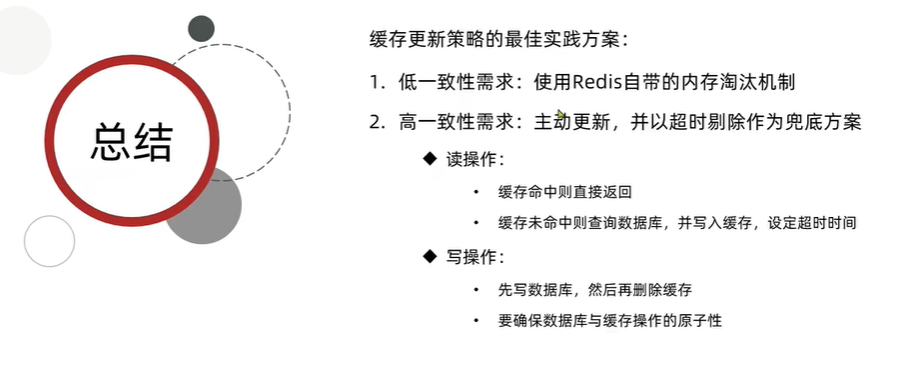
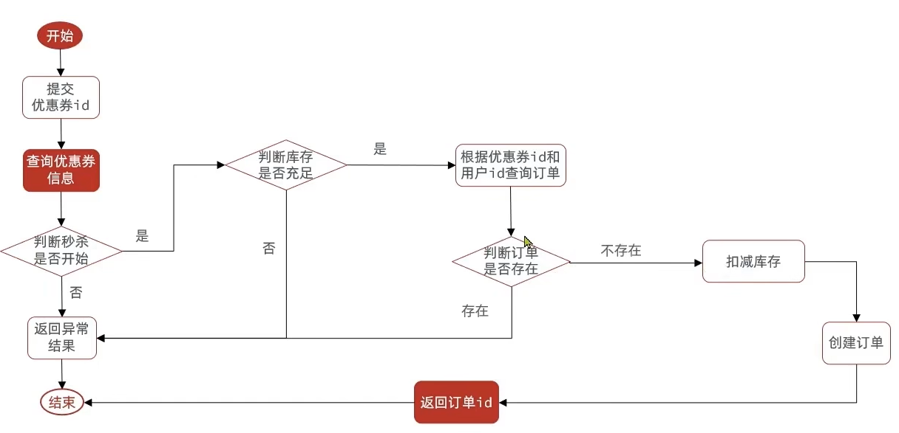

# 黑马点评

## 登录


将用户数据保存到redis，并且生成token作为redis的key，当我们校验用户是否登录时，会去携带着token进行访问，从redis中取出token对应的value，判断是否存在这个数据，如果没有则拦截，如果存在则将其保存到threadLocal中，并且放行。

- 手机号和密码验证通过，将用户信息保存在ThreadLocal中，实现线程隔离；
- 用redis的hash结构(key.field value) 替代session

### 刷新JWT token 有效期


拦截器中的请求获取token，判断redis中该用户(token) 有效期，有效则重置token时间放行，并保存用户到threadLocal。

## 商户查询缓存



### 添加商户缓存


根据商户id，先查看缓存中是否有商户id，有则直接返回，没有查询数据库后再将用户添加进缓存；

- 缓存使用保存key空值或布尔过滤，处理缓存穿透问题
- 给不同key设置随机TTL，给缓存业务添加降级和多级缓存，解决缓存雪崩问题
- 使用互斥锁(悲观锁) 或 逻辑过期（不删key查询时重置过期时间） 解决缓存击穿问题

### 缓存更新



## 优惠券秒杀

### 全局唯一ID

id自增太规律，单表容量过大分库分表后id不唯一；因此需要全局id-分布式id；

雪花算法或redis 拼接；

- 雪花算法：第一位符号位0；41位时间戳；10位机器ID；12位毫秒内序列ID

- 64位id：第一位符号位0，31位时间戳，32位秒内计数器id，1秒内生成2^32id;

### 添加优惠券

保存秒杀券信息，并保存库存到redis：key(秒杀业务前缀+券ID) : value(券库存)

```java
stringRedisTemplate.opsForValue().set(SECKILL_STOCK_KEY + voucher.getId(), voucher.getStock().toString());
```

### 秒杀下单



- 确定秒杀时间是否开始
- 确定库存是否充足
  - 充足 则库存-1，创建订单
  - 不足 返回异常
- 用户是否已有订单（一人一单）

#### 超卖问题解决

判断是否有库存的条件是stock > 0， （加乐观锁根据判断version = 1）

#### 一人一单

- **一人**。插入记录一次，对查询已有订单和创建订单方法加锁

判断用户是否已有订单，插入数据，并发下可能有多个插入线程，所以我们需要使用悲观锁操作只插入一次。对查询订单创建订单方法加锁，锁userID；

- **一单**。只能抢一张优惠券-分布式锁，看redis里是否有key ：`"order:" + userId`

**分布式场景下事务失效，需要使用代理获取原始的事务对象操作事务。**

#### 分布式锁

分布式场景下synchronized 只能锁本服务器上的对象，需要有分布式锁实现多进程可见互斥

- 手动建锁：使用setNX来控制分布式锁，并设置TTL，到期释放锁；

- 使用redission 获取分布式锁

### 使用消息队列异步秒杀

如果多线程异步，线程池很快耗光，用消息队列慢慢执行其他任务；

* 新增秒杀优惠券的同时，将优惠券信息保存到Redis中，如库存
* 基于Lua脚本，判断秒杀库存、一人一单，决定用户是否抢购成功
  * 查看库存key > 0；优惠券user set是否包含userID

  * 允许下单则将userID存入 user set

* 如果抢购成功，将优惠券id和用户id封装后存入消息队列
* 开启线程任务，不断从消息队列中消费信息，实现异步下单功能（待支付）


