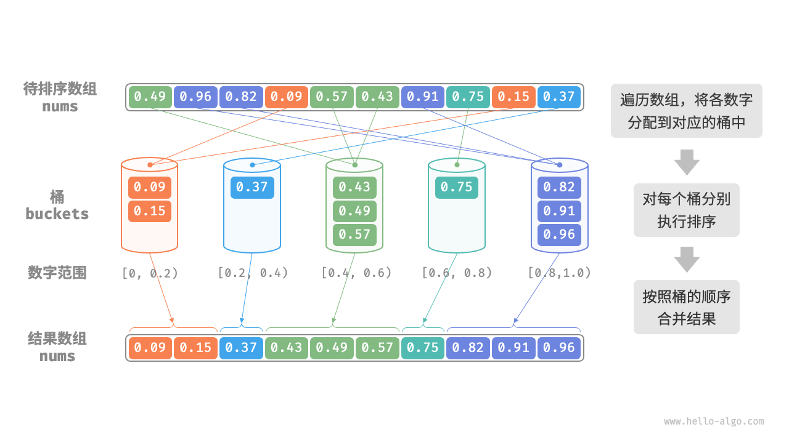
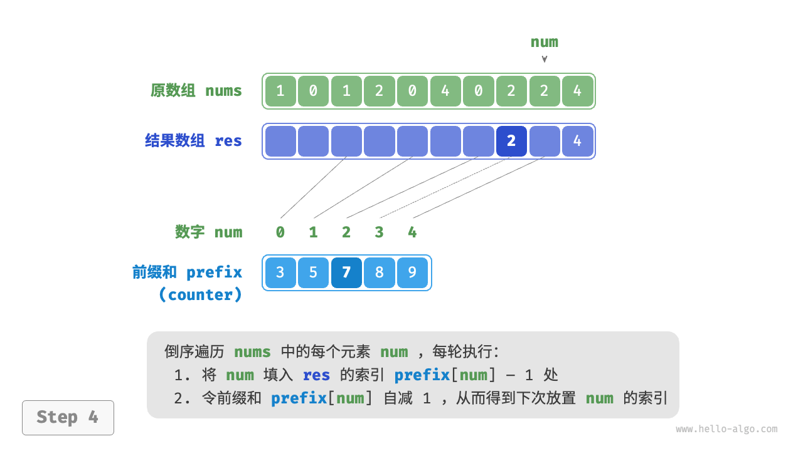
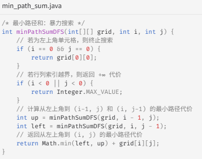

# 常用数据结构

## 数组常用

**创建数组4中方式**


3 是创建默认数组，只有三个占位符默认值0；

4 是利用ArrayList 变长数组；

**添加元素**

```java
arr.add(99);
arr.add(3,88);
```

默认将数据添加尾端，时间复杂度O(1); 指定下标添加元素O(n)；

**访问元素**

```java
c[1]
arr.get(1)
```

通过下标（索引）访问，访问是O(1)，因为是连续内存空间直接访问内存地址（偏移量）

**更新元素**

```java
c[1] = 11;
arr.set(1,11);
```

**删除元素**

```java
arr.remove(3);
```

O(n), 因为是连续内存，要向前移动操作

**数组长度**

```java
int cSize = c.length;
int arrSize = arr.size();
```

O(1), 内部有count变量维护

### 查找元素

```java
//c数组 for循环遍历

boolean is99 = arr.contains(99)；
```

### 数组排序


123方式创建的数组，用`Arrays.sort(c)`实现从小到大排序，ArrayList排序用 `Collections.sort(arr)`；

从大到小排序：

- c数组排完序后倒着读
- 转换int[] c转为 Integer[] c 后，用Arrays.sort(arr, Comparator.reverseOrder())；
- ArrayList从大到小：Collections.sort(arr, Collections.reverse());

## 链表

- 访问 O(N)
- 搜索 O(N)
- 删除 O(1)
- 插入 O(1)

**创建链表**

```java
LinkedList<Integer> list = new LinkedList<>();
```

**添加元素**

```java
list.add(1); // O(1)
list.add(2,99); //O(N)
```

**访问元素**

```java
int element = list.get(1);
```

**搜索元素**

```java
int index = list.indexOf(99);
```

**更新**

```java
list.set(2,99);
```

**删除**

```java
list.remove(2); //O(N)
```

**长度**

```java
=int len = list.size();
```

## 队列

**创建队列**

```java
Queue<Integer> queue = new LinkedList<>(); //队列插入删除操作多，适合链表；用ArrayList也可以
```

| **添加元素**     | queue.add(1);/queue.offer(1); |
| ---------------- | ----------------------------- |
| **获取顶端元素** | queue.peek();                 |
| **元素出队**     | queue.poll();                 |
| 判空             | queue.isEmpty();              |
| 长度             | queue.size();                 |

### 双向队列


## 栈


### 单调栈

496 **下一个更大元素**


除了O(n2)的暴力遍历，使用从下至上递减的单调栈；

- 如果左边值大于栈顶，则栈顶值弹出栈，直到遇到小于栈顶的值或栈空，该值存在hash的值为栈顶值，空则存-1
- 因为nums1是nums2的子集且无重复元素，这样nums1不用再遍历直接去hash表中取值；


## hashmap


## Set

Set特点：无序、不重复

主要作用：

- 检查某个元素是否存在
- 重复元素


### hashset


## 堆

```java
// 初始化小顶堆
Queue<Integer> minHeap = new PriorityQueue<>();
// 初始化大顶堆（使用 lambda 表达式修改 Comparator 即可）
Queue<Integer> maxHeap = new PriorityQueue<>((a, b) -> b - a);
/* 输入列表并建堆 */
minHeap = new PriorityQueue<>(Arrays.asList(1, 3, 2, 5, 4));
maxHeap.offer(4); // 入堆
peek = maxHeap.poll(); // 5出堆

```


## 红黑树

自平衡二叉树，根节点和叶子节点是黑节点，中间隔一个红节点，保证从根节点到叶子节点的长度相同，搜索时间复杂度和二叉树一样，删除插入需要自平衡，O(logn)

# 常用模板

## 一维数组

```java
boolean[] cols = new boolean[n];
```

## 二维数组

```java
List<List<String>> state = new ArrayList<>();
    for (int i = 0; i < n; i++) {
        List<String> row = new ArrayList<>();
        for (int j = 0; j < n; j++) {
            row.add("#");
        }
        state.add(row);
  }      
```

```java
int[][] dp = new int[n + 1][3];
```

- **获取长度**: h = arr.length; w = arr[0].length;


## 创建哈希表-添加默认键值

```java
// 1.先用哈希表统计单词出现的频率
        Map<String, Integer> count = new HashMap();
        for (String word : words) {
            count.put(word, count.getOrDefault(word, 0) + 1);
        }
```

### 常用hash方法

- map.keySet() 获取key 集合

### Map遍历

- iterrator EntrySet遍历

```java
// 遍历
        Iterator<Map.Entry<Integer, String>> iterator = map.entrySet().iterator();
        while (iterator.hasNext()) {
            Map.Entry<Integer, String> entry = iterator.next();
            System.out.println(entry.getKey());
            System.out.println(entry.getValue());
        }
```

- iterraor KeySet遍历

- ```java
  Iterator<Integer> iterator = map.keySet().iterator();
          while (iterator.hasNext()) {
              Integer key = iterator.next();
              System.out.println(key);
              System.out.println(map.get(key));
          }
  ```

- ForEach EntrySet 遍历/ KeySet

```java
// 遍历
        for (Map.Entry<Integer, String> entry : map.entrySet()) {
            System.out.println(entry.getKey());
            System.out.println(entry.getValue());
        }
```


- **Lambda**

```java
 map.forEach((key, value) -> {
            System.out.println(key);
            System.out.println(value);
        });
```


## 构建小根堆-字符串排序

```java
// 2.构建小根堆 这里需要自己构建比较规则 此处为 lambda 写法 Java 的优先队列默认实现就是小根堆
        PriorityQueue<String> minHeap = new PriorityQueue<>((s1, s2) -> {
            if (count.get(s1).equals(count.get(s2))) {
                return s2.compareTo(s1);
            } else {
                return count.get(s1) - count.get(s2);
            }
        });

```

`Str1.compareTo(str2)` 字典序str1在str2之前返回负数，在str2之后返回正数，相等=0；

## 自定义排序器

```
new Object<T>((a,b)->{
	method...
	return a - b 从小到大，b-a 从大到小
})
```

集合排序自定义

```
candidates.sort((a, b) -> {
           return b - a; 倒序
        });
```


# 常见算法

## 排序

### 选择排序

每轮从未排序区间选择最小的元素k，放到排序区间末尾，即与未排序第一个元素交换；

- 时间复杂度 O(n^2)：(n-1)(n+2)/2;

- 空间复杂度O(1)，原地排序：指针i，j使用常熟大小空间
- 非稳定排序：元素num[i] 可能被交换到与其相等元素的右边

### 冒泡排序

通过连续的比较相邻元素大小实现排序，实现从左到右的升序，则每次向右比较最大的值，使最大值到最右边；右边是排序区，i < length - 1, j  < i;

- 最差时间复杂度O(n2); i循环中加flag提前结束排序，最好时间复杂度O(n)
- 空间复杂度O(1)，原地排序：指针i，j使用常熟大小空间
- **稳定排序**：由于在“冒泡”中遇到相等元素不交换。

### 插入排序

每次将元素插入已排序的对应位置；初始状态下，第一个元素完成排序，后面遍历每一个未排序元素都去已排序找插入点；排序方式是tmp = num[i] ； j = i -1 （排序区），tmp < num[j] 时 num[j + 1]  = num[j] 向右移数据，直到tmp > num[j] 表示num[j + 1] 是要插入的位置；

- 最差时间复杂度O(n2), 最好O(n)即有序情况下；
- 空间复杂度O(1)、原地排序；
- **稳定排序**

相比于选择和冒泡，插入比选择稳定，比冒泡开销少；插入在已有有序情况下效果更好

### 快速排序

**当我们以最左端元素为基准数时，必须先“从右往左查找”再“从左往右查找”**

哨兵划分，选择一个基准数，将小于基准数的元素移至左侧，大于基准数的移至右侧；i,j首尾双指针，i向右找第一个大于基准数的元素，j找第一个小于基准数的元素，i < j则交换(达到目的左小右大);循环交换 直到i = j; 将基准数和 此时的元素交换，实现左小右大，同时完成哨兵划分，左子数组和右子数组；然后递归对两边子数组哨兵划分，主要指定 **基准数，首尾指针**，递归中的首尾索引是上一个基准数的索引+1和-1


```java
/* 元素交换 */
void swap(int[] nums, int i, int j) {
    int tmp = nums[i];
    nums[i] = nums[j];
    nums[j] = tmp;
}

/* 哨兵划分 */
int partition(int[] nums, int left, int right) {
    // 以 nums[left] 为基准数
    int i = left, j = right;
    while (i < j) {
        while (i < j && nums[j] >= nums[left])
            j--;          // 从右向左找首个小于基准数的元素
        while (i < j && nums[i] <= nums[left])
            i++;          // 从左向右找首个大于基准数的元素
        swap(nums, i, j); // 交换这两个元素
    }
    swap(nums, i, left);  // 将基准数交换至两子数组的分界线
    return i;             // 返回基准数的索引
}
```

```java
/* 快速排序 */
void quickSort(int[] nums, int left, int right) {
    // 子数组长度为 1 时终止递归
    if (left >= right)
        return;
    // 哨兵划分
    int pivot = partition(nums, left, right);
    // 递归左子数组、右子数组
    quickSort(nums, left, pivot - 1);
    quickSort(nums, pivot + 1, right);
}
```

- 时间复杂度 O(nlog(n))
- 空间复杂度O(n): 递归使用栈帧空间O(n)
- 非稳定排序

> 当数组中所有元素都相等时，快速排序的时间复杂度是 O(n2) 吗？该如何处理这种退化情况？
>
> 是的。对于这种情况，可以考虑通过哨兵划分将数组划分为三个部分：小于、等于、大于基准数。仅向下递归小于和大于的两部分。在该方法下，输入元素全部相等的数组，仅一轮哨兵划分即可完成排序。


### 归并排序

1. **划分阶段**：通过递归不断地将数组从中点处分开，将长数组的排序问题转换为短数组的排序问题。
2. **合并阶段**：当子数组长度为 1 时终止划分，开始合并，持续地将左右两个较短的有序数组合并为一个较长的有序数组，直至结束。

1. 计算数组中点 `mid` ，递归划分左子数组（区间 `[left, mid]` ）和右子数组（区间 `[mid + 1, right]` ）。
2. 递归执行步骤 `1.` ，直至子数组区间长度为 1 时终止。


- **后序遍历**：先递归左子树，再递归右子树，最后处理根节点。
- **归并排序**：先递归左子数组，再递归右子数组，最后处理合并。

```java
/* 合并左子数组和右子数组 */
void merge(int[] nums, int left, int mid, int right) {
    // 左子数组区间为 [left, mid], 右子数组区间为 [mid+1, right]
    // 创建一个临时数组 tmp ，用于存放合并后的结果
    int[] tmp = new int[right - left + 1];
    // 初始化左子数组和右子数组的起始索引
    int i = left, j = mid + 1, k = 0;
    // 当左右子数组都还有元素时，进行比较并将较小的元素复制到临时数组中
    while (i <= mid && j <= right) {
        if (nums[i] <= nums[j])
            tmp[k++] = nums[i++];
        else
            tmp[k++] = nums[j++];
    }
    // 将左子数组和右子数组的剩余元素复制到临时数组中
    while (i <= mid) {
        tmp[k++] = nums[i++];
    }
    while (j <= right) {
        tmp[k++] = nums[j++];
    }
    // 将临时数组 tmp 中的元素复制回原数组 nums 的对应区间
    for (k = 0; k < tmp.length; k++) {
        nums[left + k] = tmp[k];
    }
}

/* 归并排序 */
void mergeSort(int[] nums, int left, int right) {
    // 终止条件
    if (left >= right)
        return; // 当子数组长度为 1 时终止递归
    // 划分阶段
    int mid = (left + right) / 2; // 计算中点
    mergeSort(nums, left, mid); // 递归左子数组
    mergeSort(nums, mid + 1, right); // 递归右子数组
    // 合并阶段
    merge(nums, left, mid, right);
}
```

- 时间复杂度O(nlogn)
- 空间复杂度O(n)、非原地排序：递归深度logn，使用O(logn)栈帧空间，合并需要O(n)数组
- **稳定排序**

### 堆排序

重点是记牢堆化的过程；将数组建立成大顶堆，每次堆顶和堆底交换，并堆长减一，使数组右侧都是排序的元素；堆顶开始循环堆化；

```java
/* 堆的长度为 n ，从节点 i 开始，从顶至底堆化 */
void siftDown(int[] nums, int n, int i) {
    while (true) {
        // 判断节点 i, l, r 中值最大的节点，记为 ma
        int l = 2 * i + 1;
        int r = 2 * i + 2;
        int ma = i;
        if (l < n && nums[l] > nums[ma])
            ma = l;
        if (r < n && nums[r] > nums[ma])
            ma = r;
        // 若节点 i 最大或索引 l, r 越界，则无须继续堆化，跳出
        if (ma == i)
            break;
        // 交换两节点
        int temp = nums[i];
        nums[i] = nums[ma];
        nums[ma] = temp;
        // 循环向下堆化
        i = ma;
    }
}

/* 堆排序 */
void heapSort(int[] nums) {
    // 建堆操作：堆化除叶节点以外的其他所有节点
    for (int i = nums.length / 2 - 1; i >= 0; i--) {
        siftDown(nums, nums.length, i);
    }
    // 从堆中提取最大元素，循环 n-1 轮
    for (int i = nums.length - 1; i > 0; i--) {
        // 交换根节点与最右叶节点（交换首元素与尾元素）
        int tmp = nums[0];
        nums[0] = nums[i];
        nums[i] = tmp;
        // 以根节点为起点，从顶至底进行堆化
        siftDown(nums, i, 0);
    }
}
```

- 时间复杂度 O(nlogn)：建堆O(n)，堆中提取最大元素O(logn)
- 空间复杂度O(1)，原地排序
- 非稳定排序，堆顶和堆底交换相同元素相对位置可能发生变化

### 桶排序 - 结合其他排序方法

1. 初始化 k 个桶，将 n 个元素分配到 k 个桶中。
2. 对每个桶分别执行排序（**这里采用编程语言的内置排序函数**）。
3. 按照桶从小到大的顺序合并结果。



```java
/* 桶排序 */
void bucketSort(float[] nums) {
    // 初始化 k = n/2 个桶，预期向每个桶分配 2 个元素
    int k = nums.length / 2;
    List<List<Float>> buckets = new ArrayList<>();
    for (int i = 0; i < k; i++) {
        buckets.add(new ArrayList<>());
    }
    // 1. 将数组元素分配到各个桶中
    for (float num : nums) {
        // 输入数据范围为 [0, 1)，使用 num * k 映射到索引范围 [0, k-1]
        int i = (int) (num * k);
        // 将 num 添加进桶 i
        buckets.get(i).add(num);
    }
    // 2. 对各个桶执行排序
    for (List<Float> bucket : buckets) {
        // 使用内置排序函数，也可以替换成其他排序算法
        Collections.sort(bucket);
    }
    // 3. 遍历桶合并结果
    int i = 0;
    for (List<Float> bucket : buckets) {
        for (float num : bucket) {
            nums[i++] = num;
        }
    }
}
```

- 时间复杂度 O(n+k)

### 计数排序 - 前缀和

- 非负整数简单排序

// 1. 遍历一遍统计数组最大元素 m

 // 2. 统计各数字的出现次数，用辅助数组counter记录

// 3. 遍历 counter ，将各元素填入原数组 nums

- 输入数据是对象，按成员变量比较排序对象

在counter 的基础上，计算出**前缀和prefix数组，即prefix[i] 等于数组前i个元素之和；prefix[i] 存储的就是元素最后一次出现的索引**；因为是记录的是num最后一次出现的索引，所以倒序遍历，对应的num 前缀和-1；倒序遍历nums数组中的num，在前缀和中找到应该放入的索引：

1. 将 `num` 填入数组 `res` 的索引 `prefix[num] - 1` 处。
2. 令前缀和 `prefix[num]` 减小 1 ，从而得到下次放置 `num` 的索引。




// 1. 统计数组最大元素 m

// 2. 统计各数字的出现次数    // counter[num] 代表 num 的出现次数

// 3. 求 counter 的前缀和，将“出现次数”转换为“尾索引”    // 即 counter[num]-1 是 num 在 res 中最后一次出现的索引

// 4. 倒序遍历 nums ，将各元素填入结果数组 res    // 初始化数组 res 用于记录结果

// 将 num 放置到对应索引处

// 令前缀和自减 1 ，得到下次放置 num 的索引

// 使用结果数组 res 覆盖原数组 nums

### 基数排序

计数排序适合数据量大但范围小的情况，如果对10^6学号排序需要大量空间；

基数排序在计数排序的基础上，利用数字各位之间的递进关系，依次对每一位进行排序，从而得到最终的排序结果。


**/* 计数排序（根据 nums 第 k 位排序） */**

`void countingSortDigit(int[] nums, int exp)`

 // 十进制的位范围为 0~9 ，因此需要长度为 10 的桶数组

// 统计 0~9 各数字的出现次数

​	// 获取 nums[i] 第 k 位，记为 d

​	// 统计数字 d 的出现次数

// 求前缀和，将“出现个数”转换为“数组索引”

// 倒序遍历，根据桶内统计结果，将各元素填入 res

​	 // 获取 d 在数组中的索引 j

​	// 将当前元素填入索引 j

​	// 将 d 的数量减 1

// 使用结果覆盖原数组 nums

**/* 基数排序 */**

// 获取数组的最大元素，用于判断最大位数

// 对数组元素的第 k 位执行计数排序        

// k = 1 -> exp = 1       

 // k = 2 -> exp = 10        

// 即 exp = 10^(k-1)

`countingSortDigit(nums, exp);`

### 小结


## 分治

53.最大子数组和

### 分治常见应用

- **寻找最近点对**：该算法首先将点集分成两部分，然后分别找出两部分中的最近点对，最后找出跨越两部分的最近点对。
- **大整数乘法**：例如 Karatsuba 算法，它将大整数乘法分解为几个较小的整数的乘法和加法。
- **矩阵乘法**：例如 Strassen 算法，它将大矩阵乘法分解为多个小矩阵的乘法和加法。
- **汉诺塔问题**：汉诺塔问题可以通过递归解决，这是典型的分治策略应用。
- **求解逆序对**：在一个序列中，如果前面的数字大于后面的数字，那么这两个数字构成一个逆序对。求解逆序对问题可以利用分治的思想，借助归并排序进行求解。

### 分治搜索策略

- 二分查找的每一步都将问题（在数组中搜索目标元素）分解为一个小问题（在数组的一半中搜索目标元素），这个过程一直持续到数组为空或找到目标元素为止。
- 树是分治思想的代表，在二叉搜索树、AVL 树、堆等数据结构中，各种操作的时间复杂度皆为 O(log⁡n) 。

分治能够提升搜索效率，本质上是因为暴力搜索每轮只能排除一个选项，**而分治搜索每轮可以排除一半选项**。

### 基于分治实现二分查找


### 汉诺塔问题

```java
/* 移动一个圆盘 */
void move(List<Integer> src, List<Integer> tar) {
    // 从 src 顶部拿出一个圆盘
    Integer pan = src.remove(src.size() - 1);
    // 将圆盘放入 tar 顶部
    tar.add(pan);
}

/* 求解汉诺塔问题 f(i) */
void dfs(int i, List<Integer> src, List<Integer> buf, List<Integer> tar) {
    // 若 src 只剩下一个圆盘，则直接将其移到 tar
    if (i == 1) {
        move(src, tar);
        return;
    }
    // 子问题 f(i-1) ：将 src 顶部 i-1 个圆盘借助 tar 移到 buf
    dfs(i - 1, src, tar, buf);
    // 子问题 f(1) ：将 src 剩余一个圆盘移到 tar
    move(src, tar);
    // 子问题 f(i-1) ：将 buf 顶部 i-1 个圆盘借助 src 移到 tar
    dfs(i - 1, buf, src, tar);
}

/* 求解汉诺塔问题 */
void solveHanota(List<Integer> A, List<Integer> B, List<Integer> C) {
    int n = A.size();
    // 将 A 顶部 n 个圆盘借助 B 移到 C
    dfs(n, A, B, C);
}
```

## 回溯


- 一般会有状态 `List<T> state`列表，表示问题的某一情况，比如已访问的路径节点列表、已做出选择的状态长度等
- choice 选择，(attempt) ，比如选择要解决的问题或探索的解；如全排列中选择不重复的元素，搜索树要选择递归的左子树右子树；
- 约束条件，判断是否做出选择；用于剪枝，即不探索的条件
- 更新状态：state.add(choice);
- 回溯状态：state.remove(state.size() - 1);

深度遍历


### 全排列问题

掌握state（已选择排列的元素，已解决问题的状态），choice（待选择的元素，解决的方案），约束条件(不做选择的判断)和对应状态的添加移除（探索和回溯）；回溯是 `// 进行下一轮选择            backtrack(state, choices, selected, res)`

- 无相等元素

保证在后续几轮选择中，不会选到之前已经用于解决的元素（在state中的元素）；添加select[i] 表示是否选择过，对**已使用元素剪枝**；

```java
// 遍历所有选择
    for (int i = 0; i < choices.length; i++) {
        int choice = choices[i];
        // 剪枝：不允许重复选择元素
        if (!selected[i]) {
            // 尝试：做出选择，更新状态
            selected[i] = true;
            state.add(choice);
            // 进行下一轮选择
            backtrack(state, choices, selected, res);
            // 回退：撤销选择，恢复到之前的状态
            selected[i] = false;
            state.remove(state.size() - 1);
        }
```

- 有相等元素

如113的排列，后面几轮访问1 时会出现重复组合；对**相等元素剪枝**，使用哈希表 duplicated表示该轮已尝试过的元素

```java
// 遍历所有选择
    Set<Integer> duplicated = new HashSet<Integer>();
    for (int i = 0; i < choices.length; i++) {
        int choice = choices[i];
        // 剪枝：不允许重复选择元素 且 不允许重复选择相等元素
        if (!selected[i] && !duplicated.contains(choice)) {
            // 尝试：做出选择，更新状态
            duplicated.add(choice); // 记录选择过的元素值
            selected[i] = true;
            state.add(choice);
            // 进行下一轮选择
            backtrack(state, choices, selected, res);
            // 回退：撤销选择，恢复到之前的状态
            selected[i] = false;
            state.remove(state.size() - 1);
        }
```

- 重复选择剪枝 搜索过程中传递selected，只有一个selected
- 相等元素剪枝 每轮选择都调用duplicated，保证相等元素只选择一次（被记录在selected中）

### 子集和问题

> 给定一个正整数数组 `nums` 和一个目标正整数 `target` ，请找出所有可能的组合，使得组合中的元素和等于 `target` 。

#### 无重复元素

如输入集合{3，4，5} 和 目标 9，解为{3，3，3} ，{4，5}；是组合不是排列，{4，5} 和 {5，4} 是同一个解；可以重复取元素

参考全排列法，**solution**是当SUM(state) = target；因为可以重复取，所以selected不需要，如果不能重复取，则加selected 重复选择剪枝；**state**是子集数组；**choice**是nums[i]；**约束**是 total + choice[i] > target； **回溯**是 `backtrack(state, target, total + choices[i], choices, res);`


**去除重复组合**-重复子集剪枝

对nums 排序，使得**choice** 选择元素时不用在从头选择，因为前面的是已访问过的，从未访问的索引开始；

#### 重复元素情况

nums = {4，4，5}，target = 9；

由于数组已排序，判断左边元素是否相等，相等则说明访问过该元素，跳过；

每个元素只能选一次，当下一轮选择元素使，choice[i + 1] 开始访问，就不会导致自己被重复消费

### N皇后问题

找到约束条件：

- 主次对角线 不能有其他皇后，满足 row1 - col1 =  row2 - col2
- 其他列不能有皇后，cols[j] = false

用 `List<List<String>> state = new ArrayList<>();` 初始化棋盘，# 表示空位；

- **solution**是遍历的 row = n ,表示n个皇后放置完毕，将结果添加进结果集中；

- **state** 是 ‘#’ 或 ‘Q’；**choice** 是col 每列；

- **约束**是 针对探索的某行 i，遍历所有列 j，约束主次对角线公式；同时cols[j] 为False; 满足则放置成功探索下一行；

- 回溯是 `backtrack(row + 1, n, state, res, cols, diags1, diags2);`

## 动态规划

### 爬楼梯

> 给定一个共有 n 阶的楼梯，你每步可以上 1 阶或者 2 阶，请问有多少种方案可以爬到楼顶？

#### 回溯方法

就是列出所有可能的方法；

solution 是 state = n时/state = 0 (减一法)；

state 是爬了多少阶楼梯；

choice 是 1 或 2；

约束是 state + choice > n

回溯是`backtrack(choices, state + choice, n, res);`

#### DP 暴力搜索

原问题：dp[i] 种方案

子问题：达到第i阶要么在i-1迈一步，要么在i-2 迈两步；

分解成 dp[i] = dp[i-1] + dp[i-2] - > ... dp[1] = 1

```java
/* 搜索 */
int dfs(int i) {
    // 已知 dp[1] 和 dp[2] ，返回之
    if (i == 1 || i == 2)
        return i;
    // dp[i] = dp[i-1] + dp[i-2]
    int count = dfs(i - 1) + dfs(i - 2);
    return count;
}

/* 爬楼梯：搜索 */
int climbingStairsDFS(int n) {
    return dfs(n);
}
```

分析可得暴力搜索形成递归树，树深n，时间复杂度 O(2^n);**指数阶的时间复杂度是“重叠子问题”导致的**;  例如dp[9] 被分解为 dp[8] 和 dp[7]， dp[8] 分解成 dp[7] 和 dp[6]，两个都包含dp[7]子问题重叠了都得去递归运算；

#### 记忆搜索法-子问题都只计算一次（重复子问题剪枝）

> 记忆搜索是从顶至底的方法，从原问题(根节点)开始递归分解的子问题，直到找到叶子节点(解)；通过回溯构建原问题的解

目的是将重复子问题剪枝；用一个mem[i] 来记录第i个问题d[i]的解，当再次需要计算dp[i] 时从men[i] 获取；

```java
/* 记忆化搜索 */
int dfs(int i, int[] mem) {
    // 已知 dp[1] 和 dp[2] ，返回之
    if (i == 1 || i == 2)
        return i;
    // 若存在记录 dp[i] ，则直接返回之
    if (mem[i] != -1)
        return mem[i];
    // dp[i] = dp[i-1] + dp[i-2]
    int count = dfs(i - 1, mem) + dfs(i - 2, mem);
    // 记录 dp[i]
    mem[i] = count;
    return count;
}
```

### 爬楼梯动态规划

> 动归是从底至顶的方法，从最小子问题的解开始，迭代构建更大子问题的解；不包含回溯，只需循环迭代，因此不需要递归。

```java
/* 爬楼梯：动态规划 */
int climbingStairsDP(int n) {
    if (n == 1 || n == 2)
        return n;
    // 初始化 dp 表，用于存储子问题的解
    int[] dp = new int[n + 1];
    // 初始状态：预设最小子问题的解
    dp[1] = 1;
    dp[2] = 2;
    // 状态转移：从较小子问题逐步求解较大子问题
    for (int i = 3; i <= n; i++) {
        dp[i] = dp[i - 1] + dp[i - 2];
    }
    return dp[n];
}
```


#### 空间优化

因为原问题的解只和dp[i-1] 和 dp[i-2] 有关，因此不需要存储所有解；使用**滚动变量和滚动数组**

```java
/* 爬楼梯：空间优化后的动态规划 */
int climbingStairsDPComp(int n) {
    if (n == 1 || n == 2)
        return n;
    int a = 1, b = 2;
    for (int i = 3; i <= n; i++) {
        int tmp = b;
        b = a + b;
        a = tmp;
    }
    return b;
}
```

### DP问题特性

分治是递归地将问题分解成小问题，最后回溯合并；动归中的子问题互相依赖，存在重复子问题；

DP适合用来求最优化问题：

- **最优子结构**

原问题有多个解决方案，子问题都有相应的代价 `cost`，dp[i-1] 和 dp[i-2] 根据cost 选择最优的结构；

- **无后效性**

给定一个确定的状态，它的未来发展只与当前状态有关，而与过去经历的所有状态无关。

### 解决思路

包含重叠子问题、最优子结构，并满足无后效性，那么它通常适合用动态规划求解。

先看问题能否用回溯(穷举) 解决，在此基础上：

- 问题包含最大（小）或最多（少）等最优化描述。
- 问题的状态能够使用一个列表、多维矩阵或树来表示，并且一个状态与其周围的状态存在递推关系。

不适合的：

- 问题的目标是找出所有可能的解决方案，而不是找出最优解。
- 问题描述中有明显的排列组合的特征，需要返回具体的多个方案。

步骤：**描述决策，定义状态，建立 DP 表，推导状态转移方程，确定边界条件等。**

> 问题：给定一个 n * m 的二维网格 `grid` ，网格中的每个单元格包含一个非负整数，表示该单元格的代价。机器人以左上角单元格为起始点，每次只能向下或者向右移动一步，直至到达右下角单元格。请返回从左上角到右下角的最小路径和。


- 每轮决策：向下或向右走一格
- 定义状态：dp[0, 0] = 0, dp[i, j]
- dp表：尺寸与grid 相同的矩阵
- 状态转移方程：dp[i, j] = min(dp[i - 1, j], dp[i, j - 1]) + grid[i, j]`(cost)`


**确定边界条件和状态转移顺序**

- 边界条件：首行i = 0 和 首列 j = 0 
- 状态转移顺序：外循环遍历行，内循环遍历列

#### 暴力搜索

从状态[i, j] 开始搜索，不断分解为更小的状态 [i - 1, j] 和 [i, j - 1]

- 递归参数：状态[i,j]
- 返回到[0,0] 的最小路径和dp[i， j]
- 终止条件：i =0 & j = 0, 返回代价 grid[0, 0]
- 剪枝：i < 0 或 j < 0 时返回代价 无穷大，代表不可行



#### 记忆化搜索

引入一个和网格 `grid` 相同尺寸的记忆列表 `mem` ，用于记录各个子问题的解，并将重叠子问题进行剪枝：

```java
/* 最小路径和：记忆化搜索 */
int minPathSumDFSMem(int[][] grid, int[][] mem, int i, int j) {
    // 若为左上角单元格，则终止搜索
    if (i == 0 && j == 0) {
        return grid[0][0];
    }
    // 若行列索引越界，则返回 +∞ 代价
    if (i < 0 || j < 0) {
        return Integer.MAX_VALUE;
    }
    // 若已有记录，则直接返回
    if (mem[i][j] != -1) {
        return mem[i][j];
    }
    // 左边和上边单元格的最小路径代价
    int up = minPathSumDFSMem(grid, mem, i - 1, j);
    int left = minPathSumDFSMem(grid, mem, i, j - 1);
    // 记录并返回左上角到 (i, j) 的最小路径代价
    mem[i][j] = Math.min(left, up) + grid[i][j];
    return mem[i][j];
}
```

#### 动归

```java
/* 最小路径和：动态规划 */
int minPathSumDP(int[][] grid) {
    int n = grid.length, m = grid[0].length;
    // 初始化 dp 表
    int[][] dp = new int[n][m];
    dp[0][0] = grid[0][0];
    // 状态转移：首行
    for (int j = 1; j < m; j++) {
        dp[0][j] = dp[0][j - 1] + grid[0][j];
    }
    // 状态转移：首列
    for (int i = 1; i < n; i++) {
        dp[i][0] = dp[i - 1][0] + grid[i][0];
    }
    // 状态转移：其余行和列
    for (int i = 1; i < n; i++) {
        for (int j = 1; j < m; j++) {
            dp[i][j] = Math.min(dp[i][j - 1], dp[i - 1][j]) + grid[i][j];
        }
    }
    return dp[n - 1][m - 1];
}
```


### 01背包问题


- 状态：[i, c] 当前物品id和剩余背包容量c
- 状态[i, c] 对应子问题的最大价值：dp[i, c] 
- 求解dp[n, cap] 需要 （n+1）*(cap + 1) 的dp表
- 策略：
  - 不放物品i ：剩余容量不变， 状态变化[i-1, c]
  - 放入物品i：剩余容量减少wgt[i-1] , 价值增加val[i-1], 状态变化[i-1, c-wgt[i-1]]

- 状态转移方程：dp[i,c] = max(dp[i-1,c], dp[i-1, c-wgt[i-1]]+val[i-1])
- 边界条件：无物品或剩余背包容量时价值0, dp[i, 0] = 0 ,dp[0,c] = 0

核心思想：比较物品放入背包和不放入背包时的价值；

- 暴力搜索：从顶之下递归，dp[i, c] 的价值需要依赖 dp[i-1, c]（不放入i-1） 或者 dp[i-1,c- wgt[i-1]] + val[i-1] (放入i-1) 决定；存在重复子问题；
- 记忆搜索：增加mem，记录dp[i,c] 的价值；
- 动归：从底至上，初始状态边界条件 dp[i, 0] = 0 ,dp[0,c] = 0；开始遍历行和列，根据放和不放的策略状态转移，选价值大的返回，直到遍历到 dp[i,c]

### 完全背包问题


- 01背包问题，将物品i放入背包，之后只能从i-1的物品里挑
- 完全背包问题，可以从前i个物品里挑

动归参数

- 状态：[i, c] 当前物品id和剩余背包容量c
- 状态[i, c] 对应子问题的最大价值：dp[i, c] 
- 求解dp[n, cap] 需要 （n+1）*(cap + 1) 的dp表
- 策略：
  - 不放物品i ：剩余容量不变， 状态变化[i-1, c]
  - 放入物品i：剩余容量减少wgt[i] , 价值增加val[i], **状态变化[i, c-wgt[i-1]]**，wgt[i-1] 表示对应重量的物品

- 状态转移方程：dp[i,c] = max(dp[i-1,c], dp[i, c-wgt[i-1]]+val[i-1])
- 边界条件：无物品或剩余背包容量时价值0, dp[i, 0] = 0 ,dp[0,c] = 0

### 零钱兑换-完全背包的满足目标值情况

#### 不可重复取

- 优化目标相反，完全背包问题是要最大化物品价值，零钱兑换问题是要最小化硬币数量。
- 完全背包问题是求“不超过”背包容量下的解，零钱兑换是求“恰好”凑到目标金额的解。

动归参数

- 状态 [i, a] 对应子问题 前i种硬币能凑出金额a的最少硬币数，记为dp【i，a]
- dp表 (n + 1) * (amt + 1)
- 策略
  - 不使用硬币 i : dp[i-1, a]
  - 使用硬币i：dp[i, a - coins[i-1] + 1]， coins[i-1] 表示cost，对应面值的硬币
- 状态边界：dp[i, 0] 不需要硬币数所以为0； dp[0, a] 表示没有面额满足硬币数，无穷大,设置一个数表示无效；
- 状态转移方程： dp[i, a] = min(dp[i-1, a], dp[i, a - coins[i-1] + 1])

#### 可重复取

 dp[i, a] = min(dp[i-1, a], dp[i, a - coins[i-1] ])，状态边界：dp[i, 0] = 1, dp[0, 1] = 0

## 贪心

# 算法技巧

## 双指针算法

- 普通双指针，两个指针向一个方向移动；
- 对撞双指针，两个指针面对面移动；
- 快慢双指针


## 滑动窗口

减少while循环；

- 适合数组中定长问题


