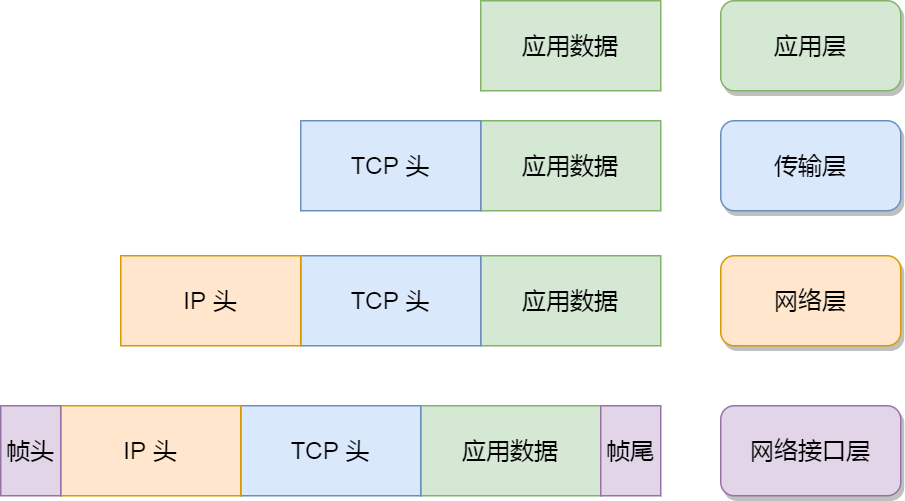
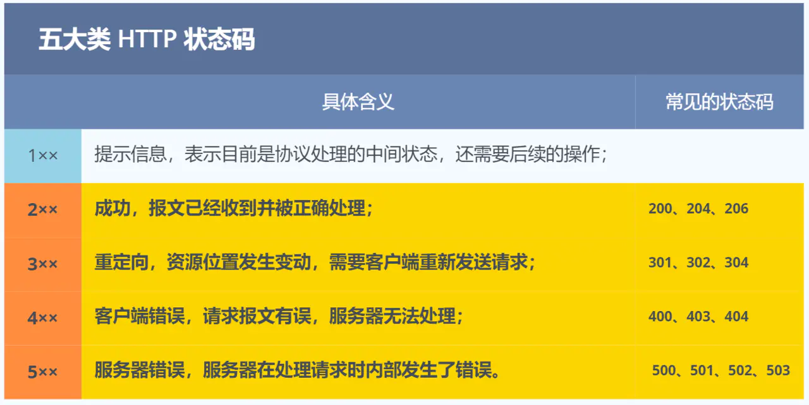
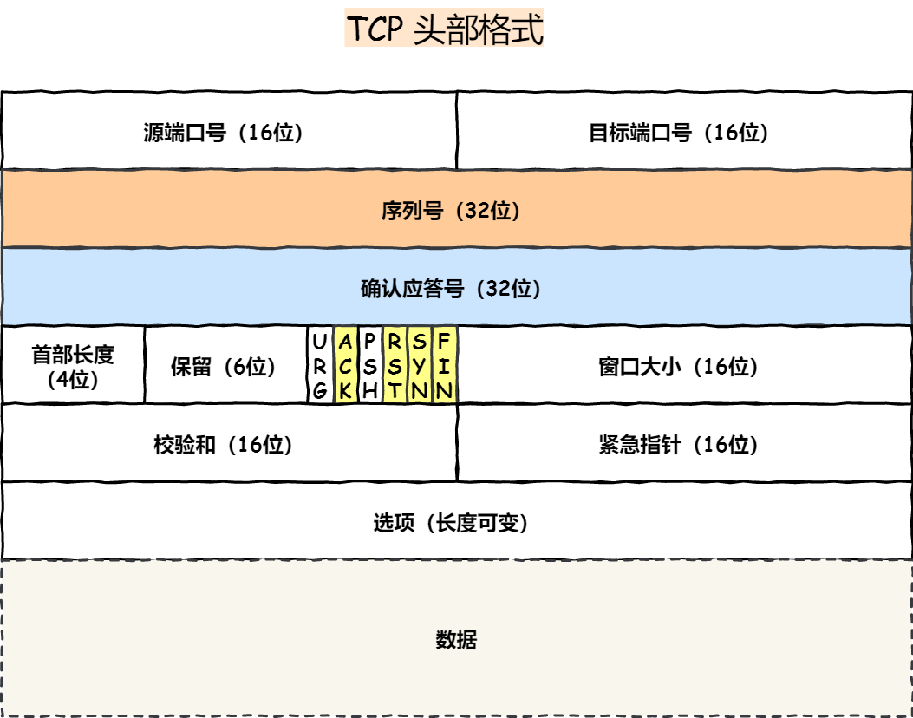
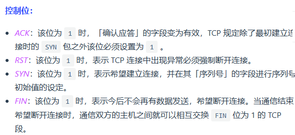
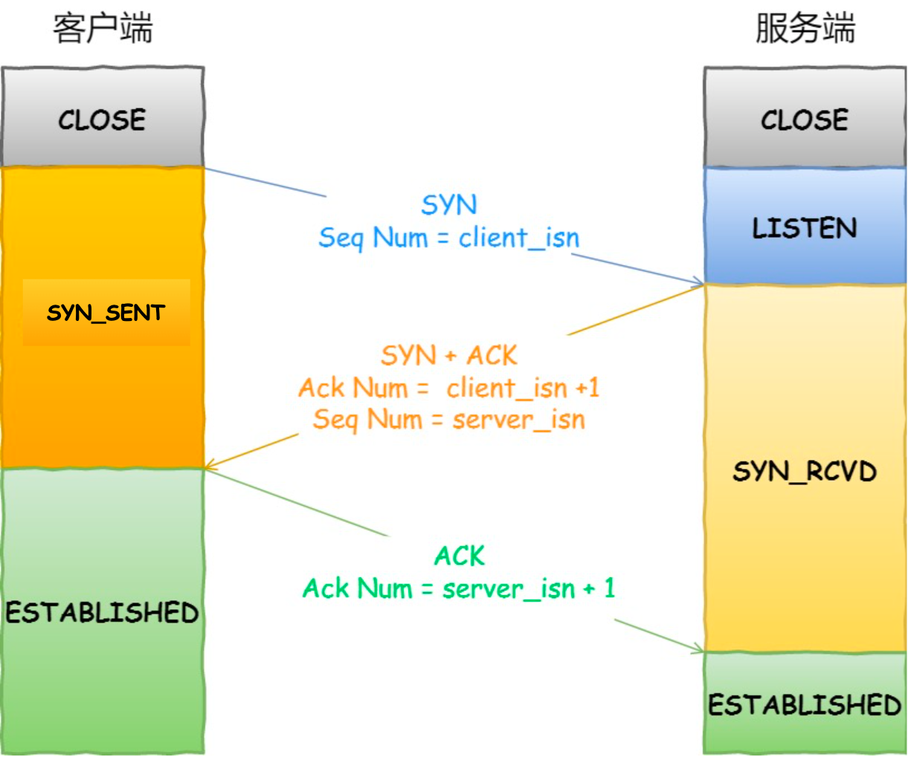
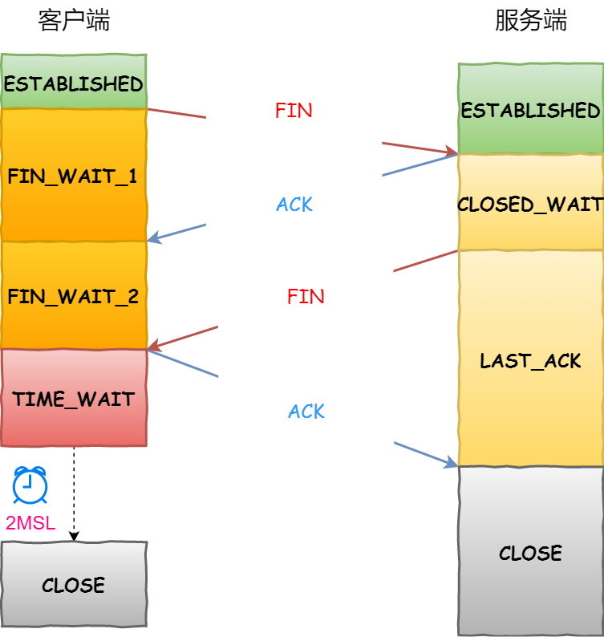

# 计算机网络

## 网络分层模型

### OSI七层模型

- 物理层：光缆，传输比特流
- 数据链路层：交换机，光猫
- 网络层：路由器寻址
- 传输层：两台主机建立可靠连接（TCP、UDP）
- 会话层：管理应用程序的会话
- 表示层：数据处理（jpg、html）
- 应用层：为计算机提供服务

### TCP/IP四层模型

#### 应用层

不同设备的应用需要通信时，会把数据传给下一层传输层处理；只为用户提供应用功能：HTTP、FTP、SMTP等；不关心数据是怎么传输的；在OS中的用户态，传输层在内核态；

#### 传输层

TCP和UDP；应用传输的数据太大，需要将数据包分块传输，接收方需要通过端口来区分应用数据；

#### 网络层

如常见的IP协议，将传输层的 报文 作为数据部分，加上IP包头组成IP报文，根据长度分片；使用IP地址路由寻址找到目标设备的IP地址，还需要配合`子网掩码`算出IP地址的`网络号`和`主机号`；

#### 网络接口层

物理设备之间的通信，MAC地址的寻找

> 网络接口层的传输单位是帧（frame），IP 层的传输单位是包（packet），TCP 层的传输单位是段（segment），HTTP 的传输单位则是消息或报文（message）。但这些名词并没有什么本质的区分，可以统称为数据包。

## HTTP

### 状态码

### GET和POST的区别？

GET用URL传输数据，POST用报文body传输数据；GET要求安全幂等的，做只读操作；POST会修改服务器数据的请求；

### HTTP和HTTPS的区别？

HTTP是明文传输，抓包可以看到信息；HTTPS是加密传输，加了SSL/TLS安全协议；

HTTP在TCP三次握手后可以建立连接，HTTPS在三次握手后还需要SSL/TLS 握手才能进行传输；

HTTP默认端口80，HTTPS默认端口443.

HTTPS需要数字证书认证；

## TCP

### TCP基础

- **序列号**：建立连接时计算机随机生成数作为初始值，通过 SYN 包传给接收端主机，每发送一次数据，就「累加」一次该「数据字节数」的大小。**用来解决网络包乱序问题。**
- **确认应答号**：指下一次「期望」收到的数据的序列号，发送端收到这个确认应答以后可以认为在这个序号以前的数据都已经被正常接收。**用来解决丢包的问题。**

#### 为什么需要TCP？在哪一层工作？

IP层不可靠，不保证数据包顺序和完整性；TCP工作在传输层；

#### 什么是TCP？

面向连接的、可靠的、基于字节流的传输层协议

- 面向连接：主机间一对一
- 可靠的：保证报文能达到接收端
- 字节流：消息会被分组成多个TCP报文；前一个TCP报文没收到时，后面接收到的也不会扔给应用层处理，同时对重复报文自动丢弃；

#### 什么是TCP连接？

保证可靠性和流量控制维护的某些状态信息，组成包括：

- **Socket**：由 IP 地址和端口号组成
- **序列号**：用来解决乱序问题等
- **窗口大小**：用来做流量控制

#### 如何唯一确定一个TCP连接？

- 源地址
- 源端口
- 目的地址
- 目的端口

TCP四元组，原地址和目标地址是IP头中的字段（32位）；端口是TCP头重的字段（16位）

#### UDP和TCP什么区别？应用场景？

- 连接不同：TCP需要建立连接，UDP直接传输
- 服务对象：TCP是一对一，UDP都可以：一对多、多对多
- 可靠性：TCP保证不丢失、不重复、按序到达；UDP不保证
- 拥塞控制、流量控制：TCP有这个机制

应用场景：

TCP：

- FTP文件传输
- HTTP/HTTPS

UDP: 广播通信、包总量少的通信、视频音频通信

### TCP连接建立

#### TCP三次握手过程？

- 客户端服务端都处于close状态，服务端主动监听某端口，处于监听状态
- 第一次握手：客户端随机初始化TCP的序列号client_isn，并将SYN标志为1，发送不含应用数据的报文，客户端处于SYN-SENT状态
- 第二次握手：服务端收到SYN报文后，随机初始化自己的序列号server_isn，并将确认应答号设置为client-isn+1，将SYN和ACK标志为1，发送不含应用数据的TCP报文，服务端处于SYN-RCVD
- 第三次握手：客户端收到服务端报文后，向服务端回应ACK报文，并将确认应答号设置为server-isn + 1，客户端处于建立状态，服务端接收到报文后进入建立状态

#### 为什么TCP是三次握手？不是2次、4次？

因为三次握手才能保证双方具有接收和发送的能力；

通过SYN + 1的比较，防止网络拥堵时旧的连接初始化；（两次握手应答确认号不一致）

减少资源开销（三次就够，四次浪费）

### TCP连接断开

- 第一次挥手：客户端将状态位FIN置为1，向服务端发送FIN报文，进入FIN_WAIT1
- 第二次挥手：服务端接收到FIN，向客户端发送ACK，进入CLOSE_WAIT，客户端接收到ACK进入FIN_WAIT2
- 第三次挥手：服务端发送FIN，进入LAST_ACK
- 第四次挥手：客户端接收ACK后进入TIME_WAIT延迟关闭，向服务端发送ACK，服务端接收到ACK关闭；

#### 为什么挥手需要四次？

第一次发FIN只表示不再发送数据，还能接收数据

服务端接收FIN发送ACK，表示还有数据处理，等不再发送数据后发送FIN，表示同意关闭连接

#### 四次挥手丢失会发生什么？

- 第一次丢失：客户端发送FIN没收到ACK，会重新发送FIN，达到次数限制直接关闭
- 第二次丢失：客户端没收到ACK，同一；服务端处理完信息后发送FIN，达到次数自动关闭
- 第三次丢失：客户端在FIN_WAIT2等待FIN，服务端一直没收到ACK，重传FIN，达到次数自动关闭
- 第四次丢失：客户端发送ACK 到时间自动关闭，如果收到FIN重置延迟关闭时间；服务端重传FIN次数达到关闭

## TCP重传机制

### 什么时候发生重传？

- 数据包丢失
- 确认应答丢失(ACK没收到)

### 快速重传是什么？

不以时间为驱动，以数据为驱动；当收到三个一样的ACK就重传对应的包

## TCP滑动窗口

发送窗口范围的数据包和ACK，确认窗口范围内的ACK都收到了再往后移

## 

